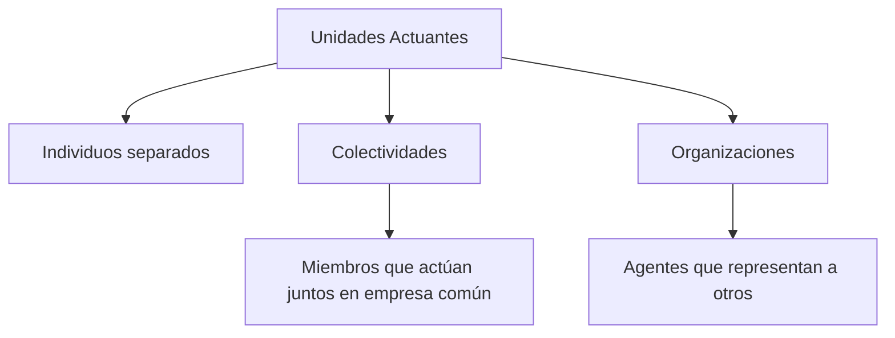
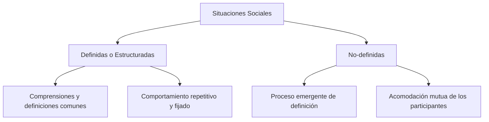
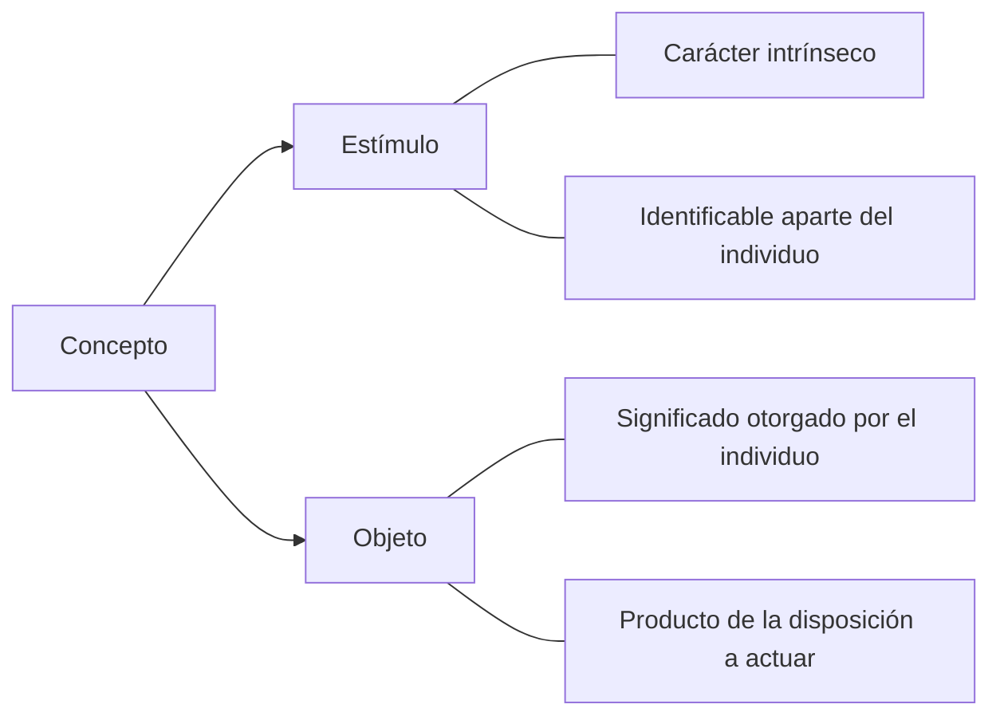
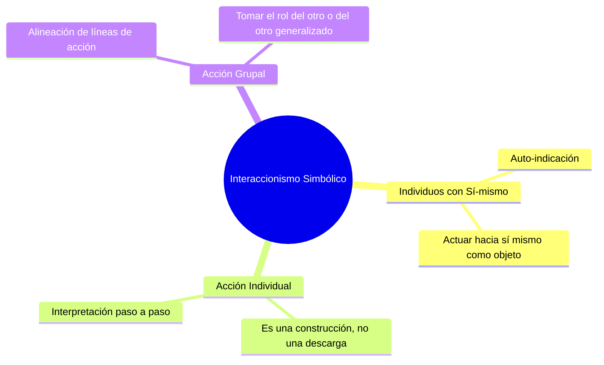
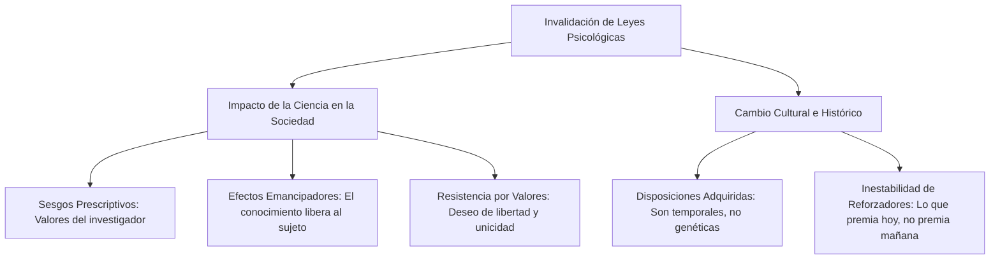
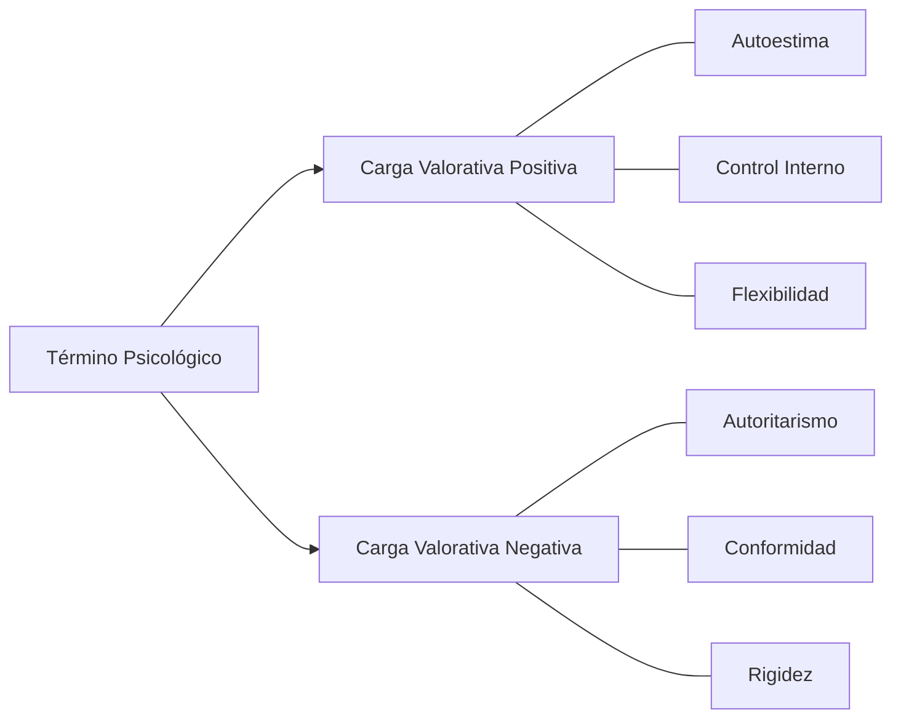
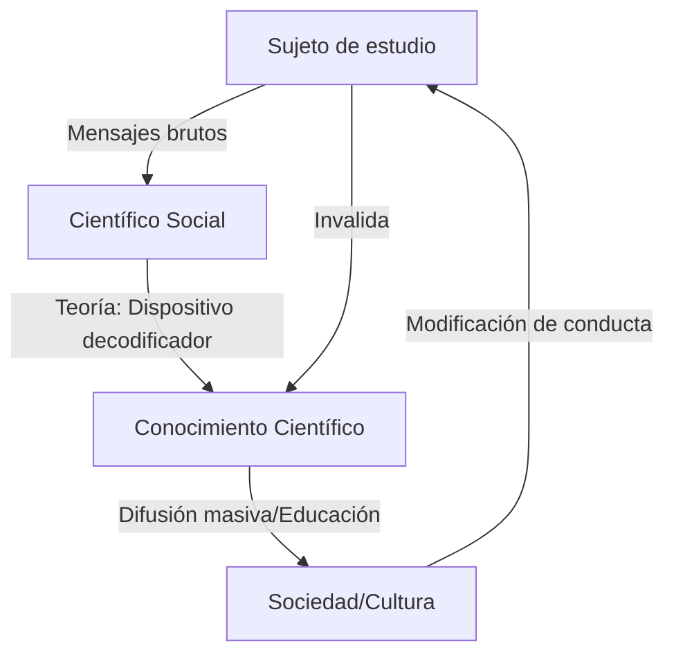
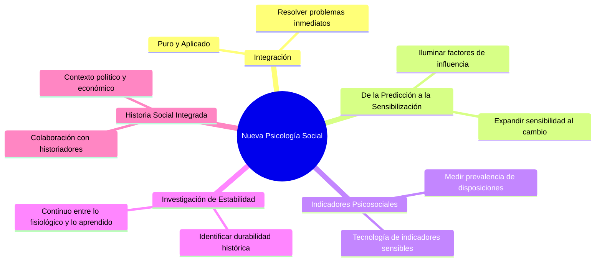
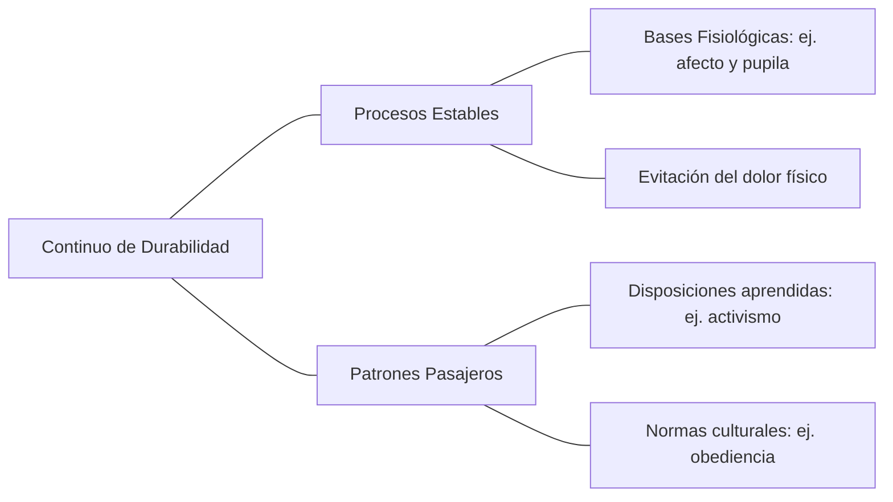

**user**: qué relación hay entre los conceptos de mead y  de berger y luckman?
[Context: Notes: Saicolandia.md]
[Timestamp: 2026/07/11 16:23:52]

**ai**: La relación entre George Herbert Mead y los autores Peter Berger y Thomas Luckmann es fundamental en el campo de la [[Psicologia-Social]], ya que estos últimos retoman y sistematizan las ideas de Mead para explicar cómo se construye la realidad social.

Aquí te detallo los puntos clave de esa relación:

- **La Socialización Primaria:** Berger y Luckmann se basan directamente en el interaccionismo simbólico de Mead para describir la socialización primaria. Para ellos, el individuo no nace miembro de una sociedad, sino que se incorpora a ella a través de la internalización de los significados que le transmiten los "otros significantes" (padres, cuidadores).
- **El "Otro Generalizado":** Este es el concepto puente más importante. Mead define al "Otro Generalizado" como la internalización de las normas y valores de la sociedad en su conjunto. Berger y Luckmann utilizan este concepto para marcar el fin de la socialización primaria: cuando el niño ya no solo obedece a su madre porque ella se lo pide, sino porque entiende que "uno no debe hacer tal cosa". En ese punto, la sociedad se ha instalado dentro del individuo.
- **La Dialéctica del Yo y el Mí:** Mead propone que el *Self* (sí mismo) surge de la interacción entre el "Yo" (la parte espontánea e impulsiva) y el "Mí" (la parte socializada que refleja las expectativas de los demás). Berger y Luckmann adoptan esta visión dialéctica para explicar que la identidad es un proceso continuo entre la autoidentificación y la identificación que hacen los demás de nosotros.
- **Internalización de la Realidad:** Mientras Mead se enfoca más en la interacción micro y el desarrollo del lenguaje y el pensamiento, Berger y Luckmann expanden esto a una teoría macro. Utilizan la base de Mead para explicar cómo la estructura social (que es externa) se convierte en algo interno y subjetivo para la persona.
- **El Lenguaje como Herramienta:** Ambos coinciden en que el lenguaje es el vehículo principal para que la realidad social sea compartida. Para Mead, el símbolo significativo permite la comunicación; para Berger y Luckmann, el lenguaje es lo que permite "objetivar" la experiencia y hacerla disponible para todos los miembros de la sociedad.

En resumen, podrías decir que Berger y Luckmann toman la psicología social de Mead y la convierten en el motor de su teoría sobre la construcción social de la realidad, especialmente para explicar cómo nos convertimos en sujetos sociales.
[Timestamp: 2026/07/11 16:24:03]

**user**: hace una charla ted amena, entretenida pero rigurosa, sobre blumer y:
Conceptos distintivos del Interaccionismo simbólico y sus supuestos básicos

- Interacción simbólica
- Sí mismo - conciencia
- Auto-indicación
- Unidad actuante
- Objeto - símbolo
- Acción construida
- Acción colectiva
[Timestamp: 2026/07/11 16:48:54]

**ai**: *(Se apagan las luces. Un círculo rojo se ilumina en el centro del escenario. Entro con paso tranquilo, sonriendo, y espero a que el silencio sea total.)*

Imagina que vas caminando por la calle y ves a un amigo. Él levanta la mano y agita los dedos. Tú, automáticamente, sonríes y haces lo mismo. Parece simple, ¿verdad? Un estímulo, una respuesta. 

Pero, ¿qué pasaría si ese mismo gesto ocurriera en medio de una subasta de arte? Acabas de comprar un Picasso por tres millones de dólares. ¿Y si ocurre en un campo de batalla? Quizás estás pidiendo fuego de cobertura.

Bienvenidos al mundo de **Herbert Blumer**. Él nos enseñó que los seres humanos no somos máquinas que reaccionan a estímulos, sino intérpretes constantes de la realidad. Hoy vamos a desglosar por qué la [[Psicologia-Social]] le debe tanto a este hombre y a su **Interaccionismo Simbólico**.

### 1. El corazón de todo: La Interacción Simbólica
Blumer decía que la sociedad no es una estructura rígida, sino algo que "está ocurriendo" ahora mismo. La **interacción simbólica** es ese proceso donde no solo reaccionamos a lo que el otro hace, sino a lo que *creemos que significa* lo que el otro hace. Entre el gesto de mi amigo y mi respuesta, hay un proceso invisible de interpretación. Sin significado, no hay acción humana.

### 2. El Objeto y el Símbolo: El mundo es lo que decimos que es
Para Blumer, un **objeto** no tiene un significado intrínseco. Una silla es madera y clavos, pero para un cansado es un refugio, para un carpintero es un desafío y para un manifestante puede ser un arma. Nosotros creamos los objetos a través de los **símbolos**. El mundo físico está ahí, pero el mundo en el que *vivimos* es un mapa de significados que construimos juntos.

### 3. El "Sí mismo" y la Auto-indicación: Tu diálogo interno
Aquí es donde se pone interesante. Blumer dice que tenemos un **Sí mismo (Self)**. No es una cosa dentro de la cabeza, es un proceso. Tenemos la capacidad de la **auto-indicación**. 
¿Qué es esto? Es ese diálogo que tienes contigo mismo antes de hablar: *"Si le digo esto, se va a enojar... mejor uso estas palabras"*. Te señalas cosas a ti mismo, te conviertes en objeto de tu propia reflexión. No eres un títere de tus impulsos; eres un estratega de tu propia conducta.

### 4. La Unidad Actuante y la Acción Construida
A menudo pensamos que la sociedad nos empuja a actuar. Blumer dice: "Un momento". El individuo (o un grupo) es una **unidad actuante**. La acción no se "libera" por una causa externa, la **acción se construye**. 
Vamos paso a paso: notas algo, lo interpretas, evalúas tus metas, descartas opciones y finalmente actúas. Eres el arquitecto de tu comportamiento, no un simple peón del sistema.

### 5. La Acción Colectiva: El baile de significados
¿Y cómo encajamos todos en esto? A través de la **acción colectiva**. La sociedad es el ajuste de las líneas de acción de todos nosotros. Es como una coreografía masiva donde cada uno está interpretando lo que el otro hace para encajar su propio movimiento. Cuando nuestras interpretaciones coinciden, tenemos orden social. Cuando chocan, tenemos conflicto o cambio.

### Conclusión
Herbert Blumer nos dejó una lección poderosa: la realidad social no está "ahí afuera" esperándonos, la estamos fabricando en este preciso instante a través de cómo nos miramos y cómo nos hablamos. 

La próxima vez que alguien te salude en la calle, recuerda: no estás solo moviendo la mano. Estás participando en el milagro de la creación de significado. Estás construyendo el mundo, un símbolo a la vez.

Muchas gracias.

*(Aplausos imaginarios mientras salgo del escenario)*
[Timestamp: 2026/07/11 16:49:06]

**user**: encontrá si existen taxonomias, y en caso de haberlas, ponelas en formato mermaid para copiar
[Context: Notes: psicologia-social/bruto/ps-u1-blumer_la-sociedad-como-interaccion-simbolica.md]
[Timestamp: 2026/07/11 17:02:06]

**ai**: Basado en el texto de [[ps-u1-blumer_la-sociedad-como-interaccion-simbolica]], se pueden identificar varias taxonomías o clasificaciones clave que estructuran el pensamiento de Herbert Blumer.

Aquí tienes las más importantes representadas en formato Mermaid:

### 1. Tipos de Unidades Actuantes
Blumer clasifica quiénes son los que realmente "actúan" en la sociedad, oponiéndose a la idea de que las estructuras actúan por sí solas.

### 2. Clasificación de las Situaciones Sociales
El texto distingue entre situaciones donde el significado ya está establecido y aquellas donde debe ser creado.

### 3. Diferencia entre Objeto y Estímulo
Una taxonomía conceptual fundamental para entender la diferencia entre el conductismo y el interaccionismo.

### 4. Premisas Básicas del Interaccionismo Simbólico
Esta taxonomía resume los tres pilares que Blumer menciona como presupuestos de su teoría.

### 5. Contraste de Enfoques: Interaccionismo vs. Sociología Convencional
El texto clasifica las diferencias en cómo ven al individuo y a la acción.

| Dimensión | Interaccionismo Simbólico | Sociología Convencional |
| :--- | :--- | :--- |
| **El Individuo** | Ser con "sí-mismo" que interpreta | Organismo que responde a fuerzas |
| **La Acción** | Construida mediante interpretación | Producto de factores (estatus, rol, norma) |
| **La Estructura** | Marco para la acción | Determinante de la acción |
| **Cambio Social** | Mediado por nuevas interpretaciones | Resultado directo de factores externos |

Estas estructuras te permitirán organizar mejor el contenido de la nota de [[ps-u1-blumer_la-sociedad-como-interaccion-simbolica]] en tu estudio.
[Timestamp: 2026/07/11 17:02:17]

**user**: encontrá si existen taxonomias, y en caso de haberlas, ponelas en formato mermaid para copiar
[Context: Notes: psicologia-social/bruto/ps-u1-gergen_construccionismo-social.md]
[Timestamp: 2026/07/11 17:06:18]

**ai**: En el texto de [[ps-u1-gergen_construccionismo-social]] (específicamente en el artículo "La psicología social como historia"), Kenneth Gergen organiza sus argumentos a través de varias clasificaciones y taxonomías sobre por qué la psicología social no puede ser una "ciencia natural" de leyes universales.

Aquí tienes las taxonomías principales en formato Mermaid:

### 1. Factores que invalidan las leyes transhistóricas
Gergen clasifica las razones por las cuales el conocimiento psicológico altera los mismos hechos que intenta describir.

### 2. Taxonomía de los Sesgos Prescriptivos
Gergen muestra cómo los términos "científicos" suelen ser etiquetas valorativas disfrazadas.

### 3. El Circuito de Retroalimentación del Conocimiento
Esta taxonomía describe el proceso de comunicación entre la ciencia y la cultura.

### 4. Nuevas Implicaciones para la Especialidad
Gergen propone una reestructuración de los objetivos de la psicología social al aceptarla como una ciencia histórica.

### 5. Continuo de Durabilidad de los Fenómenos
Clasificación de los hechos sociales según su resistencia al cambio histórico.

Estas taxonomías resumen la tesis central de Gergen: la psicología social no descubre leyes, sino que realiza una **crónica sistemática de la historia contemporánea**.
[Timestamp: 2026/07/11 17:06:29]