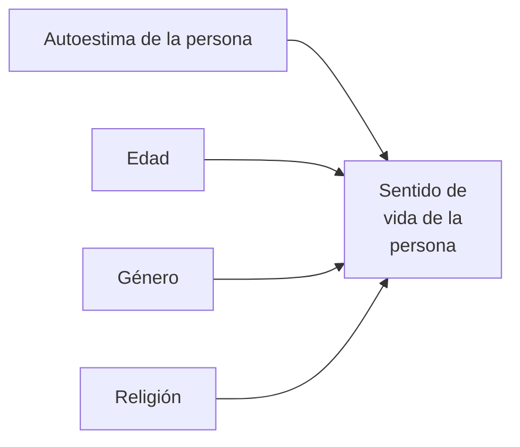
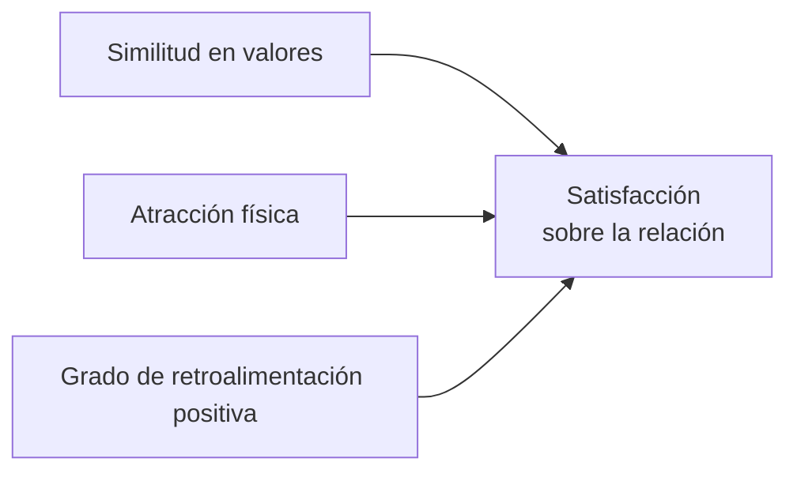

## 10

## Análisis de los datos cuantitativos

Proceso de investigación cuantitativa

## Paso 9 Analizar los datos

- Decidir el programa de análisis de datos que se utilizará.

- Explorar los datos obtenidos en la recolección.

- Analizar descriptivamente los datos por variable.

- Visualizar los datos por variable.

- Evaluar la confiabilidad, validez y objetividad de los instrumentos de medición utilizados.

- Analizar e interpretar mediante pruebas estadísticas las hipótesis planteadas (análisis estadístico inferencial).

- Realizar análisis adicionales.

- Preparar los resultados para presentarlos.

## Objetivos del aprendizaje

Al terminar este capítulo, el alumno será capaz de:

1 Revisar el proceso para analizar los datos cuantitativos.

2 Reforzar los conocimientos estadísticos fundamentales.

3 Comprender las principales pruebas o métodos estadísticos desarrollados, así como sus aplicaciones y la forma de interpretar sus resultados.

4 Analizar la interrelación entre distintas pruebas estadísticas.

5 Diferenciar la estadística descriptiva y la inferencial, la paramétrica y la no paramétrica.

## Síntesis

En el capítulo se presentan brevemente los principales programas computacionales de análisis estadístico que emplea la mayoría de los investigadores, así como el proceso fundamental para efectuar análisis cuantitativo. Asimismo, se comentan, analizan y ejemplifican las pruebas estadísticas más utilizadas. Se muestra la secuencia de análisis más común, incluyendo estadísticas descriptivas, análisis paramétricos, no paramétricos y multivariados. En la mayoría de estos análisis, el enfoque del capítulo se centra en los usos y la interpretación de los métodos, más que en los procedimientos de cálculo, debido a que en la actualidad los análisis se realizan con ayuda de una computadora.

![[ecyc-u4-sampieri_analisis-datos-cuantitativos1.png]]

Nota: Este capítulo se complementa con uno del CD anexo: Material complementario $ \rightarrow $ Capítulos $ \rightarrow $ Capítulo 8 "Análisis estadístico: segunda parte". Asimismo, con el documento incluido en el CD: "Fórmulas estadísticas", que contiene las fórmulas que estaban en la parte impresa de ediciones anteriores y el apéndice 4 "Tablas anexas".

## ¿Qué procedimiento se sigue para analizar cuantitativamente los datos?

Una vez que los datos se han codificado, transferido a una matriz, guardado en un archivo y "limpiado" de errores, el investigador procede a analizarlos.

En la actualidad, el análisis cuantitativo de los datos se lleva a cabo por computadora u ordenador. Ya casi nadie lo hace de forma manual ni aplicando fórmulas, en especial si hay un volumen considerable de datos. Por otra parte, en la mayoría de las instituciones de educación media y superior, centros de investigación, empresas y sindicatos se dispone de sistemas de cómputo para archivar y analizar datos. De esta suposición parte el presente capítulo. Por ello, se centra en la interpretación de los resultados de los métodos de análisis cuantitativo y no en los procedimientos de cálculo.

El análisis de los datos se efectúa sobre la matriz de datos utilizando un programa computacional. El proceso de análisis se esquematiza en la figura 10.1. Posteriormente veremos paso a paso el proceso.

## Fases del Análisis de Datos

|    Fase    | Descripción                                                                                                          |
| :--------: | :------------------------------------------------------------------------------------------------------------------- |
| **FASE 1** | Seleccionar un programa estadístico en la computadora (ordenador) para analizar los datos.                           |
| **FASE 2** | Ejecutar el programa: SPSS, Minitab, Stats, SAS u otro equivalente.                                                  |
| **FASE 3** | Explorar los datos: a) Analizar descriptivamente los datos por variable. b) Visualizar los datos por variable. |
| **FASE 4** | Evaluar la confiabilidad y validez logradas por el o los instrumentos de medición.                                   |
| **FASE 5** | Analizar mediante pruebas estadísticas las hipótesis planteadas (análisis estadístico inferencial).                  |
| **FASE 6** | Realizar análisis adicionales.                                                                                       |
| **FASE 7** | Preparar los resultados para presentarlos (tablas, gráficas, cuadros, etcétera).                                     |

Figura 10.1 Proceso para efectuar análisis estadístico.

## Paso 1: seleccionar un programa de análisis

Existen diversos programas para analizar datos. En esencia su funcionamiento es muy similar, incluyen dos partes o segmentos que se mencionaron en el capítulo anterior: una parte de definiciones de las variables, que a su vez explican los datos (los elementos de la codificación ítem por ítem), indicador por indicador en casos propios de las ingenierías y diversas disciplinas y la otra parte, la matriz de datos. La primera parte es para que se comprenda la segunda. Las definiciones, desde luego, son efectuadas por el investigador. Lo que éste hace, una vez recolectados los datos, es precisar los parámetros de la matriz de datos en el programa (nombre de cada variable en la matriz —que equivale a un ítem, reactivo, categoría o subcategoría de contenido u observación, indicador—, tipo de variable o ítem, ancho en dígitos, etc.) e introducir los datos en la matriz, la cual es como cualquier hoja de cálculo. Asimismo, recordemos que la matriz tiene columnas (variables o ítems), filas o renglones (casos) y celdas (intersección entre una columna y un renglón). Cada celda contiene un dato (que significa un valor de un caso en una variable). Supongamos que tenemos cuatro casos o personas y tres variables (género, color de cabello y edad); la matriz se vería como se muestra en la tabla 10.1.

Tabla 10.1 Ejemplo de matriz de datos con tres variables y cuatro casos

<table border="1"><tr><td>Caso</td><td>Columna 1(genero)</td><td>Columna 2(color de pelo)</td><td>Columna 3(edad)</td></tr><tr><td>1</td><td>1</td><td>1</td><td>35</td></tr><tr><td>2</td><td>1</td><td>1</td><td>29</td></tr><tr><td>3</td><td>2</td><td>1</td><td>28</td></tr><tr><td>4</td><td>2</td><td>4</td><td>33</td></tr></table>

La codificacion (especificada en la parte de las definiciones de las variables o columnas que corresponden a items) seria:

- Généro (1 = masculino y 2 = femenino).

- Color de cabello (1 = negro, 2 = castaño, 3 = pelirrojo, 4 = rubio).

- Edad (dato "bruto o crudo" en años).

De esta forma, si se lee por renglón o fila (caso), de izquierda a derecha, la primera celda indica un hombre (1); la segunda, de cabello negro (1), y la tercera, de 35 años (35). En el segundo, un hombre de cabello negro y 29 años. La tercera, una mujer de cabello color negro, con 28 años. La cuarta fila (caso número cuatro) nos señala una mujer (2), rubia (4) y de 33 años (33). Pero, si leemos por columna o variable de arriba hacia abajo, tendríamos en la primera (género) dos hombres y dos mujeres (1, 1, 2, 2).

Por lo general, en la parte superior de la matriz de datos aparecen las opciones de los comandos para operar el programa de análisis estadístico como cualquier otro programa (Archivo, Edición, etc.). Una vez que estamos seguros que no hay errores en la matriz, procedemos a realizar el análisis de la matriz, el análisis estadístico. En cada programa tales opciones varian, pero en cuestiones mínimas.

Ahora, comentaremos brevemente los programas más importantes y de dos de ellos señalaremos sus comandos generales.

## Statistical Package for the Social Sciences SPSS $^{\circ}$ o PASW Statistics

El SPSS (Paquete Estadístico para las Ciencias Sociales) desarrollado en la Universidad de Chicago, es uno de los más difundidos. Contiene todos los análisis estadísticos que se describirán en este capítulo.

En América Latina, algunas instituciones educativas tienen versiones antiguas del SPSS; otras, versiones más recientes (PASW Statistics), ya sea en español o inglés. Existen versiones para Windows, Macintosh y UNIX. Desde luego, éstas sólo pueden utilizarse en computadoras con la capacidad necesaria para el paquete.

Como ocurre con todos los programas o software, SPSS® o PASW Statistics constantemente se actualiza con versiones nuevas en varios idiomas. $ ^{1} $ Asimismo, cada año surgen textos o manuales acordes con estas nuevas versiones. En el CD anexo el lector encontrará un manual que abarca las cuestiones esenciales de este paquete de análisis. Lo mejor para mantenerse al día en materia de SPSS/PASW es consultar su sitio en internet (www.spss.com/); o si éste llega a cambiar, con la palabra clave "SPSS" podemos encontrarlo en un directorio o mediante un motor de búsqueda como Google, Altavista, o cualquier otro. Para la actualización de manuales, las palabras claves serían: "SPSS manuals" (recordemos que para cruzar palabras, éstas tienen que ir entre comillas " ").

Como ya se señaló, SPSS/PASW contiene las dos partes citadas que se denominan: a) vista de variables (para definiciones de las variables y consecuentemente, de los datos) y b) vista de los datos (matriz de datos).

En ambas vistas se observan los comandos para operar en la parte superior. También, en la página de SPSS se puede "bajar" o "descargar" a la computadora una demostración del programa por un tiempo limitado.

El paquete SPSS/PASW trabaja de una manera muy sencilla: éste abre la matriz de datos y el investigador usuario selecciona las opciones más apropiadas para su análisis, tal como se hace en otros programas.

File (archivo): sirve para construir un nuevo archivo, localizar uno ya construido, guardar archivos, especificar impresora, imprimir, cerrar, enviar archivos por correo electrónico, entre otras funciones.

Edit (edición): se emplea para modificar archivos, manipular la matriz, buscar datos, copiar, cortar, eliminar y otras acciones de edición.

View (ver): como su nombre lo dice es para ver o visualizar la barra de estado, barra de herramientas, fuentes, cuadrícula (matriz), etiquetas y variables.

Data (datos): se insertan variables, sopesan casos, insertan casos, ordenan casos para limpiar archivos, fundir archivos (juntar varios archivos o matrices), segmentar archivos (por una variable o criterio; por ejemplo, la variable género, en este caso se realiza el análisis por submuestra segmentada, resultados para hombres y para mujeres), seleccionar casos, etcétera.

Transform (transformar): la función es de recodificar, conjuntar o unir y modificar variables y datos; categorizar variables; asignar rangos a casos, entre otras.

Analyze (analizar): se solicitan análisis estadísticos que básicamente serían:

1. Informes (resúmenes de casos, información de columnas y reglones).

2. Estadísticos descriptivos (tablas de frecuencias, medidas de tendencia central y dispersion, razones, tablas de contingencia).

3. Comparar medias (prueba $t$ y análisis de varianza —ANOVA— unidireccional).

4. Modelo lineal general (independiente o factor y dependiente, con covariable).

5. ANOVA (análisis de varianza factorial en varias direcciones).

6. Correlaciones (bivariada —dos— y multivariadas —tres o más—) para cualquier nivel de medición de las variables.

7. Regresión (lineal, curvilineal y múltiple).

8. Clasificación (conglomerados y análisis discriminante).

9. Reducción de datos (análisis de factores).

10. Escalas (fiabilidad y escalamiento multidimensional).

11. Pruebas no paramétricas.

12. Respuestas múltiples (escalas).

13. Validación compleja.

14. Series de tiempos.

15. Ecuaciones estructurales y modelamiento matemático.

Add-ons (agregados): mediante esta función (que no está incluida en todas las versiones ni variantes) se tiene acceso a análisis complejos como redes neurales, identificación de casos inusuales y varias pruebas estadísticas avanzadas).

## El diagrama Q-Q Se utiliza para verificar qué tanto la distribución de nuestras variables es "normal".

Graphs (gráficos): con esta función se solicitan gráficos (histogramas, de sectores o pastel, diagrams de dispersion, Pareto, Q-Q —solicitar normalización de distribuciones—, P-P, curva COR, etcétera).

Utilities (utilidades o herramientas): se definen ambientes, conjuntos, información sobre variables, etcétera.

S-plus: es para la adquisición, edición y transformación de datos, la línea de comandos, métodos estadísticos básicos con S-Plus y R, gráficos estadísticos básicos con S-Plus y R, métodos estadísticos multivariados avanzados y creación de funciones propias con S-Plus.

Window (ventana): sirve para moverse a través de archivos y hacia otros programas.

Help (ayuda): cuenta con contenidos de ayuda, cómo utilizar SPSS, comandos, guías, "asesor estadístico" y demás elementos aplicados al paquete (con índice).

## Minitab $^{\textcircled{R}}$

Es un paquete que goza de popularidad por su relativamente bajo costo. Incluye un considerable número de pruebas estadísticas, y cuenta con un tutorial para aprender a utilizarlo y practicar; además, es muy sencillo de manejar.

Minitab tiene un sitio web (http://www.minitab.com/) en la cual podemos acceder a un demo gratuito del programa por tiempo limitado.

Para comenzar a utilizar Minitab, se abre una sesión (la cual es definida con nombre y fecha), y se abre una matriz u hoja de trabajo (worksheet) (en la parte superior de la pantalla aparece la sesión y en la parte inferior se presenta la matriz). Se definen las variables (C —columnas—): nombre, formato (numérico, texto, fecha/tiempo), ancho (en dígitos), su descripción y orden de los valores. Los renglones o filas son casos. Los análisis realizados aparecen en la sesión (parte o pantalla superior) y las gráficas se reproducen en recuadros.

Sus comandos incluyen:

File (archivo): para construir un nuevo archivo, localizar uno ya construido, guardar o abrir archivos, abrir una gráfica de Minitab, específicar impresora, imprimir, cerrar, entre otras funciones.

Edit (edición): útil para modificar archivos, buscar datos, copiar, cortar y eliminar celdas, conectar Minitab con otras aplicaciones, etcétera.

Data (datos): funciones para asignar códigos a columnas, dividir la matriz, copiar columnas, eliminar columnas y renglones o filas, establecer rangos, recodificar, cambiar el tipo de datos, desplegar datos, mostrar los datos de la hoja de trabajo en la ventana de sesión, entre otros.

Calc (calcular): calcula las estadísticas de columnas y filas, distribuciones de probabilidad, matrices, estandarizaciones, operaciones aritméticas.

Stat (estadísticas): de manera fundamental, ejecuta los siguientes tipos de estadísticas:

1. Básicas: descriptivas, correlación, covarianza, chi-cuadrada, prueba $t$, prueba de hipótesis acerca de la media poblacional...

2. Regresión lineal y múltiple.

3. Análisis de varianza (ANOVA) unidireccional y factorial.

4. DOE (análisis para diseños experimentales, análisis de respuestas).

5. Diagramas (control charts) (de atributos, multivariados, de tiempo) individuales y grupales.

6. Diagramas de dispersión, Pareto, causa-efecto...

7. Confiabilidad.

8. Análisis multivariado: análisis de factores (validación), análisis discriminante, análisis de conglomerados, de correspondencia simple o múltiple.

9. Series de tiempos: autocorrelación, correlación parcial, correlación cruzada, entre otras.

10. Tablas: tabulación cruzada, chi-cuadrada.

11. Estadística no paramétrica.

12. EDA (análisis exploratorio de datos, diagrams de caja, fotograma, etcétera).

13. Poder y tamaño de muestra (1-muestra z, 1-muestra- t, 2-muestra- t, ANOVA y otras. Sirve para determinar si el tamaño de muestra es apropiado para varias pruebas estadísticas).

Graph (gráfica): solicitar gráficos (histogramas, barras de pastel, diagrams de dispersion, Pareto, series de tiempos, etcétera).

Editor (editor): mover columnas, redefinir columnas, insertar columnas, buscar, ir a un caso, entre otras acciones.

Tools (herramientas): definir ambientes, conjuntos, información sobre variables, conexión a internet, consultas, etcétera.

Window (ventana): sirve para moverse a través de archivos y hacia otros programas, minimizar ventanas y demás funciones similares en otros programas.

Help (ayuda): cuenta con contenidos de ayuda, cómo utilizar Minitab, comandos, guías y demás elementos de Windows aplicados al paquete. En la figura 10.2 se muestra una vista de la pantalla de Minitab.

Hoja de trabajo actual. Hoja de trabajo 1

Editable

Figura 10.2 Pantalla de Minitab.

Otro programa de análisis sumamente difundido es el SAS (Sistema de Análisis Estadístico), que fue diseñado en la Universidad de Carolina del Norte. Es muy poderoso y su utilización se ha incrementado notablemente. Es un paquete muy completo para computadoras personales que contiene una variedad considerable de pruebas estadísticas.

En el CD se incluye un programa (software) sencillo que hemos titulado STATS, con los análisis bivariados más elementales para comenzar a practicar y comprender las pruebas básicas. Asimismo, en internet existen diversos programas gratuitos de análisis estadístico para cualquier ciencia o disciplina.

Por lo general se elige el programa de análisis que está disponible en nuestra institución educativa, centro de investigación u organización de trabajo, o el que podamos comprar u obtener en internet. Todos los programas mencionados son excelentes opciones. Cualquiera nos sirve, solamente que debemos seleccionar uno. Recomendamos que en el centro de cómputo de su institución soliciten información respecto de los programas disponibles.

## Paso 2: ejecutar el programa

En el caso de SPSS y Minitab, ambos paquetes son fáciles de usar, pues lo único que hay que hacer es solicitar los análisis requeridos seleccionando las opciones apropiadas. Obviamente antes de tales análisis, se debe verificar que el programa "corra" o funcione en nuestra computadora. Comprobado esto, comienza la ejecución del programa y la tarea analítica.

## Paso 3: explorar los datos

En esta etapa, inmediata a la ejecución del programa, se inicia el análisis. Cabe señalar que si hemos llevado a cabo la investigación reflexionando paso a paso, esta etapa es relativamente sencilla, porque: 1) formulamos la pregunta de investigación que pretendemos contestar, 2) visualizamos un alcance (exploratorio, descriptivo, correlacional y/o explicativo), 3) establecimos nuestras hipótesis (o estamos

conscientes de que no las tenemos), 4) definimos las variables, 5) elaboramos un instrumento (conocemos qué items miden qué variables y qué nivel de medición tiene cada variable: nominal, ordinal, de intervalos o razón) y 6) recolectamos los datos. Sabemos qué deseamos hacer, es decir, tenemos claridad.

La exploración típica se muestra en la figura 10.3 (que se ilustra utilizando el programa SPSS, ya que, insistimos, ésta puede variar de programa en programa en cuanto a comandos o instrucciones, pero no en lo referente a las funciones implementadas). Algunos conceptos pueden, por ahora, no significar algo para el lector que se inicia en los menesteres de la investigación, pero éstos se irán explicando a lo largo del capítulo.

Figura 10.3 Secuencia más común para explorar datos en SPSS.

Veamos ahora los conceptos estadísticos que se aplican a la exploración de datos, pero antes de proseguir es necesario realizar un par de apuntes, uno sobre las variables del estudio y las variables de la matriz de datos, y el otro sobre los factores de los que depende el análisis.

## Apunte 1

Desde el final del capítulo anterior, se introdujo el concepto de variable de la matriz de datos, que es distinto del concepto variable de la investigación. Las variables de la matriz de datos son columnas o ítems. Las variables de la investigación son las propiedades medidas y que forman parte de las hipótesis o que se pretenden describir (género, edad, actitud hacia el presidente municipal, inteligencia, duración de un material, etc.). En ocasiones, las variables de la investigación requieren un único

Variables de la matriz de datos

Son columnas o items.

item o indicador para ser medidas (como en la tabla 10.2 con la variable "tipo de escuela a la que asiste"), pero en otras se necesitan varios items para tal finalidad. Cuando sólo se precisa de un ítem o

Variables de la investigación Son las propiedades medidas y que forman parte de las hipótesis o que se pretenden describir.

indicador, las variables de la investigación ocupan una columna de la matriz (una variable de la matriz). Pero si están compuestas de varios ítems, ocuparán tantas columnas como ítems (o variables en la matriz) las conformen. Esto se ejemplifica en la tabla 10.2 con los casos de la variable "satisfacción respecto al superior" y "moral de los empleados".

Tabla 10.2 Ejemplos de variables de investigación y formulación de ítems

<table border="1"><tr><td>Variable: tipo de escuela a la que asiste (con un item)</td><td>Variable: satisfacción respecto al superior (con tres ítems)</td><td>Variable: moral de los empleados (con cinco ítems)</td></tr><tr><td>¿Asiste a una escuela pública o privada?</td><td>1. ¿En qué medida está usted satisfecho con su superior inmediato?</td><td>1. “En el departamento donde trabajo nos mantenemos unidos”</td></tr><tr><td>1 Escuela pública2 Escuela privada</td><td>1 Sumamente insatisfecho2 Más bien insatisfecho3 Ni insatisfecho ni satisfecho4 Más bien satisfecho5 Sumamente satisfecho</td><td>5 Totalmente de acuerdo4 De acuerdo3 Ni de acuerdo ni en desacuerdo2 En desacuerdo1 Totalmente en desacuerdo</td></tr><tr><td></td><td>2. ¿Qué tan satisfecho está usted con el trato que recibe de parte de su superior inmediato?</td><td>2. “La mayoría de las veces en mi departamento compartimos la información más que guardarla para nosotros”</td></tr><tr><td></td><td>1 Sumamente insatisfecho2 Más bien insatisfecho3 Ni insatisfecho ni satisfecho4 Más bien satisfecho5 Sumamente satisfecho</td><td>5 Totalmente de acuerdo4 De acuerdo3 Ni de acuerdo ni en desacuerdo2 En desacuerdo1 Totalmente en desacuerdo</td></tr><tr><td></td><td>3. ¿Qué tan satisfecho está con la orientación que le proporciona su superior inmediato para que usted realice su trabajo?</td><td>3. “En mi departamento nos mantenemos en contacto permanentemente”</td></tr><tr><td></td><td>1 Sumamente insatisfecho2 Más bien insatisfecho3 Ni insatisfecho ni satisfecho4 Más bien satisfecho5 Sumamente satisfecho</td><td>5 Totalmente de acuerdo4 De acuerdo3 Ni de acuerdo ni en desacuerdo2 En desacuerdo1 Totalmente en desacuerdo</td></tr><tr><td></td><td></td><td>4. “En mi departamento nos reunimos con frecuencia para hablar tanto de asuntos de trabajo como de cuestiones personales”</td></tr><tr><td></td><td></td><td>5 Totalmente de acuerdo4 De acuerdo3 Ni de acuerdo ni en desacuerdo2 En desacuerdo1 Totalmente en desacuerdo</td></tr><tr><td></td><td></td><td>5. “En mi trabajo todos nos llevamos bien”</td></tr><tr><td>Esta variable es medida por una sola pregunta y ocupa una columna o variable de la matriz.</td><td>Esta variable es medida por tres preguntas y ocupa tres columnas o variables de la matriz.</td><td>Esta variable es medida por cinco preguntas y ocupa cinco columnas o variables de la matriz.</td></tr></table>

Y cuando las variables de la investigación se integran de varios ítems o variables en la matriz, las columnas pueden ser continuas o no (estar ubicadas de manera seguida o en distintas partes de la matriz). En el tercer ejemplo (variable "moral de los empleados"), las preguntas podrían ser las núme- www.FreeLibros.com

ros: 1, 2, 3, 4 y 5 del cuestionario, entonces las primeras cinco columnas de la matriz representarán a estos ítems. Pero pueden ubicarse en distintos segmentos del cuestionario (por ejemplo, ser las preguntas 1, 5, 17, 22 y 38), entonces las columnas que las representen se ubicarán de forma discontinua (serán las columnas o variables de la matriz 1, 5, 17, 22 y 38), porque regularmente la secuencia de las columnas corresponde a la secuencia de los ítems en el instrumento de medición.

Esta explicación la hacemos porque hemos visto que varios estudiantes confunden las variables de la matriz de datos con las variables del estudio. Son cuestiones vinculadas pero distintas.

Cuando una variable de la investigación está integrada por diversas variables de la matriz o ítems suele denominársele variable compuesta y su puntuación total es el resultado de adicionar los valores de los reactivos que la conforman. Tal vez el caso más claro lo es la escala Likert, donde se suman las puntuaciones de cada ítem y se logra la calificación final. A veces la adición es una sumatoria, otras ocasiones es multiplicativa o de otras formas, según se haya desarrollado el instrumento. Al ejecutar el programa y durante la fase exploratoria, se toma en cuenta a todas las variables de la investigación e ítems y se considera a las variables compuestas, entonces se indica en el programa cómo están constituidas, mediante algunas instrucciones (en cada programa son distintas en cuanto al nombre, pero su función es similar). Por ejemplo, en SPSS se crean nuevas variables compuestas en la matriz de datos con el comando "Transformar" y luego con el comando "Calcular" o "Computar", de este modo, se construye la variable compuesta mediante una expresión numérica. Revisemos un ejemplo.

En el caso de la variable "moral en el departamento de trabajo", podríamos asignar las siguientes columnas (en el supuesto de que fueran continuas) a los cinco ítems, tal como se muestra en la tabla 10.3.

Y tener la siguiente matriz:

### EJEMPLO

|       | fr1 | fr2 | fr3 | fr4 | fr5 |
| :---: | :-: | :-: | :-: | :-: | :-: |
| **1** |  1  |  2  |  2  |  4  |  3  |
| **2** |  2  |  2  |  2  |  2  |  2  |
| **K** |  2  |  3  |  2  |  2  |  3  |

Tabla 10.3 Ejemplo con la variable moral

<table border="1"><tr><td>Variable de la investigación: moral</td><td>Variable de la matriz que corresponde a la variable de la investigación</td><td>Ubicación en la matriz</td></tr><tr><td>1. “En el departamento donde trabajo nos mantenemos unidos”</td><td>Frase 1 (fr1)</td><td>Columna 1</td></tr><tr><td>5. Totalmente de acuerdo
4. De acuerdo
5. Ni de acuerdo ni en desacuerdo
6. En desacuerdo
7. Totalmente en desacuerdo</td><td></td><td></td></tr><tr><td>2. “La mayoría de las veces en mi departamento compartimos la información más que guardarla para nosotros”</td><td>Frase 2 (fr2)</td><td>Columna 2</td></tr><tr><td>5. Totalmente de acuerdo
8. De acuerdo
9. Ni de acuerdo ni en desacuerdo
10. En desacuerdo
11. Totalmente en desacuerdo</td><td></td><td></td></tr><tr><td></td><td></td><td>(continua)</td></tr></table>

Table 10.3 Ejemplo con la variable moral (continuación)

<table border="1"><tr><td>Variable de la investigación: moral</td><td>Variable de la matriz que corresponde a la variable de la investigación</td><td>Ubicación en la matriz</td></tr><tr><td>3. “En mi departamento nos mantenemos en contacto permanente”.
5. Totalmente de acuerdo
6. De acuerdo
7. Ni de acuerdo ni en desacuerdo
8. En desacuerdo
9. Totalmente en desacuerdo</td><td>Frase 3 (fr3)</td><td>Columna 3</td></tr><tr><td>4. “En mi departamento nos reunimos con frecuencia para hablar tanto de asuntos de trabajo como de cuestiones personales”.
10. Totalmente de acuerdo
11. De acuerdo
12. Ni de acuerdo ni en desacuerdo
13. En desacuerdo
14. Totalmente en desacuerdo</td><td>Frase 4 (fr4)</td><td>Columna 4</td></tr><tr><td>5. “En mi trabajo todos nos llevamos muy bien”.
15. Totalmente de acuerdo
16. De acuerdo
17. Ni de acuerdo ni en desacuerdo
18. En desacuerdo
19. Totalmente en desacuerdo</td><td>Frase 5 (fr5)</td><td>Columna 5</td></tr></table>

En las opciones "Transformar" y "Calcular" o "Computar" el programa nos pide que indiquemos el nombre de la nueva variable (en este caso la compuesta por cinco frases): moral. Y nos solicita que desarrollemos la expresión numérica que corresponda a esta variable compuesta: $ fr1+fr2+fr3+fr4+fr5 $ (automaticamente el programa realiza la operación y agrega la nueva variable compuesta "moral" a la matriz de datos y realiza los cálculos, y ahora sí, la variable del estudio es una variable más de la matriz de datos). La matriz se modificaría de la siguiente manera:

<table border="1"><tr><td></td><td>fr1</td><td>fr2</td><td>fr3</td><td>fr4</td><td>fr5</td><td>Moral</td></tr><tr><td>1</td><td>1</td><td>2</td><td>2</td><td>4</td><td>3</td><td>12</td></tr><tr><td>2</td><td>2</td><td>2</td><td>2</td><td>2</td><td>2</td><td>10</td></tr><tr><td>K</td><td>2</td><td>3</td><td>2</td><td>2</td><td>3</td><td>12</td></tr></table>

Desde luego, para mantener esta variable debemos demostrar que fue medida de forma confiable y válida, así como evaluar si todos los ítems aportan favorablemente a ambos elementos o algunos no. Y en lugar de una suma, la variable moral podría ser un promedio de las cinco frases o variables de la matriz (como ya se mencionó en el tema de la escala Likert). Entonces, la expresión en "Calcular" hubiera sido: $(fr1+fr2+fr3+fr4+fr5)/5$, y los valores en "moral" serían:

<table border="1"><tr><td></td><td>fr1</td><td>fr2</td><td>fr3</td><td>fr4</td><td>fr5</td><td>Moral</td></tr><tr><td>1</td><td>1</td><td>2</td><td>2</td><td>4</td><td>3</td><td>2.4</td></tr><tr><td>2</td><td>2</td><td>2</td><td>2</td><td>2</td><td>2</td><td>2.0</td></tr><tr><td>K</td><td>2</td><td>3</td><td>2</td><td>2</td><td>3</td><td>2.4</td></tr></table>

Por último, las variables de la investigación son las que nos interesan, ya sea que estén compuestas por uno, dos, diez, 50 o más ítems. El primer análisis es sobre los ítems, únicamente para explorar; el análisis descriptivo final es sobre las variables del estudio.

## Apunte 2

Los análisis de los datos dependen de tres factores:

a) El nivel de medición de las variables.

b) La manera como se hayan formulado las hipótesis.

c) El interes del investigador.

Por ejemplo, los análisis que se aplican a una variable nominal son distintos a los de una variable por intervalos. Se sugiere recordar los niveles de medición vistos en el capítulo anterior.

El investigador busca, en primer término, describir sus datos y posteriormente efectuar análisis estadísticos para relacionar sus variables. Es decir, realiza análisis de estadística descriptiva para cada una de las variables de la matriz (ítems) y luego para cada una de las variables del estudio, finalmente aplica cálculos estadísticos para probar sus hipótesis. Los tipos o métodos de análisis cuantitativo o estadístico son variados y se comentarán a continuación; pero cabe señalar que el análisis no es indiscriminado, cada método tiene su razón de ser y un propósito específico; por ello, no deben hacerse más análisis de los necesarios. La estadística no es un fin en sí misma, sino una herramienta para evaluar los datos.

## Estadística descriptiva para cada variable

La primera tarea es describir los datos, los valores o las puntuaciones obtenidas para cada variable. Por ejemplo, si aplicamos a 2112 niños el cuestionario sobre los usos y las gratificaciones que la televisión tiene para ellos, ¿cómo pueden describirse estos datos? Esto se logra al describir la distribución de las puntuaciones o frecuencias de cada variable.

## ¿Qué es una distribución de frecuencias?

Una distribución de frecuencias es un conjunto de puntuaciones ordenadas en sus respectivas categorías y generalmente se presenta como una tabla.

OQ2

La tabla 10.4 muestra un ejemplo de una distribución de frecuencias.

Distribución de frecuencias Conjunto de puntuaciones ordenadas en sus respectivas categorías.

## EJEMPLO

En un estudio entre 200 personas latinas que viven en el estado de California, Estados Unidos, $ ^{2} $ se les preguntó: ¿cómo prefiere que se refieran a usted en cuanto a su origen étnico? Las respuestas fueron:

Tabla 10.4 Ejemplo de una distribución de frecuencias

<table border="1"><tr><td colspan="3">Variable: preferencias al referir el origen étnico (nombrada en SPSS: prefoe)</td></tr><tr><td>Categorías</td><td>Códigos(valores)</td><td>Fecuencias</td></tr><tr><td>Hispano</td><td>1</td><td>52</td></tr><tr><td>Latino</td><td>2</td><td>88</td></tr><tr><td>Latinoamericano</td><td>3</td><td>6</td></tr><tr><td>Americano</td><td>4</td><td>22</td></tr><tr><td>Otros</td><td>5</td><td>20</td></tr><tr><td>No respondieron</td><td>6</td><td>12</td></tr><tr><td>Total</td><td></td><td>200</td></tr></table>

A veces, las categorías de las distribuciones de frecuencias son tantas que es necesario resumirlas. Por ejemplo, examinaremos detenidamente la distribución de la tabla 10.5. Esta distribución podría compendiarse como en la tabla 10.6.

Tabla 10.5 Ejemplo de una distribución que necesita resumirse

<table border="1"><tr><td colspan="2">Variable: calificación en la prueba de motivación</td></tr><tr><td>Categorías</td><td>Frecuencias</td></tr><tr><td>48</td><td>1</td></tr><tr><td>55</td><td>2</td></tr><tr><td>56</td><td>3</td></tr><tr><td>57</td><td>5</td></tr><tr><td>58</td><td>7</td></tr><tr><td>60</td><td>1</td></tr><tr><td>61</td><td>1</td></tr><tr><td>62</td><td>2</td></tr><tr><td>63</td><td>3</td></tr><tr><td>64</td><td>2</td></tr><tr><td>65</td><td>1</td></tr><tr><td>66</td><td>1</td></tr><tr><td>68</td><td>1</td></tr><tr><td>69</td><td>1</td></tr><tr><td>73</td><td>2</td></tr><tr><td>74</td><td>1</td></tr><tr><td>75</td><td>4</td></tr><tr><td>76</td><td>3</td></tr><tr><td>78</td><td>2</td></tr><tr><td>80</td><td>4</td></tr><tr><td>82</td><td>2</td></tr><tr><td>83</td><td>1</td></tr><tr><td>84</td><td>1</td></tr><tr><td>86</td><td>5</td></tr><tr><td>87</td><td>2</td></tr><tr><td>89</td><td>1</td></tr><tr><td>90</td><td>3</td></tr><tr><td>92</td><td>1</td></tr><tr><td>TOTAL</td><td>63</td></tr></table>

Tabla 10.6 Ejemplo de una distribución resumida

<table border="1"><tr><td colspan="2">Variable: calificación en la prueba de motivación</td></tr><tr><td>Categorías</td><td>Frecuencias</td></tr><tr><td>55 o menos</td><td>3</td></tr><tr><td>56-60</td><td>16</td></tr><tr><td>61-65</td><td>9</td></tr><tr><td>66-70</td><td>3</td></tr><tr><td>71-75</td><td>7</td></tr><tr><td>76-80</td><td>9</td></tr><tr><td>81-85</td><td>4</td></tr><tr><td>86-90</td><td>11</td></tr><tr><td>91-96</td><td>1</td></tr><tr><td>TOTAL</td><td>63</td></tr></table>

## ¿Qué otros elementos contiene una distribución de frecuencias?

Las distribuciones de frecuencias pueden completarse agregando los porcentajes de casos en cada categoría, los porcentajes válidos (excluyendo los valores perdidos) y los porcentajes acumulados (porcentaje de lo que se va acumulando en cada categoría, desde la más baja hasta la más alta).

La tabla 10.7 muestra un ejemplo con las frecuencias y porcentajes en sí, los porcentajes válidos y los acumulados. El porcentaje acumulado constituye lo que aumenta en cada categoría de manera porcentual y progresiva (en orden descendente de aparición de las categorías), tomando en cuenta los porcentajes válidos. En la categoría "sí se ha obtenido la cooperación", se ha acumulado 74.6%. En la categoría "no se ha obtenido la cooperación", se acumula 78.7% (74.6% de la categoría anterior y 4.1% de la categoría en cuestión). En la última categoría siempre se acumula el total (100%).

Tabla 10.7 Ejemplo de una distribución de frecuencias con todos sus elementos

<table border="1"><tr><td colspan="5">Variable: cooperación del personal con el proyecto de calidad de la empresa</td></tr><tr><td>Categorías</td><td>Códigos</td><td>Frecuencias</td><td>Porcentaje válido</td><td>Porcentaje acumulado</td></tr><tr><td>-Sí se ha obtenido la cooperación</td><td>1</td><td>91</td><td>74.6</td><td>74.6</td></tr><tr><td>-No se ha obtenido la cooperación</td><td>2</td><td>5</td><td>4.1</td><td>78.7</td></tr><tr><td>-No respondieron</td><td>3</td><td>26</td><td>21.3</td><td>100.0</td></tr><tr><td>Total</td><td></td><td>122</td><td>100.0</td><td></td></tr></table>

Las columnas porcentaje y porcentaje válido son iguales (mismas cifras o valores) cuando no hay valores perdidos; pero si tenemos valores perdidos, la columna porcentaje válido presenta los cálculos sobre el total menos tales valores. En la tabla 10.8 se muestra un ejemplo con valores perdidos en el caso de un estudio exploratorio sobre los motivos de los niños celayenses para elegir su personaje televisivo favorito (García y Hernández Sampieri, 2005).

Al elaborar el reporte de resultados, una distribución se presenta con los elementos más informativos para el lector y la descripción de los resultados o un comentario, tal como se muestra en la tabla 10.9.

Tabla 10.8 Ejemplo de tabla con valores perdidos (en SPSS)

<table border="1"><tr><td></td><td></td><td>Frecuencia</td><td>Porcentaje</td><td>Porcentaje válido</td><td>Porcentaje acumulado</td></tr><tr><td rowspan="5">Válidos</td><td>Divertidos</td><td>142</td><td>72.1</td><td>73.2</td><td>73.2</td></tr><tr><td>Buenos</td><td>10</td><td>5.1</td><td>5.2</td><td>78.4</td></tr><tr><td>Tienen poderes</td><td>23</td><td>11.7</td><td>11.9</td><td>90.2</td></tr><tr><td>Son fuertes</td><td>19</td><td>9.6</td><td>9.8</td><td>100.0</td></tr><tr><td>Total</td><td>194</td><td>98.5</td><td>100.0</td><td></td></tr><tr><td>Perdidos
TOTAL</td><td>No contestaron</td><td>3
197</td><td>1.5
100.0</td><td></td><td></td></tr></table>

Tabla 10.9 Ejemplo de una distribución de frecuencias para presentar a un usuario

<table border="1"><tr><td colspan="3">Se ha obtenido la cooperación del personal para el proyecto de calidad</td></tr><tr><td>Obtención</td><td>Núm. de organizaciones</td><td>Porcentajes</td></tr><tr><td>Sí</td><td>91</td><td>74.6</td></tr><tr><td>No</td><td>5</td><td>4.1</td></tr><tr><td>No respondieron</td><td>26</td><td>21.3</td></tr><tr><td>Total</td><td>122</td><td>100.0</td></tr><tr><td colspan="3">COMENTARIO. Prácticamente tres cuartas partes de las organizaciones sí han obtenido la cooperación del personal. Llama la atención que poco más de una quinta parte no quiso comprometerse con su respuesta. Las organizaciones que no han logrado la cooperación del personal mencionaron como factores ausentismo, rechazo al cambio y conformismo.</td></tr></table>

En SPSS se solicitan las tablas con distribuciones de frecuencias en: Analizar $ \rightarrow $ Estadísticos descriptivos $ \rightarrow $ Frecuencias. $ ^{3} $

## ¿De qué otra manera pueden presentarse las distribuciones de frecuencias?

Las distribuciones de frecuencias, especialmente cuando utilizamos los porcentajes, pueden presentarse en forma de histogramas o gráficas de otro tipo (por ejemplo: de pastel). Algunos ejemplos se muestran en la figura 10.4.

Solamente la tercera parte de los ciudadanos expresa una opinión positiva respecto al alcalde (favorable o muy favorable).

Otros tipos de gráficas

Prácticamente tres cuartas partes han obtenido la cooperación de todo el personal (o la mayoría) para el proyecto de la empresa. Pero llama la atención que poco más de una quinta parte no quiso comprometerse con su respuesta. Los cinco motivos de no cooperación con dicho proyecto fueron: ausentismo, falta de interés, rechazo al cambio, falta de concientización y conformismo.

Figura 10.4 Ejemplos de gráficas para presentar distribuciones.

SPSS y Minitab producen tales gráficas, o bien, los datos pueden exportarse a otros programas y/o paquetes que las generan (de cualquier tipo, a colores, utilizando efectos de movimiento y en tercera dimensión, como por ejemplo: Power Point).

Para obtener las gráficas en SPSS no olvide consultar en el CD anexo el manual de SPSS/SPAW.

## Las distribuciones de frecuencias también se pueden graficar como polígonos de frecuencias

Los polígonos de frecuencias relacionan las puntuaciones con sus respectivas frecuencias. Es más bien propio de un nivel de medición por intervalos o razón. Los polígonos se construyen sobre los puntos medios de los intervalos. Por ejemplo, si los intervalos fueran 20-24, 25-29, 30-34, 35-39, y siguientes; los puntos medios serían 22, 27, 32, 37, etc. SPSS o Minitab realizan esta labor en forma automática. Un ejemplo de un polígono de frecuencias se muestra en la figura 10.5.

Figura 10.5 Ejemplo de un polígono de frecuencias.

Polígonos de frecuencias Relacionan las puntuaciones con sus respectivas frecuencias, por medio de gráficas útiles para describir los datos.

El polígono de frecuencias obedece a la siguiente distribución:

<table border="1"><tr><td>Categorías/intervalos</td><td>Frecuencias absolutas</td></tr><tr><td>20-24.9</td><td>10</td></tr><tr><td>25-29.9</td><td>20</td></tr><tr><td>30-34.9</td><td>35</td></tr><tr><td>35-39.9</td><td>33</td></tr><tr><td>40-44.9</td><td>36</td></tr><tr><td>45-49.9</td><td>27</td></tr><tr><td>50-54.9</td><td>8</td></tr><tr><td>TOTAL</td><td>169</td></tr></table>

Los polígonos de frecuencias representan curvas útiles para describir los datos. Nos indican hacia dónde se concentran los casos (personas, organizaciones, segmentos de contenido, mediciones de polución, etc.) en la escala de la variable; más adelante se hablará de ello.

En resumen, para cada una de las variables de la investigación se obtiene su distribución de frecuencias y, de ser posible, se grafica y obtiene su polígono de frecuencias correspondiente (para producir los polígonos en SPSS no olvide consultar en el CD anexo el manual respectivo).

En la figura 10.6 se muestra un ejemplo más.

El polígono puede presentarse con frecuencias como en la figura 10.5 o con porcentajes como con este último ejemplo. Pero además del polígono de frecuencias, deben calcularse las medidas de tendencia central y de variabilidad o dispersion.

Con respecto a la innovación en la empresa, que es la percepción del apoyo a las iniciativas tendientes a introducir mejoras en la manera como se realiza el trabajo, a nivel organizacional y departamental, la mayoría de los individuos tienden a estar en altos niveles de la escala.

Figura 10.6 Ejemplo de un polígono de frecuencias con la variable innovación.

## ¿Cuáles son las medidas de tendencia central?

Medidas de tendencia central Valores medios o centrales de una distribución que sirven para ubicarla dentro de la escala de medición.

Moda Categoría o puntuación que se presenta con mayor frecuencia.

Mediana Valor que divide la distribución por la mitad.

Las medidas de tendencia central son puntos en una distribución obtenida, los valores medios o centrales de ésta, y nos ayudan a ubicarla dentro de la escala de medición. Las principales medidas de tendencia central son tres: moda, mediana y media. El nivel de medición de la variable determina cuál es la medida de tendencia central apropiada para interpretar.

La moda es la categoría o puntuación que ocurre con mayor frecuencia. En la tabla 10.7, la moda es "1" (sí se ha obtenido la cooperación). Se utiliza con cualquier nivel de medición.

La mediana es el valor que divide la distribución por la mitad. Esto es, la mitad de los casos caen por debajo de la mediana y la otra mitad se ubica por encima de ésta. La mediana refleja la posición intermedia de la distribución. Por ejemplo, si los datos obtenidos fueran:

<table border="1"><tr><td>24</td><td>31</td><td>35</td><td>35</td><td>38</td><td>43</td><td>45</td><td>50</td><td>57</td></tr></table>

La mediana es 38, porque deja cuatro casos por encima (43, 45, 50 y 57) y cuatro casos por debajo (35, 35, 31 y 24). Parte a la distribución en dos mitades. En general, para descubrir el caso o la puntuación que constituye la mediana de una distribución, simplemente se aplica la fórmula:

$$ \frac{N+1}{2} $$

Si tenemos nueve casos, $ \frac{9+1}{2} $ entonces buscamos el quinto valor y este es la mediana. Note que la mediana es el valor observado que se localiza a la mitad de la distribución, no el valor de cinco. La fórmula no nos proporciona directamente el valor de la mediana, sino el número de caso en donde está la mediana.

La mediana es una medida de tendencia central propia de los niveles de medición ordinal, por intervalos y de razón. No tiene sentido con variables nominales, porque en este nivel no hay jerarquías ni noción de encima o debajo. Asimismo, la mediana es particularmente útil cuando hay valores extremos en la distribución. No es sensible a éstos. Si tuviéramos los siguientes datos:

<table border="1"><tr><td>24</td><td>31</td><td>35</td><td>35</td><td>38</td><td>43</td><td>45</td><td>50</td><td>248</td></tr></table>

la mediana seguiría siendo 38.

Para la interpretación de la media y la mediana, se incluye un comentario al respecto en el siguiente ejemplo. $ ^{6} $

## EJEMPLO

¿Qué edad tiene? Si teme contestar no se preocupe, los perfiles de edad difieren de un país a otro.

Con base en proyecciones sobre la población en 2009, la población mundial para finales de 2010 será de aproximadamente 6 867 millones de habitantes (Knol, 2009). $^{7}$

La mediana de edad a nivel mundial es en 2009 de 28.1 años, lo que significa que la mitad de los habitantes del globo terrestre sobrepasa esta edad y el otro medio es más joven. Cabe señalar que la mediana varía de un lugar a otro, ya que en los países más desarrollados la edad mediana de la población —esto es, la edad que divide a la población en dos partes iguales— ha ido en ascenso constante desde 1950 hasta llegar, en el 2009, a 38.8 años. En los países más pobres del orbe es de 19.3. Por continente tenemos las siguientes medianas: África = 19.2 años (no ha variado desde 1950), Asia = 27.7, Europa = 39.2 (creciendo 10 años, desde 1950), Latinoamérica y el Caribe = 26.4 (avanzamos 6.4 años en casi 60 años), Canadá y Estados Unidos de América = 36.4, y Oceania = 32.3. Se estima que para la mitad de este siglo la edad mediana mundial habrá aumentado a aproximadamente 36 años. Actualmente, el país con la población más joven es Yemen, con una edad mediana de 15 años, y el más viejo es Japón, con una edad mediana de 41 años (Di Santo, 2009).

Buena noticia para el actual ciudadano global medio, porque parece ser que se encuentra en la situación de envejecer más lentamente.

La media es la medida de tendencia central más utilizada y puede definirse como el promedio aritmético de una distribución. Se simboliza como $ \bar{X} $ , y es la suma de todos los valores dividida entre el número de casos. Es una medida solamente aplicable a mediciones por intervalos o de razón. Carece de sentido para

Media Es el promedio aritmético de una distribución y es la medida de tendencia central más utilizada.

variables medidas en un nivel nominal u ordinal. Es una medida sensible a valores extremos. Si tuviéramos las siguientes puntuaciones:
8 7 6 4 3 2 6 9 8

El promedio sería igual a 5.88. Pero bastaría una puntuación extrema para alterarla de manera notoria:
8 7 6 4 3 2 6 9

20 (promedio igual a 7.22).

El cálculo de la media, así como el resto de fórmulas de diversos estadísticos los podrá encontrar el lector en el CD anexo: Material complementario $ \rightarrow $ Capítulos $ \rightarrow $ Capítulo 8 "Análisis estadístico: segunda parte" (al final).

## ¿Cuáles son las medidas de la variabilidad?

Las medidas de la variabilidad indican la dispersión de los datos en la escala de medición y responden a la pregunta: ¿dónde están diseminadas las puntuaciones o los valores obtenidos? Las medidas de tendencia central son valores en una distribu-

Medidas de la variabilidad Son intervalos que indican la dispersion de los datos en la escala de medición.

ción y las medidas de la variabilidad son intervalos que designan distancias o un número de unidades en la escala de medición. Las medidas de la variabilidad más utilizadas son rango, desviación estándar y varianza.

Rango Indica la extensión total de los datos en la escala.

El rango, también llamado recorrido, es la diferencia entre la puntuación mayor y la puntuación menor, e indica el número de unidades en la escala de medición que se necesitan para incluir los valores máximo y mínimo. Se calcula así: $ X_{M}-X_{m} $ (puntuación mayor, menos puntuación menor). Si tenemos los siguientes valores:

Desviación estándar Promedio de desviación de las puntuaciones con respecto a la media que se expresa en las unidades originales de medición de la distribución.

el rango será: 33-17=16.

Cuanto más grande sea el rango, mayor será la dispersion de los datos de una distribución.

La desviación estándar o típica es el promedio de desviación de las puntuaciones con respecto a la media. Esta medida se expresa en las unidades originales de medición de la distribución. Se interpreta en relación con la media. Cuanto mayor sea la dispersion de los datos alrededor de la media, mayor será la desviación estándar. Se simboliza con: s o la sigma minúscula $ \sigma $ , o bien mediante la abreviatura DE. Su cálculo lo podrá encontrar el lector en el CD anexo: Material complementario $ \rightarrow $ Capítulos $ \rightarrow $ Capítulo 8 "Análisis estadístico: segunda parte" (al final).

La desviación estándar se interpreta como cuánto se desvía, en promedio, de la media un conjunto de puntuaciones.

Supongamos que un investigador obtuvo para su muestra una media (promedio) de ingreso familiar anual de $6 000 y una desviación estándar de $1 000. La interpretación es que los ingresos familiares de la muestra se desvían, en promedio, mil unidades monetarias respecto a la media.

La desviación estándar sólo se utiliza en variables medidas por intervalos o de razón.

## $\mathrm{O O_{2}}$ La varianza

Varianza Se utiliza en análisis inferenciales.

La varianza es la desviación estándar elevada al cuadrado y se simboliza $ s^{2} $ . Es un concepto estadístico muy importante, ya que muchas de las pruebas cuantitativas se fundamentan en él. Diversos métodos estadísticos parten de la descomposición de la varianza

(Jackson, 2008; Beins y McCarthy, 2009). Sin embargo, con fines descriptivos se utiliza preferente la desviación estándar.

## ¿Cómo se interpretan las medidas de tendencia central y de la variabilidad?

Cabe destacar que al describir nuestros datos, respecto a cada variable del estudio, interpretamos las medidas de tendencia central y de la variabilidad en conjunto, no aisladamente. Consideramos todos los valores. Para interpretarlos, lo primero que hacemos es tomar en cuenta el rango potencial de la escala. Supongamos que aplicamos una escala de actitudes del tipo Likert para medir la "actitud hacia el presidente" de una nación (digamos que la escala tuviera 18 ítems y se promediaran sus valores). El rango potencial es de uno a cinco (vea la figura 10.7).

Figura 10.7 Ejemplo de escala con rango potencial.

Si obtuviéramos los siguientes resultados:

Variable: actitud hacia el presidente

Moda: 4.0

Mediana: 3.9

Media ( $ \bar{X} $ ): 4.2

Desviación estándar: 0.7

Puntuación más alta observada (máximo): 5.0

Puntuación más baja observada (mínimo): 2.0

Rango: 3

podríamos hacer la siguiente interpretación descriptiva: la actitud hacia el presidente es favorable. La categoría que más se repitió fue 4 (favorable). Cincuenta por ciento de los individuos está por encima del valor 3.9 y el restante 50% se sitúa por debajo de este valor (mediana). En promedio, los participantes se ubican en 4.2 (favorable). Asimismo, se desvían de 4.2, en promedio, 0.7 unidades de la escala. Ninguna persona calificó al presidente de manera muy desfavorable (no hay "1"). Las puntuaciones tienden a ubicarse en valores medios o elevados.

En cambio, si los resultados fueran:

Variable: actitud hacia el presidente

Moda:1

Mediana: 1.5

Media $ (\bar{X}) $:1.3

Desviación estándar: 0.4

Varianza: 0.16

Máximo: 3.0

Mínimo: 1.0

Rango: 2.0

la interpretación es que la actitud hacia el presidente es muy desfavorable. En la figura 10.8 vemos gráficamente la comparación de resultados. La variabilidad también es menor en el caso de la actitud muy desfavorable (los datos se encuentran menos dispersos).

![[ecyc-u4-sampieri_analisis-datos-cuantitativos2.png]]

Figura 10.8 Ejemplo de interpretación gráfica.de las estadísticas descriptivas.

Otro ejemplo de interpretación de los resultados de una medición respecto a una variable sería el que ahora se presenta.

## EJEMPLO

Hernández Sampieri y Cortés (1982) aplicaron una prueba de motivación intrínseca sobre la ejecución de una tarea a 60 participantes de un experimento. La escala contenía 17 ítems (con cinco opciones cada uno, uno a cinco) y los resultados fueron los siguientes: $ ^{9} $

N:60

Rango: 41

Media: 66.883

Mínimo: 40

Mediana: 67.833

Máximo: 81

Varianza: 83.02

Moda: 61

Curtosis: 0.587

DE:9.11

Sumatoria: 4013

Asimetría: -0.775

EE:1.176

¿Qué podráamos decir sobre la motivación intrínseca de los participantes?

El nivel de motivación intrínseca exhibido por los participantes tiende a ser elevado, como lo indican los resultados. El rango real de la escala iba de 17 a 85. El rango resultante para esta investigación varió de 40 a 81. Por tanto, es evidente que los individuos se inclinaron hacia valores elevados en la medida de motivación intrínseca. Además, la media de los participantes es de 66.9 y la mediana de 67.8, lo cual confirma la tendencia de la muestra hacia valores altos de la escala. A pesar de que la dispersión de las puntuaciones de los sujetos es considerable (la desviación estándar es igual a 9.1 y el rango es de 41), esta dispersión se manifiesta en el área más elevada de la escala. Veámoslo gráficamente.

![[ecyc-u4-sampieri_analisis-datos-cuantitativos3.png]]

Escala de motivación intrínseca (datos ordinales, supuestos como datos en nivel de intervalo).

En resumen, la tarea resultó intrínsecamente motivante para la mayoría de los participantes; sólo que para algunos resultó muy motivante; para otros, relativamente motivante, y para los demás, medianamente motivante. Esto es, que la tendencia general es hacia valores superiores.

Ahora bien, ¿qué significa un alto nivel de motivación intrínseca exhibido con respecto a una tarea? Implica que la tarea fue percibida como atractiva, interesante, divertida y categorizada como una experiencia agradable. Asimismo, involucra que los individuos, al ejecutarla, derivaron de ella sentimientos de satisfacción, goce y realización personal. Por lo general, quien se encuentra intrínsecamente motivado hacia una labor, disfrutará la ejecución de ésta, ya que obtendrá de la labor per se recompensas internas, como sentimientos de logro y autorrealización. Además de ser absorbido por el desarrollo de la tarea y, al tener un buen desempeño, la opinión de sí mismo mejorará o se verá reforzada.

## ¿Hay alguna otra estadística descriptiva?

Sí, la asimetría y la curtosis. Los polígonos de frecuencia suelen representarse como curvas (figura 10.9) para que puedan analizarse en términos de probabilidad y visualizar su grado de dispersion. De hecho,

en realidad son curvas. Los dos elementos mencionados son esenciales para estas curvas o polígonos de frecuencias.

La asimetría es una estadística necesaria para conocer cuánto se parece nuestra distribución a una distribución teórica llamada curva normal (la cual se representa también en la figura 10.9) y constituye un indicador del lado de la curva donde se agrupan las frecuencias. Si es cero (asimetría = 0), la curva o distribución es simétrica. Cuando es positiva, quiere decir que hay más valores agrupados

hacia la izquierda de la curva (por debajo de la media). Cuando es negativa, significa que los valores tienden a agruparse hacia la derecha de la curva (por encima de la media).

Asimetría y curtosis Estadísticas que se usan para conocer cuánto se parece una distribución a la distribución teórica llamada curva normal o campana de Gauss.

La curtosis es un indicador de lo plana o "picuda" que es una curva. Cuando es cero (curtosis = 0), significa que puede tratarse de una curva normal. Si es positiva,

quiere decir que la curva, la distribución o el polígono es más "picuda(o)" o elevada(o). Si la curtosis es negativa, indica que es más plana la curva.

La asimetría y la curtosis requieren mínimo de un nivel de medición por intervalos. En la figura 10.9 se muestran ejemplos de curvas con su interpretación.

![[ecyc-u4-sampieri_analisis-datos-cuantitativos4.png]]

Distribución simétrica (asimetría = 0), con curtosis positiva, y una desviación estándar y varianza medias.

![[ecyc-u4-sampieri_analisis-datos-cuantitativos5.png]]

Distribución con asimetría negativa, curtosis positiva,

y desviación estándar y varianza mayores.

![[ecyc-u4-sampieri_analisis-datos-cuantitativos31.png]]

Distribución con asimetría positiva, curtosis negativa, y desviación estándar y varianza considerables.

![[ecyc-u4-sampieri_analisis-datos-cuantitativos6.png]]

Distribución con asimetría negativa, curtosis positiva,

y desviación estándar y varianza menores.

![[ecyc-u4-sampieri_analisis-datos-cuantitativos7.png]]

Distribución simétrica, curtosis positiva, y una desviación estándar y varianza bajas.

![[ecyc-u4-sampieri_analisis-datos-cuantitativos8.png]]

Curva normal, curtosis = 0, asimetría = 0, y desviación estándar y varianza promedios.

Figura 10.9 Ejemplos de curvas o distribuciones y su interpretación.

## ¿Cómo se traducen las estadísticas descriptivas al inglés?

Algunos programas y paquetes estadísticos computacionales pueden realizar el cálculo de las estadísticas descriptivas, cuyos resultados aparecen junto al nombre respectivo de éstas, muchas veces en inglés.

A continuación se indican las diferentes estadísticas y su equivalente en inglés.

| Estadística         | Equivalente en inglés |
| :------------------ | :-------------------- |
| Moda                | *Mode*                |
| Mediana             | *Median*              |
| Media               | *Mean*                |
| Desviación estándar | *Standard deviation*  |
| Varianza            | *Variance*            |
| Máximo              | *Maximum*             |
| Mínimo              | *Minimum*             |
| Rango               | *Range*               |
| Asimetría           | *Skewness*            |
| Curtosis            | *Kurtosis*            |

## Nota final

Debe recordarse que en una investigación se obtiene una distribución de frecuencias y se calculan las estadísticas descriptivas para cada variable, las que se necesiten de acuerdo con los propósitos de la investigación y los niveles de medición.

## EJEMPLO

Hernández Sampieri (2005), en su investigación sobre el clima organizacional, obtuvo las siguientes estadísticas fundamentales de sus variables en una de las muestras:

<table border="1"><tr><td></td><td>N</td><td>Mínimo</td><td>Máximo</td><td>Media</td><td>Desviación estándar</td></tr><tr><td>Moral</td><td>390</td><td>1.00</td><td>5.00</td><td>3.3818</td><td>0.91905</td></tr><tr><td>Dirección</td><td>393</td><td>1.00</td><td>5.00</td><td>2.7904</td><td>1.08775</td></tr><tr><td>Innovación</td><td>396</td><td>1.00</td><td>5.00</td><td>3.4621</td><td>0.91185</td></tr><tr><td>Identificación</td><td>383</td><td>1.00</td><td>5.00</td><td>3.6584</td><td>0.91283</td></tr><tr><td>Comunicación</td><td>397</td><td>1.00</td><td>5.00</td><td>3.2519</td><td>0.87446</td></tr><tr><td>Desempeño</td><td>403</td><td>1.00</td><td>5.00</td><td>3.6402</td><td>0.86793</td></tr><tr><td>Motivación intrínseca</td><td>401</td><td>2.00</td><td>5.00</td><td>3.9111</td><td>0.73900</td></tr><tr><td>Autonomía</td><td>395</td><td>1.00</td><td>5.00</td><td>3.2025</td><td>0.85466</td></tr><tr><td>Satisfacción</td><td>399</td><td>1.00</td><td>5.00</td><td>3.7249</td><td>0.90591</td></tr><tr><td>Liderazgo</td><td>392</td><td>1.00</td><td>5.00</td><td>3.4532</td><td>1.10019</td></tr><tr><td>Visión</td><td>391</td><td>1.00</td><td>5.00</td><td>3.7341</td><td>0.89206</td></tr><tr><td>Recompensas</td><td>381</td><td>1.00</td><td>5.00</td><td>2.4528</td><td>1.14364</td></tr></table>

Notas: Todas las variables son compuestas (integradas de varios ítems). La columna "N" representa el número de casos válidos para cada variable. El N total de la muestra es de 420, pero como podemos ver

en la tabla, el número de casos es distinto en las diferentes variables, porque SPSS elimina de toda la variable a los casos que no hayan respondido a un ítem o más reactivos. La variable con mayor promedio es la motivación intrínseca y la más baja es recompensas.

Posteriormente, obtuvo las tablas y distribuciones de frecuencias de todas sus 12 variables. De las cuales solamente incluimos la variable "desempeño" por cuestiones de espacio.

<table border="1"><tr><td colspan="5">Desempeño</td></tr><tr><td></td><td>Valores</td><td>Frecuencia</td><td>Porcentaje válido</td><td>Porcentaje acumulado</td></tr><tr><td></td><td>1</td><td>2</td><td>0.5</td><td>0.5</td></tr><tr><td></td><td>2</td><td>35</td><td>8.7</td><td>9.2</td></tr><tr><td></td><td>3</td><td>133</td><td>33.0</td><td>42.2</td></tr><tr><td></td><td>4</td><td>169</td><td>41.9</td><td>84.1</td></tr><tr><td></td><td>5</td><td>64</td><td>15.9</td><td>100.0</td></tr><tr><td>Total
N=420
Perdidos=17</td><td></td><td>403</td><td>100.0</td><td></td></tr></table>

Para el cálculo de estadísticas descriptivas (tendencia central y dispersion) en SPSS, se sugiere consultar en el CD anexo el manual respectivo.

## Puntuaciones z

Las puntuaciones z son transformaciones que se pueden hacer a los valores o las puntuaciones obtenidas, con el propósito de analizar su distancia respecto a la medida, en unidades de desviación estándar. Una puntuación z nos indica la dirección y el grado en que un valor individual obtenido se aleja de la media, en una escala de unidades de desviación estándar. El lector puede conocer más sobre las puntuaciones z en el CD anexo: Material complementario $ \rightarrow $ Capítulos $ \rightarrow $ Capítulo 8 "Análisis estadístico: segunda parte".

Razones y tasas

Una razón es la relación entre dos categorías. Por ejemplo:

$$
\begin{array}{c c} Categorías & Frecuencia \\ \mathrm {Masculino} & 6 0 \\ \mathrm {Femenino} & 3 0 \end{array}
$$

Tasa Es la relación entre el número de casos de una categoría y el número total de observaciones.

La razón de hombres a mujeres es de $ \frac{60}{30}=2 $ . Es decir, por cada dos hombres hay una mujer.

Una tasa es la relación entre el número de casos, frecuencias o eventos de una categoría y el número total de observaciones, multiplicada por un múltiplo de 10, generalmente 100 o 1 000. La fórmula es:

$$
\mathrm {T a s a} = \frac {\mathrm {N u m e r o d e e v e n t o s}}{\mathrm {N u m e r o t o t a l d e e v e n t o s p o s i b l e s}} \times 1 0 0 \mathrm {o} 1 0 0 0
$$

$$
\mathrm {E j e m p l o} = \frac {\mathrm {N u m e r o d e n a c i d o s v i v o s e n l a c i u d a d}}{\mathrm {N u m e r o d e h a b i t a n t e s e n l a c i u d a d}} \times 1 0 0 0
$$

$$
Tasa de nacidos vivos en Santa Lucía: \frac {1 0 0 0 0}{3 0 0 0 0 0} \times 1 0 0 0 = 3 3. 3 3
$$

Es decir, hay 33.33 nacidos vivos por cada 1 000 habitantes en Santa Lucía.

## Corolario

Ahora bien, hemos analizado descriptivamente los datos por variable del estudio y los visualizamos gráficamente. En caso de que alguna distribución resulte ilógica, debemos cuestionarnos si la variable debe ser excluida, sea por errores del instrumento de medición o en la recolección de los datos, ya que la codificación puede ser verificada. Por ejemplo, supongamos que nos encontramos un porcentaje alto de valores perdidos (de 20%), $ ^{10} $ debemos preguntarnos: ¿por qué tantos participantes no respondieron o contestaron erróneamente? O, al medir la satisfacción laboral, resulta que 90% se encuentra "sumamente satisfecho" (¿es lógico?); u otro caso sería que, en ingresos anuales el promedio fuera de 15 000 dólares por familia (¿resulta creíble en tal municipio?). La tarea es revisar la información descriptiva de todas las variables.

Ahora, debemos demostrar la confiabilidad y validez de nuestro instrumento, sobre la base de los datos recolectados.

## Paso 4: evaluar la confiabilidad o fiabilidad y validez lograda por el instrumento de medición

La confiabilidad se calcula y evalúa para todo el instrumento de medición utilizado, o bien, si se administraron varios instrumentos, se determina para cada uno de ellos. Asimismo, es común que el instrumento contenga varias escalas para diferentes variables, entonces la fiabilidad se establece para cada escala y para el total de escalas (si se pueden sumar, si son aditivas).

Tal y como se mencionó en el capítulo 9, existen diversos procedimientos para calcular la confiabilidad de un instrumento de medición. Todos utilizan fórmulas que producen coeficientes de fiabili-

dad que pueden oscilar entre cero y uno, donde recordemos que un coeficiente de cero significa nula confiabilidad y uno representa un máximo de confiabilidad. Cuanto más se acerque el coeficiente a cero (0), mayor error habrá en la medición.

Los procedimientos más utilizados para determinar la confiabilidad mediante un coeficiente son:

1. Medida de estabilidad (confiabilidad por test-retest). En este procedimiento un mismo instrumento de medición se aplica dos o más veces a un mismo grupo de personas, después de cierto periodo. Si la correlación entre los resultados de las diferentes aplicaciones es altamente positiva, el instrumento se considera confiable. Se trata de una especie de diseño panel. Desde luego, el periodo entre las mediciones es un factor a considerar. Si el periodo es largo y la variable susceptible de cambios, ello suele confundir la interpretación del coeficiente de fiabilidad obtenido por este procedimiento. Y si el periodo es corto las personas pueden recordar cómo respondieron en la primera aplicación del instrumento, para aparecer como más consistentes de lo que en realidad son (Bohrnstedt, 1976). El proceso de cálculo con dos aplicaciones se representa en la figura 10.10.

![[ecyc-u4-sampieri_analisis-datos-cuantitativos9.png]]

Figura 10.10 Medida de estabilidad.

2. Método de formas alternativas o paralelas. En este esquema no se administra el mismo instrumento de medición, sino dos o más versiones equivalentes de éste. Las versiones (casi siempre dos) son similares en contenido, instrucciones, duración y otras características, y se administran a un mismo grupo de personas simultáneamente o dentro de un periodo relativamente corto. El instrumento es confiable si la correlación entre los resultados de ambas administraciones es positiva de manera significativa. Los patrones de respuesta deben variar poco entre las aplicaciones. Una variación de este método es el de las formas alternas prueba-posprueba (Creswell, 2005), cuya diferencia reside en que el tiempo que transcurre entre la administración de las versiones es mucho más largo, que es el caso de algunos experimentos. El método se representa en la figura 10.11.

![[ecyc-u4-sampieri_analisis-datos-cuantitativos10.png]]

Figura 10.11 Método de formas alternativas o paralelas.

3. Método de mitades partidas (split-halves). Los procedimientos anteriores (medida de estabilidad y método de formas alternas) requieren cuando menos dos administraciones de la medición en el mismo grupo de individuos. En cambio, el método de mitades partidas necesita sólo una aplicación de la medición. Específicamente el conjunto total de ítems o reactivos se divide en dos mitades equivalentes y se comparan las puntuaciones o los resultados de ambas. Si el instrumento es confiable, las puntuaciones de las dos mitades deben estar muy correlacionadas. Un individuo con baja puntuación en una mitad tenderá a mostrar también una baja puntuación en la otra mitad. El procedimiento se diagrama en la figura 10.12.

![[ecyc-u4-sampieri_analisis-datos-cuantitativos11.png]]

Figura 10.12 Método de mitades partidas.

4. Medidas de coherencia o consistencia interna. Éstos son coeficientes que estiman la confiabilidad: a) el alfa de Cronbach (desarrollado por J. L. Cronbach) y b) los coeficientes KR-20 y KR-21 de Kuder y Richardson (1937). El método de cálculo en ambos casos requiere una sola administración del instrumento de medición. Su ventaja reside en que no es necesario dividir en dos mitades a los ítems del instrumento, simplemente se aplica la medición y se calcula el coeficiente. La mayoría de los programas estadísticos como SPSS y Minitab los determinan y solamente deben interpretarse.

Respecto a la interpretación de los distintos coeficientes mencionados cabe señalar que no hay una regla que indique: a partir de este valor no hay fiabilidad del instrumento. Más bien, el investigador calcula su valor, lo reporta y lo somete a escritinio de los usuarios del estudio u otros investigadores. Pero podemos decir —de manera más o menos general— que si obtengo 0.25 en la correlación o coeficiente, esto indica baja confiabilidad; si el resultado es 0.50, la fiabilidad es media o regular. En cambio, si supera el 0.75 es aceptable, y si es mayor a 0.90 es elevada, para tomar muy en cuenta.

Con respecto a los métodos basados en coeficientes de correlación, rogamos al lector se forme una idea más clara después de revisar el apartado de correlación que se presenta más adelante en este capítulo. Pero sí hay una consideración importante que hacer ahora. El coeficiente que elijamos para determinar la confiabilidad debe ser apropiado al nivel de medición de la escala de nuestra variable (por ejemplo, si la escala de mi variable es por intervalos, puedo utilizar el coeficiente de correlación de Pearson; pero si es ordinal podré utilizar el coeficiente de Spearman o de Kendall; y si es nominal, otros coeficientes). Alfa trabaja con variables de intervalos o de razón y KR-20 y KR-21 con ítems dicotómicos. El cálculo del coeficiente alfa se incluye en el CD anexo: Material complementario $\rightarrow$ Capítulos $\rightarrow$ Capítulo 8 "Análisis estadístico: segunda parte".

Con la finalidad de comprender mejor los métodos para determinar la confiabilidad vea la tabla 10.10.

Tabla 10.10 Aspectos básicos de los métodos para determinar la confiabilidad

<table border="1"><tr><td>Método</td><td>Número de veces que el instrumento es administrado</td><td>Número de versiones diferentes del instrumento</td><td>Número de participantes que proveen los datos</td><td>Inquietud o pregunta que contesta</td></tr><tr><td>Estabilidad(test-retest)</td><td>Dos veces en tiempo pos distintos.</td><td>Una version.</td><td>Cada participante responde al instrumento dos veces.</td><td>¿Responden los individuos de una manera similar a un instrumento si se les administra dos veces?</td></tr><tr><td>Formas alternas</td><td>Dos veces al mismo tiempo o con una diferencia de tiempo muy corta.</td><td>Dos versiones diferentes, pero equivalentes.</td><td>Cada participante responde a cada version del instrumento.</td><td>Cuando dos versiones de un instrumento son similares, hay convergencia o divergencia en las respuestas a ambas versiones?</td></tr><tr><td>Formas alternas y prueba-posprueba</td><td>Dos veces en tiempo pos distintos.</td><td>Dos versiones diferentes, pero equivalentes.</td><td>Cada participante responde a cada version del instrumento.</td><td>Cuando dos versiones de un instrumento son similares, hay convergencia o divergencia en las respuestas a ambas versiones?</td></tr><tr><td>Mitades partidas</td><td>Una vez</td><td>Una fragmentada en dos partes equivalentes.</td><td>Cada participante responde a la única version.</td><td>¿Son las puntuaciones de una mitad del instrumento similares a las obtenidas en la otra mitad?</td></tr><tr><td>Medidas de consistencia interna(alfa y KR-20 y 21)</td><td>Una vez</td><td>Una version</td><td>Cada participante responde a la única version.</td><td>¿Las respuestas a los ítems del instrumento son coherentes?</td></tr></table>

Asimismo, en la tabla 10.11 se presentan ejemplos de estudios con su respectiva confiabilidad.

Tabla 10.11 Ejemplos de confiabilidad

<table border="1"><tr><td>Investigación</td><td>Instrumento</td><td>Métodos de cálculo y resultados</td><td>Comentario</td></tr><tr><td>Evaluación de los conocimientos, opiniones, experiencias y acciones en torno al abuso sexual infantil(Kolko et al.,1987).</td><td>Escala cognitiva de nueve ítems para infantes en edades preescolares y primeros grados básicos.</td><td>Coherencia interna alfa=0.34.</td><td>Confiabilidad bajo que demues-tra incongruencia,atribuida por los autores a lo corto de la escala(pocos ítems).</td></tr><tr><td>Estudio sobre la repercusión que tiene la ansiedad generada por las actividades académicas en el desempeño escolar(Suárez Gallardo,2004).</td><td>Dos escalas de 25 ítems tipo Likert,una para medir la ansiedad sobre actividades académicas y la otra para el desempeño escolar.</td><td>El valor de la confiabilidad para la escala de ansiedad,al aplicar una prueba alfa de Cronbach,fue de0.916;en tanto que para la escala de desempeño escolar resultó de0.93.</td><td>Las dos mediciones(de la ansiedad generada por las actividades académicas y la del desempeño escolar)indican una estabilidad muy alta.</td></tr><tr><td>Desarrollo y validación de una escala autoaplicable para medir la satisfacción sexual en varones y mujeres de México(Álvarez Gayou,Honold y Millán,2005).</td><td>Un inventario para medir la satisfacción sexual que está integrado por 29 reactivos y fue administrado a una muestra de 760 personas,de ambos géneros,cuyas edades fluctuaron entre los 16 y 65 años.</td><td>La confiabilidad del inventario establecida por medio de una prueba alfa Cronbach fue de0.92.</td><td>El valorαindica una fiabilidad sumamente elevada.</td></tr><tr><td>Validación de un instrumento para medir la cultura empresarial en función del clima organizacional y víncular empíricamente ambos constructos(Hernández Sampieri,2009).</td><td>Cuestionario estandarizado que mide el clima organizacional en función del Modelo de los Valores en Competencia de Quinn y Rohrbaugh,a través de escalas tipo Likert con cuatro opciones de respuesta:dos positivas y dos negativas.</td><td>El coeficiente alfa-Cronbach obtenido resultó igual a0.95(con 95 ítems).La muestra estuvo conformada por1424 empleados de 12 empresas(972 casos válidos completos).</td><td>Confiabilidad muy elevada.</td></tr><tr><td>Actitudes hacia el matrimonio:integración y sus resultados en las relaciones personales(Riggio y Weiser,2008).</td><td>Escalas del Modelo de Inversión(IMS),las cuales a partir de 37 reactivos(cada uno con 9 categorías)miden la entrega,la inversión psico-lógica y la satisfacción con respecto a una relación romántica actual.</td><td>Los coeficientes alfa resultantes de aplicar las escalas a 400 universitarios fueron:0.94 para entrega y satisfacción,y0.88 para inversión psicológica.</td><td>Coeficientes muy considerables para entrega y satisfacción,y aceptable para inversión.</td></tr></table>

Otro caso es el ya comentado de Núñez (2001) y su instrumento para medir el sentido de vida, cuya fiabilidad fue de 0.96 en su tercera versión con 99 ítems (vea en el CD anexo $ \rightarrow $ Material complementario $ \rightarrow $ Investigación cuantitativa $ \rightarrow $ Ejemplo 5).

Como podemos observar en la tabla 10.11, entre más información se proporcione sobre la confiabilidad, el lector se forma una idea más clara sobre su cálculo y las condiciones en que se demostró. Es indispensable incluir las dimensiones de la variable medida, el tamaño de muestra y el método utilizado. Una cuestión importante es que los coeficientes son sensibles al número de ítems o reactivos, entre más agreguemos, el valor del coeficiente tenderá a ser más elevado.

Insistimos en que el coeficiente alfa es para intervalos y los coeficientes Kuder Richarson para items dicotómicos (por ejemplo: sí-no). Estos últimos se usan en el método de "mitades partidas", aunque —como señalan Creswell (2005) y Babbie (2009)— se confía en la mitad de la información del instrumento, por lo que conviene agregar el cálculo de "profecía" Spearman-Brown.

Además de estimar un coeficiente de correlación y/o un coeficiente de coherencia entre los ítems del instrumento, es conveniente calcular la correlación ítem-escala completa. Ésta representa la vinculación de cada reactivo con toda la escala. Habrá tantas correlaciones como ítems contenga el instrumento. Corbetta (2003, p. 237) lo ejemplifica adecuadamente de la siguiente manera: si estamos midiendo el autoritarismo, es lógico pensar que quien alcanza altas puntuaciones en esta variable en toda la escala (es muy autoritaria), habrá de tener puntuaciones elevadas en todos los ítems que la conforman. Pero si uno de los reactivos sistematicamente (en un número considerable de individuos) presenta valores contradictorios con respecto a la escala total, podemos concluir que ese ítem no funciona adecuadamente (contradice a los demás reactivos). Los ítems que alcancen coeficientes de correlación bajos con la escala, tal vez deban analizarse y, eventualmente, eliminarse.

Asimismo, cada uno de los reactivos puede ser evaluado en su capacidad de discriminación mediante la prueba $t$ de Student (paramétrica). Se consideran dos grupos, el primero integrado por 25% de los casos con los puntajes más altos obtenidos en el ítem y el otro grupo compuesto por 25% de los casos con los puntajes más bajos. Los ítems cuya prueba no resulte significativa serán reconsiderados.

Los conceptos estadísticos aquí vertidos (por ejemplo, correlación) tendrán mayor sentido, una vez que se revisen más ampliamente, lo cual se hará más adelante en este capítulo.

## La validez

Ya se comentó en el capítulo anterior que la evidencia sobre la validez del contenido se obtiene mediante las opiniones de expertos y al asegurarse que las dimensiones medidas por el instrumento sean representativas del universo o dominio de dimensiones de la(s) variable(s) de interés (a veces mediante un muestreo aleatorio simple). La evidencia de la validez de criterio se produce al correlacionar las puntuaciones de los participantes, obtenidas por medio del instrumento, con sus valores logrados en el criterio. Recordemos que una correlacion implica asociar puntuaciones obtenidas por la muestra en dos o más variables.

Por ejemplo, Núñez (2001), además de aplicar su instrumento sobre el sentido de vida, administró otras dos pruebas que supuestamente miden variables similares: el PIL (propósito de vida) y el Logo-test de Elizabeth Lukas. El coeficiente de correlación de Pearson entre el instrumento diseñado y el PIL fue de 0.541, valor que se considera moderado. El coeficiente de correlación de Spearman's rho fue igual a 0.42 entre el Logo Test y su instrumento, lo cual indica dos cuestiones: los tres instrumentos no miden la misma variable, pero sí conceptos relacionados.

La evidencia de la validez de constructo se obtiene mediante el análisis de factores. Tal método nos indica cuántas dimensiones integran a una variable y qué ítems conforman cada dimensión. Los reactivos que no pertenezcan a una dimensión, quiere decir que están "aislados" y no miden lo mismo que los demás ítems; por tanto, deben eliminarse. Es un método que tradicionalmente se ha considerado complejo, por los cálculos estadísticos implicados, pero que es relativamente sencillo de interpretar y como los cálculos hoy en día los realiza la computadora, está al alcance de cualquier persona que se inicie dentro de la investigación. Este método se revisa —con ejemplos reales— en el CD anexo $ \rightarrow $ Material Complementario $ \rightarrow $ Capítulos $ \rightarrow $ Capítulo 8 "Análisis estadístico: segunda parte".

La confiabilidad se obtiene en Minitab siguiendo los comandos: Estadísticas (Statistics) $ \rightarrow $ Confiabilidad/supervivencia (Reliability/Survival), y en SPSS no olvide consultar en el CD anexo el manual respectivo. En las futuras versiones de estos programas, las opciones podrían cambiar, pero es cuestión de localizar en dónde se solicita el análisis de interés.

Una vez que se determina la confiabilidad (de 0 a 1) y se muestra la evidencia sobre la validez, si algunos ítems son problemáticos (no discriminan, no se vinculan a otros ítems, van en sentido contrario a toda la escala, no miden lo mismo, etc.), se eliminan de los cálculos (pero en el reporte de la investigación, se indica cuáles fueron eliminados, las razones de ello y cómo alteran los resultados); posteriormente se vuelve a realizar el análisis descriptivo (distribución de frecuencias, medidas de tendencia central y de variabilidad, etcétera).

En el CD anexo $ \rightarrow $ Material complementario $ \rightarrow $ Investigación cuantitativa $ \rightarrow $ Ejemplo 4 "Diseño de una escala autoaplicable para la evaluación de la satisfacción sexual en hombres y mujeres mexicanos" (Álvarez Gayou, Honold y Millán, 2005), se presenta la validación de un instrumento que muestra todos los elementos para ello, paso por paso. Incluye la generación de redes semánticas. Su abordaje es desde el punto de vista de la salud y con propiedad científica.

## ¿Hasta aquí llegamos?

Cuando el estudio tiene una finalidad puramente exploratoria o descriptiva, debemos interrogarnos: ¿podemos establecer relaciones entre variables? En caso de una respuesta positiva, es factible seguir; pero si dudamos o el alcance se limitó a explorar y describir, el trabajo de análisis concluye y debemos comenzar a preparar el reporte de la investigación. De lo contrario es necesario continuar con la estadística inferencial.

## Paso 5: analizar mediante pruebas estadísticas las hipótesis planteadas (análisis estadístico inferencial)

En este paso se analizan las hipótesis a la luz de pruebas estadísticas, que a continuación detallamos.

Estadística inferencial: de la muestra a la población

¿Para qué es útil la estadística inferencial?

Con frecuencia, el propósito de la investigación va más allá de describir las distribuciones de las variables: se pretende probar hipótesis y generalizar los resultados obtenidos en la muestra a la población o universo. Los datos casi siempre se recolectan de una muestra y sus resultados estadísticos se denominan estadígrafos; la media o la desviación estándar de la distribución de una muestra son estadígrafos. A las estadísticas de la población se les conoce como parámetros. Éstos no son calculados, porque no se recolectan datos de toda la población, pero pueden ser inferidos de los estadígrafos, de ahí el nombre de estadística inferencial. El procedimiento de esta naturaleza de la estadística se esquematiza en la figura 10.13.

Estadística inferencial Se utiliza para probar hipótesis y estimar parámetros.

OQ5

![[ecyc-u4-sampieri_analisis-datos-cuantitativos12.png]]

Figura 10.13 Procedimiento de la estadística inferencial.

Entonces, la estadística inferencial se utiliza fundamentalmente para dos procedimientos vinculados (Wiersma y Jurs, 2008; Asadoorian, 2008):

a) Probar hipótesis poblacionales

b) Estimar parámetros

La prueba de hipótesis la comentaremos en este capítulo y se efectúa dependiendo del tipo de hipótesis de que se trate. Existen pruebas estadísticas para diferentes clases de hipótesis como iremos viendo.

La inferencia de los parámetros depende de que hayamos elegido una muestra probabilística con un tamaño que asegure un nivel de significancia adecuado. En el CD anexo $ \rightarrow $ Material Complementario $ \rightarrow $ Capítulos $ \rightarrow $ Capítulo 8 "Análisis estadístico: segunda parte", se presenta un ejemplo de inferencia sobre la hipótesis de la media poblacional.

## ¿En qué consiste la prueba de hipótesis?

Prueba de hipótesis Determina si la hipótesis es congruente con los datos de la muestra.

Una hipótesis en el contexto de la estadística inferencial es una proposición respecto a uno o varios parámetros, y lo que el investigador hace por medio de la prueba de hipótesis es determinar si la hipótesis poblacional es congruente con los datos obtenidos en la muestra (Wiersma y Jurs, 2008; Gordon, 2010).

Una hipótesis se retiene como un valor aceptable del parámetro, si es consistente con los datos. Si no lo es, se rechaza (pero los datos no se descartan). Para comprender lo que es la prueba de hipótesis en la estadística inferencial es necesario revisar los conceptos de distribución muestral $ ^{11} $ y nivel de significancia.

## ¿Qué es una distribución muestral?

Distribución muestral Conjunto de valores sobre una estadística calculada de todas las muestras posibles de una población.

Una distribución muestral es un conjunto de valores sobre una estadística calculada de todas las muestras posibles de determinado tamaño de una población. Las distribuciones muestrales de medias son probablemente las más conocidas. Expliquemos este concepto con un ejemplo. Supongamos que nuestro universo son los automovilistas de una ciudad y deseamos averiguar cuánto tiempo pasan diariamente manejando ("al volan-

te"). De este universo podría extraerse una muestra representativa. Vamos a suponer que el tamaño adecuado de muestra es de 512 automovilistas (n = 512). Del mismo universo se podrían extraer diferentes muestras, cada una con 512 personas.

Teóricamente, incluso podría elegirse al azar una, dos, tres, cuatro muestras, y las veces que fuera necesario hacerlo, hasta agotar todas las muestras posibles de 512 automovilistas de esa ciudad (todos los individuos serían seleccionados en varias muestras). En cada muestra se obtendría una media del tiempo que pasan los automovilistas manejando. Tendríamos pues, una gran cantidad de medias, tantas como las muestras extraídas $(\bar{X}_1, \bar{X}_2, \bar{X}_3, \bar{X}_4, \bar{X}_5, \dots \bar{X}_k)$. Y con éstas elaborariamos una distribución de medias. Habría muestras que, en promedio, pasaran más tiempo "al volante" que otras. Este concepto se representa en la figura 10.14.

Si calculáramos la media de todas las medias de las muestras, prácticamente obtendríamos el valor de la media poblacional.

De hecho, casi nunca se obtiene la distribución muestral (la distribución de las medias de todas las muestras posibles). Es más bien un concepto teórico definido por la estadística para los investigadores. Lo que comúnmente hacemos es extraer una sola muestra.

En el ejemplo de los automovilistas, sólo una de las líneas verticales de la distribución muestral presentada en la figura 10.14 es la media obtenida para nuestra única muestra seleccionada de 512 personas. Y la pregunta es: ¿nuestra media calculada se encuentra cerca de la media de la distribución

![[ecyc-u4-sampieri_analisis-datos-cuantitativos13.png]]

Son medias $(\bar{X})$ , no se trata de puntuaciones. Cada media representaría una muestra.

Figura 10.14 Distribución muestral de medias.

muestral?, debido a que si está cerca podremos tener una estimación precisa de la media poblacional (el parámetro poblacional es prácticamente el mismo que el de la distribución muestral). Esto se expresa en el teorema central del límite:

Si una población (no necesariamente normal) tiene de media m y de desviación estándar s, la distribución de las medias en el muestreo aleatorio realizado en esta población tiende, al aumentar n, a una distribución normal de media m y desviación estándar $ \frac{s}{\sqrt{n}} $ , donde n es el tamaño de muestra.

El teorema especifica que la distribución muestral tiene una media igual a la de la población, una varianza igual a la varianza de la población dividida entre el tamaño de muestra (su desviación estándar es $ \frac{\sigma}{\sqrt{n}} $ y se distribuye normalmente). La desviación estándar (s) es un parámetro normalmente desconocido, aunque es posible estimarlo por la desviación estándar de la muestra. El concepto de distribución normal es importante otra vez y se ofrece una breve explicación en la figura 10.15.

## ¿Qué es el nivel de significancia?

Wiersma y Jurs (2008) ofrecen una explicación sencilla del concepto, en la cual nos basaremos para analizar su significado. La probabilidad de que un evento ocurra oscila entre cero (0) y uno (1), donde cero implica la imposibilidad de ocurrencia y uno la certeza de que el fenómeno ocurra. Al lanzar al aire una moneda no cargada, la probabilidad de que salga "cruz" es de 0.50 y la probabilidad de que la moneda caiga en "cara" también es de 0.50. Con un dado, la probabilidad de obtener cualquiera de sus caras al lanzarlo es de $1 / 6 = 0.1667$. La suma de posibilidades siempre es de uno.

Aplicando el concepto de probabilidad a la distribución muestral, tomaremos el área de esta como 1.00; en consecuencia, cualquier área comprendida entre dos puntos de la distribución corresponderá a la probabilidad de la distribución. Para probar hipótesis inferenciales respecto a la media, el investigador debe evaluar si es alta o baja la probabilidad de que la media de la muestra esté cerca de la media de la distribución muestral. Si es baja, el investigador dudará de generalizar a la población. Si es alta,

el investigador podrá hacer generalizaciones. Es aquí donde entra el nivel de significancia o nivel alfa $ (\alpha)^{1 2} $ , el cual es un nivel de la probabilidad de equivocarse y se fija antes de probar hipótesis inferenciales.

Nivel de significancia Es un nivel de la probabilidad de equivocarse y que fija de manera a priori el investigador.

Este concepto fue esbozado en el capítulo 8 con un ejemplo coloquial, pero lo volvemos a recordar: si fuera a apostar en las carreras de caballos y tuviera 95% de probabilidades de atinarle al ganador, contra sólo 5% de perder, ¿apostaría? Obviamente sí, siempre y cuando le aseguraran ese 95% en favor.

Una gran cantidad de los fenómenos del comportamiento humano se manifiestan de la siguiente forma: la mayoría de las puntuaciones se concentran en el centro de la distribución, en tanto que en los extremos encontramos sólo algunas puntuaciones. Por ejemplo, la inteligencia: hay pocas personas muy inteligentes (genios), pero también hay pocas personas con muy baja inteligencia (por ejemplo: personas con capacidades mentales diferentes). La mayoría de los seres humanos somos medianamente inteligentes. Esto podría representarse así:

![[ecyc-u4-sampieri_analisis-datos-cuantitativos14.png]]

Debido a ello, se creó un modelo de probabilidad llamado curva normal o distribución normal. Como todo modelo es una distribución teórica que difícilmente se presenta en la realidad tal cual, pero sí se presentan aproximaciones a éste. La curva normal tiene la siguiente configuración:

Media = 0

Desviación estándar (s) = 1

![[ecyc-u4-sampieri_analisis-datos-cuantitativos15.png]]

68. 26% del área de la curva normal es cubierta entre $ - 1 s y+1 s $ , 95.44% del área de esta curva es cubierta entre $ - 2 s y+2 s y $ 99.74% se cubre con $ - 3 s y+3 s $ .

Las principales características de la distribución normal son:

1. Es unimodal, una sola moda.

2. La asimetria es cero. La mitad de la curva es exactamente igual a la otra mitad.

La distancia entre la media y +3s es la misma que la distancia entre la media y -3s.

3. Es una función particular entre desviaciones con respecto a la media de una distribución y la probabilidad de que éstas ocurran.

4. La base está dada en unidades de desviación estándar (puntuaciones z), destacando las puntuaciones $ - 1 s, - 2 s, - 3 s,$ $ + 1 s, + 2 s y + 3 s $ (que equivalen respectivamente a $ - 1. 0 0 z, - 2. 0 0 z, - 3. 0 0 z, + 1. 0 0 z, + 2. 0 0 z, + 3. 0 0 z). Las distancias entre puntuaciones z representan áreas bajo la curva. De hecho, la distribución de puntuaciones z es la curva normal.

5. Es mesocurtica (curtosis de cero).

6. La media, la mediana y la moda coinciden en el mismo punto.

Figura 10.15 Concepto de curva o distribución normal.
Pues bien, algo parecido hace el investigador. Obtiene una estadística en una muestra (por ejemplo, la media) y analiza qué porcentaje tiene de confianza en que dicha estadística se acerque al valor de la distribución muestral (que es el valor de la población o el parámetro). Busca un alto porcentaje de certeza, una probabilidad elevada para estar tranquilo, porque sabe que tal vez haya error de muestreo y, aunque la evidencia parece mostrar una aparente "cercanía" entre el valor calculado en la muestra y el parámetro, tal "cercanía" puede no ser real o deberse a errores en la selección de la muestra.

¿Con qué porcentaje de confianza el investigador generaliza, para suponer que tal cercanía es real y no por un error de muestreo? Existen dos niveles convenidos en ciencias sociales:

a) El nivel de significancia de 0.05, el cual implica que el investigador tiene 95% de seguridad para generalizar sin equivocarse y sólo 5% en contra. En términos de probabilidad, 0.95 y 0.05, respectivamente; ambos suman la unidad.

b) El nivel de significancia de 0.01, el cual implica que el investigador tiene 99% en su favor y 1% en contra (0.99 y 0.01 = 1.00) para generalizar sin temor.

A veces el nivel de significancia puede ser todavía más riguroso, como al generalizar resultados de medicamentos o vacunas; o la resistencia de los materiales de un edificio (por ejemplo, 0.001, 0.00001, 0.00000001), pero al menos debe ser de 0.05. No se acepta un nivel de 0.06 (94% a favor de la generalización confiable), $ ^{13} $ porque se busca hacer ciencia lo más exacta posible.

El nivel de significancia es un valor de certeza que el investigador fija a priori, respecto a no equivocarse. Cuando uno lee en un reporte de investigación que los resultados fueron significativos al nivel del 0.05 ( $ p < 0.05 $ ), indica lo que se comentó: que existe 5% de posibilidad de error al aceptar la hipótesis, correlación o valor obtenido al aplicar una prueba estadística; o 5% de riesgo de que se rechace una hipótesis nula cuando era verdadera (Mertens, 2005; Babbie, 2009).

Volveremos más adelante sobre este punto.

## ¿Cómo se relacionan la distribución muestral y el nivel de significancia?

El nivel de significancia se expresa en términos de probabilidad (0.05 y 0.01) y la distribución muestral también como probabilidad (el área total de ésta como 1.00). Pues bien, para ver si existe o no confianza al generalizar acudimos a la distribución muestral, con una probabilidad adecuada para la investigación. El nivel de significancia lo tomamos como un área bajo la distribución muestral, como se observa en la figura 10.16, y depende de si elegimos un nivel de 0.05 o de 0.01. Es decir, que nuestro valor estimado en la muestra no se encuentre en el área de riesgo y estemos lejos del valor de la distribución muestral, que insistimos es muy cercano al de la población.

Así, el nivel de significancia representa áreas de riesgo o confianza en la distribución muestral.

## ¿Se pueden cometer errores al probar hipótesis y realizar estadística inferencial?

Nunca estaremos completamente seguros de nuestra estimación. Trabajamos con altos niveles de confianza o seguridad, pero, aunque el riesgo es mínimo, podría cometerse un error. Los resultados posibles al probar hipótesis serían:

1. Aceptar una hipótesis verdadera (decisión correcta).

2. Rechazar una hipótesis falsa (decisión correcta).

3. Aceptar una hipótesis falsa (conocido como error del Tipo II o error beta).

4. Rechazar una hipótesis verdadera (conocido como error del Tipo I o error alfa).

![[ecyc-u4-sampieri_analisis-datos-cuantitativos16.png]]

![[ecyc-u4-sampieri_analisis-datos-cuantitativos17.png]]

Nota:

1. Podemos expresarlo en proporciones (0.025, 0.95 y 0.025, respectivamente) o porcentajes como está en la gráfica.

2. 95% representa el área de confianza y 2.5%, el área de riesgo (2.5% + 2.5% = 5%) en cada extremo, porque en nuestra estimación de la media poblacional pasaríamos hacia valores más altos o bajos.

Figura 10.16 Niveles de significancia en la distribución muestral.

Ambos tipos de error son indeseables; sin embargo, puede reducirse mucho la posibilidad de que se presenten mediante:

a) Muestras representativas probabilísticas.

b) Inspección cuidadosa de los datos.

c) Selección de las pruebas estadísticas apropiadas.

d) Mayor conocimiento de la población.

## Prueba de hipótesis

## OQ5

Hay dos tipos de análisis estadísticos que pueden realizarse para probar hipótesis: los análisis paramétricos y los no paramétricos. Cada tipo posee sus características y presuposiciones que lo sustentan; la elección de qué clase de análisis efectuar depende de estas presuposiciones. De igual forma, cabe destacar que en una misma investigación es posible llevar a cabo análisis paramétricos para algunas hipótesis y variables, y análisis no paramétricos para otras. Asimismo, los análisis a realizar dependen de las hipótesis que hayamos formulado y el nivel de medición de las variables que las conforman.

## Análisis paramétricos

## ¿Cuáles son los supuestos o las presuposiciones de la estadística paramétrica?

Para realizar análisis paramétricos debe partirse de los siguientes supuestos:

1. La distribución poblacional de la variable dependiente es normal: el universo tiene una distribución normal.

2. El nivel de medición de las variables es por intervalos o razón.

3. Cuando dos o más poblaciones son estudiadas, tienen una varianza homogénea: las poblaciones en cuestión poseen una dispersion similar en sus distribuciones (Wiersma y Jurs, 2008).

Ciertamente estos criterios son tal vez demasiado rigurosos y algunos investigadores sólo basan sus análisis en el tipo de hipótesis y los niveles de medición de las variables. Esto queda a juicio del lector. En la investigación académica y cuando quien la realiza es una persona experimentada, sí debe solicitársele tal rigor.

## ¿Cuáles son los métodos o las pruebas estadísticas paramétricas más utilizadas?

Existen diversas pruebas paramétricas, pero las más utilizadas son:

- Coeficiente de correlación de Pearson y regresión lineal.

- Prueba t.

- Prueba de contraste de la diferencia de proporciones.

- Análisis de varianza unidireccional (ANOVA en un sentido o oneway).

- Análisis de varianza factorial (ANOVA).

- Análisis de covarianza (ANCOVA).

Algunos de estos métodos se tratan aquí en este capítulo y otros se explican en el CD anexo $\rightarrow$ Material Complementario $ \rightarrow $ Capítulos $ \rightarrow $ Capítulo 8 "Análisis estadístico: segunda parte".

Cada prueba obedece a un tipo de hipótesis de investigación e hipótesis estadística distinta. Las hipótesis estadísticas se comentan en el mencionado capítulo 8 del CD anexo.

## ¿Qué es el coeficiente de correlación de Pearson?

Definición: es una prueba estadística para analizar la relación entre dos variables medidas en un nivel por intervalos o de razón.

Se simboliza: r.

Hipótesis a probar: correlacional, del tipo de "a mayor X, mayor Y", "a mayor X, menor Y", "altos valores en X están asociados con altos valores en Y", "altos valores en X se asocian con bajos valores de Y". La hipótesis de investigación señala que la correlación es significativa.

Variables: dos. La prueba en sí no considera a una como independiente y a otra como dependiente, ya que no evalúa la causalidad. La noción de causa-efecto (independiente-dependiente) es posible establecerla teóricamente, pero la prueba no asume dicha causalidad.

El coeficiente de correlación de Pearson se calcula a partir de las puntuaciones obtenidas en una muestra en dos variables. Se relacionan las puntuaciones recolectadas de una variable con las puntuaciones obtenidas de la otra, con los mismos participantes o casos.

Nivel de medición de las variables: intervalos o razón.

Interpretación: el coeficiente r de Pearson puede variar de $ - 1. 0 0 $ a $ + 1. 0 0 $ , donde:

-1.00 = correlación negativa perfecta. ("A mayor X, menor Y", de manera proporcional. Es decir, cada vez que X aumenta una unidad, Y disminuye siempre una cantidad constante.) Esto también se aplica "a menor X, mayor Y".

-0.90 = Correlación negativa muy fuerte.

-0.75 = Correlacion negativa considerable.

-0.50 = Correlacion negativa media.

-0.25 = Correlación negativa débil.

-0.10 = Correlación negativa muy débil.

0. 00 = No existe correlación alguna entre las variables.

+0.10 = Correlación positiva muy débil.

+0.25 = Correlación positiva débil.

+0.50 = Correlación positiva media.

+0.75 = Correlación positiva considerable.

+0.90 = Correlación positiva muy fuerte.

+1.00 = Correlación positiva perfecta. ("A mayor X, mayor Y" o "a menor X, menor Y", de manera proporcional. Cada vez que X aumenta, Y aumenta siempre una cantidad constante.)

El signo indica la dirección de la correlación (positiva o negativa); y el valor numérico, la magnitud de la correlación. Los principales programas computacionales de análisis estadístico reportan si el coeficiente es o no significativo de la siguiente manera:

r= 0.7831 (valor del coeficiente)

s o P= 0.001 (significancia)

N= 625 (número de casos correlacionados)

Si s o P es menor del valor 0.05, se dice que el coeficiente es significativo en el nivel de 0.05 (95% de confianza en que la correlación sea verdadera y 5% de probabilidad de error). Si es menor a 0.01, el coeficiente es significativo al nivel de 0.01 (99% de confianza de que la correlación sea verdadera y 1% de probabilidad de error).

O bien, otros programas como SPSS/PASW los presentan en una tabla, se señala con asterisco(s) el nivel de significancia: donde un asterisco (*) implica una significancia menor a 0.05 (quiere decir que el coeficiente es significativo en el nivel de 0.05, la probabilidad de error es menor de 5%) y dos asteriscos (**) una significancia menor a 0.01 (la probabilidad de error es menor de 1%). Esto podemos verlo en el ejemplo de la tabla 10.12:

Tabla 10.12 Correlaciones entre moral y dirección

<table border="1"><tr><td></td><td></td><td>Moral</td><td>Dirección</td></tr><tr><td rowspan="3">Moral</td><td>Correlación de Pearson</td><td>1</td><td>0.557**</td></tr><tr><td>Sig. (bilateral)</td><td></td><td>0.000</td></tr><tr><td>N</td><td>362</td><td>335</td></tr><tr><td rowspan="3">Dirección</td><td>Correlación de Pearson</td><td>0.557**</td><td>1</td></tr><tr><td>Sig. (bilateral)</td><td>0.000</td><td></td></tr><tr><td>N</td><td>335</td><td>373</td></tr></table>

** La correlación es significativa al nivel 0.01 (bilateral, en ambos sentidos entre las variables).

Observe que se correlacionan dos variables: "moral" y "dirección", aunque la correlacion aparece dos veces, porque es una tabla que hace todas las comparaciones posibles entre las variables y al hacerlo, genera un eje diagonal (representado por las correlaciones de las variables contra ellas mismas —"moral" con "moral" y "dirección" con "dirección", que carece de sentido porque son las mismas puntuaciones, por eso es perfecta—), y por encima de ese eje aparecen todos los coeficientes, y se repiten por debajo del eje. La correlacion es de 0.557 y es significativa en el nivel del 0.000 (menor del 0.01). $ N $ representa el número de casos correlacionados.

Una correlación de Pearson puede ser significativa, pero si es menor a 0.30 resulta débil, aunque de cualquier manera ayuda a explicar el vínculo entre las variables.

Consideraciones: cuando el coeficiente r de Pearson se eleva al cuadrado $ ( r^{2} ) $ , se obtiene el coeficiente de determinación y el resultado indica la varianza de factores comunes. Esto es, el porcentaje de la variación de una variable debido a la variación de la otra variable y viceversa (o cuánto explica o determina una variable la variación de la otra). Veámoslo gráficamente en la figura 10.17.

Figura 10.17 Varianza de factores comunes.

Por ejemplo: Si la correlación entre "productividad" y "asistencia al trabajo" es de 0.80.

$$
r = 0. 8 0
$$

$$
r ^ {2} = 0. 6 4
$$

"La productividad" constituye a, o explica, 64% de la variación de "la asistencia al trabajo".

"La asistencia al trabajo" explica 64% de "la productividad". Si r es 0.72 y consecuentemente $ r^{2} $ = 0.52, quiere decir que poco más de la mitad de la variabilidad de un constructo o variable está explicada por la otra.

<table border="1"><tr><td colspan="2">EJEMPLO</td></tr><tr><td>Hi:</td><td>“a mayor motivación intrínseca, mayor productividad”</td></tr><tr><td>Resultado:</td><td>r=0.721s o P=0.0001</td></tr><tr><td>Interpretación:</td><td>se acepta la hipótesis de investigación en el nivel de 0.01. La correlación entre la motivación intrínseca y la productividad es considerable y positiva.</td></tr><tr><td>Hi:</td><td>“a mayor ingreso, mayor motivación intrínseca”</td></tr></table>

Interpretación: se acepta la hipótesis nula. El coeficiente no es significativo: 0.081 es mayor que 0.05; recordemos que 0.05 es el nivel mínimo para aceptar la hipótesis.

Nota precautoria: Recuerde lo referente a correlaciones espurias que se comentaron en el capítulo 5 "Definición del alcance de la investigación a realizar".

Creswell (2005) señala que un coeficiente de determinación $(r^{2})$ entre 0.66 y 0.85 ofrece una buena predicción de una variable respecto de la otra variable; y por encima de 0.85 implica que ambas variables miden casi el mismo concepto subyacente, son "cercanamente" un constructo semejante.

El coeficiente de correlación de Pearson es útil para relaciones lineales, como lo veremos en la regresión lineal, pero no para relaciones curvilineales, en este caso, se suele usar Spearman rho $(r_{s})$ .

Cuando queremos correlacionar simultaneamente más de dos variables (ejemplo: motivación, satisfacción en el trabajo, moral y autonomía), se utiliza el coeficiente de correlación múltiple o $R$, el cual se revisa en el CD anexo $\rightarrow$ Material Complementario $\rightarrow$ Capítulos $\rightarrow$ Capítulo 8 "Análisis estadístico: segunda parte".

Para el cálculo del coeficiente de correlación de Pearson mediante SPSS/PASW, no olvide consultar en el CD anexo el manual respectivo. En Minitab es en Estadísticas $ \rightarrow $ Estadísticas básicas.

## ¿Qué es la regresión lineal?

Definición: es un modelo estadístico para estimar el efecto de una variable sobre otra. Está asociado con el coeficiente $r$ de Pearson. Brinda la oportunidad de predecir las puntuaciones de una variable tomando las puntuaciones de la otra variable. Entre mayor sea la correlación entre las variables (covariación), mayor capacidad de predicción.

Hipótesis: correlacionales y causales.

Variables: dos. Una se considera como independiente y otra como dependiente. Pero, para poder hacerlo, debe tenerse un sólido sustento teórico.

Nivel de medición de las variables: intervalos o razón.

Procedimiento e interpretación: la regresión lineal se determina con base en el diagrama de dispersión. Éste consiste en una gráfica donde se relacionan las puntuaciones de una muestra en dos variables. Veámoslo con un ejemplo sencillo de ocho casos. Una variable es la calificación en Filosofía y la otra variable es la calificación en Estadística; ambas medidas, hipotéticamente, de 0 a 10.

Puntuaciones

<table border="1"><tr><td>Sujetos</td><td>Filosofía(X)</td><td>Estadística(Y)</td></tr><tr><td>1</td><td>3</td><td>4</td></tr><tr><td>2</td><td>8</td><td>8</td></tr><tr><td>3</td><td>9</td><td>8</td></tr><tr><td>4</td><td>6</td><td>5</td></tr><tr><td>5</td><td>10</td><td>10</td></tr><tr><td>6</td><td>7</td><td>8</td></tr><tr><td>7</td><td>6</td><td>7</td></tr><tr><td>8</td><td>5</td><td>5</td></tr></table>

El diagrama de dispersion se construye graficando cada par de puntuaciones en un espacio o plano bidimensional. Sujeto "1" tuvo 3 en X (filosofía) y 4 en Y (estadística):

![[ecyc-u4-sampieri_analisis-datos-cuantitativos18.png]]

Así se grafican todos los pares:

![[ecyc-u4-sampieri_analisis-datos-cuantitativos19.png]]

Los diagrams de dispersion son una manera de visualizar gráficamente una correlación. Por ejemplo:

Si aplicáramos los exámenes de filosofía y estadística (escala de 0 a 10 en ambas mediciones) a 775 alumnos y obtuviéramos el siguiente resultado: $ r=0.814^{**} $ (significativa al nivel del .01). La correlación es considerablemente positiva y el diagrama de dispersion sería el siguiente: $ ^{14} $

Figura 10.18 Ejemplos de gráficas de dispersión.

![[ecyc-u4-sampieri_analisis-datos-cuantitativos20.png]]

La tendencia es ascendente, altas puntuaciones en Y, altas puntuaciones en X (mejores calificaciones en Estadística están asociadas con mejores calificaciones en Filosofía).

En cambio, si administráramos una prueba sobre la "depresión" (escala de 0 a 50) y una que mida el "sentido de vida" (0 a 100) y el resultado fuera: $ -0.926^{**} $ (significativa al nivel del .01). La correlación es sumamente negativa y el diagrama de dispersion sería el siguiente:

![[ecyc-u4-sampieri_analisis-datos-cuantitativos21.png]]

La tendencia es descendente, altas puntuaciones en depresión se encuentran vinculadas con bajas en sentido de vida, y viceversa.

En el caso de que dos variables no estén correlacionadas, por ejemplo: r = .006 (no significativa) (digamos entre "inteligencia" -90 a 140- y "motivación al trabajo" -0 a 50-). El diagrama de dispersión no tiene ninguna tendencia:

![[ecyc-u4-sampieri_analisis-datos-cuantitativos22.png]]

Figura 10.18 Ejemplos de gráficas de dispersión (continuación).

www.FreeLibros.com

Así, cada punto representa un caso y un resultado de la intersección de las puntuaciones en ambas variables. El diagrama de dispersion puede ser resumido a una línea, si hay tendencia.

![[ecyc-u4-sampieri_analisis-datos-cuantitativos23.png]]

Conociendo la línea y la tendencia, podemos predecir los valores de una variable conociendo los de la otra variable.

Figura 10.18 Ejemplos de gráficas de dispersión (continuación).

$$
Y = a + b X
$$

Esta línea es la recta de regresión y se expresa mediante la ecuación de regresión lineal:

en donde Y es un valor de la variable dependiente que se desea predecir, a es la ordenada en el origen y b la pendiente o inclinación, X es el valor que fijamos en la variable independiente.

Los programas y paquetes computacionales de análisis estadístico que incluyen la regresión lineal, proporcionan los datos de a y b.

## a o intercept y b o slope

Para predecir un valor de Y, se sustituyen los valores correspondientes en la ecuación.

EJEMPLO

$$
\begin{array}{l} a (i n t e r c e p t) = 1. 2 \\ b (s l o p e) = 0. 8 \\ \end{array}
$$

Entonces podemos hacer la predicción: ¿a un valor de 7 en Filosofía qué valor le corresponde en Estadística?

$$
Y = \frac {1 . 2}{\square} + \frac {(0 . 8)}{\square} \frac {(7)}{\square}
$$

$$
Y=6. 8
$$

Predecimos que a un valor de 7 en X le corresponderá un valor de 6.8 en Y.

## EJEMPLO

## Regresión lineal

"La autonomía laboral es una variable que predice la motivación intrínseca en el trabajo. Ambas variables están relacionadas".

Las dos variables fueron medidas en una escala por intervalos de 1 a 5.

Resultado: $ a (intercept) = 0.42 $

$ b (slope) = 0.65 $

Interpretación: Cuando X (autonomía) es 1, la predicción estimada de Y es 1.07; cuando X es 2, la predicción estimada de Y es 1.72; cuando X es 3, Y será 2.37; cuando X es 4, Y será 3.02, y cuando X es 5, Y será 3.67.

$ Y = a + bX $

1.07 = 0.42 + 0.65 (1)

1.72 = 0.42 + 0.65 (2)

2.37 = 0.42 + 0.65 (3)

3.02 = 0.42 + 0.65 (4)

3.67 = 0.42 + 0.65 (5)

Consideraciones: la regresión lineal es útil con relaciones lineales, no con relaciones curvilineales. Porque como señalan León y Montero (2003, p. 191) es un error atribuir a la relación causal una covariación exclusivamente lineal: a mayores valores en la variable independiente, mayores valores en la dependiente. Existen muchas relaciones de causa-efecto que no son lineales, como por ejemplo: la vinculación entre ansiedad y rendimiento. Cierto grado de ansiedad ayuda a conseguir mejores resultados en un examen o la práctica de un deporte; pero, por encima de cierto nivel (nerviosismo extremo), la ejecución empeora. En la figura 10.19 se muestran ejemplos de estas relaciones.

Las relaciones curvilineales son aquellas en las cuales la tendencia varía: primero es ascendente y luego descendente, o viceversa.

Se ha demostrado que una estrategia persuasiva con niveles altos de apelación al temor, por ejemplo, un comercial televisivo muy dramático, provoca una baja persuasibilidad, lo mismo que una estrategia persuasiva con niveles muy bajos de apelación al temor.

La estrategia persuasiva más adecuada es la que utiliza niveles medios de apelación al temor. Esta relación es curvilineal; se representaría así:

![[ecyc-u4-sampieri_analisis-datos-cuantitativos24.png]]

Otras gráficas de relaciones curvilineales serían:

![[ecyc-u4-sampieri_analisis-datos-cuantitativos25.png]]

![[ecyc-u4-sampieri_analisis-datos-cuantitativos26.png]]

Figura 10.19 Ejemplos de relaciones curvilineales.

En la práctica, los estudiantes no deben preocuparse por graficar los diagrams de dispersion. Esto lo hace el programa respectivo (SPSS, Minitab u otro). En SPSS no olvide acudir al manual en el CD anexo.

## ¿Qué es la prueba t?

Definición: es una prueba estadística para evaluar si dos grupos difieren entre sí de manera significativa respecto a sus medias en una variable.

Se simboliza: t.

Hipótesis: de diferencia entre dos grupos. La hipótesis de investigación propone que los grupos difieren de manera significativa entre sí y la hipótesis nula plantea que los grupos no difieren significativamente. Los grupos pueden ser dos plantas comparadas en su productividad, dos escuelas contrastadas en los resultados a un examen, dos clases de materiales de construcción cotejados en su rendimiento, etcétera.

Variables: la comparación se realiza sobre una variable (regularmente y de manera teórica: dependiente). Si hay diferentes variables, se efectuarán varias pruebas $t$ (una por cada par de variables), $y$ la razón que motiva la creación de los grupos puede ser una variable independiente. Por ejemplo, un experimento con dos grupos, donde a uno se le aplica el estimulo experimental $y$ al otro no, es de control.

Nivel de medición de la variable de comparación: intervalos o razón.

Cálculo e interpretación: el valor $t$ es calculado por el programa estadístico, ya prácticamente no se determina manualmente. $^{15}$ Los programas, por ejemplo, SPSS/PASW, arrojan una tabla con varios resultados, de los cuales los más necesarios para interpretar son el valor $t y$ su significancia. Veamos primero un ejemplo $y$ luego una interpretación de un resultado de un análisis mediante SPSS.

## EJEMPLO

Hi: "los varones le atribuyen mayor importancia al atractivo físico en sus relaciones heterosexuales que las mujeres".

Ho: "los varones no le atribuyen mayor importancia al atractivo físico en sus relaciones heterosexuales que las mujeres".

La variable atractivo físico fue medida a través de una escala de intervalos, la cual varía de 0 a 18. El grupo de mujeres estuvo constituido por 119 personas y el de hombres por 128 (variable que origina el contraste: género). Los resultados fueron:

$$
\begin{array}{l} \bar {X} _ {1} (\mathrm {mujeres}) = 1 2 \\ \bar {X} _ {2} (\mathrm {hombres}) = 1 5 \\ \end{array}
$$

$$
\mathrm {V a l o r} t = 6. 6 9 8
$$

Significancia menor de 0.01

$$
n _ {1} = 1 1 9 \mathrm {m u j e r e s}
$$

$$
n _ {2} = 1 2 8 \mathrm {h o m b r e s}
$$

$$
\mathrm {G r a d o s d e l i b e r t a d} = 2 4 5
$$

Conclusión: se acepta la hipótesis de investigación y se rechaza la hipótesis nula.

Si el valor $t$ hubiera sido de 1.05 y no significativo, se aceptaría la hipótesis nula.

La prueba $ t $ se basa en una distribución muestral o poblacional de diferencia de medias conocida como la distribución $ t $ de Student que se identifica por los grados de libertad, los cuales constituyen el número de maneras en que los datos pueden variar libremente. Son determinantes, ya que nos indican qué valor debemos esperar de $ t $ , dependiendo del tamaño de los grupos que se comparan. Cuanto mayor número de grados de libertad se tengan, la distribución $ t $ de Student se acercará más a ser una distribución normal y usualmente, si los grados de libertad exceden los 120, la distribución normal se utiliza como una aproximación adecuada de la distribución $ t $ de Student (Wiersma y Jurs, 2008, Babbie, 2009).

Los grados de libertad se calculan con la fórmula siguiente, en la que $ n_{1} $ y $ n_{2} $ son el tamaño de los grupos que se comparan:

$$
g l = \left(n _ {1} + n _ {2}\right) - 2
$$

Vogt (1999) señala que los grados de libertad indican cuántos casos fueron usados para calcular un valor estadístico en particular.

Los autores realizamos un análisis por prueba $t$ con poco menos de medio millón de alumnos de una institución pública, con la finalidad de comparar el desempeño entre mujeres $y$ hombres respecto al promedio general de la carrera, el valor obtenido fue de 22.802, significancia $= 0.000$ (menor al 0.01). El promedio de los estudiantes fue de 6.58 ($n = 302$ 272) $y$ el de las estudiantes de 7.11 ($n = 193$ 436). Ante la interrogante: ¿se observaron diferencias en el desempeño académico por género? Se puede decir que las mujeres obtienen mayor promedio que los hombres en una diferencia de 0.53 puntos, la cual es significativa al nivel del 0.01.

Consideraciones: La prueba $ t $ se utiliza para comparar los resultados de una preprueba con los resultados de una posprueba en un contexto experimental. Se comparan las medias $ y $ las varianzas del grupo en dos momentos diferentes: $ \left( \bar {X}_{1} \right) \times\left( \bar {X}_{2} \right). $ O bien, para comparar las prepruebas o pospruebas de dos grupos que participan en un experimento:

$$
\mathrm {G} _ {1} \quad \left(\bar {X} _ {1}\right)
$$

$$
\mathrm {G} _ {2}
$$

![[ecyc-u4-sampieri_analisis-datos-cuantitativos27.png]]

## O son las pospruebas

Cuando el valor $t$ se calcula mediante un paquete estadístico computacional, la significancia se proporciona como parte de los resultados $y$ ésta debe ser menor a 0.05 o 0.01, lo cual depende del nivel de confianza seleccionado (en SPSS y Minitab se ofrece el resultado en dos versiones, según sea el caso, si se asumen o no varianzas iguales). $^{16}$ Lo más importante es visualizar el valor $t y$ su significancia. Vea la tabla 10.13.

Para solicitar en SPSS/PASW la prueba $t$, no olvide consultar el manual contenido en el CD anexo. En Minitab este método se encuentra en: Estadísticas $\rightarrow$ Estadísticas básicas. En STATS se denomina: diferencia de dos medias independientes $y$ simplemente se colocan número de casos o respuestas en cada grupo, medias $y$ desviaciones estándar de los grupos, $y$ automáticamente se calcula el valor $t y$ el nivel de significancia expresado en porcentaje.

## ¿Qué es el tamaño del efecto?

Al comparar grupos, en este caso con la prueba $ t $ es importante determinar el tamaño del efecto, que es una medida de la "fuerza" de la diferencia de las medias u otros valores considerados (Creswell, 2005; Alhija y Levy, 2009). Resulta ser una medida en unidades de desviación estándar.

Table 10.13 Elementos fundamentales para interpretar los resultados de una prueba $t$

<table border="1"><tr><td colspan="13">Estadísticos de grupo</td></tr><tr><td rowspan="3">F3</td><td colspan="2">Género</td><td colspan="2">N</td><td colspan="2">Media</td><td colspan="3">Desviación tip.</td><td colspan="3">Error tip. de la media</td></tr><tr><td colspan="2">Masculino</td><td colspan="2">86</td><td colspan="2">3.69</td><td colspan="3">1.043</td><td colspan="3">0.113</td></tr><tr><td colspan="2">Femenino</td><td colspan="2">88</td><td colspan="2">3.84</td><td colspan="3">1.071</td><td colspan="3">0.114</td></tr><tr><td colspan="13">Prueba de muestras independientes</td></tr><tr><td colspan="5">Prueba de Levene para la igualdad de varianzas</td><td colspan="3"></td><td colspan="3">Prueba t para la igualdad de medias</td><td colspan="2">95% intervalo de confianza para la diferencia</td></tr><tr><td rowspan="3">F3</td><td rowspan="2"></td><td>F</td><td>Sig.</td><td>t</td><td>gl</td><td>Sig.(bilateral)</td><td>Diferencia de medias</td><td>Error tip. de la diferencia</td><td>inferior</td><td>superior</td></tr><tr><td>0.001</td><td>0.970</td><td>-0.966</td><td>172</td><td>0.335</td><td>-0.15</td><td>0.160</td><td>-0.471</td><td>0.162</td></tr><tr><td>No se han asumido varianzas iguales</td><td colspan="2">Valor “F” diferencia entre las varianzas de los grupos (dispersión de los datos)</td><td>Valor “t”</td><td colspan="8">Significancia: no es menor al 0.05, mucho menos al 0.01: No hay diferencias entre los grupos en la variable de contraste</td></tr></table>

¿Cómo se calcula? El tamaño del efecto es justo la diferencia estandarizada entre las medias de los dos grupos. En otras palabras:

$$
\mathrm {Tamaño total del efecto} = \frac {\mathrm {Media del grupo 1} - \mathrm {Media del grupo 2}}{\mathrm {Desviación estándar sopesada}}
$$

La desviación estándar sopesada es la estimación reunida de la desviación estándar de ambos grupos, basada en la premisa que cualquier diferencia entre sus desviaciones es solamente debida a la variación del muestreo (Creswell, 2005).

La desviación estándar sopesada (denominador en la fórmula) se calcula así:

$$
\sqrt {\frac {\left(N _ {E} - 1\right) S D _ {E} ^ {2} + \left(N _ {C} - 1\right) S D _ {C} ^ {2}}{N _ {E} + N _ {C} - 2}}
$$

Donde $ N_{E} $ y $ N_{C} $ son el tamaño de los grupos (grados de libertad), respectivamente; en tanto que, $ SD_{E} $ y $ SD_{C} $ son sus desviaciones estándares.

## EJEMPLO

17. 9-15.2/3.3=0.82 (interpretación: las medias varian menos de una desviación estándar, una respecto de la otra).

## EJEMPLO

28. 5-37.5/4.1=-2.19 (los promedios varian más de dos desviaciones estándar uno sobre otro).

## ¿Qué es la prueba de diferencia de proporciones?

Definición: es una prueba estadística para analizar si dos proporciones o porcentajes difieren significativamente entre sí.

Hipótesis: de diferencia de proporciones en dos grupos.

## STATS

Variable: la comparación se realiza sobre una variable. Si hay varias, se efectuará una prueba de diferencia de proporciones por variable.

Nivel de medición de la variable de comparación: cualquier nivel, incluso por intervalos o razón, pero siempre expresados en proporciones o porcentajes.

Procedimiento e interpretación: este análisis puede realizarse muy fácilmente en el programa STATS, subprograma: Diferencia de dos proporciones independientes. Se colocan el número de casos y el porcentaje obtenido para cada grupo y se calcula. Eso es todo. No se necesita de fórmulas y tablas como se hacía anteriormente.

## STATS

### EJEMPLO

**Hi:** *"el porcentaje de liberales en la ciudad de Arualm es mayor que en Linderbuck"*.  
En STATS colocamos los datos que se nos requiere:

| Variable | Grupo uno | Grupo dos |
| :--- | :---: | :---: |
| **¿Número de respuestas?** | 410 | 301 |
| **¿Porcentaje estimado?** | 55% | 48% |

| Resultado                                    |   Valor   |
| :------------------------------------------- | :-------: |
| **Probabilidad de diferencia significativa** |  93.56%   |
| **Valor $z$**                                | 1.8942301 |

Como no se alcanza una significancia de 95% (porque STATS®, lo da al contrario de SPSS o Minitab, proporciona el porcentaje de esta a favor), aceptamos la hipótesis nula y rechazamos la de investigación.

## ¿Qué es el análisis de varianza unidireccional o de un factor?

(ANOVA one-way)

3 Definición: es una prueba estadística para analizar si más de dos grupos difieren significativamente entre sí en cuanto a sus medias y varianzas. La prueba t se usa para dos grupos y el análisis de varianza unidirecional se usa para tres, cuatro o más grupos. Aunque con dos grupos se puede utilizar también.

Hipótesis: de diferencia entre más de dos grupos. La hipótesis de investigación propone que los grupos difieren significativamente entre sí y la hipótesis nula propone que los grupos no difieren significativamente.

Variables: una variable independiente y una variable dependiente.

Nivel de medición de las variables: la variable independiente es categórica y la dependiente es por intervalos o razón.

El hecho de que la variable independiente sea categórica significa que es posible formar grupos diferentes. Puede ser una variable nominal, ordinal, por intervalos o de razón (pero en estos últimos dos casos la variable debe reducirse a categorías).

Por ejemplo:

- Religión.

- Nivel socioeconómico (muy alto, alto, medio, bajo y muy bajo).

- Antigüedad en la empresa (de cero a un año, más de un año a cinco años, más de cinco años a 10, más de 10 años a 20 y más de 20 años).

Interpretación: el análisis de varianza unidireccional produce un valor conocido como F o razón F, que se basa en una distribución muestral, conocida como distribución F, el cual es otro miembro de la familia de distribuciones muestrales. La razón F compara las variaciones en las puntuaciones debidas a dos diferentes fuentes: variaciones entre los grupos que se comparan y variaciones dentro de los grupos. Si el valor $ F $ es significativo implica que los grupos difieren entre sí en sus promedios. Entonces se acepta la hipótesis de investigación y se rechaza la nula. $ ^{17} $ A continuación se presenta un ejemplo de un estudio donde el análisis apropiado es el de varianza.

Análisis de varianza Prueba estadística para analizar si más de dos grupos difieren entre sí de manera significativa en sus medias y varianzas.

## EJEMPLO

Hi: "Los niños que se expongan a contenidos de elevada violencia televisiva exhibirán una conducta más agresiva en sus juegos, respecto de los niños que se expongan a contenidos de mediana o baja violencia televisada".

Ho: "Los niños que se expongan a contenidos de elevada violencia televisiva no exhibirán una conducta más agresiva en sus juegos, respecto de los niños que se expongan a contenidos de mediana o baja violencia televisada".

La variable independiente es el grado de exposición a la violencia televisada y la variable dependiente es la agresividad exhibida en los juegos, medida por el número de conductas agresivas observadas (nivel de medición por intervalos).

Para probar la hipótesis se diseño un experimento con cuatro grupos:

$$
\begin{array}{l} G _ {1} X _ {1} (\text {e l e v a d a v i l e n c i a}) \quad 0 \\ G _ {2} X _ {2} (\text {m e d i a n a v i l e n c i a}) \quad 0 \\ G _ {3} X _ {3} (\text {baja v i l e n c i a}) \quad 0 \\ G _ {4} - (\text {c o n d u c t a p r o s o c i a l}) \quad 0 \\ \end{array}
$$

Número de actos agresivos

En cada grupo hay 25 niños.

La razón F fue de 9.89 y resultó significativa en el nivel de 0.05: se acepta la hipótesis de investigación. La diferencia entre las medias de los grupos es admitida, el contenido altamente violento tiene un efecto sobre la conducta agresiva de los niños en sus juegos. El estímulo experimental tuvo un efecto.

Esto se corrobora comparando las medias de las pospruebas de los cuatro grupos, porque el análisis de varianza unidireccional sólo nos señala si la diferencia entre las medias y las distribuciones de los grupos es o no significativa; pero no nos indica en favor de qué grupos lo es. Es posible hacer esto último al visualizar los promedios y compararlos con las distribuciones de sus grupos. Y si adicionalmente queremos cotejar cada par de medias ($\bar{X}_1$ con $\bar{X}_2$,$\bar{X}_1$ con $\bar{X}_3$,$\bar{X}_2$ con $\bar{X}_3$ ,etc.) y determinar con exactitud donde están las diferencias significativas, podemos aplicar un contraste posterior, con el cálculo de una prueba $t$ para cada par de medias; o bien, por medio de algunas estadísticas que suelen ser parte de los análisis efectuados en los paquetes estadísticos computacionales.

Tales estadísticas se incluyen en la tabla 10.14.

Tabla 10.14 Principales estadísticas para comparaciones posteriores (post hoc) en el ANOVA unidireccional o de un factor $ ^{18} $

<table border="1"><tr><td>Nombre</td><td>Siglas</td></tr><tr><td>Diferencia menos significativa</td><td>DMS</td></tr><tr><td>Prueba Fde Ryan-Einot-Gabriel-Welsch</td><td>R-E-G-WF</td></tr><tr><td>Prueba de rango de Ryan-Einot-Gabriel-Welsch</td><td>R-E-G-WQ</td></tr><tr><td>Prueba de Tukey</td><td></td></tr><tr><td>Otras: Waller-Duncan,T2de Tamhane,T3de Dunnett,Games-Howell,Cde Dunett,Bonferroni,Sidak,Gabriel,Hochberg,Scheffé...</td><td></td></tr></table>

## EJEMPLO

Supongamos que por medio de una escala Likert (1-5) medimos la actitud que tienen hacia el entrenador del equipo de fútbol de una ciudad, las tres porras o grupos de aficionados permanentes: la Ultra, la Central y la de Veteranos. Y queremos analizar si difieren significativamente entre sí. Realizamos el análisis de varianza y los resultados son los que se muestran en la tabla 10.15 con los elementos que suelen incluir los programas de análisis estadístico como SPSS, nada más que éstos abrevian términos.

Tabla 10.15 Ejemplo de análisis de varianza

<table border="1"><tr><td colspan="9">ANOVA
Actitud hacia el entrenador del equipo de fútbol</td></tr><tr><td>Fuente de variación</td><td colspan="2">Suma de cuadrados</td><td colspan="2">Grados de libertad</td><td colspan="2">Medias cuadráticas</td><td>Valor F</td><td colspan="2">Significancia</td></tr><tr><td>Intergrupos</td><td colspan="2">46768</td><td colspan="2">2</td><td colspan="2">23384</td><td>17.394</td><td colspan="2">0.000</td></tr><tr><td>Intragrupos</td><td colspan="2">793175</td><td colspan="2">590</td><td colspan="2">1344</td><td></td><td colspan="2"></td></tr><tr><td>Total</td><td colspan="2">839943</td><td colspan="2">592</td><td colspan="2"></td><td></td><td colspan="2"></td></tr><tr><td colspan="10">Descriptivos</td></tr><tr><td colspan="10">Actitud hacia el entrenador del equipo de fútbol</td></tr><tr><td></td><td>N</td><td>Media</td><td>Desviación típica</td><td>Error típico</td><td>Límite inferior</td><td>Límite superior</td><td>Mínimo</td><td>Máximo</td><td></td></tr><tr><td>Porra Ultra</td><td>195</td><td>3.61</td><td>1.046</td><td>0.075</td><td>3.46</td><td>3.76</td><td>1</td><td>5</td><td></td></tr><tr><td>Porra Central</td><td>208</td><td>3.72</td><td>1.090</td><td>0.076</td><td>3.57</td><td>3.87</td><td>1</td><td>5</td><td></td></tr><tr><td>Porra Veteranos</td><td>190</td><td>3.07</td><td>1.331</td><td>0.097</td><td>3.88</td><td>3.26</td><td>1</td><td>5</td><td></td></tr><tr><td>Total</td><td>593</td><td>3.48</td><td>1.191</td><td>0.049</td><td>3.38</td><td>3.57</td><td>1</td><td>5</td><td></td></tr></table>

$ ^{18} $ Algunas pruebas son para cuando se asumen varianzas iguales y otras no, el programa indica cuáles se utilizan en cada caso. www.FreeLibros.com

Comentario: la actitud de las diferentes porras hacia el entrenador es significativamente distinta, la más desfavorable es la de los veteranos (su media es de 3.07, cerrando o redondeando a décimas: 3.1).

## Estadística multivariada

Hasta aquí hemos visto pruebas paramétricas con una sola variable independiente y una dependiente. ¿Pero qué ocurre cuando tenemos diversas variables independientes y una dependiente, varias independientes y dependientes? Esquemas del tipo, como se muestra en la figura 10.20.

Objetivo: Analizar el efecto que sobre el sentido de vida tienen la autoestima, la edad, el género y la religión.

    
O si queremos probar la hipótesis: "la similitud en valores, la atracción física y el grado de realimentación positiva son factores que inciden en la satisfacción sobre la relación en parejas de novios cuyas edades oscilan entre los 24 y los 32 años".

Asimismo, si pretendemos evaluar si un método educativo incrementa la conciencia y valores ecológicos de los estudiantes de bachillerato, controlando y analizando la influencia de la variable nivel educativo de los padres.

![[ecyc-u4-sampieri_analisis-datos-cuantitativos28.png]]

Figura 10.20 Ejemplos de esquemas con diversas variables tanto dependientes como independientes.

Si buscamos conocer la influencia de cuatro variables de los médicos sobre el apego al tratamiento y la satisfacción en torno a la atención por parte de sus pacientes.

![[ecyc-u4-sampieri_analisis-datos-cuantitativos29.png]]

Figura 10.20 Ejemplos de esquemas con diversas variables tanto dependientes como independientes (continuación).

Entonces, requerimos de otros métodos estadísticos como los que se muestran en la tabla 10.16. Estos métodos son comentados en el CD adjunto: Material Complementario $ \rightarrow $ Capítulos $ \rightarrow $ Capítulo 8 "Análisis estadístico: segunda parte", en análisis multivariado.

Tabla 10.16 Métodos estadísticos multivariados (ampliar en CD anexo)

<table border="1"><tr><td>Método</td><td>Propósitos fundamentales</td></tr><tr><td>Análisis de varianza factorial(ANOVA de varios factores)</td><td>Evaluar el efecto de dos o más variables independientes sobre una variable dependiente.</td></tr><tr><td>Análisis de covarianza(ANCOVA)</td><td>Analizar la relación entre una variable dependiente y dos o más independientes, al eliminar y controlar el efecto de al menos una de estas variables independientes.</td></tr><tr><td>Regresión múltiple</td><td>Evaluar el efecto de dos o más variables independientes sobre una variable dependiente, así como predecir el valor de la variable dependiente con una o más variables independientes, y estimar cuál es la independiente que mejor predice las puntuaciones de la variable dependiente.Se trata de una extensión de la regresión lineal.</td></tr><tr><td>Análisis multivariado de varianza(MANOVA)</td><td>Analizar la relación entre dos o más variables independientes y dos o más variables dependientes.</td></tr><tr><td>Análisis lineal de patrones(PATH)</td><td>Determinar y representar interrelaciones entre variables a partir de regresiones, así como analizar la magnitud de la influencia de algunas variables sobre otras, influencia directa e indirecta.Es un modelo causal.</td></tr><tr><td>Análisis discriminante</td><td>Construir un modelo predictivo para pronosticar el grupo de pertenencia de un caso a partir de las caractérísticas observadas de cada caso(predecir la pertenencia de un caso a una de las categorías de la variable dependiente,sobre la base de dos o más independientes).</td></tr><tr><td>Distancias euclidianas</td><td>Evaluar la similitud entre variables(en unidades de correlación).</td></tr></table>

## Análisis no paramétricos

## ¿Cuáles son las presuposiciones de la estadística no paramétrica?

Para realizar los análisis no paramétricos debe partirse de las siguientes consideraciones:

## OQ5

1. La mayoría de estos análisis no requieren de presupuestos acerca de la forma de la distribución poblacional. Aceptan distribuciones no normales.

2. Las variables no necesariamente tienen que estar medidas en un nivel por intervalos o de razón; pueden analizar datos nominales u ordinales. De hecho, si se quieren aplicar análisis no paramétricos a datos por intervalos o razón, éstos necesitan resumirse a categorías discretas (a unas cuantas). Las variables deben ser categóricas.
## ¿Cuáles son los métodos o las pruebas estadísticas no paramétricas más utilizados?

Las pruebas no paramétricas más utilizadas son:

1. La chi cuadrada o $\chi^{2}.$

2. Los coeficientes de correlación e independencia para tabulaciones cruzadas.

3. Los coeficientes de correlación por rangos ordenados de Spearman y Kendall.

## ¿Qué es la chi cuadrada o $\chi^{2}$?

Definición: es una prueba estadística para evaluar hipótesis acerca de la relación entre dos variables categóricas.

Chi cuadrada Prueba estadística para evaluar hipótesis acerca de la relación entre dos variables categóricas.

Se simboliza: $\chi^{2}.$

Hipótesis a probar: correlacionales.

Variables involucradas: dos. La prueba chi cuadrada no considera relaciones causales.

Nivel de medición de las variables: nominal u ordinal (o intervalos o razón reducidos a ordinales).

Procedimiento: se calcula por medio de una tabla de contingencia o tabulación cruzada, que es un cuadro de dos dimensiones, y cada dimensión contiene una variable. A su vez, cada variable se subdivide en dos o más categorías.

Un ejemplo de una tabla de contingencia se presenta en la tabla 10.17.

Tabla 10.17 Ejemplo de una tabla de contingencia

<table border="1"><tr><td rowspan="2"></td><td colspan="3">Género</td><td>Total</td></tr><tr><td></td><td>Masculino</td><td>Femenino</td><td></td></tr><tr><td rowspan="2">Intención del voto</td><td>Candidata A
Guadalupe Torres</td><td>40</td><td>58</td><td>98</td></tr><tr><td>Candidata B
Liz Almanza</td><td>32</td><td>130</td><td>162</td></tr><tr><td colspan="2">Total</td><td>72</td><td>188</td><td>260</td></tr></table>

Esta tabla demuestra el concepto de tabla de contingencia o tabulación cruzada. Las variables aparecen señaladas a los lados del cuadro (intención del voto y género), cada una con sus dos categorías. Se dice que se trata de una tabla $ 2 \times 2 $ , donde cada dígito significa una variable y el valor de éste indica el número de categorías de la variable:

| **Componente**       | **Valor / Símbolo** | **Descripción**                  |
| -------------------- | ------------------- | -------------------------------- |
| **Primera variable** | 2                   | Una variable con dos categorías  |
| **Operador**         | $\times$            | Factorial / Interacción          |
| **Segunda variable** | 2                   | Otra variable con dos categorías |

Un ejemplo de una tabla de contingencia $2 \times 3$ se muestra en la tabla 10.18. Las dos variables son: identificación política (tres categorías) y zona del distrito electoral (dos categorías). Los números que aparecen en las celdas son frecuencias. Por ejemplo: 180 personas de la zona norte del distrito se identifican con el partido derechista. Es necesario hacer notar que no importa cuál variable esté en la parte superior o a la izquierda, porque al final lo fundamental es que todas las categorías de una variable se crucen con todas las categorías de la otra.

En esencia, la chi cuadrada es una comparación entre la tabla de frecuencias observadas y la denominada tabla de frecuencias esperadas, la cual constituye la tabla que esperariamos encontrar si las variables fueran estadísticamente independientes o no estuvieran relacionadas (Wright, 1979). Es una prueba que parte del supuesto de "no relación entre variables" y el investigador evalúa si en su caso esto es cierto o no, analiza si las frecuencias observadas son diferentes de lo que pudiera esperarse en caso de ausencia de correlación. La lógica es así: "si no hay relación entre las variables, debe tenerse una tabla así (la de las frecuencias esperadas). Si hay relación, la tabla que obtengamos como resultado en nuestra investigación tiene que ser muy diferente respecto de la tabla de frecuencias esperadas". Es decir, lo que se contó versus lo que se esperaría del azar.

Tabla 10.18 Ejemplo de una tabla de contingencia $3 \times 2$

<table border="1"><tr><td rowspan="2" colspan="2"></td><td colspan="2">Zona del distrito electoral</td><td rowspan="2">Total</td></tr><tr><td>Norte</td><td>Sur</td></tr><tr><td rowspan="4">Identificación política</td><td>Partido Derechista</td><td>180</td><td>100</td><td>280</td></tr><tr><td>Partido del Centro</td><td>190</td><td>280</td><td>470</td></tr><tr><td>Partido Izquierdista</td><td>170</td><td>120</td><td>290</td></tr><tr><td>Total</td><td>540</td><td>500</td><td>1040</td></tr></table>

## STATS

La chi cuadrada se puede obtener a través de los programas estadísticos o mediante STATS. En los programas se solicita el análisis: Estadísticas (y usando las opciones "básicas" y "tablas") en Minitab y en SPSS/SPAW: Analize (analizar) $\rightarrow$ Descriptive Statistics (Estadísticas descriptivas) $\rightarrow$ Crosstabs (tabulaciones cruzadas).

## SPSS

En SPSS el programa produce un resumen de los casos válidos y perdidos para cada variable y una tabla de contingencia sencilla, como la 10.17, o bien una tabla más compleja con diversos resultados por celda (frecuencias contadas u observadas, frecuencias esperadas, porcentajes respecto a marginales y totales, etc.). Este segundo caso se muestra en el CD adjunto: Material Complementario $\rightarrow$ Capítulos $\rightarrow$ Capítulo 8 "Análisis estadístico: segunda parte", al final, en la parte sobre chi cuadrada.

El programa también proporciona el valor de chi cuadrada junto con otras pruebas (pero recomendamos centrarse en el resultado de esta), como se muestra a continuación en el siguiente ejemplo que corresponde a la tabla 10.17:

<table border="1"><tr><td></td><td>Valor</td><td>Grados de libertad(gl)</td><td>Significancia</td></tr><tr><td>Chi cuadrada de Pearson</td><td>13.529</td><td>1</td><td>0.000</td></tr></table>

En este caso, el valor de chi cuadrada es significativo al nivel de 0.01, es decir, se acepta la hipótesis de investigación de que existe relación entre las variables intención del voto y género (Liz Almanza gana, pero sobre todo por el voto femenino).

Algunas veces, solamente se utiliza el valor de chi cuadrada simplemente para ver si hay o no relación entre las variables.

## EJEMPLO

Hi: "Los tres canales de televisión a nivel nacional difieren en la cantidad de programas prosociales, neutrales y antisociales que difunden. Hay relación entre la variable canal de televisión nacional y la variable emisión de programas prosociales, neutrales y antisociales".

Resultados:

$$
\chi^ {2} = 7. 9 5
$$

$$
g l = 4
$$

Significancia mayor de 0.05.

Conclusión: se rechaza la hipótesis de investigación y se acepta la nula. No hay relación entre las variables.

El cálculo de la chi cuadrada en STATS la podrá encontrar el lector en el CD adjunto: Material Complementario $\rightarrow$ Capítulos $\rightarrow$ Capítulo 8 "Análisis estadístico: segunda parte", hasta el final.

# ¿Qué son los coeficientes de correlación e independencia para tabulaciones cruzadas?

Adicionales a la chi cuadrada, existen otros coeficientes para evaluar si las variables incluidas en la tabla de contingencia o tabulación cruzada están correlacionadas. En la tabla 10.19 se describen los coeficientes más importantes para tal finalidad. $^{18}$

Tabla 10.19 Principales coeficientes para tablas de contingencia

<table border="1"><tr><td>Coeficiente</td><td>Para cuadros de contingencia...</td><td>Nivel de medición de ambas variables</td><td>Interpretación</td></tr><tr><td>Phi(φ)</td><td>2×2</td><td>Nominal. Puede utilizarse con variables ordinales reducidas a dos categorías. SPSS lo muestra en cálculos para datos nominales.</td><td>En tablas 2×2 varía de 0 a 1, donde cero implica ausencia de correlación entre las variables; y uno, que hay correlación perfecta entre las variables. En tablas más grandes, phi puede ser mayor de 1.0, pero la interpretación es compleja. Por ello, se recomienda limitar su uso a las tablas 2×2.</td></tr><tr><td>Coeficiente de contingencia C de Pearson</td><td>Cualquier tamaño. De hecho es un ajuste de phi para tablas con más de dos categorías en las variables. Incluso funciona mejor con tablas de 5×5.</td><td>Nominal. Puede utilizarse con variables ordinales reducidas a dos categorías.</td><td>0 a 1, pero en tablas menores a 5×5, se acerca pero nunca alcanza el uno.</td></tr><tr><td>V de Cramer(C)</td><td>Cualquier tamaño</td><td>Cualquier nivel de variables, pero siempre reducidas a categorías. SPSS lo muestra en cálculos para datos nominales.</td><td>0 a 1, pero el uno solamente se alcanza si ambas variables tienen el mismo número de categorías(o marginales).</td></tr><tr><td>Goodman-KruskalLambda o sóloLambda(λ)</td><td>Cualquier tamaño</td><td>Cualquier nivel de variables, pero siempre reducidas a categorías. SPSS lo muestra en cálculos para datos nominales.</td><td>Fluctúa entre 0 y 1, asume causalidad, lo que significa que puede predecirse a la variable dependiente definida en la tabla, sobre la base de la independiente. La versión usual deLambda es asimétrica. Sin embargo, SPSS y otros programas presentan tres versiones: una simétrica y dos asimétricas (estas últimas representan a cada una de las variables considerada como dependiente). La version simétrica es simplemente el promedio de las dosLambda asimétricas. Una prueba asimétrica presupone que el investigador puede designar cuál es la variable independiente y cuál la dependiente. En una simétrica no se asume tal causalidad.</td></tr><tr><td></td><td></td><td></td><td>(continua)</td></tr></table>

Tabla 10.19 Principales coeficientes para tablas de contingencia (continuación)

<table border="1"><tr><td>Coeficiente</td><td>Para cuadros de contingencia...</td><td>Nivel de medición de ambas variables</td><td>Interpretación</td></tr><tr><td>Coeficiente de incertidumbre o entropía o U de Theil</td><td>Cualquier tamaño</td><td>Cualquier nivel de variables, pero siempre reducidas a categorías. SPSS lo muestra en cálculos para datos nominales.</td><td>Fluctúa entre 0 y 1, asume causalidad, lo que significa que puede predecirse a la variable dependiente definida en la tabla, sobre la base de la independiente. Por razones históricas (de costumbre), el coeficiente se ha computado frecuentemente en términos de predecir la variable de las columnas, sobre la base de la variable de las filas.</td></tr><tr><td>Gamma de Goodman y Kruskal</td><td>Cualquier tamaño</td><td>Ordinal</td><td>Varía de-1 a+1(-1 es una relación negativa perfecta,y+1 una relación positiva perfecta).</td></tr><tr><td>Tau-a,Tau-b y Tau-c(ταa,τb,τc)</td><td>Cualquier tamaño</td><td>Ordinal</td><td>Varían de-1 a+1.Tau-a y Tau-b son asimétricas y Tau-c es simétrica.</td></tr><tr><td>D de Somers</td><td>Cualquier tamaño</td><td>Ordinal</td><td>Varía de-1 a+1.</td></tr><tr><td>Kappa</td><td>Cualquier tamaño</td><td>Datos categorizados por intervalo.</td><td>Regularmente de 0 a1.</td></tr></table>

## ¿Qué otra aplicación tienen las tablas de contingencia?

Las tablas de contingencia, además de servir para el cálculo de chi cuadrada y otros coeficientes, son útiles para describir conjuntamente dos o más variables. Esto se efectúa al convertir las frecuencias observadas en frecuencias relativas o porcentajes. En una tabulación cruzada puede haber tres tipos de porcentajes respecto de cada celda.

- Porcentaje en relación con el total de frecuencias observadas ("N" o "n" de muestra).

- Porcentaje en relación con el total marginal de la columna.

- Porcentaje en relación con el total marginal del renglón.

Veamos con un ejemplo hipotético de una tabla $ 2 \times 2 $ con las variables género y preferencia por un conductor televisivo. Las frecuencias observadas serían:

<table border="1"><tr><td rowspan="4">Preferencia por el conductor</td><td rowspan="4">A B</td><td colspan="2">Género</td><td rowspan="4"></td></tr><tr><td>Masculino</td><td>Femenino</td></tr><tr><td>25</td><td>25</td><td>50</td></tr><tr><td>40</td><td>10</td><td>50</td></tr><tr><td></td><td></td><td>65</td><td>35</td><td>100</td></tr></table>

Las celdas podrían representarse así:

<table border="1"><tr><td>a</td><td>c</td></tr><tr><td>b</td><td>d</td></tr></table>

Tomemos el caso de a (celda superior izquierda). La celda a (25 frecuencias observadas) con respecto al total (N = 100) representa 25%. En relación con el total marginal de columna (cuyo total es 65) representa 38.46% y respecto del total marginal de renglón (cuyo total es 50) significa 50%. Esto puede expresarse así:

<table border="1"><tr><td></td><td>Frecuencias observadas</td><td></td><td></td></tr><tr><td></td><td>25</td><td></td><td></td></tr><tr><td>En relación con N</td><td>25.00%</td><td></td><td></td></tr><tr><td>En relación con“a+b”</td><td>38.46%</td><td>c</td><td>a+c=50</td></tr><tr><td>En relación con“a+c”</td><td>50.00%</td><td></td><td></td></tr><tr><td></td><td>b</td><td>d</td><td>b+d</td></tr><tr><td></td><td>a+b=65</td><td>c+d</td><td>100=N</td></tr></table>

Así procedemos con cada categoría, como ocurre en la tabla 10.20.

Tabla 10.20 Ejemplo de una tabla de contingencia para describir conjuntamente dos variables

<table border="1"><tr><td rowspan="4">Preferencia por el conductor</td><td rowspan="4">A B</td><td colspan="2">Género</td><td rowspan="4"></td></tr><tr><td>Masculino</td><td>Femenino</td></tr><tr><td>25</td><td>25</td><td>50</td></tr><tr><td>40</td><td>10</td><td>50</td></tr><tr><td></td><td></td><td>65</td><td>35</td><td>100</td></tr></table>

Algunos programas ubican los porcentajes incluidos en las celdas en otro orden. Por ejemplo, el porcentaje respecto al total lo colocan al final, pero las interpretaciones son similares.

## Otros coeficientes de correlación

El coeficiente de correlación de Pearson es una estadística apropiada para variables medidas por intervalos o razón y para relaciones lineales. La chi cuadrada y demás coeficientes son estadísticas adecuadas para tablas de contingencia con variables nominales, ordinales y de intervalos, pero reducidas a categorías; ahora, ¿qué ocurre si las variables de nuestro estudio son ordinales, por intervalos y de razón?, o bien, una mezcla de niveles de medición, o los datos no necesariamente los disponemos en una tabla de contingencia. Existen otros coeficientes que comentaremos brevamente.

# $\bigcirc \bigcirc^3$ ¿Qué son los coeficientes y la correlación por rangos ordenados de Spearman y Kendall?

Coeficientes rho de Spearman y tau de Kendall Son medidas de correlación para variables en un nivel de medición ordinal; los individuos u objetos de la muestra pueden ordenarse por rangos.

Los coeficientes rho de Spearman, simbolizado como rs, y tau de Kendall, simbolizado como t, son medidas de correlación para variables en un nivel de medición ordinal (ambas), de tal modo que los individuos u objetos de la muestra pueden ordenarse por rangos (jerarquías). Por ejemplo, supongamos que tenemos las variables "preferencia en el sabor" y "atractivo del envase", y pedimos a un grupo de personas representativas del mercado que evaluen conjuntamente 10 marcas de refrescos embotellados específicos y

las ordenen del 1 al 10; en tanto que, "1" es la categoría o el rango máximo en ambas variables. Finalmente se obtienen los siguientes resultados del grupo:

<table border="1"><tr><td>Marca19</td><td>Variable1
Preferencia en el sabor</td><td>Variable2
Atractivo del envase</td></tr><tr><td>Loy</td><td>1</td><td>2</td></tr><tr><td>Wiz Cola</td><td>2</td><td>5</td></tr><tr><td>Fan</td><td>3</td><td>1</td></tr><tr><td>Energizador</td><td>4</td><td>3</td></tr><tr><td>Maron</td><td>5</td><td>4</td></tr><tr><td>Manzanol</td><td>6</td><td>6</td></tr><tr><td>Cold</td><td>7</td><td>8</td></tr><tr><td>Zoda II</td><td>8</td><td>7</td></tr><tr><td>Frutol</td><td>9</td><td>10</td></tr><tr><td>Roanapause</td><td>10</td><td>9</td></tr></table>

Para analizar tales resultados, utilizaríamos los coeficientes rs y t. Ahora bien, debe observarse que todos los refrescos o sodas tienen que jerarquizarse por rangos que contienen las propiedades de una escala ordinal (se ordena de mayor a menor). Ambos coeficientes varián de $ - 1. 0 $ (correlación negativa perfecta) a $ + 1. 0 $ (correlación positiva perfecta), considerando el 0 como ausencia de correlación entre las variables jerarquizadas. Se trata de estadísticas sumamente eficientes para datos ordinales. La diferencia entre ellos es explicada por Nie et al. (1975, p. 289) de la manera siguiente: el coeficiente de Kendall $ (t) $ resulta un poco más significativo cuando los datos contienen un número considerable de rangos empatados. El coeficiente de Spearman rho parece ser una aproximación cercana al coeficiente $ r $ de Pearson, cuando los datos son continuos (por ejemplo, no caracterizados por un número considerable de empates en cada rango). De acuerdo con Creswell (2005) sirve también para analizar relaciones curvilineales.

También se interpreta su significancia igual que Pearson y otros valores estadísticos.

Otro ejemplo sería relacionar la opinión de dos médicos y la jerarquización de los mismos pacientes en cuanto al avance de una enfermedad terminal en estos.

## ¿Qué otros coeficientes existen?

Un coeficiente muy importante es el eta, que es similar al coeficiente r de Pearson, pero con relaciones no lineales, las cuales se comentaron anteriormente. Es decir, eta define la "correlación perfecta" (1.00) como curvilineal y a la "relación nula" (0.0) como la independencia estadística de las variables. Este coeficiente es asimétrico (concepto explicado en la tabla 10.19), y a diferencia de Pearson, se puede obtener un valor diferente para el coeficiente al determinar cuál variable se considera independiente y

cuál dependiente. $ Eta^{2} $ es interpretada como el porcentaje de la varianza en la variable dependiente explicado por la independiente. El investigador puede calcular eta de las dos maneras: al cambiar la definición de la independiente y dependiente, luego promediar los dos coeficientes y obtener uno simétrico. Eta puede trabajarse en tablas de contingencia. Otros coeficientes se describen en la tabla 10.21.

Tabla 10.21 Otros coeficientes de correlación

<table border="1"><tr><td>Coeficiente</td><td>Nivel de medición de las variables</td><td>Ejemplo</td><td>Interpretación</td></tr><tr><td>Biserial ($r_b$)</td><td>Una ordinal y la otra por intervalos o razón.</td><td>Jerarquía en la organización y motivación.</td><td>-1.00 (correlación negativa perfecta).0.0 (ausencia de relación).+1.00 (correlación positiva perfecta).</td></tr><tr><td>Biserial por rangos ($r_{rb}$)</td><td>Una variable nominal y la otra ordinal.</td><td>Escuela de procedencia (pública privada) y rango en una prueba de un idioma extranjero (alto, medio, bajo).</td><td>-1.00 (correlación negativa perfecta).0.0 (ausencia de relación).+1.00 (correlación positiva perfecta).</td></tr><tr><td>Biserial puntual ($r_{pb}$)</td><td>Una variable por intervalos o razón y la otra nominal.</td><td>Motivación al estudio y licenciatura (Economía, Derecho, Administración, etcétera).</td><td>-1.00 (correlación negativa perfecta).0.0 (ausencia de relación).+1.00 (correlación positiva perfecta).</td></tr><tr><td>Tetrachoric</td><td>Las dos dicotómicas, no necesariamente expresadas en tablas.</td><td>Género y afiliación/no afiliación a un partido político.</td><td>-1.00 (correlación negativa perfecta).0.0 (ausencia de relación).+1.00 (correlación positiva perfecta).</td></tr></table>

Existen muchos más coeficientes, pero los más importantes son los señalados. Lo mejor de todo es que los programas computacionales de análisis estadístico los calculan, lo único que tenemos que hacer es interpretarlos y verbalizar sus resultados con comentarios.

## Una vista general a los procedimientos o pruebas estadísticas

Ahora, presentamos una tabla final (10.22) sobre los principales métodos estadísticos, considerando: a) el tipo de pregunta de investigación (descriptiva, de diferencia de grupos, correlacional o causal), b) el número de variables involucradas, c) nivel de medición de las variables o tipo de datos y d) en comparación de grupos, si son muestras independientes o correlacionadas. En este último punto, las muestras independientes se seleccionan de manera que no exista ninguna relación entre los miembros de las muestras; por ejemplo, un grupo experimental y uno de control en un experimento. No hay ningún emparejamiento de las observaciones entre las muestras. Mientras que en las correlacionadas, sí existe una relación entre los miembros de las muestras; por ejemplo, el mismo grupo antes y después de un tratamiento experimental, preprueba y posprueba. Algunas de las pruebas o métodos estadísticos no fueron desarrollados en el capítulo y varios se encuentran en el CD adjunto: Material complementario $ \rightarrow $ Capítulos $ \rightarrow $ Capítulo 8 "Análisis estadístico: segunda parte".

## Tabla 10.22 $ ^{20} $ Elección de los procedimientos estadísticos o pruebas

<table border="1"><tr><td>1) Pregunta de investigación: Descriptiva</td><td>Procedimiento o prueba</td></tr><tr><td>Datos nominales
Datos ordinales
Datos por intervalos o razón</td><td>Moda
Mediana, moda
Media, mediana, moda, desviación estándar, varianza y rango</td></tr><tr><td></td><td>(continua)</td></tr></table>

## Tabla 10.22 Elección de los procedimientos estadísticos o pruebas (continuación)

<table border="1"><tr><td>2) Pregunta de investigación: diferencias de grupos
a) Dos variables o grupos
a.1. Muestras correlacionadas
• Datos nominales
• Datos ordinales
• Datos por intervalos o razón
a.2. Muestras independientes
• Datos nominales
• Datos ordinales
• Datos por intervalos o razón
b) Más de dos variables o grupos
b.1. Muestras correlacionadas
• Datos nominales
• Datos ordinales
• Datos por intervalos o razón
• Datos por intervalos o razón, control de efectos de otra variable independiente
b.2. Muestras independientes
• Datos nominales
• Datos nominales u ordinales (categóricos) y de intervalos-razón
• Datos ordinales
• Datos por intervalos o razón</td><td>Prueba de McNemar
Prueba de Wilcoxon para pares de rangos
Prueba t para muestras correlacionadas
Chi cuadrada
Prueba Mann-Whitney U o prueba Kolmogorov-Smirnov para dos muestras
Prueba t para muestras no correlacionadas o independientes
Prueba Q de Cochran
Análisis de varianza de Friedman en dos vías
Análisis de varianza (ANOVA)
Análisis de covarianza (ANCOVA)
Chi cuadrada para k muestras independientes
Chi cuadrada de Friedman
Análisis de varianza en una vía de Kruskal-Wallis (ANOVA)
Análisis de varianza (ANOVA)</td></tr><tr><td>3) Pregunta de investigación: correlacional
a) Dos variables
• Datos nominales
• Datos ordinales
• Datos por intervalos o razón
• Una variable independiente y una dependiente (ambas de intervalos o razón)
• Datos por intervalos y nominales u ordinales
• Datos por intervalos y una dicotomía artificial en una escala ordinal (la dicotomía es artificial porque subyace una distribución continua)
b) Más de dos variables
• Datos nominales
• Datos ordinales
• Datos por intervalos o razón</td><td>Coeficiente de contingencia o Phi
Coeficiente de rangos ordenados de Spearman o coeficiente de rangos ordenados de Kendall
Coeficiente de correlación de Pearson (producto-momento)
Regresión lineal
Coeficiente biserial puntual
Coeficiente biserial</td></tr><tr><td>4) Pregunta de investigación: causal o predictiva
• Diversas independientes y una dependiente (las independientes en cualquier nivel de medición, la dependiente en nivel por intervalos o razón). Cuando las independientes son nominales u ordinales se convierten en variables “dummy”
• Diversas independientes y dependientes
• Agrupamiento (membresía de todos los datos)
• Estructuras y redes causales</td><td>Regresión multiple
Análisis multivariado de varianza (MANOVA)
Análisis discriminante (en una vía, jerárquico o factorial, de acuerdo con el número de variables involucradas)
Análisis de patrones o vías (path analysis)</td></tr><tr><td>5) Pregunta de investigación: estructura de variables o validación de constructo
Las variables deben estar por intervalos o razón</td><td>Análisis de factores</td></tr></table>

## Paso 6: realizar análisis adicionales

Este paso implica —simplemente— que una vez realizados nuestros análisis, es posible que decidamos efectuar otros análisis o pruebas extra para confirmar tendencias y evaluar los datos desde diferentes ángulos. Por ejemplo, podemos en una tabla de contingencia calcular primero chi cuadrada y luego phi, lambda, T de Cramer (C) y el coeficiente de contingencia. O después de un ANOVA, efectuar los contrastes posteriores que consideremos apropiados. Resulta este paso un momento clave para verificar que no se nos haya olvidado un análisis pertinente. En esta etapa regularmente se eligen los análisis multivariados.

## Paso 7: preparar los resultados para presentarlos

Se recomienda, una vez que se obtengan los resultados de los análisis estadísticos (tablas, gráficas, cuadros, etc.), las siguientes actividades; sobre todo para quienes se inician en la investigación:

1. Revisar cada resultado análisis general $\rightarrow$ análisis específico $\rightarrow$ valores resultantes (incluida la significancia) $\rightarrow$ tablas, diagrams, cuadros y gráficas].

2. Organizar los resultados (primero los descriptivos, por variable del estudio; luego los resultados relativos a la confiabilidad y la validez; posteriormente los inferenciales, que se pueden ordenar por hipótesis o de acuerdo con su desarrollo).

3. Cotejar diferentes resultados: su congruencia y en caso de inconsistencia lógica volverlos a revisar. Asimismo, se debe evitar la combinación de tablas, diagrams o gráficas que repitan datos. Por lo común, columnas o filas idénticas de datos no deben aparecer en dos o más tablas. Cuando éste es el caso, debemos elegir la tabla o elemento que ilustre o refleje mejor los resultados y sea la opción que presente mayor claridad. Una buena pregunta en este momento del proceso es: qué valores, tablas, diagrams, cuadros o gráficas son necesarias?, cuáles explican mejor los resultados?

4. Priorizar la información más valiosa (que es en gran parte resultado de la actividad anterior), sobre todo si se van a producir reportes ejecutivos y otros más extensos.

5. Copiar y/o "formatear" las tablas en el programa con el cual se elaborará el reporte de la investigación (procesador de textos o uno para presentaciones, como Word o Power Point). Algunos programas como SPSS y Minitab permiten que se transfieran los resultados (tablas, por ejemplo) directamente a otro programa (copiar y pegar). Por ello, resulta conveniente usar una versión del programa de análisis que esté en el mismo idioma que se empleará para escribir el reporte o elaborar la presentación. Aunque, de no ser así, el texto de las tablas y gráficas puede modificarse, únicamente es más tardado.

6. Comentar o describir brevemente la esencia de los análisis, valores, tablas, diagrams, gráficas.

7. Volver a revisar los resultados.

8. Y, finalmente, elaborar el reporte de investigación.

En el CD anexo, el lector encontrará más ejemplos de estudios con diferentes análisis tratados en este capítulo y el capítulo 8 del CD "Análisis estadístico: segunda parte". Se incluye al final del presente capítulo una secuencia de análisis en Minitab con la investigación de la televisión y el niño, y en el capítulo 8 del CD una secuencia de análisis en SPSS con un estudio del clima organizacional.

## Resumen
- El análisis cuantitativo de los datos se efectúa mediante la matriz de datos, la cual está guardada como archivo.

- Los pasos más importantes en el análisis de los datos son:

- Decidir el programa de análisis de los datos a utilizar.

- Explorar los datos obtenidos en la recolección:

  a) Analizar descriptivamente los datos por variable del estudio.

b) Visualizar los datos por variable.

- Evaluar la confiabilidad y validez del instrumento o instrumentos de medición utilizados.

- Analizar e interpretar mediante pruebas estadísticas las hipótesis planteadas (análisis estadístico inferencial).

- Realizar análisis adicionales.

- Preparar los resultados para presentarlos.

- Los análisis estadísticos se llevan a cabo mediante programas computacionales, con la ayuda de paquetes estadísticos, los más conocidos son: SPSS, Minitab y SAS.

- El tipo de análisis o pruebas estadísticas depende del nivel de medición de las variables, las hipótesis y el interés del investigador.

- Los principales análisis estadísticos que pueden hacerse son: estadística descriptiva para cada variable (distribución de frecuencias, medidas de tendencia central y medidas de la variabilidad), la transformación a puntuaciones z, razones y tasas, cálculos de estadística inferencial, pruebas paramétricas, pruebas no paramétricas y análisis multivariados. Algunos fueron tratados en este capítulo y otros se comentan en el capítulo 8 del CD anexo.

- Las distribuciones de frecuencias contienen las categorías, los códigos, las frecuencias absolutas (número de casos), los porcentajes, los porcentajes válidos y los porcentajes acumulados.

- Las distribuciones de frecuencias (particularmente de los porcentajes) pueden presentarse en forma gráfica.

- Una distribución de frecuencias puede representarse por medio del polígono de frecuencias o de la curva de frecuencias.

- Las medidas de tendencia central son la moda, la mediana y la media.

- Las medidas de la variabilidad son el rango (diferencia entre el máximo y el mínimo), la desviación estándar y la varianza.

- Otras estadísticas descriptivas de utilidad son la asimetría y la curtosis.

- Las puntuaciones z son transformaciones de los valores obtenidos a unidades de desviación estándar (su explicación se incluye en el capítulo 8 del CD adjunto).

- Una razón es la relación entre dos categorías; una tasa es la relación entre el número de casos de una categoría y el número total de casos, multiplicada por un múltiplo de diez.

- La confiabilidad se calcula mediante coeficientes: de correlación, alfa y KR-20 y 21.

- La validez de criterio se obtiene mediante coeficientes de correlación y la de constructo por medio del análisis de factores.

- La estadística inferencial sirve para efectuar generalizaciones de la muestra a la población. Se utiliza para probar hipótesis y estimar parámetros. Se basa en el concepto de distribución muestral.

- La curva o distribución normal es un modelo teórico sumamente útil; su media es 0 (cero) y su desviación estándar es uno (1).

- El nivel de significancia y el intervalo de confianza son niveles de probabilidad de cometer un error, o de equivocarse en la prueba de hipótesis o la estimación de parámetros. Los niveles más comunes son 0.05 y 0.01.

- Los análisis o las pruebas estadísticas paramétricas más utilizados son:

<table border="1"><tr><td>Prueba</td><td>Tipo de hipótesis</td></tr><tr><td>Coeficiente de correlación de Pearson</td><td>Correlacional</td></tr><tr><td>Regresión lineal</td><td>Correlacional/causal</td></tr><tr><td>Prueba t</td><td>Diferencia de grupos</td></tr><tr><td>Contraste de la diferencia de proporciones</td><td>Diferencia de grupos</td></tr><tr><td>Análisis de varianza(ANOVA):unidireccional con una variable independiente y factorial con dos o más variables independientes</td><td>Diferencia de grupos/causal</td></tr><tr><td>Análisis de covarianza(ANCOVA).Véalo en el CD</td><td>Correlacional/causal</td></tr></table>

- En todas las pruebas estadísticas paramétricas las variables están medidas en un nivel por intervalos o razón.

- Los análisis o las pruebas estadísticas no paramétricas más utilizadas son:

<table border="1"><tr><td>Prueba</td><td>Tipos de hipótesis</td></tr><tr><td>Chi cuadrada</td><td>Diferencias de grupos para establecer correlación</td></tr><tr><td>Coeficiente de correlación e independencia para tabulaciones cruzadas: phi, C de Pearson, V de Cramer, lambda, gamma, tau (varios), Somers, etcétera</td><td>Correlacional</td></tr><tr><td>Coeficientes de correlación de Spearman y Kendall</td><td>Correlacional</td></tr><tr><td>Coeficiente eta para relaciones no lineales
(ejemplos: curvilineales)</td><td>Correlacional</td></tr></table>

- Las pruebas no paramétricas se utilizan con variables nominales u ordinales o relaciones no lineales.

- Los análisis multivariados trabajan con más de un par de variables de manera simultánea y se presentan en el capítulo 8 del CD anexo.

- Una vez analizados los datos, los resultados se preparan para incluirse en el reporte de la investigación.

## Conceptos básicos

<table border="1"><tr><td>Análisis de datos</td><td>Matriz de datos</td></tr><tr><td>Análisis de factores</td><td>Media</td></tr><tr><td>Análisis de varianza</td><td>Mediana</td></tr><tr><td>Análisis multivariados</td><td>Medida de tendencia central</td></tr><tr><td>Asimetría</td><td>Medidas de variabilidad</td></tr><tr><td>Categoría</td><td>Métodos cuantitativos</td></tr><tr><td>Chi cuadrada</td><td>Minitab</td></tr><tr><td>Codificación</td><td>Moda</td></tr><tr><td>Coeficiente de correlación de Pearson</td><td>Nivel de significancia</td></tr><tr><td>Coeficiente de Kendall</td><td>Paquetes estadísticos</td></tr><tr><td>Coeficiente de Spearman</td><td>Polígono de frecuencias</td></tr><tr><td>Coeficientes de correlación e independencia para tabulaciones cruzadas</td><td>Prueba t
Pruebas estadísticas</td></tr><tr><td>Contraste de diferencia de proporciones</td><td>Puntuación z</td></tr><tr><td>Curtosis</td><td>Rango</td></tr><tr><td>Curva de frecuencias</td><td>Razón</td></tr><tr><td>Curva o distribución normal</td><td>Regresión lineal</td></tr><tr><td>Desviación estándar</td><td>SPSS/SPAW</td></tr><tr><td>Distribución de frecuencias</td><td>STATS®</td></tr><tr><td>Estadística</td><td>Tabulación cruzada</td></tr><tr><td>Estadística descriptiva</td><td>Tasa</td></tr><tr><td>Estadística inferencial</td><td>Variable de la matriz de datos</td></tr><tr><td>Estadística no paramétrica</td><td>Variable del estudio</td></tr><tr><td>Estadística paramétrica</td><td>Varianza</td></tr><tr><td>Eta</td><td>Vista de las variables</td></tr><tr><td>Gráficas</td><td>Vista de los datos</td></tr><tr><td>Intervalo de confianza</td><td></td></tr></table>

## Ejercicios

1. Construya una distribución de frecuencias hipotéticas, con todos sus elementos, e interprétela verbalmente.

2. Localice una investigación científica donde se reporte la estadística descriptiva de las variables y analice las propiedades de cada estadígrafo o información estadística proporcionada (distribución de frecuencias, medidas de tendencia central y medidas de la variabilidad).

3. Un investigador obtuvo, en una muestra, las siguientes frecuencias absolutas para la variable "actitud hacia el director de la escuela":

<table border="1"><tr><td>Categoría</td><td>Frecuencias absolutas</td></tr><tr><td>Totalmente desfavorable</td><td>69</td></tr><tr><td>Desfavorable</td><td>28</td></tr><tr><td>Ni favorable ni desfavorable</td><td>20</td></tr><tr><td>Favorable</td><td>13</td></tr><tr><td>Totalmente favorable</td><td>6</td></tr></table>

a) Calcule las frecuencias relativas o porcentajes.

b) Grafique los percentajes mediante un histograma (barras).

c) Explique los resultados para responder a la pregunta: ¿la actitud hacia el director de la escuela tiende a ser favorable o desfavorable?

4. Un investigador obtuvo, en una muestra de trabajadores, los siguientes resultados al medir el "orgullo por el trabajo realizado". La escala oscilaba entre 0 (nada de orgullo por el trabajo realizado) a 8 (orgullo total).

$$
M a x i m o = 5
$$

$$
M i n i m o = 0
$$

$$
M e d i a = 3. 6
$$

$$
\mathrm {M o d a} = 3. 0
$$

$$
\mathrm {M e d i a n a} = 3. 2
$$

$$
\mathrm {D e s v i a c i o n e s t a n d a r} = 0. 6
$$

¿Qué puede decirse en esta muestra acerca del orgullo por el trabajo realizado?

5. ¿Qué es la curva normal? ¿Qué son el nivel de significancia y el intervalo de confianza? Responda a estas preguntas en equipo con sus compañeros.

6. Relacione las columnas A y B. En la columna A se presentan hipótesis; y en la columna

B, pruebas estadísticas apropiadas para las hipótesis. Se trata de encontrar la prueba que corresponde a cada hipótesis (las respuestas se localizan en el CD anexo $ \rightarrow $ Material complementario $ \rightarrow $ Apéndices $ \rightarrow $ Apéndice 3: "Respuestas a los ejercicios").

## Columna A

Hi: "A mayor inteligencia mayor capacidad de resolver problemas matemáticos" (medidas las variables por intervalos).

Hi: "Los hijos de padres alcohólicos muestran una menor autoestima con respecto a los hijos de padres no alcohólicos" (autoestima medida por intervalos).

Hi: "El porcentaje de delitos por asalto a mano armada, en relación con el total de crímenes cometidos, es mayor en la ciudad de México que en Caracas".

Hi: "El género está relacionado con la preferencia por telenovelas o espectáculos deportivos.

## Columna B

Hi: La intensidad del sabor de productos empacados de pescado está relacionada con la preferencia por la marca (sabor intenso, sabor medianamente intenso, sabor poco intenso, sabor muy poco intenso) (preferencia = rangos a 12 marcas).

Hi: "Se presentarán diferencias en cuanto al aprovechamiento entre un grupo expuesto a un método de enseñanza novedoso, un grupo que recibe instrucción mediante un método tradicional y un grupo de control que no se expone a ningún método".

Diferencias de proporciones

Chi cuadrada

Spearman

Coeficiente de correlación de Pearson

7. Desarrolle una hipótesis que requiera analizarse con la prueba $t$, una hipótesis que requiera analizarse con chi cuadrada y otra con el coeficiente de Spearman o Kendall.

8. Suponga un estudio cuya variable independiente es: años de experiencia del docente, y la dependiente: satisfacción del grupo (ambas medidas por intervalos), ¿qué pruebas y modelo estadístico le servirían para analizar los datos y cómo podrá efectuarse el análisis?

9. Genere un ejemplo hipotético de una razón "F" significativa e interpretela.

10. Construya un ejemplo hipotético de una tabulación cruzada y utilícola para fines descriptivos.

11. Busque un artículo de investigación social en revistas científicas que contengan resultados de pruebas $t$, ANOVA y $\chi^2$ aplicadas; evalúe la interpretación de los autores.

12. Para interpretar una prueba se requiere evaluar el resultado (valor) y... (complete la frase).

13. Respecto al estudio que ha ido desarrollando a lo largo del proceso cuantitativo, ¿qué pruebas estadísticas le serán útiles para analizar los datos? y ¿qué secuencia de análisis habrá de seguir? (Discútalo con su profesor y sus compañeros.)

## Ejemplos desarrollados

![[ecyc-u4-sampieri_analisis-datos-cuantitativos30.png]]

Figura 10.21 La secuencia de análisis con Minitab.

Los programas favoritos de los niños en 2005 fueron: Bob Esponja, las telenovelas infantiles y Los Simpson (vea figura 10.22).

## La pareja y relación ideales

Los análisis fueron realizados en el programa SPSS y las gráficas en Power Point. La n = 725 estudiantes. Se presentan únicamente las tablas y gráficas

descriptivas de ciertas variables y/o preguntas en términos de porcentajes, con anotaciones muy breves, para que el lector, a manera de ejercicio —preferentemente grupal— amplie los comentarios y desarrollo implicaciones de los resultados.

El promedio de edad de la muestra fue de 21 años y la mediana de 20. En cuanto al género: 46% mujeres y 54% hombres de una gran variedad de licenciaturas.

Figura 10.22 Programas preferidos (agrupados aquellos con menos de 4%).

De la muestra, más de la mitad no tiene novio o novia.

Solamente uno de cada 10 estudiantes definió explícitamente al noviazgo por la dimensión prematrimonial ("la relación en la que conoces a la persona con quien te vas a casar"). 15.25% señaló que el noviazgo es una "etapa de la vida". ¿Qué más podríamos comentar de esta gráfica?

No hubo quien lo considerara que "no tiene importancia".

La media fue de 4.13 y la mediana igual a 4.0 (mínimo 2 y máximo 5, desviación estándar = 0.813). ¿Qué puede decirse de esta tabla de acuerdo con lo expuesto en los apartados de estadística descriptiva de este capítulo?

Figura 10.23 ¿Tienes novio/novia?

Figura 10.24 Definición del noviazgo.

Table 10.23 ¿Qué tan importante es en tu vida tu pareja actual?

<table border="1"><tr><td>Válidos</td><td>Categorías</td><td>Porcentaje válido</td><td>Porcentaje acumulativo</td></tr><tr><td>5</td><td>Sumamente importante</td><td>38.4</td><td>38.4</td></tr><tr><td>4</td><td>Importante</td><td>37.6</td><td>76.0</td></tr><tr><td>3</td><td>Medianamente importante</td><td>22.4</td><td>98.4</td></tr><tr><td>2</td><td>Poco importante</td><td>1.6</td><td>100.0</td></tr><tr><td></td><td>Total</td><td>100.0</td><td></td></tr></table>

Figura 10.25 Cualidades novio ideal.

Para la gráfica anterior, se tomaron las cinco cualidades mencionadas por todos los estudiantes que integraron la muestra. Estimado lector, ¿qué nos dice la gráfica? Por favor, compárela con las cualidades que a usted le gustarían en su novio o novia ideal y discútalas con sus mejores amigos/amigas.

Figura 10.26 Relación de pareja para toda la vida.

Prácticamente una quinta parte de la muestra no sabe si le gustaría o no tener una relación de pareja de por vida. Pero a la enorme mayoría (casi en proporción cuatro a uno) sí le agradaría.

Figura 10.27 Razones del "sí".

Si la pregunta se hubiera redactado: En tu futuro, ¿te gustaría o no tener una sola o única relación de pareja para toda la vida? (agregando "sola o única"). ¿Cree usted amigo(a) lector(a) que las respuestas hubieran cambiado en algo?

La razón principal de quienes respondieron afirmativamente que les gustaría tener una relación de pareja de por vida es el hecho de "compartir una vida" (poco más de una tercera parte).

A 22.2% de los respondientes les gustaría en su futuro tener una relación de pareja duradera a largo plazo al margen de los "cánones establecidos" (unión libre y relación sin vivir juntos). Y 62.5% quisieran un matrimonio tradicional (figura 10.28)

Un último comentario es que al realizar una prueba de diferencia de proporciones entre hombres y mujeres respecto a la apariencia física, no cabe duda que los estudiantes celayenses le dan mayor importancia a ésta que sus compañeras (significancia menor del 0.05).

## El abuso sexual infantil

La confiabilidad de los instrumentos se resume en la tabla 10.24 (Confiabilidad de instrumentos), para CKAQ-Español (n = 150, $ \bar{X}=5. 0 8 $ , DS = 3.43 y rango de 8 a 22 puntos) y RP-México (n = 150, $ \bar{X}= $ 11.53, DS = 7.97 y un rango de 0 a 38 puntos).

En tu futuro ¿qué tipo de relación de pareja duradera a largo plazo te gustaría establecer, tener o formar?

Figura 10.28 Tipo de relación duradera.

Tabla 10.24 Confiabilidad de instrumentos

<table border="1"><tr><td>Instrumento</td><td>Confiabilidad interna(p&lt;0.01)</td><td>Confiabilidad de estabilidad temporal“test-retest”(p&lt;0.01)</td><td>Tipo de instrumento</td></tr><tr><td>CKAQ-Español</td><td>0.69</td><td>0.50</td><td>Cognitivo</td></tr><tr><td>RP-México</td><td>0.75</td><td>0.75</td><td>Conductual</td></tr><tr><td>EPA</td><td>0.78</td><td>0.75</td><td>Conductual</td></tr></table>

Los tres grupos experimentales mostraron que existe un tipo de sensibilidad al instrumento en el CKAK-Español (Kruskal-Wallis $ \chi^{2}=78.4 $ , gl = 2, $ p<0.001 $ ) y RP-México (Kruskal-Wallis $ \chi^{2}=83.06 $ , gl = 2, $ p<0.001 $ ), lo cual indica que los grupos difieren en localización o forma, y reafirma la sensibilidad de las escalas al mostrar un comportamiento diferente entre los grupos, donde quienes más recientemente terminan el Programa de Prevención del Abuso Sexual Infantil (PPASI) mejores puntajes obtienen.

Con el objetivo de indagar el comportamiento de los grupos de seguimiento y control con respecto al grupo que termina un PPASI, se calcularon los porcentajes relativos en las subescalas de hacer, decir, denunciar y el reconocimiento de los contactos posi-

tivos y negativos. Los resultados se exhiben en la tabla 10.25, que presenta los porcentajes de aciertos en relación con el grupo que acaba de concluir un PPASI en el RP-México. Se deduce que para las subescalas de reconocimiento de contactos negativos, DECIR y DENUNCIAR, se conserva el cambio esperado, quienes más recientemente hayan participado en un PPASI obtienen un mejor puntaje. En la habilidad de HACER, se observa que el grupo de seguimiento tiene un mejor desempeño en promedio. Esto se puede explicar debido al incremento en la madurez de las niñas y niños, lograda a lo largo de un año aproximadamente; de 5.58 años en el primer grupo y de 6.47 años promedio en el grupo de seguimiento.

En la subescala de contactos positivos se advierte que al terminar el PPASI "Porque me quiero me cuido", tiene un puntaje promedio ligeramente menor que el grupo de control (11.45%), y mucho mejor en el grupo de seguimiento (53.71%), lo que avala que la escala es sensible a medir dicha habilidad y su posible efecto nocivo ante un PPASI. Este resultado si bien acredita parcialmente los resultados de Underwager y Wakefield (1993), que sostiene que al atender a los PPASI, los niños y niñas se muestran desconfiados(as) ante las aproximaciones cotidianas normales. También se constata que al cabo de un año de concluido el programa, los infantes son capaces de superarlo y se muestran mucho más asertivos. Entre los grupos al terminar PPASI y de control se evidenció que solamente la habilidad de reconocer contactos positivos (Mann-Whitney $ z=-1.48 $ , $ n=124 $ , $ p=0.14 $ ) es la única habilidad que tiene la misma localización, esta evidencia contradice la teoría de Underwager y Wakefield (1993). Se puede concluir en este estudio que, si bien es ciero que al terminar el PPASI las niños y niños aumentaban ligeramente el recelo ante los contactos positivos, esto no es significativo y con el tiempo, al incremento de la madurez, el fenómeno se supera.

En el caso de los grupos al terminar un PPASI y de seguimiento, se encontró que hay un mismo comportamiento en las subescalas de DECIR (MannWhitney $ z=-1.20 $ , $ n=72 $ , $ p=0.23 $ ) y HACER (Mann-Whitney $ z=-1.26 $ , $ n=72 $ , $ p=0.21 $ ) por lo que hay permanencia en el tiempo de estas dos habilidades.

La correlación entre las diferentes escalas verifica que hay una vinculación moderada entre las escalas CKAQ-Español y RP-México (Spearman $ r= $ 0.68, n=150, p<0.01), para el total de casos experimentales. En el caso de los grupos de control (Spearman $ r= $ 0.23, n=79, p<0.05) y al terminar el PPASI (Spearman $ r= $ 0.35, p<0.05) las escalas tienen un nivel de correlación aún menor.

Tabla 10.25 Porcentaje de rangos relativos con respecto al grupo que termina un PPASI

<table border="1"><tr><td>Grupo</td><td>Contactos negativos(%)</td><td>Contactos positivos(%)</td><td>Decir</td><td>Hacer</td><td>Denunciar</td></tr><tr><td>Al terminar PPASI</td><td>100.00</td><td>100.00</td><td>100.00</td><td>100.00</td><td>100.00</td></tr><tr><td>Seguimiento</td><td>77.82</td><td>53.71</td><td>90.86</td><td>105.71</td><td>74.28</td></tr><tr><td>Control</td><td>37.39</td><td>115.45</td><td>44.14</td><td>49.14</td><td>41.52</td></tr></table>

El resumen de puntajes por escala y grupo experimental se presenta en la tabla 10.26, donde la columna CKAQ-Español (Transformado) presenta la conversión de una escala con un puntaje de 0 a 22 a una de 0 a 40, para tener un comparativo equivalente entre las escalas cognitiva y conductual. Se observa que la escala cognitiva se encuentra por encima de la conductual en todos los grupos. Sin embargo, el grupo de control observa una mayor diferencia entre las escalas conductuales y cognitivas. El porcentaje relativo, con respecto al puntaje promedio del grupo al terminar PPASI, proporcionalmente el grupo de seguimiento obtiene 87.07% de aciertos y el grupo de control 69.88%, para la escala CKAQ-Español. En el caso del instrumento conductual RP-México, el porcentaje relativo es de 70.85% de aciertos en el grupo de seguimiento y 31.19% en el grupo de control. Lo que evidencia que la sensibilidad al cambio en esta escala conductual es mayor.

Se observa también que la distribución de la escala cognitiva CKAQ-Español, en general, se encuentra por encima de las escalas conductuales, lo que permite deducir que los menores pueden tener cierto grado de conocimiento que no se traduce en habilidades autoprotectoras.

Tabla 10.26 Resumen descriptivo de puntajes por escala y grupo experimental

<table border="1"><tr><td>Grupo experimental</td><td>CKAQ-Español</td><td>CKAQ-Español(Transformado)</td><td>RP-México</td></tr><tr><td>Al terminarPPASI</td><td></td><td></td><td></td></tr><tr><td>Media</td><td>18.33</td><td>33.32</td><td>19.11</td></tr><tr><td>Desviaciónestándar</td><td>2.66</td><td>4.83</td><td>6.48</td></tr><tr><td>SeguimientoMedia</td><td>15.96</td><td>29.01</td><td>13.54</td></tr><tr><td>Desviaciónestándar</td><td>2.34</td><td>4.26</td><td>5.23</td></tr><tr><td>ControlMedia</td><td>12.81</td><td>23.29</td><td>5.96</td></tr><tr><td>Desviaciónestándar</td><td>2.17</td><td>3.94</td><td>4.37</td></tr><tr><td>TotalMedia</td><td>15.08</td><td>27.42</td><td>11.53</td></tr><tr><td>Desviaciónestándar</td><td>3.43</td><td>2.24</td><td>7.97</td></tr></table>

## Los investigadores opinan

Desde 1990 han disminuido las tensiones entre lo cualitativo versus lo cuantitativo, por lo que se buscaó establecer una sinergia, así como ser más flexibles y eclécticos, dicho en el buen sentido, en los procedimientos.

La investigación cuantitativa ganó cuando particularizó los instrumentos y tomó en cuenta las características de los grupos a los cuales se dirige el estudio. Lo anterior propició un importante avance en la explicación de los procesos psicológicos, en especial los cognoscitivos; y en los descubrimientos neuropsicológicos, así como en el uso de software

para el montaje de experimentos, demostraciones y simulaciones.

En este tipo de investigaciones, destacan las pruebas estadísticas por su utilidad en el análisis de datos categóricos de correspondencia, la ordenación de datos para conocer preferencias, el análisis factorial confirmativo, las correctas estimaciones de conjuntos de datos complejos, el manejo de resultados estadísticos de los experimentos, la validación de datos, la determinación del tamaño de la muestra y el análisis de regresión, entre otros aspectos a considerar.

A pesar de tan importantes avances en la investigación, aún hace falta financiamiento para una promoción significativa y que, además, fomente la especialización de los investigadores, lo cual les permitiría competir de manera efectiva.

CIRO HERNANDO LEÓN PARDO

Coordinador del Área de Investigación

FACULTAD DE PSICOLOGÍA

Universidad Javeriana

Bogotá, Colombia

Para efectuar una buena investigación se requiere plantear de forma correcta el problema, con lo cual tenemos 50 por ciento de la solución, y también con un rigor metodológico, es decir, incluir todos los pasos del proceso.

Tal apego a la metodología implica el empleo de los recursos pertinentes; por ejemplo, en las investigaciones sociales las pruebas estadísticas proporcionan una visión más precisa del objeto de estudio, ya que apoyan o no las hipótesis para su validación o rechazo.

Los estudiantes pueden concebir una idea de investigación a partir de sus intereses personales, aunque se recomienda que elijan temas intimamen-

te relacionados con su carrera, y que procuren que sean de actualidad y de interés común.

Para ello, los profesores deben infundir en los alumnos la importancia de la investigación en el terreno académico y en el profesional, destacando su relevancia tanto en la generación de conocimiento como en la búsqueda de soluciones a problemas.

## ROBERTO DE JESÚS CRUZ CASTILLO

Profesor de tiempo completo

FACULTAD DE CIENCIAS DE LA ADMINISTRACIÓN

Universidad Autónoma de Chiapas

Chiapas, México