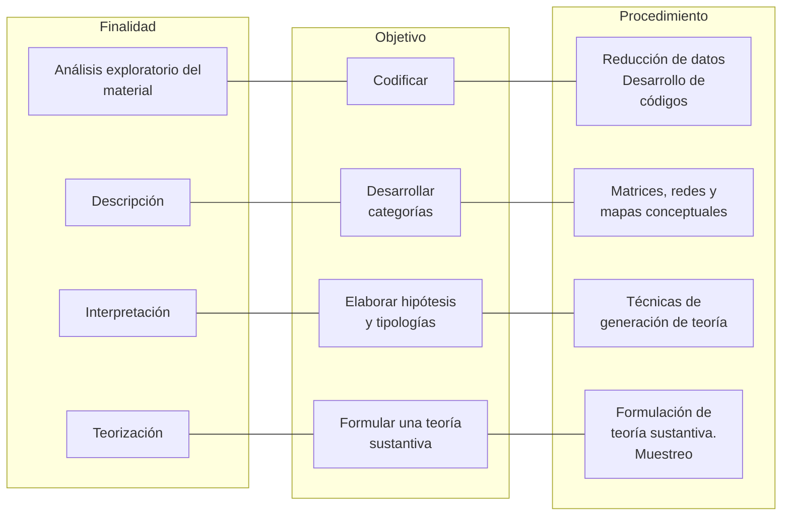

José Yuni / Claudio Urbano

# ANALISIS DE DATOS CUALITATIVOS

El análisis de datos es una de las actividades principales en la investigación cualitativa tanto por su importancia en el desarrollo del estudio como por la relevancia que posee como actividad concreta ya que se realiza a lo largo de todo el proceso. No es una etapa precisa y temporalmente delimitada en una fase concreta de la investigación. Antes bien, opera por ciclos que tienen lugar a lo largo de todo el proceso de investigación.

El análisis de datos de materiales cualitativos suele ser problemático por varias razones. Primero, que no existen procedimientos estandarizados que puedan aplicarse del mismo modo a cualquier tipo de datos. Segundo, que en el trabajo de campo se recopila información de naturaleza tan disímil que el investigador debe utilizar múltiples técnicas de análisis; Tercero, que el investigador puede volver a los mismos datos, en diferentes momentos de la investigación y extraer de ellos indicios referidos a distintas propiedades; Cuarto, muchas veces se termina cuantificando la información cualitativa, desvirtuando la lógica subyacente y empobreciendo las finalidades del análisis; Quinto, que se trata de captar procesos sociales, interacciones portadoras de significados, en otras palabras, se pretende reconstruir teóricamente un objeto en constante dinamismo y que va modificándose permanentemente.

Las alternativas de solución no son muchas y las disponibles están estrechamente vinculadas al mantenimiento de una actitud equilibrada y reflexiva del investigador. La más importante es, quizás, la de no perder de vista que la finalidad del análisis cualitativo es obtener una comprensión holística, integral y compleja de las situaciones sociales, para lo que describen las cualidades y propiedades que caracterizan el objeto.

El análisis de los datos antes que un procedimiento mecánico, se presenta como un movimiento intelectual permanente del investigador. En esta tarea se reintegran las cuestiones epistemológicas, lógicas, procedimentales, con la materialidad discursiva referida a las situaciones observadas. Por ello, el análisis cualitativo supone la confluencia y convergencia de tres actividades intelectuales: realización de procesos de generación teórica, de procesos de expansión y contrastación de hipótesis y/o teorías y procedimientos analíticos manipulativos. 

La primer actividad intelectual nos conduce a la intencionalidad teórica de las metodologías cualitativas, orientadas a generar teorías sustantivas. Recordemos que esas teorías son formuladas a partir de los datos, mediante el uso de procedimientos de inducción analítica. La segunda actividad, íntimamente relacionada a la anterior, remite al uso del método de comparación constante como el procedimiento metodológico que posibilita la contrastación y la expansión de los postulados; y la tercera actividad, se relaciona con los procedimientos manipulativos por medio de los cuáles se asigna cierto orden a la voluminosa e informe masa de datos que se obtienen cotidianamente en el trabajo de campo.

## a. Codificacion de la informacion

a. Codificacion de la informacion Reiteramos en varias ocasiones que el trabajo del investigador cualitativo se define por su carácter de interacción social. Como producto de esas interacciones y mediante el uso sistemático de cotidianamente en el trabajo de campo 
Los escasos autores que han tratado el tema del análisis de datos desde una perspectiva metodológica, ofrecen visiones parciales porque enfatizan sólo alguna de estas tres dimensiones. Veamos los aportes más relevantes.

## PAUTAS METODOLÓGICAS PARA EL ANÁLISIS DE DATOS CUALITATIVOS

diferentes técnicas de recolección de información, obtiene material empírico generado en las mismas situaciones sociales que desea estudiar. Como todo material producido en la interacción social, éste es vehiculizado por algún tipo de lenguaje y por lo tanto puede ser abordado a través de un proceso semiótico. No es nuestra intención entrar en esta dimensión. Sólo rescatamos el hecho de que el producto del trabajo del investigador se plasma en materiales discursivos. El investigador genera textos acerca de los otros y de sí mismo en relación a los otros, y acerca de todos situados en un determinado contexto. El análisis de datos supone, entonces, poder encontrar las tramas de sentido que sostienen esos textos. Para ello, debe realizar una serie de operaciones manipulativas.

Desde esta perspectiva, el sentido del análisis de datos es reducir, categorizar, clarificar, sintetizar y comparar la información con el fin del obtener una información lo más completa posible del fenómeno observado. En la bibliografía aparecen distintas posiciones respecto a las características que debe tener el análisis e interpretación de datos en la investigación cualitativa. Así, entre los etnógrafos hay una corriente que postula que el investigador en su descripción solamente tiene que ordenar en su narración lo que le han informado los sujetos que interrogó u observó, sin realizar ninguna interpretación. Otros, sostienen que además de la narración descriptiva el etnógrafo debe desarrollar interpretaciones y explicaciones a partir de los materiales.

Otra discusión se refiere a la necesidad de reducir el material discursivo y narrativo a códigos numéricos. Es decir, si se mantiene la estructura de la información o se la convierte en tablas numéricas, a partir de recuentos de frecuencias, uso de porcentajes, etc. Amparados en la característica de flexibilidad de los diseños cualitativos, la mayoría de los investigadores utiliza ambas formas de reducción, aunque insistimos que desde este enfoque se debe mantener la primacía de la comprensión de las cualidades.

Miles y Huberman(1984) consideran que el análisis consiste en cuatro tipos de actividades concurrentes: la reducción de datos, la

presentación de datos, la elaboración de conclusiones y la verificación. Generalmente, para facilitar el trabajo manual que suponen las etapas siguientes, el investigador debe preparar el material. La recomendación en tal sentido es que se seccione el texto por oraciones.

La reducción de datos implica seleccionar, focalizar, abstraer y transformar los datos brutos de forma que puedan ir estableciéndose hipótesis de trabajo. Para esta reducción se pueden utilizar distintas técnicas tales como códigos, la reducción de memorandums, etc. (Colás, 1994:272)

La base del proceso de reducción de datos es la codificación. Es decir se le asigna un código que identifica una unidad de significado relevante para nuestra investigación a cada frase o párrafo. Se denomina código a una abreviatura o símbolo que se aplica a una frase o párrafo de la transcripción de una entrevista o del diario de campo. Estos código permiten clasificar el tipo de información que contiene el texto según diferentes intenciones analíticas. Se pueden identificar distintos tipos de código, tales como:

Códigos descriptivos: llamados así porque describen el contenido de la oración analizada. Los códigos descriptivos serían una especie de etiquetas que el investigador va asignando a cada frase según el tema principal a que se refiera. De esta primera aproximación se obtiene una visión general acerca de cuáles son los temas principales que aparecen en el texto. Cabe señalar que el esquema de codificación se va construyendo a medida que se va recolectando la investigación. El investigador puede tener un esquema conceptual previo, con unos pocos códigos, y a medida que va incorporando información va modificando el esquema, agregando códigos, refinando otros.

$\Rightarrow$ Códigos explicativos o interpretativos: estos surgen luego de que se haya etiquetado todo el material discursivo. El investigador puede encontrar recurrencias en la información, o

esta podría agruparse pues parece que ciertos códigos distintos responden a la misma categoría o están relacionadas con una misma propiedad de la situación. Este tipo de códigos supone que se puedan establecer ciertas relaciones entre códigos o entre tipos de códigos.

$\Rightarrow$ Códigos patrón: designan patrones explicativos de las relaciones entre los eventos o acontecimientos y poseen un cariz inferncial y explicativo. Este tipo de códigos esta estrechamente relacionado con la construcción de un modelo comprensivo y la formulación de conceptos teóricos de mayor nivel de abstracción.

Generalmente, en la tarea de codificación predomina el uso del primer tipo de códigos.

La codificación es, entonces, el procedimiento por medio del cual los datos segmentados son categorizados de acuerdo a un sistema organizado que se deriva de la lectura de los datos. Si bien pueden utilizarse algunas categorías relacionadas con el marco conceptual inicial, la estructura del sistema de categorías se va conformando a medida que se van analizando los datos.

## Veamos un ejemplo:

## UNA INVESTIGACION SOBRE CREENCIAS

ECOLOGICAS EN LA INFANCIA

En un trabajo de investigación sobre la construcción de las nociones ecológicas en la infancia, se indagó a niños de entre 6 y 12 años de diferentes países, acerca de un conjunto de creencias ecológicas. Los niños debían completar un protocolo en el que se les pedía que pensaran que debían irse a vivir a una isla por el resto de su vida. Se le proveía de información respecto a que la isla tenía

buen agua, pastos y temperatura agradable. Luego se les pidió que anotaran los cosas que se llevarían y qué cosas harían una vez que llegaran a la isla. Luego se los invitó a dibujar la isla tal como ellos se la representaban al momento de su llegada y luego de su estancia por un tiempo prolongado. Alrededor de mil niños de cinco países participaron de la investigación.

Como puede observarse, se trata de una técnica proyectiva, de tipo cualitativa y que genera materiales discursivos y pictóricos. Siguiendo la lógica expuesta, se analizó el material.

Tomemos el caso de los objetos que se llevarían a la isla. La intención de esta consigna era poder captar qué objetos o elementos los niños percibían como necesarios para sobrevivir en un nuevo entorno. Se tomó un grupo de 50 protocolos y se procedió a elaborar listados con cada una de las respuestas de cada niño. Así, más allá de las diferencias lingüísticas, comenzaron a producirse agrupamientos de objetos que podían ser clasificados por alguna característica. Se elaboraron así las primeras categorías que fueron aplicadas la totalidad de los casos. Finalmente, el sistema de categorías quedó conformado con nueve clases de objetos. Para cada código se elaboró una definición y se pusieron ejemplos ilustrativos de modo que cualquiera de los miembros del equipo pudiera codificar los protocolos. Por ejemplo: Materiales cognitivos: objetos y útiles que cubren las necesidades mentales de los individuos (cuadernos, lápices, libros, instrumentos musicales, instrumentos de medición, etc.)

Posteriormente, y a la luz de los primeros resultados, se quiso determinar si los objetos tenían alguna significatividad ecológica, es decir si estaban ligados a alguna idea de reproducción de especies (semillas, animales, parejas humanas, plantas) o de transformación del ambiente (herramientas de cultivo) o si por el contrario los objetos eran innecesarios o inviables en las condiciones de vida de la isla. Con esa intención, se volvieron a analizar todos los protocolos y, particularmente las pregunta sobre lo que se llevarían, pero en esa ocasion con los códigos nuevos elaborados para responder al interrogante que se nos planteó.

## b. Exposición y presentación de los datos

Esta actividad consiste en presentar la información en forma sistemática y que permita visualizar las relaciones más importantes entre las categorías construidas anteriormente. Una vez codificada la información, el investigador continua trabajando la información para establecer categorías conceptuales más amplias, a partir de las cuales se elaboran hipótesis descriptivas y explicativas. En este momento el investigador trata de establecer algunas conexiones entre diferentes fenómenos, observa ciertas regularidades, detecta patrones de interacción entre propiedades de una situación. En fin se trata de elaborar un modelo más interactivo que de cuenta de la relación entre las categorías iniciales.

Las formas más habituales de organización y presentación que se utilizan son las matrices. Mediante éstas se ordena en un plano con distintas coordenadas la información textual producida por cada caso. Según el interés, la finalidad del estudio o el momento en el cuál se las utilice, las matrices pueden adoptar un orden temático, un orden temporal, o ambos simultáneamente. A su vez las matrices pueden ser descriptivas -propias de los primeros momentos de la investigación- o explicativas. Estas últimas aportan explicaciones, razones y causas del fenómeno observado, se usan en la fase posterior del análisis, y en ellas se vinculan determinados procesos con ciertos efectos, productos o resultados.

También se utilizan las "redes" que se configuran en torno a enlaces de categorías que se unen entre si. Las redes son muy útiles para describir datos y facilitar la clasificación y comunicación del tema analizado. Expresan una ordenación de las categorías a diferentes niveles de complejidad y facilitan la comparación entre sujetos en base a una estructura comparativa común

Otra forma de representación gráfica son los mapas conceptuales. Estos representan conceptos que las personas tienen sobre sí mismas o sobre lo que hacen. El mapa conceptual permite mostrar diferentes relaciones y articulaciones entre las propiedades de una situación.

En un estudio sobre la identidad profesional de los maestros santiagueños, las autoras realizaron una primera matriz para ordenar los datos de cada historia de vida y luego compararlas. Ordenaron en las columnas las siguientes categorías: aspectos estructurales (origen social, edad), aspectos institucionales (formación profesional, tipo de escuela, etc.) y aspectos técnicos-pedagógicos (definición de su función social, descripciones de su práctica, etc.). En las filas ubicaron a cada sujeto y en cada uno identificaron sus definiciones desde los discursos (lo que debe ser, explicaciones, argumentaciones) y desde su práctica (descripciones). En esta fase del trabajo, su interés era conocer cuáles eran los núcleos de identificación profesional y vocacional de los maestros. Luego volcaron en cada celda de la matriz, transcripciones textuales de las expresiones utilizadas por los entrevistados. La matriz vacía quedó estructurada de la siguiente manera:

## UN EJEMPLO DE MATRIZ DESCRIPTIVA

En esta etapa de elaboración de conclusiones, el aspecto manipulativo de los datos y las tareas de reducción se limitan considerablemente. El investigador tiene que aguzar su ingenio interpretativo y argumental para poder elaborar una narración coherente que contenga los matices, las articulaciones, las relaciones

## c. Elaboración de conclusiones

<table border="1"><tr><td></td><td></td><td rowspan="2">Aspectos institucionales</td><td rowspan="2">Aspectos institucionales</td><td rowspan="2">Aspectos técnicos-pedagógicos</td></tr><tr><td></td><td></td></tr><tr><td>Sujeto 1</td><td>Discurso</td><td></td><td></td><td></td></tr><tr><td></td><td>Práctica</td><td></td><td></td><td></td></tr><tr><td>Sujeto 2</td><td>Discurso</td><td></td><td></td><td></td></tr><tr><td></td><td>Práctica</td><td></td><td></td><td></td></tr><tr><td>Sujeto n</td><td></td><td></td><td></td><td></td></tr></table>

causales, las influencias recíprocas entre determinadas situaciones o aspectos personales. El modelo procedimental más característico es el que sugieren Glaser y Straus, en su propuesta de generar teoría a partir de los datos, y que puede hemos tratado con anterioridad.

Un modo típico de avanzar en la producción de explicaciones es mediante la elaboración de tipologías. Es decir se identifican tipologías de respuestas, de situaciones o de prácticas. Como resultado de este proceso el investigador obtendrá una teoría sustantiva provisoria del fenómeno. La formulación de una teoría supone que se supere la mera descripción de la situación observada. Es necesario que se integre el modelo teórico elaborado en un marco más amplio, para ello debe tratar de esforzarse por insertar aspectos particulares en categorías más amplias y abarcativas y establecer claramente cuáles son las propiedades que caracterizan el fenómeno, cuáles son los factores que lo condicionan y de qué modo las interacciones sociales, las prácticas y los lenguajes de los sujetos contribuyen a modificarlo, a conservarlo o a darle nuevos significados.

Tabla resumen de las finalidades, objetivos y procedimientos en el análisis de datos cualitativos

![[ecyc-u4-yuni.png]]

## d. Verificación del modelo teórico

En este momento se trata de verificar el modelo teórico, analizar las inconsistencia, examinar los casos críticos, intentar resolver las lagunas que el modelo pudiera tener. Los procedimientos que se utilizan son variados aunque destacan el método de comparación constante y el muestreo teórico, ya que mediante ellos se pueden contrastar los postulados teóricos con nuevos casos. En cuanto a las formas de producción de los materiales de análisis, se puede señalar la conveniencia de elaborar memorandums. Sobre la base de los memorandums el investigador intentará elaborar generalizaciones. Debe recordarse aquí que en los procedimientos que se describen hay una serie de criterios metodológicos que deben observarse para asegurar la validez y confiabilidad. En primer lugar, dado que en la investigación cualitativa se persigue captar las diferencias y no la homogeneidad de una situación, el método de comparación constante es un procedimiento que garantiza información divergente. En cuanto a la recolección y análisis, debemos guiarnos por el criterio de la saturación de la información en la variable. Según este, cuando comenzamos a encontrar siempre la misma información en un aspecto o atributo del fenómeno debe detenerse la búsqueda de datos y su análisis ya que mayor volumen de información no aporta nuevas categorías de análisis. Como en todo el proceso de investigación cualitativa, la triangulación -particularmente la de investigadores y de fuentes- constituyen estrategias cruciales en el análisis e interpretación de datos.

El trabajo con los datos es exhaustivo y se combina en diferentes niveles y con diferentes tipos de datos. El análisis se hace extensivo hasta que los nuevos datos no aportan o regeneran nuevos desarrollo teóricos.La manipulación de los datos durante el análisis es ecléctica y eminentemente dialéctica. Por ello no existe un único camino correcto para acceder al análisis e interpretación de información. El investigador debe explorar cuál es la vía más apropiada y sobre todo, cuál es la más fructífera para acceder al conocimiento de su objeto de estudio. En definitiva, como lo reconocen los metodólogos, la única garantía del investigador es lo que llaman su "sensibilidad teórica", es decir su capacidad para descubrir relaciones, contradicciones, complejidades...allí donde otros apenas ven información.

