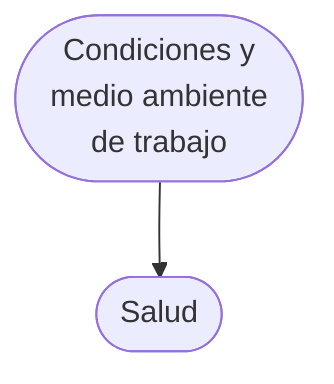

# Los componentes del diseño flexible en la investigación cualitativa

Nora Mendizábal

Se puede considerar a la ciencia como un stock y como un flujo: un conjunto de conocimientos verificados pero provisorios o una actividad productora de ideas. Esta actividad se inicia y se desarrolla mediante la investigación científica planeada, con diseños que articulan lógicamente sus elementos constitutivos y que se comunican por medio de propuestas o proyecto escritos de investigación. El diseño articula lógica y coherentemente los componentes principales de la investigación: justificación o propósitos, teoría, preguntas de investigación, método y los criterios utilizados para garantizar la calidad del estudio; este se comunicará luego en un documento, una propuesta escrita, para que pueda ser evaluado por diferentes jurados y guiar así al investigador en la continuidad del proceso de investigación.

Dentro de las ciencias sociales los estudios se pueden conducir con diseños estructurados o con diseños flexibles, elección que no está necesariamente vinculada al estilo de indagación cuantitativo o cualitativo adoptado. También hay estudios o programas que, por su magnitud y relevancia, parten de interrogantes complejos que ameritan una aproximación que combine estilos y diseños.

No obstante, el objetivo de este capítulo está circunscrito a presentar las características de los diseños flexibles en la investigación cualitativa dentro de las ciencias sociales. Consta de tres partes: en la primera se presentan los diversos tipos de diseño, los rasgos de los datos cualitativos obtenidos a través del diseño flexible, y las paradojas o di-

lemas de las propuestas escritas. En la segunda parte se describen los elementos principales de un diseño; y en la tercera se desarrollan los lineamientos para la redacción de las propuestas escritas y las exigencias institucionales para su presentación.

Como la finalidad ultima de este capítulo es pedagógica, se ha utilizado expresamente bibliografía que ha demostrado su utilidad en la guía de los investigadores nóveles en sus diseños y propuestas de investigación (Maxwell, 1996; Marshall y Rossman, 1999; Creswell, 1998).

1. Los diseños de investigación en ciencias sociales.

La paradoja de los diseños flexibles

## 1.1. Diseños estructurados

Se pueden modelar analíticamente dos tipos de diseños: estructurados y flexibles. El diseño estructurado es un plan o protocolo lineal riguroso, con una secuencia unidireccional, cuyas fases preestablecidas se suceden en el tiempo y las realizan quizá diferentes personas; esta secuencia se inicia con los propósitos de la investigación hasta arribar a la recolección y análisis de los datos. Parte de objetivos finales precisos, un marco teórico que delimita y define conceptualmente su campo de estudio, y una metodología rigurosa para obtener datos comparables. Este diseño no podrá ser modificado en el transcurso del estudio y solo captará aquello que los conceptos operacionalizados delimiten.

Generalmente se ha asociado este diseño a los estudios sociales cuantitativos interesados en la verificación. Si simplificamos los rasgos diversos de estos estudios, podemos afirmar que se inician con hipótesis definidas de antemano o con conceptos rigurosamente operacionalizados –indicadores, variables—; además, en las categorías preconcebidas de estas variables, se clasifican unidades de análisis pertenecientes a muestras probabilísticas, y estas categorías cumplen con los criterios de exhaustividad, mutua exclusión y relevancia; si las unidades de análisis son individuos, cada persona es interrogada con el mismo tipo de preguntas preelaboradas por el investigador en cuestionarios pautados. El objetivo es garantizar la comparabilidad de los datos en el interior de cada categoría, y posteriormente obtener, por inferencia estadística, el conocimiento de las características medibles en todo el universo de unidades de análisis de referencia. Los datos son números, ya sea porque se trata con variables cuantitativas o con las frecuencias de variables de diversos niveles de medición; además, su análisis es matemático: porcentajes, modo, mediana, media, correlaciones, regresiones y/o asociaciones, entre otros.

También existen dentro de determinadas investigaciones cualitativas diseños estructurados, que pretenden ver la realidad social a par-

tir de esquemas teóricos seleccionados, conducir estudios para verificar teorías desarrolladas por otros investigadores o aumentar su validez. El ejemplo típico dentro de la sociología es el caso de los tradicionales estudios de conducta desviada, que utilizaban la teoría de Merton como marco para deducir los conceptos utilizados (Merton, 1980).

## 1.2. Diseños flexibles

Un diseño flexible, por el contrario, alude sólo a «la estructura subyacente» de los elementos que gobiernan el funcionamiento de un estudio (Maxwell, 1996: 4); se refiere a la articulación interactiva y sutil de estos elementos que presagian, en la propuesta escrita, la posibilidad de cambio para captar los aspectos relevantes de la realidad analizada durante el transcurso de la investigación. El concepto de flexibilidad alude a la posibilidad de advertir durante el proceso de investigación situaciones nuevas e inesperadas vinculadas con el tema de estudio, que puedan implicar cambios en las preguntas de investigación y los propósitos; a la viabilidad de adoptar técnicas novedosas de recolección de datos; y a la factibilidad de elaborar conceptualmente los datos en forma original durante el proceso de investigación. Este proceso se desarrolla en forma circular; opuesto, por lo tanto, al derrotero lineal unidireccional expuesto anteriormente. Por lo tanto, la idea de flexibilidad abarca tanto al diseño en la propuesta escrita, como al diseño en el proceso de la investigación.

Cuando se presenta la propuesta por escrito, el investigador debe tratar de introducir la idea de que la misma puede sufrir cambios, que las preguntas son solo preliminares, del mismo modo en que lo son las técnicas de recolección, las unidades y el tipo final de análisis. Tal como manifiestan Marshall y Rossman (1999: 56), la flexibilidad se construye, pues el investigador se debe reservar el derecho de hacer modificaciones sobre el diseño original, que evoluciona y puede cambiar; por lo tanto «no está escrito en la piedra» (Morse, 2003a: 1336). No obstante, en ese equilibrio móvil, los elementos constitutivos deben «dialogar e interactuar», presentando así la idea de totalidad integrada. Durante el proceso de indagación, por el hecho de investigar temas poco conocidos, o que deben ser reconsiderados, el diseño va sufriendo los cambios preanunciados y otros nuevos, que van a enriquecer y a llenar de originalidad el resultado final.

Esta flexibilidad se propicia, además, porque los conceptos utilizados en el contexto conceptual solo sirven de guía, de luz, de sensibilización, pero no constriñen por anticipado la realidad determinando que una interacción o proceso adopte las características presupuestas. Es por esta razón que, si bien el concepto utilizado mapea relaciones o características que de otro modo quedarián inadvertidas o no com-

prendidas, ya desde el principio de la investigación se presenta la posibilidad de modificarlos o superarlos. Desde el inicio de la investigación la recolección de datos, el análisis, la interpretación, la teoría, se dan conjuntamente, y esta ida y vuelta entre los datos y la teorización permite generar interactivamente conocimiento fundado en los datos. Esta idea es descrita por Blumer (1982: 30) al reflexionar sobre lo que denomina etapa exploratoria de investigación:

La exploración es un procedimiento flexible mediante el cual el especialista se traslada de una a otra línea de investigación, adopta nuevos puntos de observación a medida que su estudio progresa, se desplaza en nuevas direcciones hasta entonces impensadas y modifica su criterio sobre lo que son datos pertinentes, conforme va quedando más información y una mayor comprensión.

La flexibilidad del diseño en la propuesta y en el proceso está encarnada por la actitud abierta, expectante y creativa del investigador cualitativo; algunos autores la han equiparado, en forma poética, a la actitud de una persona frente a una puesta de sol: se rinde ante su belleza y capta lo que se presenta.

Se vincula este tipo de diseño a la investigación cualitativa inductiva que desea crear conceptos, hipótesis, modelos y/o teoría desde los datos empíricos. Pero también es posible utilizar este diseño en investigaciones cuantitativas que, utilizando datos secundarios -obtenidos en forma rigurosa-, se propongan crear teoría y nuevos conceptos, analizándolos en forma libre e inductiva (Glaser y Strauss, 1967: 185; Glaser, 1978: 6).

## 1.3. ¿Qué tipo de datos cualitativos se obtienen con este diseño flexible?

Una de las características fundamentales del tipo de investigación cualitativa que deseamos presentar, dentro de la gran diversidad de sus manifestaciones, es la de ser principalmente emergente, inductiva, más que fuertemente configurada; por lo tanto el diseño flexible presentado es el que propicia esta particularidad. Durante el transcurso de la indagación el investigador podrá estar abierto a lo inesperado, modificará sus líneas de investigación y los datos a recabar en la medida en que progresa el estudio, y será proclive a revisar y modificar imágenes y conceptos del área que estudia. Además, los datos producidos con este diseño flexible son descriptivos, ricos, son las palabras de los entrevistados, ya sea habladas o escritas, y/o la conducta observable; el análisis de la información es no matemático; se intenta captar reflexivamente el significado de la acción atendiendo a la perspectiva del sujeto o grupo estudiado; la información surge de la actitud natu-

ralista del investigador al realizar el trabajo de campo, ya que interaccióna con las personas en su propio ambiente y habla su lenguaje (por lo tanto está lejos del laboratorio o de las aulas, que serían no naturales), y utiliza una multiplicidad de métodos para registrar datos; se aborda en forma holística las situaciones sociales complejas y es indicada para analizar sus procesos y trayectorias.

La investigación cualitativa es un término que alberga en su interior una gran variedad de modalidades. Algunas focalizan en: 1) la experiencia de vida del individuo, en el significado subjetivo de sus manifestaciones, y se basan en los fundamentos teóricos del interaccionismo simbólico; constituyen la tradición de la teoría fundamentada y la historia de vida, 2) la forma en que se produce el orden social y la cultura, utilizando la etnografía, la etnometodología, y el estudio de casos; 3) otras se centran en el lenguaje y en la comunicación; y finalmente la corriente alemana menciona las tradiciones que privilegian 4) las estructuras profundas de acción y significado, a través de la hermenéutica (Marshall y Rossman, 1999: 5, 60, 61; Flick, 2004: 31, 289).

Así, diferentes autores concluyen con respecto a su «estado del arte» actual, que constituye un «confuso muestrario de alternativas de métodos de investigación» (Marshall y Rossman, 1999: 1), una «miriada de métodos» (Morse, 2003b: 834), «significa diferentes cosas en cada momento» (Denzin y Lincoln, 1994). Pero lejos de preocuparse, e imponer un consenso que no existe, la situación muestra la fertilidad y la vida de la investigación cualitativa (Geertz, 2002). Las implicancias y características de cada tradición, también denominadas género, escuela, tipo, estrategia, aproximaciones, método, pueden ser objeto de periodizaciones y clasificarse en «momentos» que muestran las «tensiones, contradicciones, y dudas» (Denzin y Lincoln, 1994) dentro de la investigación cualitativa a lo largo de la historia. El término se convierte de este modo en una gran «sombrilla», cuyos rayos constituyen cada tradición, unida por la misma tela (Denzin y Lincoln, 1994; Flick, 2002: 6). Otro autor, también afecto a las metáforas, manifiesta que la investigación cualitativa es una gran «tela tramada realizada manualmente en un telar por diferentes artesanos» (Creswell, 1998). Haciendo una nueva reinterpretación, y dado que el tejer es una actividad que conozco, considero que los criterios científicos propios de la actividad constituirán el telar; la urdimbre –los hilos verticales– las características comunes a toda investigación cualitativa; y el entrelazado horizontal de los hilos, lanas, sedas, con sus diferentes colores, tensiones, dibujos, y por qué no sentidos y fines trabajados por cada artesano/a, serían la trama unida pero rica en variedades. Cada tensión producida por el «peine» del artesano podría equipararse con las diferentes formas de estructuración en cada tradición. Habría así diferencias interindividuales entre artesanos y diferencias intraindividuales, debidas a la creatividad desarrollada por cada actor.

Si bien se ha demostrado la utilidad de este estilo de investigación y su legítimo modo de conducirlas, es preciso evitar mistificaciones o apologías respecto de sus bondades, que pueden llevar a un antagonismo irracional entre los estilos diversos, cuantitativo y cualitativo, sin preguntarse cuándo son más apropiados los diseños cualitativos, para qué tema, para qué pregunta, para qué grupo (Flick, 2002; Creswell, 1998). Definitivamente, la elección del estilo y su tradición se deriva, fundamentalmente, de la pregunta de investigación que se efectue, ya que no es conveniente algo parecido a «una aproximación monolítica» u «ortodoxia metodológica» (Patton, 2002: 264, 272). Lo que sí se exige, siempre, es un trabajo de calidad.

Estas apreciaciones captadas por analistas que realizan estudios transversales de las diversas tradiciones, implican que del mismo modo en que no es conveniente juzgar las propuestas de investigación cualitativa con criterios cuantitativos, no se debería juzgar el diseño de una propuesta de investigación de una tradición, para un tema e interrogantes determinados, con los criterios de otra tradición.

## 1.4. Paradojas o dilemas en las propuestas escritas

A pesar de las características flexibles, evolutivas, cambiantes, propias de estudios desarrollados en escenarios naturales, sobre temas nuevos e intrigantes, en los cuales los conocimientos surgen de las múltiples perspectivas de los entrevistados en forma preferentemente inductiva, es necesario elaborar un diseño de investigación explícito y comunicarlo en forma escrita; tal propuesta permitirá estructurar las ideas principales del investigador con los elementos básicos teórico-metodológicos y servirá de guía durante el proceso de investigación.

Esta dificultad ha sido analizada por varios autores, y se ha llegado a hablar de «la paradoja» o «dilema» del diseño de investigación cualitativo (Morse, 2003a: 1335; Marshall y Rossman, 1999: 38), ya que, por un lado, se detallan las características flexibles del diseño en el proceso de investigación, las indecisiones anteriores a toda investigación, el carácter preliminar del bagaje de conocimientos con que contamos, y por otro lado la exigencia de confeccionar una propuesta clara, con preguntas definidas vinculadas a los propósitos, que puedan ser contestadas con determinadas técnicas y en el tiempo presentado en el cronograma. Además, el estudio debe estar enmarcado en una/s disciplina/s, dentro de una/s de las tradiciones de la investigación cualitativa, y seguir lineamientos teóricos elaborados y actualizados, sujetos a ampliación, enriquecimiento o superación. Todos estos elementos cuentan para juzgar su calidad en el momento de la evaluación. De esta manera la aparente paradoja, reconocida y aceptada, debe ser resuelta presentando diseños flexibles.

La presentación de las propuestas de investigación cualitativa en ciencias sociales es un requerimiento fundamental para la evaluación y financiación posterior, tal como veremos en el apartado 3.3. Es necesario que los investigadores: a) expliciten el diseño implicito; b) justifiquen la relevancia del proyecto para la ciencia y para el país, dado que los escasos recursos del Estado deben utilizarse en forma eficiente; y c) demuestren a los integrantes de los jurados, que pueden no conocer las características de la investigación cualitativa, que los criterios de calidad estarán garantizados.

## 2. El diseño en la investigación cualitativa

## 2.1. Definiciones

Las características del diseño flexible de la investigación cualitativa deberán constar en la propuesta escrita. Se puede definir a este diseño como una «disposición de elementos que gobierno el funcionamiento de un estudio» que producirá datos cualitativos en forma inductiva, y también como la «estructura subyacente e interconexión de componentes de un estudio y la implicación de cada elemento sobre los otros» (Maxwell, 1996: 4).

Estas definiciones aluden a una articulación sutil, móvil y no lineal entre los elementos constitutivos del diseño, que le permite sufrir modificaciones en forma paulatina a lo largo del proceso de investigación. Si la marca registrada (hall-mark) fundamental de la investigación cualitativa, ya sea en la etapa de propuesta como en el proceso de la indagación, es su flexibilidad, este diseño permite y propicia que esto suceda.

El término diseño sería una distinción analítica dentro de la propuesta o proyecto de investigación, una instancia previa de reflexión sobre el modo de articular sus componentes para poder responder a los interrogantes planteados, tratando de lograr toda la coherencia posible entre el problema de investigación, los propósitos, el contexto conceptual, los fundamentos epistemológicos, las preguntas de investigación, los métodos y los medios para lograr la calidad del estudio. Si bien esta articulación lógica es una promesa sobre el trabajo futuro, en el documento escrito se puede vislumbrar la armonía flexible entre sus componentes, que anticipan los posibles cambios en el posterior desarrollo (véase gráfico 2.1).

Gráfico 2.1. Modelo interactivo del diseño en la propuesta de investigación cualitativa

![[ecyc-u5-mendizabal_componentes-diseno-flexible1.png]]

Fuente: Maxwell, 1996: 5.

El diseño se convierte en acto o se despliega en el proceso total de la investigación efectivamente desarrollada, y dadas sus particularidades tan azarosas, sufre continuas transformaciones que enriquecen finalmente el estudio final. Por lo tanto, se refiere a la articulación lógica de los cinco componentes principales ya mencionados de una propuesta de investigación. Esta estructura se observa en forma estática en cada propuesta o plan futuro de la investigación, y como proceso a lo largo de todo el desarrollo de la misma, y en el informe final escrito.

Así, en este trabajo se hará una distinción analítica entre diseño y propuesta: el primero alude tanto al modo de articular lógica y coherentemente los componentes de la investigación, como también al modo en que se conduce el proceso total de la investigación efectivamente desarrollada. La propuesta o proyecto escrito de investigación es un documento que articula en forma coherente los diferentes elementos que la componen, a través de una argumentación sólida y convincente sobre la importancia de llevarla a cabo. La misma materializa las exigencias prácticas y teóricas para acceder a una evaluación y su posterior financiación, en caso de obtenerla (Maxwell, 1996). Si bien esta definición de diseño es la compartida por la mayoría de los autores de esta obra y transmitida en los seminarios internos y en los cursos externos de metodología cualitativa, porque representa la perspectiva analítica más pedagógica, es conveniente relevar otros usos del término diseño.

Algunos autores conservan la distinción entre propuesta y diseño; denominan diseño sólo a los aspectos metodológicos de la investigación, asemejándose así a los investigadores cuantitativos, quienes con el término aluden a la puesta a prueba de las hipótesis. Se refieren a los aspectos relacionados con la recolección de datos, el análisis, la interpretación, el objeto de estudio, las muestras y los aspectos éticos. Así, Taylor y Bogdan (1986) consideran que el diseño se refiere «a los métodos, los aspectos referidos a la recolección de datos, el análisis y a la comunicación escrita». Para Marshall y Rossman (1999: 23; 38) el diseño sólo constituye una parte de la propuesta que abarca los procedimientos y los métodos: la población de interés, el método de recolección de información, la estrategia de análisis de datos, las garantías de credibilidad, la biografía del investigador, los aspectos éticos de la investigación. Para estas perspectivas habría un diseño esbozado en el momento de presentar la propuesta o proyecto de investigación, referido solo a los aspectos metodológicos, y también se apreciaría el mismo en el transcurso del proceso de la investigación, por el modo de conducir la recolección de datos, su análisis, su interpretación, y en la arquitectura del informe final escrito.

Otros autores no diferencian «expresamente» las ideas de propuesta y diseño, pero sí rescatan al diseño como articulación lógica de todos los componentes que integran una investigación durante el proceso efectivo de su ejecución, desde las primeras ideas hasta la comunicación escrita. Para Creswell (1998: 255), el diseño de investigación se refiere «al proceso total, desde la conceptualización de un problema hasta la expresión escrita».

## 2.2. Componentes del diseño de investigación

Evidentemente un diseño de investigación y su comunicación en una propuesta no se logran solamente conociendo metodologías cualitativas, sino que son necesarios una sólida formación disciplinar o transdisciplinar y un conocimiento profundo de la problemática a investigar. Contrariamente a lo que sugiere el sentido común, se investigan los temas que se conocen, y en caso contrario, es necesario, antes de iniciar el proceso de investigación, estudiar las contribuciones de otros investigadores, leyendo la totalidad de los textos relevantes, los trabajos de investigación efectuados, realizando entrevistas en centros de estudio y asistiendo a congresos y seminarios.

Pasando nuevamente a las exigencias del diseño de investigación cualitativa, este implica la articulación lógica de un conjunto de elementos «principales»: propósitos, contexto conceptual, presupuestos epistemológicos, preguntas de investigación, método y criterios de calidad.

El gráfico 2.1 ilustra el tipo de vinculación lógica e interactiva que deberían tener los componentes: atender la coherencia, en principio, de los tres primeros que se podrían considerar más teóricos: propósitos, contexto conceptual y preguntas de investigación. Posteriormente, el modo en que el método permite responder las preguntas de investigación, y cómo se garantizarán los criterios de calidad. Finalmente, el «todo» debe estar coherentemente articulado, aunque, posiblemente, sea preliminar, evolutivo y cambiante.

## 2.2.1. Los propósitos

¿A qué se denomina propósito?

¿Qué otros sinónimos utilizaría para denominar ese componente?

¿Con qué diferente tipo de propósitos se puede iniciar un estudio?

Los propósitos se refieren a la finalidad última del trabajo, al «por qué» o al «para qué» se lo realiza. Independientemente de la denominación dada usualmente a este componente –testimonio, justificación u objetivo último-, es importante explicitar si los propósitos son descriptivos, teóricos, políticos y prácticos, personales y/o surgen de una demanda externa. El primero alude a la necesidad de realizar descripciones densas; el segundo, a la posibilidad de contribuir a la expansión de la teoría –se replica un estudio en otras unidades de análisis–, al enriquecimiento conceptual en el interior de la misma, o a la superación y/o creación de nuevos conceptos o teorías. Los terceros, los propósitos políticos, aluden a la posibilidad de dar respuestas a problemas que se desea resolver, en diferentes escalas –un grupo social, un aula, un taller, un barrio, una institución–, y a partir de allí elaborar recomendaciones para implementar en prácticas y políticas de acuerdo al nivel, ya sea local o nacional; estos últimos también se denominan propósitos emancipatorios o de empoderamiento. Dentro de los fines prácticos se pueden encontrar estudios que se refieran a la evaluación de diversos tipos de programas. Finalmente, es posible, a su vez, que los motivos solo sean personales o surgidos por una demanda institucional, como por ejemplo, una asociación sindical que solicite un estudio de condiciones de trabajo; en estos casos es necesario detallar sus características.

Evidentemente, pueden presentarse uno o varios motivos para realizar un estudio. Debido a las diferentes tradiciones ya mencionadas en este capítulo, se verá que, por ejemplo, es dentro de la teoría fundamentada en donde la construcción de categorías conceptuales y/o teoría es un propósito inherente a ella, o en la etnografía lo es la realización de la «descripción densa».

Los propósitos explicitados deberán ser tenidos en cuenta en el contexto conceptual, las preguntas y los métodos. Si se han aducido

motivos teóricos, ya sea por vacío de conocimiento o por la necesidad de enriquecer las categorías conceptuales y sus propiedades, en tal caso un análisis crítico de la bibliografía relevante mostrará por qué no son aptas para dar cuenta del tema y responder a la pregunta de investigación. Cuando se propone crear conocimiento para elaborar recomendaciones y transformar, por ejemplo, sistemas, modalidades de enseñanza o condiciones de trabajo, se deberá realizar un trabajo de campo muy minucioso y responsable, con múltiples técnicas de recolección de información.

En la propuesta escrita, este componente del diseño de investigación forma parte de la introducción del estudio, juntamente con el tema, asunto, o foco central; el planteo del problema, en caso de que lo hubiera; la/las tradiciones elegidas dentro del estilo de investigación cualitativa, ya sea etnografía, teoría fundamentada, estudio de caso, historia de vida; y las unidades de análisis.

Así, algunos autores (Creswell, 1998) proponen una guía muy pedagógica que sintetiza estas observaciones y complementa el estilo utilizado por muchos investigadores argentinos para presentar propuestas. Esta podría ser utilizada eligiendo una o más opciones, que dependerán de la dimensión del estudio y del número de tradiciones necesarias para realizarlo:

El propósito de este estudio basado en ... (definir la «tradición» elegida) es ... (elegir, ya sea: entender; describir; ampliar, enriquecer, crear teoría; transformar la realidad), las ... (definir el foco o tema central de la investigación), de los ... (definir las unidades de análisis: individuos, grupos, procesos).

En esta investigación el ... (foco central) será definido como ... (dar la definición).

Se podría ilustrar este esquema con un ejemplo tomado de una investigación realizada en el CEIL-PIETTE del CONICET denominada Telegestión: su impacto en la salud de los trabajadores (Neffa et al., 2001).

## Recuadro 2.1

El trabajo es una de las principales actividades desarrolladas por hombres y mujeres, que permite: la producción de bienes y servicios para ser utilizados por la sociedad, la realización personal de los operadores, el vinculo social dentro del grupo de trabajo y la obtención de un ingreso para satisfacer necesidades materiales y espirituales. Pero estos fines últimos serán alcanzados si se protegen las condiciones de trabajo de los operadores y se evita el surgimiento de enfermedades. Si bien la crisis social ha puesto en la agenda otros temas de investigación como: desempleo, precariedad, pobreza, las

condiciones de trabajo de los operarios que aún tienen trabajo deben seguir siendo estudiadas.

La demanda de investigación surgió luego de advertirse que en los operadores/as los umbrales de fatiga usuales se habían superado: ya no se podía recuperar el bienestar con el descanso diario posterior a la jornada de trabajo.

El propósito de este estudio basado en dos tradiciones de investigación cualitativa, estudio de caso y la teoria fundamentada, es analizar cómo son percibidas las condiciones de trabajo y cómo es vivida su vinculación con su salud por parte de los/as operadores/as telefónicos/as; enriquecer el mapa conceptual elaborado en la bibliografía relevante sobre la vinculación entre las condiciones de ejecución, las características de los operadores y la tarea prescrita sobre la actividad, y estas a su vez, sobre la salud de los operadores y la calidad del trabajo realizado; y luego de comprender el trabajo elaborar recomendaciones para transformar las condiciones laborales nocivas.

## 2.2.2. El contexto conceptual

¿Qué es el contexto conceptual?

¿Cuáles son las fuentes para elaborar un contexto conceptual?

¿Qué función tiene?

¿Qué herramienta se puede utilizar para identificar los vacíos

o brechas en el conocimiento?

Se denomina contexto conceptual al «sistema de conceptos, supuestos, expectativas, creencias y teorías que respaldan e informan la investigación» (Maxwell, 1996). El contexto conceptual no se encuentra ni se toma prestado, es construido por el investigador. Permite a) ubicar el estudio dentro de los debates de la comunidad científica, b) vincularlo con las tradiciones teóricas generales y específicas del tema, c) evaluar el tipo de aporte teórico que se realizará a través del estudio propuesto: expandir la teoría, enriquecerla o superarla creando nuevos conceptos, y por supuesto d) respaldar el resto de los componentes del diseño, especialmente, las preguntas de investigación. Tiene como función iluminar conceptualmente aspectos relevantes de los datos o fenómenos sociales, y la dirección de sus posibles relaciones, que de otro modo podrían pasar inadvertidas o no ser comprendidas. Pero al mismo tiempo, dado que es un contexto flexible, permite que surjan en forma inductiva e inesperada nuevos datos que puedan ser conceptualizados, ya sea para enriquecer o superar el contexto inicial.

El contexto conceptual se elabora a partir de diversas fuentes o recursos: 1) la experiencia vital del investigador y sus propias especulaciones o ideas; 2) el conocimiento y dominio de las tradiciones teóri-

cas referidas a la temática estudiada, y el análisis crítico de la bibliografía pertinente y relevante, tarea que se denomina, curiosamente, «estado del arte»; y 3) los estudios o investigaciones anteriores.

1. La experiencia vital se refiere a los conocimientos que posee el investigador a partir de su ejercicio profesional y vivencias sobre el tema estudiado, que dan lugar a una mirada calificada sobre el tema.

El conocimiento no surge sólo de la bibliografía publicada, sino de «papers» y estudios no publicados, de charlas informales dentro de grupos de investigación, los «colegios invisibles», de la asistencia a congressos, y de consejos brindados por maestros conocedores del campo de estudio.

2. El análisis de las teorías e investigaciones referidas a la temática, relevantes y pertinentes, se hará en forma crítica y responsable; por lo tanto no es el resumen descriptivo de las decenas de publicaciones en libros y documentos escritos sobre el tema. Hay muchas definiciones sobre qué es una teoría; para Maxwell «es un conjunto de conceptos y de relaciones propuestas entre ellas, una estructura que intenta representar o modelar algo sobre el mundo», que «cuenta una historia iluminada sobre el fenómeno, que le brinda nuevas ideas, revelaciones, y amplía su comprensión» (1996: 33).

Según las diferentes tradiciones dentro de la investigación cualitativa, y de acuerdo con la elegida para realizar el estudio, el análisis de la bibliografía adoptará diversos matices. Siempre se debe conocer la teoría disciplinar y la referida a la temática específica, ya sea cuando el propósito es solo realizar un estudio en otro contexto para «ampliar» el alcance de la teoría, como cuando hay interés explícito de enriquecer conceptos o crear y superar los vigentes. En este último caso, el análisis crítico de la bibliografía permitirá encontrar vacíos, brechas o huecos en el conocimiento, así como contradicciones, relaciones no apropiadas y otras inexistentes. Una herramienta sugerida para esta tarea —en forma gráfica— es lo que se denomina mapa conceptual, que permite analizar el campo de estudio con las teorizaciones existentes y propias sobre el tema, comenzar a pensar críticamente sobre las brechas en el conocimiento —gaps— y evaluar sus posibles contribuciones. Evidentemente, solo cuando finalice el estudio quedará elaborada una pequeña teoría.

El mapa permite reconocer el «territorio» teórico, pero al relacionarlo con los datos de la realidad, se puede advertir que faltan conceptos, que los existentes se pueden enriquecer encontrando otras dimensiones o propiedades, que faltan relaciones importantes, que se necesita incorporar otra disciplina para responder a la problemática de la investigación, etc. Tomando como ejemplo el tema referido a las condiciones de trabajo y su vinculación con la salud de los operarios, se puede analizar en forma muy resumida cómo fue complejizándose el

Gráfico 2.2. Mapa conceptual

![[ecyc-u5-mendizabal_componentes-diseno-flexible2.png]]

mapa teórico, desde el abordaje inicial de la sociología hasta el sugerido por la ergonomía, que permitió llenar los huecos no analizados y extender la influencia del trabajo no solo sobre la salud de los trabajadores sino también hacia la calidad de lo producido. El aporte más importante es haber captado la diferencia entre la tarea prescrita por la organización del trabajo, y la tarea real –actividad– efectivamente desarrollada (gráfico 2.2). Además, si tomamos el mapa como contexto conceptual, es posible enriquecer las dimensiones y subdimensiones de las categorías conceptuales –por ejemplo, enriquecer el concepto de sobrecarga cognitiva o psíquica-, y/o crear otras a partir del análisis inductivo de las características propias según las diversas actividades que se analicen. Por ejemplo maestros, operadores de teléfono, obreros del vidrio, etc. Por otro lado, a partir de los «estudios piloto» sobre el terreno, es posible ponderar y seleccionar determinadas categorías, o plantearse otras diferentes.

Respecto de las teorías existen dos peligros: a) iniciar el estudio sin ninguna teoría, situación que puede conducir a no poder reconocer aspectos relevantes del fenómeno estudiado, y b) imponer una teoría, descansar en ella, ver la realidad desde una sola perspectiva y tratar de «calzar» los datos en las categorías preconcebidas, o poner «datos redondos en categorías cuadradas» (Glaser y Strauss, 1967).

3. Los conocimientos surgidos de los estudios piloto o de investigaciones anteriores permiten comprender mejor el tema, especialmente

desde las personas o grupos ya estudiados. Estos ejercicios pueden mejorar y esclarecer el diseño final.

Con estas fuentes o recursos se construye el contexto conceptual en el estilo de investigación cualitativo apropiado para cada tema de investigación.

## La distinción entre el contexto conceptual y el marco teórico

El contexto conceptual se diferencia expresamente del «marco teórico». Este «marco teórico» es utilizado en estudios denominados «estructurados», que generalmente se corresponden con el estilo de investigación cuantitativa; se elabora a partir de teorías validadas, cuyos conceptos, dimensiones e indicadores operacionalizados están rigidamente definidos e individualizados, y cuya función es ahondar el foco de análisis desde esta sola y rutinaria perspectiva, en forma deductiva, lo cual constriñe la situación estudiada «forzándola» o «violentándola» para que encaje en los conceptos o esquemas preconcebidos. El aspecto positivo de este abordaje es que garantiza la comparabilidad de estudios que responden a un mismo marco teórico.

## El contexto conceptual y las tradiciones de investigación

También el contexto conceptual toma un matiz diferente de acuerdo con las tradiciones de estudio. Se da una especie de continuum, hay estudios que parten de un contexto conceptual elaborado, que será solo ampliado o enriquecido por los resultados finales del mismo; y otros en los cuales la necesidad de generar teoría está explícitamente planteada en los propósitos y demostrada en el análisis crítico de la bibliografía relevante, ya sea usando mapas conceptuales o textos, en los cuales se visualizan las brechas, omisiones o vacíos en el conocimiento. Así, para Creswell (1998: 85), la etnografía y la fenomenología partirían de un contexto conceptual elaborado que sería enriquecido y/o replanteado por los aportes del estudio; en el estudio de caso y estudio biográfico, se da una situación intermedia, ya que si bien pueden partir de una teoría, su propósito es elaborar patrones, taxonomías y modelos; en cambio la teoría fundamentada parte de la necesidad expresa de construir en forma inductiva nuevos conceptos relacionados o redefinir los existentes articulándolos en teorías más generales (véase cap. 4).

La función orientadora del contexto conceptual, dentro de la tradición de la teoría fundamentada, se ilustra en el siguiente texto:

Aunque los investigadores conozcan datos y teorías deben escapar de alguna manera a aquellos rasgos de su trabajo que bloquean la nueva perspectiva de una corazonada repentina, el destello de una revelación, la idea brillante o la formulación teórica profundamente diferente.

El conocimiento específico es necesario pero a veces constituye un obstáculo mental que impide esta clase de creatividad intelectual. De hecho hay científicos expertos sobresalientes en sus especialidades, y aun competentes investigadores, pero no particularmente creativos (Strauss y Corbin, 1990: 29; traducción de la autora).

Si bien somos respetuosos de las diversas tradiciones presentadas en la literatura internacional dentro de la investigación cualitativa, desearíamos propiciar la creación de conceptos, hipótesis y/o teorías nuevos. La teoría fundamentada -Grounded Theory- es una tradición de investigación que permite en forma inductiva, durante el proceso de investigación, generar conceptos e interrelacionarlos, siguiendo un conjunto de rígidas y detalladas reglas formuladas por los autores. Según las propias palabras de estos:

La teoría fundamentada es una teoría derivada inductivamente del estudio del fenómeno que representa. Es descubierta, desarrollada y provisoriamente verificada a través de la recolección y análisis sistemáticos de datos pertenecientes al fenómeno. Por lo tanto, la recolección de datos, el análisis y la teoría se hallan en una relación recíproca. Uno no comienza con una teoría y luego la prueba. Más bien se comienza con un área de estudio y se permite que emerja lo que es relevante para ese área (Strauss y Corbin, 1990: 23; traducción de la autora).

Es necesario recordar que un concepto es una «abstracción teórica relevante» que surge de analizar y extraer determinados aspectos y rasgos de la realidad, de los hechos, pero no es igual a esos hechos. Para conceptualizar hay que aprender a distanciarse de la minuciosidad del dato y de la filigrana cambiante de lo social, a borrar las diferencias en la misma especie y captar solo lo relevante. Para reafirmar la importancia de la conceptualización sobre la obsesiva descripción aditiva, es útil incorporar la literatura y echar mano de la idea presente en el genial cuento de Borges (1974: 490) «Funes el memorioso», cuyo personaje era incapaz de arribar a ideas generales: solo tenía capacidad de ver diferencias, de aprender en forma aditiva innumerable cantidad de datos, sin poder resumirlas en categorías conceptuales. No podía admitir, por ejemplo, que se utilizara el mismo concepto de «perro», a ejemplares de diverso tamaño,

le molestaba que el perro de las tres y catorce (visto de perfil) tuviera el mismo nombre que el perro de las tres y cuarto (visto de frente) [...] había aprendido sin esfuerzo el inglés, el francés [...] Sospecho, sin embargo que no era capaz de pensar. Pensar es olvidar diferencias, es generalizar, abstraer. En el abarrotado mundo de Funes no había sino detalles, casi inmediatos.

Por lo tanto, luego de advertir la relevancia de la conceptualización, hay que aprender a «pensar teóricamente», ya sea para conceptualizar con las categorías existentes en las diversas disciplinas, o para generar ideas nuevas –o redefinir las categorías existentes– para los propios datos (Glaser, 1978), evitando que estos se adapten «a presión» en las categorías establecidas (véase recuadro 2.2). ¿De qué conceptos creados por los teóricos en ciencias sociales hablamos? Por ejemplo, si nos referimos a individuos: estigma (Goffman, 1998), valor social de los enfermos (Glaser y Strauss, 1967), carga psíquica (Wisner, 1988), etc.; si nos referimos a colectivos u organizaciones: instituciones totales (Goffman, 1984); modo 1 y modo 2 de producción del conocimiento (Gibbons, Limoges et al., 1997),$^1$ redes (Chesnais, 2003), modelos productivos toyotianos, fordianos, taylorianos (Boyer y Freyssenet, 2001), organización adhocrática (Mintzberg, 1991),$^2$ etc. Muchos de ellos pueden, si corresponde, ser reutilizados en la investigación, y otros ser enriquecidos o reespecificados a lo largo de la misma –ya que para crear no es necesario la «inmaculada concepción» de conceptos– (Glaser, 1978: 8). Pero lo aconsejable sería comenzar a producir nuevos conceptos, relacionarlos, y evitar el uso indiscriminado de los existentes, pues así solo se los banaliza.

El gran desafío entonces es la creatividad.3 La misma se demanda en todas las ciencias, pues es gracias a ella que avanza el conocimiento, pero para que surja es necesario incentivarla a partir de un entrenamiento determinado, que desarrollle las habilidades para desafiar el conocimiento establecido al problematizar conceptualmente temas en forma original. Esta habilidad, denominada sensibilidad teórica o imaginación sociológica, se desarrolla o se aumenta al pensar de modo no habitual: estimulando el proceso inductivo, haciendo preguntas a los datos —qué, quién, cómo, dónde, por qué, cuándo-, pensando en situaciones antagónicas o contrarias a las analizadas, incorporando las diversas perspectivas de pensamiento, de modo tal que la mente sea como un prisma en movimiento que capte e irradie luz. Con este ejercicio el investigador adquiere más densidad en su análisis y luego podrá confrontar estas nuevas ideas con los datos que analiza. También se requieren habilidades sociales: ser astutos en la observación, capacidad para interactuar, y además tener coraje y suerte (Strauss y Corbin, 1990: 18, 75; Wright Mills, 1985: 222).

## Recuadro 2.2

## Teoría de las organizaciones (Mintzberg, 1991)

Es útil citar un ejemplo dentro de la teoría de las organizaciones, para ilustrar sobre el uso indebido de los modelos, desde donde se pretende forzar los hechos para que se adapten a ellos. Este tema sería útil para aquellos

que indaguen los aspectos organizacionales de las instituciones, a través de la tradición del estudio de caso intrínseco (Stake, 1995). Mintzberg (1991) sugiere estudiar las organizaciones a partir de las siguientes dimensiones o «atributos de una organización»: 1) las partes, 2) los mecanismos de coordinación, 3) los parámetros para diseñar estructuras, y 4) las contingencias. A partir del análisis de esos atributos, ha clasificado a las organizaciones en siete tipos o configuraciones: empresarial, profesional, innovadora, diversificada, maquinal, misionera y política.

En el capítulo «Más allá de las configuraciones», se plantea si la investigación sobre organizaciones será un rompecabezas –puzzle-, en donde solo hay siete soluciones posibles para ordenar los datos de las diversas organizaciones, o es un juego para armar libremente –Lego-. Si fuera esta última opción, los atributos guiarián la observación, iluminarian aspectos que de otro modo quedarián sin relevar, pero permitirían el surgimiento de otros nuevos que deben ser conceptualizados; así aconseja dar lugar, valorizar y conceptuar lo que se denomina anomalías. A partir de allí es posible analizar e interpretar los datos de manera original, demostrando con rigor las razones de estas nuevas tipologías.

Aun cuando ninguna organización real concuerda perfectamente con ninguna de nuestras formas puras [...] aunque algunas se aproximan bastante [...] estas configuraciones no existen en absoluto. Después de todo son simples palabras y dibujos sobre una hoja de papel, no son la realidad misma. Las organizaciones son tremendamente complejas, mucho más que cualquiera de estas caricaturas. Lo que estas constituyen es una especie de teoría, o por lo menos los componentes de una teoría, y toda teoría simplifica necesariamente, y por lo tanto distorsiona, la realidad. El problema, desde luego, es que en algunas áreas, por lo menos, no podemos arreglárnoslas sin las teorías (implicitas cuando no explícitas). Así pues, a menudo no tenemos que elegir entre la teoría y la realidad, sino entre teorías alternativas [...] (Mintzberg, 1991: 306).

## Los presupuestos epistemológicos

Si bien la finalidad de este capítulo es la metodología, es necesario reflexionar acerca de las características ontológicas atribuidas a los temas, problemas y sujetos estudiados, qué fundamentos epistemológicos se esgrimen para producir conocimiento dentro del tipo de investigación elegida y, finalmente, qué teoría de la interacción en ciencias sociales avala el interés por la subjetividad de las personas. Estos temas han sido desarrollados en el capítulo precedente.

## 2.2.3. Las preguntas de investigación

<table><tr><td>¿Por qué las preguntas de investigación son consideradas el «corazón» de la investigación?</td></tr><tr><td>¿Cuál es el proceso seguido para elaborar una pregunta de investigación?</td></tr><tr><td>¿Cómo se formulan? ¿Qué características tienen?</td></tr><tr><td>¿Qué diferencia hay entre preguntas de investigación, métodos y propósitos?</td></tr><tr><td>¿Por qué hay que conectar las preguntas con el método?</td></tr><tr><td>¿Qué diferencia hay entre «preguntas de investigación» y preguntas de entrevista?</td></tr></table>

Luego de los propósitos y el contexto conceptual, y siempre manteniendo el «diálogo e interacción» entre los componentes del diseño, surgen o se derivan las preguntas de la investigación. Estas son consideradas como el «corazón» (Maxwell, 1996) del diseño, indican qué se desea saber o comprender y a partir de su formulación se conoce la dirección que tomará la investigación.

No es una tarea fácil elaborarlas, pues implica pasar de una idea o tema de investigación a preguntas preliminares, delimitadas en el tiempo y espacio, relevantes, claras y posibles de ser respondidas con los recursos materiales y humanos y de acuerdo con el cronograma diseñado. Estos primeros interrogantes, que pueden ser cinco o seis, insumen un tiempo considerable para ser formulados, «no se hacen en unas pocas horas», ya que surgen del análisis de los posibles vacíos de conocimiento en los mapas teóricos de la bibliografía temática pertinente, de las propias experiencias de investigación, de las discusiones con colegas, de la necesidad de resolver problemas sociales, de evaluar y seleccionar cuáles son los interrogantes más importantes, y de conectarlos con las técnicas y lugares posibles para ser respondidos.

Además, dadas las características generales del estilo de investigación cualitativa, las preguntas deben ser presentadas como preliminares en la propuesta escrita, y dado que pueden evolucionar o modificarse en el transcurso del proceso de investigación, deben ser enunciadas de la forma más general y amplia posible. Recordamos el dilema o paradoja de la investigación cualitativa: presentar unos interrogantes que puedan ser objeto de una evaluación por los tribunales o por las agencias financiadoras, pero que a su vez, admitan ser modificados, ampliados o enriquecidos en el transcurso del proceso efectivo de investigación.

Siempre con el ánimo de sugerir y proponer vías para realizar preguntas más adecuadas presentamos las siguientes pautas, sin con-

siderar que haya una sola modalidad para hacerlas al exigir taxativamente su aceptación:

1. En general se inician con: ¿Qué? ¿Cómo es percibido? ¿Cuales? ¿Por qué? y se desaconsejan los interrogantes: ¿Cuánto? ¿Qué correlación hay? ¿Cómo es? Estos últimos son propios del estilo de investigación cuantitativa, que se ocupa, por ejemplo, de contabilizar el número de unidades de análisis que poseen un atributo en una muestra representativa al azar, para inferir los parámetros poblacionales; el modo en que una variable independiente discrimina o afecta la distribución de datos en la variable dependiente; o de qué manera, en una correlación lineal, a «cada cambio unitario de la variable independiente X, la variable dependiente Y se modifica».

2. Para tradiciones específicas, como la teoria fundamentada, las preguntas deben favorecer el proceso inductivo y flexible de nuevas ideas sobre las situaciones analizadas; por lo tanto no deberían incluir acríticamente conceptos teóricos en los interrogantes, pues estariamos cerrándolo de antemano. Por ejemplo, en el contexto de una práctica docente desarrollada en Argentina, en el CEIL-PIETTE del CONICET, se evaluó la pertinencia de una pregunta de investigación en el proyecto: «Las relaciones de trabajo en la empresa X». Se concluyó que a nuestro entender se habían introducido incorrectamente conceptos teóricos en su formulación, que cerraban de antemano el debate y/o el mapa teórico para su análisis.

## Interrogante no apropiado

¿Qué características adopta la flexibilidad numérica, salarial, técnico-administrativa y de tiempo, en las relaciones laborales de la empresa X?

El equipo de profesores que evaluaba este ejercicio propuso como más conveniente reformular el interrogante principal en los siguientes términos:

## Interrogante apropiado

¿Qué características adquiere la flexibilidad en las relaciones laborales en el sector X de la empresa de telecomunicaciones A?

Del mismo modo no es apropiado en una investigación cualitativa que desee estudiar en forma inductiva y abierta «cómo son las interacciones de los maestros en la escuela, interpretando sus emociones y sentimientos», introducir en forma subrepticia y cándida el concepto

«aislamiento», ya que predeterminaria el estudio al considerar por anticipado que lo experimentan (Maxwell, 1996: 51):

## Interrogante no apropiado

¿Cómo manejan los maestros de escuela la experiencia de aislamiento respecto de sus colegas, cuando están en el aula?

## Interrogante apropiado

¿Cuál es la naturaleza de la experiencia de trabajo de los profesores y su relación con los colegas?

En una investigación realizada en comedores parroquiales cuyas unidades de análisis eran voluntarios/as y su tema central se refería a sus reacciones comportamentales, afectivas, y emotivas cuando trabajan con personas en situación de extrema pobreza, los evaluadores explicaron los motivos y el modo en que fue corregido el interrogante para que se adaptara mejor a la tradición de investigación cualitativa elegida.

En primer lugar una pregunta aludía a observables y datos preferentemente objetivos:

## Interrogante no apropiado

¿Cuáles son los efectos que produce sobre los voluntarios y voluntarias que trabajan en comedores parroquiales la relación cotidiana con personas en situación de extrema pobreza?

El comité de evaluación propuso reformularla para evaluar el tema desde la perspectiva de los voluntarios/as, sus sentimientos, emociones y creencias, en el desarrollo de su trabajo:

## Interrogante apropiado

¿Cómo las/los voluntarias/os que trabajan en comedores parroquiales perciben la experiencia cotidiana de trabajar con personas en situación de extrema pobreza?

3. Hay que recordar que las preguntas no son propósitos de investigación sino que aluden a «qué es lo que se va a estudiar», mientras que estos últimos apuntan a «por qué se realiza el estudio».

4. Del mismo modo, no son iguales a las preguntas de la entrevista, ya que por medio de estas últimas obtenemos datos para contestar a la

o las preguntas de investigación. Por ejemplo, si en un estudio de condiciones de trabajo de operadores de teléfono, las preguntas de investigación formulan la necesidad de diferenciar entre el trabajo real y el trabajo prescrito,$^4$ esa diferencia no puede ser indagada o registrada del mismo modo en las múltiples entrevistas, observaciones o lectura de documentos y manuales necesarios para obtener los datos, ya que los conceptos teóricos útiles dentro el mapa teórico elaborado por la ergonomía, son poco accesibles a las personas ajenas a la disciplina. Sí sería conveniente preguntar, por ejemplo, en la entrevista: ¿qué es lo que hace usted cuando recibe una llamada telefónica?, ¿Me puede explicar qué está realizando?, o ¿Qué es lo que hace durante una jornada de trabajo? Para responder al «deber hacer» o al trabajo prescrito se leen manuales y documentos o se entrevista a los jefes, supervisores y operadores (desarrollaremos este punto en el parágrafo 2.3).

5. Finalmente, deseo aclarar que, si bien es habitual que el formato estándar de presentación de propuestas escritas sea igual para todas las ciencias, y la parte correspondiente a las preguntas de investigación se defina como objetivos generales y objetivos específicos, es posible presentar estos objetivos en términos de preguntas de investigación.

## 2.2.4. El método

¿Cuáles son los procedimientos metodológicos utilizados en la investigación cualitativa que deben ser explicitados en el diseño?

Por qué los procedimientos están asociados a la tradición elegida dentro de la investigación cualitativa?

El método, término de origen griego que significa «camino», se refiere a todos los procedimientos utilizados en el estudio para producir conocimientos, al responder a las preguntas de investigación, concreter los propósitos, e interactuar con el contexto conceptual. Este componente del diseño también adoptará características diversas de acuerdo con la tradición de investigación cualitativa elegida; de todos modos, en forma «preliminar» e independientemente de la secuencia en que se presenten en el proceso efectivo de la investigación, es necesario reflexionar y desarrollar por anticipado las siguientes fases: 1) las unidades de análisis; 2) el tipo de muestra; 3) la accesibilidad al terreno y los problemas éticos; 4) las técnicas para recabar datos; 5) el tipo de análisis; 6) el software elegido para asistir el análisis; 7) la ubicación del investigador en el proceso de investigación, a fin de evaluar su posición social en el estudio y el lugar de su mirada en el transcurso de la investigación; y 8) las limitaciones del estudio.

La investigación cualitativa debe ser rigurosa y fiable, por lo tanto el investigador debe conocer todos los procedimientos necesarios para producir conocimiento y tener conciencia de su relevancia; al mismo tiempo, es deseable que desarrollle su creatividad para incorporar nuevas técnicas útiles a su estudio. Se debería optar por un sabio punto medio entre la metodolatría —excesivo apego a técnicas— y la metodofobia —desapego total de cualquier procedimiento, en pos de la creatividad absoluta-. Finalmente, la necesidad de explicitar todos los procedimientos metodológicos no pretende desalentar la práctica de la investigación empírica por parte de los investigadores, ya que es investigando como mejor se aprende este oficio.

Las fases de los procedimientos están vinculadas tanto al estilo de investigación cualitativa como a la/s tradición/es específica/s que se adoptará/n para conducir el estudio. Por ende es necesario desarrollar el motivo por el cual se ha elegido este estilo y por qué se considera más conveniente una determinada tradición. En la propuesta, al utilizar un lenguaje apropiado a la tradición elegida, se presagia el modo en que se conducirá el estudio y la forma en que encarnará dicha tradición (véanse caps. 3 a 6, en donde cada investigador desarrolla la tradición que utiliza en el ejercicio de su profesión: el abordaje etnográfico, la teoría fundamentada, la historia de vida, y la estrategia de investigación basada en los estudios de caso).

Se aconseja explicitar las siguientes fases del estudio:

1) Identificar las unidades de análisis, aquello sobre lo cual se estudiará. Estas pueden ser: individuos, grupos, organizaciones, comunidades, documentos escritos, programas. Por ejemplo, un estudio biográfico se refiere a individuos; en un estudio de caso, las unidades pueden ser diversas y combinarse entre sí: individuo/s, procesos, programa/s, organización/es, institución/es, documentos escritos. Hay que distinguir, en este punto, la unidad de análisis de la unidad de recolección. La primera alude al sujeto u objeto sobre el cual se estudian los diversos temas; la segunda al medio utilizado para obtener datos de la primera; sería el caso de entrevistar a una persona para que se refiera a un tipo de organización, a un programa educativo, etcétera.

2) Anticipar la forma de seleccionar las unidades de análisis –personas, eventos, incidentes, grupos, interacciones, etc.–, los lugares y los momentos para el estudio. Los estudios cualitativos se caracterizan por abordar ámbitos acotados, en donde se privilegia más la validez o credibilidad del conocimiento obtenido, que la posibilidad de generalizar características medibles de una muestra probabilística a todo el universo. Por tal motivo, los estudios se dirigen a analizar un reducido número de unidades de análisis, un subconjunto elegido de forma intencional al que se denomina muestra intencional o basada en criterios. Se han realizado clasificaciones de los diversos tipos de muestras;

Miles y Huberman (1994, citado en Creswell, 1998: 119) han enumerado 17 tipos diferentes. Por ejemplo, para la tradición de la teoría fundamentada, la muestra utilizada se denomina teórica, pues su objetivo es seleccionar eventos o incidentes relevantes que sean indicativos de categorías conceptuales con sus propiedades y dimensiones; si bien no se puede establecer por anticipado su número definitivo ni el tiempo que insumirá realizarla, se puede estimar en forma preliminar que con 20 a 30 eventos o incidentes, se puede lograr la comprensión de una categoría conceptual, con sus propiedades y dimensiones, y retirarse del campo, momento denominado «saturación teórica»; en el estudio biográfico, la muestra puede estar formada por una o más unidades, y pueden ser: las de caso típico, las de caso relevante políticamente, o por conveniencia; en la etnografía, las muestras se denominan oportunísticas.

3. Explicitar las posibilidades de acceso al campo para realizar el estudio y la viabilidad de trabar un vínculo apropiado con los entrevistados, con el objeto de obtener datos para la investigación.

Dado que una de las características de la investigación cualitativa es la estudiar lo social en el terreno y considerar central el trabajo de campo, garantizar el acceso al mismo es fundamental para la concreción del estudio. Se debe dejar constancia de que la relación será ética, no se dañará ni perjudicará a los entrevistados ya sea en el transcurso del estudio, o en el momento de la publicación de los resultados. Si el tema de investigación lo requiere, es útil contar con el consentimiento firmado y fechado por los entrevistados, donde manifiesten su voluntad de participar, el conocimiento de los objetivos y procedimientos y la posibilidad de retirarse del estudio si consideran que se vulneran sus derechos.

4. Describir las técnicas usadas para recolectar la información, ya sea entrevistas, observación, análisis de documentos, o medios audiovisuales. En cada caso especificar el tipo de técnica. Por ejemplo, para la etnografía será útil describir qué significa «la entrevista etnográfica», la observación participante.

5. Esbozar, aunque sea en forma preliminar, el modo en que será realizado el análisis de la información, y de acuerdo con el propósito enunciado, si el producto final será una hipótesis, una teoría, una tipología, o una descripción densa. Esta parte de la investigación es la más compleja y hasta ahora ha sido las más hermética; pero hay que recordar que los trabajos no se hacen solos, los deben realizar los investigadores. Todos se preguntan: ¿cómo pasar de los datos en bruto, distribuidos en centenas de páginas, a los hallazgos, hipótesis, modelos, o teorías?, o ¿cómo se logra que la oruga se convierta en mariposa? (Patton, 2002: 275).

Una guía útil para esta etapa es comenzar el análisis desde el principio del trabajo de campo: descripción, análisis, interpretación,

conceptualización y/o teoría; estas fases se dan en forma permanente hasta que se retira del mismo. No obstante se reconoce que hay un trabajo más fuerte de articulación en el escritorio del investigador.

En algunas tradiciones el momento del análisis sigue un camino riguroso y muy pautado, por ejemplo en la teoría fundamentada; se sugiere que desde el inicio, desde la recolección de los primérros datos, se efectue su análisis y la interpretación. Así, recolección, grabado, transcripción, lectura, codificación –abierta, axial y selectiva–, memos, matrices y creación de la teoría incipiente, se darán en una secuencia ininterrumpida y recurrente, como un «zig-zag» (Creswell, 1998) desde los datos a las primeras reflexiones teóricas, hasta que finalice el trabajo de campo. Dado que el análisis comienza con la codificación, hay que aclarar que: a) en la codificación abierta solo se atribuirán nombres o categorías conceptuales a diferentes partes relevantes de las observaciones, textos, entrevistas, que implicará partir o «romper» los datos textuales; de ese análisis surgen primero los conceptos, y luego de un trabajo de abstracción las categorías conceptuales con sus propiedades –atributos– y sus variaciones –dimensiones–; b) en la codificación axial, se ubicarán las categorías principales en un modelo paradigmático, en el cual se identificarán las condiciones causales, intervinientes y contextuales, el fenómeno principal, sus estrategias de acción y las consecuencias; y c) en la codificación selectiva se comienza realmente a pensar en una teoría.

Constantemente las nuevas ideas serán confrontadas con los datos, y de esta confrontación surgirán nuevas propiedades de las categorías conceptuales, hasta llegar a una comprensión de la situación analizada.

6. Indicar si el análisis de los datos será asistido por un programa informático. En ese caso presentar el tipo de software elegido (véase cap. 7).

7. En el transcurso del estudio, si las unidades son los actores, se tomarán en cuenta las diversas miradas o perspectivas de los entrevistados, ya sean implicitas o explícitas, como también la mirada del investigador que con su experiencia personal influye en el producto final. Por lo tanto es aconsejable que se presente, explique su experiencia laboral y profesional y el tipo de vinculación con el lugar elegido para realizar el estudio. Es necesario tener en cuenta en este punto la importancia fundamental que implica la reflexividad considerando los sesgos, valores, formación y experiencias de todos los participantes del proceso de investigación en el contexto de la situación analizada.

8. Desarrollar cuáles pueden ser las limitaciones del estudio, pues se descarta que haya diseños perfectos.

## 2.2.5 Criterios de calidad

¿Cómo se han redefinido los criterios de calidad en la investigación

cualitativa basada en el paradigma interpretativo?

¿Qué recursos utilizaría para garantizar la credibilidad de su estudio?

En este último componente del diseño se hará referencia al cuidado que observará en todo el proceso de investigación y en el informe escrito para garantizar la calidad del estudio. Este tema es muy complejo y necesitaría de un capítulo específico para ser tratado con propiedad; es motivo de debates no concluidos dentro de la multiplicidad de marcos paradigmáticos -epistemológicos, ontológicos, filosóficos y teóricos- y de las múltiples tradiciones de investigación alineadas que constituyen el gran «mural», «paraguas», «trama», o «mosaico» de las fértiles y dinámicas investigaciones cualitativas (Patton, 2002; Creswell, 1998). A las antiguas y pertinentes preguntas sobre la calidad en la investigación cualitativa se han dado innumerables respuestas, pero ninguna definitiva sobre el modo de redefinir los criterios o estándares de calidad o credibilidad para cada manifestación (Flick, 2004). Sin duda es un debate abierto, y no creo que sea este el lugar para desarrollar todas sus particularidades.

En primer lugar no hay un criterio para juzgar la calidad de la investigación cualitativa, sino varios criterios dependientes de: 1) los marcos ya mencionados; 2) las tradiciones elegidas; 3) los nuevos propósitos de las investigaciones adaptados a las demandas de pertinencia social, que además de atender las necesidades disciplinares de su ciencia, intentan resolver los problemas sociales y económicos de su medio, al insertarse en programas transversales de investigación; y 4) en alguna medida, la audiencia que evalúe el trabajo. Los dos primeros criterios nos llevan a revisar los clásicos criterios de calidad, analizar el modo en que se han redefinido, al evaluar resultados de investigación, como así también relevar los procedimientos seguidos para lograrlo. El tercero implica incorporar a los cuatro criterios básicos otros nuevos, tales como utilidad, empoderamiento, etcétera.

Tanto los investigadores que presentan las propuestas como los evaluadores, se preocupan por la calidad teórica y metodológica, y también por la relevancia social y política del estudio; ellos se preguntarán: ¿el estudio está bien hecho?, ¿es creíble?, ¿cómo sabemos que el estudio cualitativo es creíble, preciso y cierto? (Creswell, 1998). ¿Con estos dos casos se garantiza la validez y la generalidad? ¿Un estudio descriptivo y exploratorio puede validar hipótesis y teoría? ¿El estudio es útil? ¿Es ético? Sería interesante que las dos instancias, el evaluado y el evaluador, tuvieran criterios semejantes para juzgar y evitar fracasos. En ca-

Cuadro 2.1. Criterios de calidad

<table border="1"><tr><td>Criterios de calidad</td><td>Tradicional</td><td>Reformulación</td></tr><tr><td>Validez interna(validity)</td><td>Validez interna</td><td>Credibilidad-autenticidad</td></tr><tr><td>Validez externa</td><td>Generalidad estadística</td><td>Transferibilidad</td></tr><tr><td>Confiabilidad(reliability)</td><td>Confiabilidad-fiabilidad</td><td>Seguridad-Auditabilidad(dependability)</td></tr><tr><td>Objetividad</td><td>Objetividad</td><td>Confirmabilidad</td></tr></table>

so contrario es necesario manifestar conocimiento y justificar las decisiones adoptadas; estas preguntas serán respondidas de modo diferente de acuerdo con la concepción de lo que es «científico», y dentro de la investigación cualitativa, de las perspectivas y tradiciones; otro tanto ocurre con los propósitos asignados al estudio.

No obstante, debido a las tradiciones seleccionadas aquí, el tipo de institución a la que pertenecemos, los propósitos de investigación sugeridos y las características de la audiencia a la que apunta, creo útil mencionar y desarrollar los clásicos criterios de calidad redefinidos y enriquecidos para los estudios cualitativos dirigidos a evaluar el «resultado» de las investigaciones, pero también mencionar los criterios que garantizan la calidad en el «proceso» de investigación.

Por lo tanto, a pesar de haberse expuesto en el apartado metodológico los procedimientos y caminos para obtener los datos, analizarlos e interpretarlos, lo cual demuestra una actitud consciente sobre la relevancia del tema, es necesario aún explicitar de qué modo en el estudio se redefinirán y respetarán los criterios de calidad.

La calidad del conocimiento dentro de las ciencias sociales, independiente de cual sea el tipo de investigación, se evaluaba antes principalmente a partir de cuatro criterios: 1) la validez interna de los datos, implicaba constatar si reflejaban correctamente la realidad exterior única e independiente de las diversas miradas que la pudieran evaluar; 2) la validez externa, si la inferencia estadística de las características medibles de la muestra permitía conocer los parámetros poblacionales; 3) la confiabilidad, si garantizaba la estabilidad de los hallazgos independientemente del investigador y del momento; y 4) la objetividad, si el conocimiento se refería al objeto, y no a los sesgos -bias-, y/o prejuicios del investigador. Dado que la investigación cualitativa no podía ser evaluada adecuadamente a la luz de estos criterios surgidos de las ciencias exactas y utilizados para otro tipo de estudios en ciencias sociales, Guba y Lincoln en 1985 los redefinieron del siguiente modo: 1) credibilidad, 2) transferibilidad, 3) seguridad/auditabilidad, y 4) confirmabilidad (citados por Seale, 1999; Marshall y Rossman, 1999; Flick, 2004) (véase cuadro 2.1).

## Credibilidad

La validez redefinida como credibilidad implica «reflexionar sobre la credibilidad o corrección del conocimiento producido y adoptar estrategias para lograrlo» (Maxwell, 1996). Supone poder evaluar la confianza, tanto en el resultado del estudio como en su proceso. En primer lugar, el vinculo adecuado entre la interpretación de los hallazgos obtenidos y los datos provenientes ya sea de las diversas perspectivas documentadas en múltiples testimonios, o de las observaciones; en suma, si el conocimiento construido por el investigador está fundado en las construcciones de sentido de los sujetos que estudia (Flick, 2004).

Independientemente del término que se use para denominar este criterio -credibilidad, validez, verificación o comprensión- hay que advertir su importancia y adoptar un conjunto de procedimientos que garanticen su validez o impidan que sea amenazada (Creswell, 1998; Maxwell, 1996; Patton, 2002). A continuación se detallan algunos de los procedimientos indicados en el diseño, como recursos para garantizar la validez o credibilidad del proceso. El investigador es el instrumento fundamental de la investigación, y si bien esta inmersión en el campo es la que garantiza la validez de sus datos, también puede constituirse en un peligro si no se toman recaudos, funciona por lo tanto «como una espada de dos filos» (Patton, 2002: 276). Se sugieren los siguientes procedimientos: a) adoptar un compromiso con el trabajo de campo, b) obtener datos ricos teóricamente, c) triangular, d) revisión por parte de los entrevistados, y e) revisión por parte de investigadores pares y ajenos a la investigación.

a) Compromiso con el trabajo de campo: realizarlo en forma responsable, observando y relevando información durante todo el tiempo necesario; registrar las diversas miradas de los participantes que permitirán respaldar las conclusiones; redactar notas exactas, completas y precisas, diferenciar entre los datos originales y las propias interpretaciones, etcétera.

Hay estrategias para fortalecer la validez en cada nivel de análisis; en el caso de una descripción, se garantizaría la validez en la medida que los testimonios hubieran sido captados y transcritos con precisión y en forma completa. En el caso de una interpretación, respetando la perspectiva de los entrevistados sin alterar su testimonio, el sentido de sus acciones y el significado que ellos les atribuyen. En el caso de construcción de teoría, tomando en cuenta todo tipo de datos, tanto los

que confirman las hipótesis de trabajo como los datos discrepantes (Maxwell, 1996).

b) Obtención de datos ricos: información detallada, densa y completa que pueda dar lugar a una mayor comprensión del tema estudiado y ser objeto de un trabajo analítico que permita formar categorías conceptuales, propiedades y dimensiones.

c) Triangulación: es una estrategia seguida por el investigador para aumentar la «confianza» en la calidad de los datos que utiliza; esta necesidad surge de reconocer las limitaciones que implica una sola fuente de datos, mirada, o método, para comprender un tema social. Así, según Fielding y Fielding (1986), «La esencia de la triangulación es la falibilidad de una sola medida como representación del fenómeno social [...]». El término triangulación está tomado del campo de la agrimensura y la navegación, donde significa ver un punto a partir de otras dos referencias. Redefiniendo el concepto para la metodología, la triangulación, según Denzin (Fielding y Fielding, 1986), puede lograrse: 1) mediante el análisis integrado y crítico de datos obtenidos en diferente tiempo y espacio, y de personas o grupos variados; 2) por el aporte interdisciplinario de un equipo de investigadores; 3) desde diferentes perspectivas teóricas; y 4) por la implementación de diversos métodos y técnicas, ya sea dentro de la tradición cualitativa, como a partir del aporte del método cuantitativo. Es preciso reiterar que mediante la triangulación se aumenta indiscutiblemente la confianza del investigador en sus datos; pero dado que en determinados estudios las técnicas utilizadas –entrevistas, documentos, observación– o los diferentes datos pueden conservar sesgo –bias– o fuentes de invalidez, no aumenta, necesariamente, la validez del estudio. Nuevamente es necesario precisar dos cosas: se puede triangular un dato a partir de diferentes técnicas; si contribuyen al mismo sentido la confianza aumenta, si hay divergencia se analiza la razón de la misma; por ejemplo, si estudio la percepción de nivel de ruido en un puesto de trabajo primero indago cómo es percibido por los trabajadores y luego realizo mediciones con el decibelimetro, ya que en el campo de la salud hay pautas expresas sobre lo que la beneficia o perjudica; la información puede converger o no; esta medición se debe realizar junto a la evaluación de «cómo siente el operador las condiciones físicas de trabajo». Otra forma de triangular es registrar diferentes opiniones o miradas sobre un fenómeno; su registro es inherente a la investigación cualitativa (véase ejemplo de triangulación en el recuadro 2.3).

## Recuadro 2.3

Para ilustrar sobre una aplicación de triangulación, remitimos a las estrategias seguidas en el trabajo ya citado: «Estrategias teórico-metodológicas» (Mendizábal, 2001), en Telegestión: su impacto en la salud de los trabajadores. Para captar cómo eran y cómo eran percibidas las condiciones de trabajo, y el modo en que afectaban la salud de los operadores telefónicos del servicio de reparaciones «114», se utilizaron diversas técnicas: observación no participante y observación participante –cuando se adoptó el rol de operadores telefónicos–; entrevistas; técnicas audiovisuales: fotos, video; lectura de documentos y manuales de procedimientos; talleres de reflexión que se iniciaban con los interrogantes: «¿cómo siento mi cuerpo trabajando?» y «¿cómo es mi lugar de trabajo?», respondidos por medio de dibujos efectuados en silencio por cada participante y, posteriormente, presentados al grupo para la reflexión colectiva. Los datos se obtuvieron en distintos momentos del día, de la semana y del mes; en distintas situaciones climáticas, ya que la lluvia altera el tipo y número de reclamos; se entrevistó a distintos tipos de operadores, representantes sindicales y supervisores; el equipo de investigadores era de formación interdisciplinaria, provenientes de sociología, psicología, ingeniería, ergonomía cognitiva, diseño gráfico. La información fue analizada e interpretada utilizando todas las fuentes y perspectivas para enriquecer el estudio, las de los entrevistados y las del equipo de investigadores, respondiendo al propósito final: «conocer el trabajo para transformarlo», tal como manifiestan los ergónomos franceses Guerin, Laville et al. (1991).

d) Control de los miembros: también denominado validación comunicativa, implica dejar constancia de que se solicitará a los entrevistados una lectura crítica de los diversos documentos de la investigación, para que evaluen la calidad de las descripciones, el relevamiento de todas las perspectivas y la captación de su significado.

e) Auditores externos e internos al equipo de investigación: instancia relevante dentro del proceso de validez; el estudio antes de ser publicado, es evaluado por pares y no pares. En un contexto de honestidad, se requiere del investigador humildad para recibir las críticas, en general atinadas, de los auditores. Por otro lado, estos últimos deben comprometerse solidariamente para valorar los aspectos relevantes y corregir los más débiles, a fin de garantizar la calidad teórica y metodológica, el estilo literario de la comunicación y la relevancia social del estudio. El criterio de auditores internos fue utilizado por el equipo de investigadores para la elaboración de este libro.

## Transferibilidad

Un cuestionamiento frecuente al evaluar la calidad de un estudio es el alcance del conocimiento logrado en el mismo, la posibilidad o no de generalizar al universo los hallazgos obtenidos en un estudio realizado en un contexto particular. Dentro de la investigación cualitativa, dado que los estudios corresponden a ámbitos acotados, en profundidad y respetando los diferentes contextos que modelan cada situación, la validez externa –generalidad estadística– no es posible ni es un objetivo de este estilo de investigación; sí se ha planteado la posibilidad de transferir los resultados de un estudio de un contexto determinado, a otro contexto similar para comprenderlo, tarea que recae en los lectores o policy makers; por eso se ha redefinido este criterio como transferibilidad. Pero dentro de cada tradición este requisito se contempla de modo diferente: para la etnografía una descripción minuciosa —«densa»— puede transferirse a otras realidades con contextos semejantes para su adecuado análisis. La teoría fundamentada hará hincapié en la necesidad de la generalidad teórica, y el paso de la teoría sustantiva a la teoría formal; en cambio, desde el estudio de casos, como el propósito principal es entender el/los caso/s seleccionado/s, ya sea en forma intrínseca o instrumental, holística o encastrada, es necesario aclarar que no se propone inferir a partir de ellos las características de la totalidad de unidades no estudiadas. Los casos no son unidades de análisis de una muestra, son solo casos elegidos por su relevancia.

## Seguridad

Se ha redefinido la confiabilidad -reliability, fiability- como seguridad o auditabilidad -dependability-. Un requisito fundamental en las ciencias exactas para lograr la confiabilidad de la información es la repetición de datos y hallazgos por medio de diversas mediciones en distintos momentos e independientemente del investigador. Un instrumento de medición, por ejemplo un termómetro en buen estado, es confiable si ante situaciones equivalentes mide de la misma manera: da la misma temperatura (aunque aquí es necesario hacer la salvedad, de que es necesario también que esta sea la correcta; ya que el instrumento puede ser confiablemente equivocado, por ejemplo marcar siempre dos grados menos). En el proceso de investigación cualitativa esta exigencia es difícil de lograr: la pregunta de un investigador en un ambiente de confianza o de hostilidad, puede variar la respuesta del entrevistado, por lo tanto esto depende de la situación específica de cada investigación, de sus técnicas y sus métodos. Además, las relaciones sociales están en continuo cambio, y solo en determinados momentos se pueden captar todas las perspectivas referidas a un fenómeno, luego, en general, se produce un cambio. Por lo tanto, debe ser redefinido co-

mo seguridad y/o auditabilidad, haciendo hincapié en que se siguen procedimientos de algún modo pautados para obtener los datos, y que estos no son caprichosos. Las conclusiones surgirán del tipo de datos utilizados y sí podrán ser objeto de auditoría por aquellas personas que quieran evaluar la calidad de la investigación. Se garantiza en consecuencia la seguridad de los procedimientos por la utilización de estándares de trabajo –pautas de escritura, registro de los datos textuales, diferencia entre testimonios e interpretación del investigador– muy útiles para hacer comparable el trabajo de campo si interviene, por ejemplo, un equipo de investigadores.

## Confirmabilidad

Debido a la forma cooperativa en que el investigador e investigado construyen el conocimiento en la investigación cualitativa, el criterio rígido de objetividad del investigador es redefinido como confirmabilidad de los datos. De este modo se plantea la posibilidad de que otro investigador confirme si los hallazgos se adecuan o surgieron de los datos, como así también que se consulte a los entrevistados (Marshall y Rossman, 1999).

## Empoderamiento

Por otro lado, cuando los estudios tengan como propósito la práctica o la adopción de políticas para corregir situaciones injustas, este criterio se redefinirá específicamente respecto de la contribución o no al mejoramiento del programa, de las condiciones de trabajo, o de la implementación de una política.

## 2.3. Ejemplo de un diseño

Diseño de la investigación sobre condiciones de trabajo y salud de los operadores telefónicos del servicio de reparaciones 114, que permitió analizar lógicamente todos sus componentes, detectar incoherencias y redactar la propuesta escrita.

Gráfico 2.3. Diseño de la investigación sobre condiciones de trabajo y salud: el caso de los operadores del servicio de reparaciones $114^{6}$

## Propósitos

- Tema: trabajo, salud y calidad

- Problema: la fatiga superó el umbral mínimo.

- Justificacion: importancia de estudiar las condiciones de trabajo.

- P. Prácticos: conocer para transformar el trabajo. Recomendaciones.

- P. Teóricos: vacío, enriquecer conceptos. Ampliar la teoría.

- P. Personales: tradición de estudios en el Centro de investigaciones.

## Contexto conceptual

- Investigaciones realizadas.

- Estado del arte: ciencias sociales del trabajo. Análisis crítico de subdimensiones de las categorías conceptuales de carga: física, psíquica, mental.

- Ergonomía.

- Mapa conceptual: condiciones de ejecución, características de los operadores, tarea prescrita, actividad, salud, calidad.

- Función del contexto: iluminar y captar inductivamente categorías y subdimensiones que enriquezcan determinados conceptos referidos a carga de trabajo usados en la teoría.

## Preguntas de investigación

- ¿Cuáles son las actividades desarrolladas por los operadores?

- ¿Cuáles son las características de la carga laboral?

* ¿Cómo perciben su estado de salud?

* ¿Cómo perciben la relación entre la actividad realizada, su estado de salud y la calidad del trabajo que realizan?

Lugar: empresas de telefónica.

## Método

- Estilo: investigación cualitativa.

- Tradición: estudio de caso y teoría fundamentada.

- Presentación del investigador: especialista en el tema.

- Técnicas: talleres de reflexión, observación, entrevistas, fotos, vídeos.

- Análisis: grabación, codificación. Descripción. Tipos de llamada.

- Unidad de análisis: operadores del servicio 114. Empresa, proceso servuctivo.

- Muestra: teórica, máxima variación.

- Ética: confidencialidad. Promoción de la salud de los trabajadores.

## Criterios de calidad

- Credibilidad: trabajo en terreno, descripción precisa, triangulación, control de expertos y de los operadores.

- Generalidad: en el interior del sector y a situaciones similares de telegestión.

- Seguridad: se pueden auditar los materiales utilizados.

- Confirmabilidad: subjetividad de los entrevistados, observación, e interpretación del investigador.

- Contribuciones: contribuye a mejorar la salud de los trabajadores y la calidad del servicio.

## 3. La propuesta

¿Qué es una propuesta?

¿Qué características debería tener?

¿Qué formato de presentación prefiere? ¿Por qué?

## 3.1. El diseño de investigación cualitativa en la propuesta escrita

Luego de la articulación preliminar y lógica de los elementos constitutivos del diseño, la propuesta escrita se podría considerar como un argumento convincente, claro y coherente, que incluye los componentes ya mencionados, el título del trabajo, el abstract, el cronograma y la bibliografía. Por su intermedio se «explica y justifica el estudio ante una audiencia» (Maxwell, 1996). Sus componentes corresponden de «algún modo» a los criterios estándar solicitados por los institutos de investigación o agencias de promoción de un país para todas las ciencias; en el caso de Argentina: CONICET, UBACyT, FONCyT, entre otros. Por ejemplo, en este mismo contexto, en la propuesta de UBACyT se solicita explicitar, en la sección denominada «Plan de Investigación», los siguientes puntos: resumen, estado actual del conocimiento sobre el tema, objetivos e hipótesis de la investigación, metodología, resúmenes preliminares no publicados, transmisión de resultados, bibliografía y cronograma. Si bien se deben respetar las exigencias de cada entidad, es posible redefinir o enriquecer los componentes y, lo que es más importante, señalar la articulación entre ellos y la característica flexible y preliminar del diseño en la propuesta y en el proceso de investigación cualitativos.

Para Marshall y Rossman (1999: 17, 22) la propuesta es tanto «un plan inicial, para comprometerse en una investigación sistemática», como «un argumento» cuya función fundamental es convencer honestamente a la audiencia de la relevancia del estudio. Para ello habrá que destacar por qué debe hacerse el trabajo, con qué bases se cuenta, y las razones que sustentan la confianza en el investigador para que sostenga el estudio (Marshall y Rossman, 1999). O sea, relevancia, viabilidad y compromiso. La relevancia del estudio, que se deriva de los propósitos, debe subrayarse mediante la utilidad que el estudio puede tener para resolver temas prácticos, ya sea la instrumentación de diversas políticas o la transformación de situaciones que perjudican a la comunidad. Del mismo modo, se debería explicitar el interés que podrían despertar en la comunidad intelectual las contribuciones del estudio a la expansión de la teoría correspondiente al campo analizado, el enriquecimiento de determinados aspectos ya estudiados, el replan-

teo, o si es posible, la superación del conocimiento disponible. La viabilidad corresponde al modo de explicitar ante los evaluadores la posibilidad de concretar el estudio en el tiempo y con el dinero solicitados porque dispone de un buen equipo de investigación; de acceso a los lugares para garantizar el trabajo de campo; de competencias –formales y experienciales– para llevar a cabo estudios cualitativos; y porque se contemplan los problemas éticos que se podrían presentar en el desarrollo del trabajo con los entrevistados. El compromiso implica el interés del investigador por el tema abordado.

La propuesta bien elaborada, que articula lógicamente los componentes del diseño, y la demostración de la relevancia, la viabilidad y el compromiso del estudio, pueden permitir superar el prejuicio que existe aún en distintas partes del mundo respecto de la investigación cualitativa, que todavía «se considera débil, anecdótica, sesgada, simple y no científica» (Morse, 2003c: 740).

## 3.2. Los componentes de una propuesta

Hay diferentes modelos de presentación de las propuestas escritas para su posterior evaluación, una vez articulados y elaborados todos los componentes del diseño de investigación. En nuestro medio hay exigencias institucionales estándar para todas las ciencias dentro del CONICET, la Universidad de Buenos Aires (UBA), y la Agencia Nacional de Promoción Científica y Tecnológica –Anpcyt– que, como ya anticipamos, deberían ser contempladas, pero enriquecidas y adaptadas a la investigación cualitativa. Si en cambio el investigador tiene la libertad de desarrollar el diseño y la propuesta según su propio criterio, se sugieren a modo de ejemplo tres tipos de formato diferentes. La presentación del informe final, del paper o del libro adquirirá desde luego otras formas, sobre las cuales también sería necesario reflexionar detenidamente.

Para Marshall y Rossman (1999) la propuesta escrita podría estar organizada de la siguiente forma: 1) introducción: planteo del problema, tema y propósito, significado y contribuciones potenciales, marco y preguntas de investigación generales, limitaciones; 2) revisión de la literatura relacionada: tradiciones teóricas, ensayos de expertos, investigaciones relacionadas; 3) diseño y metodología: aproximación general, selección de lugares y poblaciones, métodos de obtención de datos, procedimientos de análisis de datos, credibilidad, biografía personal, consideraciones políticas y éticas; y 4) apéndice.

Para Creswell (1998: 22) el formato sugerido se ordena de la siguiente manera: 1) introducción: planteo del problema, propósitos del estudio, preguntas y subpreguntas, definiciones, delimitaciones y limitaciones, relevancia del estudio; 2) procedimientos: supuestos y razones para realizar un estudio cualitativo, tipo de diseño utilizado, el pa-

pel del investigador, procedimientos de recolección de información, métodos de verificación, resultados del estudio y su relación con la literatura y la teoría; y 3) apéndice.

El orden sugerido por Maxwell (1996) sería el siguiente: 1) abstract, 2) introducción, 3) contexto conceptual, 4) preguntas de investigación, 5) métodos, 6) validez, implicancias, 7) bibliografía, 8) cronograma. En el gráfico se efectuan algunas modificaciones para enriquecer el planteo (véase gráfico 2.4).

Gráfico 2.4. La relación entre el diseño y la propuesta

![[ecyc-u5-mendizabal_componentes-diseno-flexible3.png]]

Fuente: Maxwell, 1996: 105.

## 3.3. Las exigencias institucionales para las propuestas de investigación

Es necesario finalmente contextualizar las exigencias teóricas referidas a la elaboración de diseños y propuestas escritas con los li-

neamientos de la política de cada país en ciencia, tecnología e innovación, que forman parte a su vez de las políticas públicas. Del mismo modo que en las diversas tradiciones de investigación cualitativa ya analizadas -el abordaje etnográfico, la teoría fundamentada, la historia de vida y la estrategia de investigación basada en los estudios de caso-, el contexto socioeconómico es inescindible del análisis del objeto de estudio; no se pueden comprender las características de las propuestas escritas, aisladas del medio en el cual se desarrollan.

En primer lugar, por ejemplo en Argentina, la actual política científica propicia la idea de un Sistema Nacional de Innovación, que implica articular el funcionamiento de todos los organismos de ciencia y tecnología y vincularlo con las demandas del sector productivo y de la sociedad. Se pasa así de la idea de organismos aislados dependientes de diferentes reparticiones ministeriales a la de sistemas integrados, utilizando para tal fin el esquema articulador de diversos consejos y gabinetes. En segundo lugar, el concepto de sistema alude a que hay diferentes actores que interactuan entre sí cumpliendo funciones diversas. Dichas funciones se refieren a la planificación, coordinación, promoción, ejecución y evaluación científicas. Así, por ejemplo, la Secretaría de Ciencia, Tecnología e Innovación Productiva —SECyT— realiza la planificación científica; la promoción de la actividad científica, o sea la creación y financiación de las condiciones materiales corren por cuenta de la Agencia Nacional de Promoción Científica y Tecnológica —ANPCyT— por medio del Fondo para la Ciencia y Tecnología —FONCyT—, y en menor medida por el Consejo Nacional de Investigaciones Científicas y Técnicas —CONICET—, y las universidades nacionales y provinciales. Les toca la ejecución de los proyectos sobre todo a los organismos de ciencia y tecnología, las unidades ejecutoras del CONICET y las universidades. En tercer lugar, y este es el cambio más relevante, las unidades de financiación son las propuestas de investigación presentadas por los investigadores, que concursan y compiten entre sí, y son evaluadas con los nuevos criterios de relevancia social, política y económica, que se suman a los clásicos de calidad teórica y metodológica. Hay por lo tanto una «exigencia institucional» para presentar proyectos, pues la financiación se hace a partir de su aprobación; no se financian investigadores, ni institutos: solo proyectos evaluados y aprobados.

A partir de la toma de conciencia de que el conocimiento científico, y su articulación con el sistema productivo a través de las innovaciones, es estratégico para el desarrollo de los países, la evaluación y asignación de recursos para la realización de «determinados» proyectos de investigación se ha tornado prioritaria. Evaluar significa reconocer y dar valor a las actividades de los investigadores y a sus resultados. La evaluación es una tarea colectiva, pueden llevarla a cabo exclusivamente los «pares intelectuales» o incluir personas provenientes de otros ámbitos sociales, pero siempre debe contar con legitimidad social.

## 4. Reflexiones finales

Se han desarrollado las características de los diseños flexibles en la investigación cualitativa para las ciencias sociales. Se ha sugerido una guía para articular lógicamente los componentes del diseño de investigación en forma interactiva y preliminar, ya sea en el inicio de la investigación a través de la propuesta escrita, como durante el proceso efectivo de la investigación. Este estilo de diseño permite al investigador adoptar una postura abierta, natural, sin restricciones teóricas que impidan el surgimiento inductivo de ideas que luego serán originalmente conceptualizadas. Esta antesala, la preparación del diseño y la propuesta, constituye una ocasión para una reflexión paciente y puesta a punto de los conocimientos necesarios para realizar la investigación social.

Finalmente, dado que los diseños adquieren características particulares dentro de cada tradición elegida, es necesario vincular los rasgos generales descritos en este capítulo con los desarrollos específicos que se presentarán a lo largo del libro.

## Notas

1. Si bien el nombre dado a los dos conceptos no es muy creativo -Modo 1 y Modo 2- interesa rescatar la forma en que se advierte y modela la nueva producción del conocimiento, que si bien convive con la anterior, es relevante analizar. En el Modo 1 el conocimiento es disciplinar, los equipos de investigadores son homogéneos, no se interesan por el contexto de aplicación, el control de la ciencia es ejercido por los pares, los equipos se establecen en los laboratorios. En el Modo 2 el conocimiento es transdisciplinar, los equipos son heterogéneos y con diversidad organizativa, hay responsabilidad por los efectos en el contexto de aplicación, el control de calidad es ejercido por pares y usuarios, los equipos se constituyen en redes que se interconectan, lo que da lugar a la distribución social del conocimiento.

2. Tomado de Bennis y Slater (1964) y de Alvin Toffler en Shock del futuro, ambos citados en Minztberg (1991: 231).

3. El Premio Nobel en Fisiología de 2005, otorgado a investigadores australianos, es un reconocimiento a la creatividad, tesón y al desafío del conocimiento establecido. Se descubrió que la gastritis y la úlcera son causadas por una bacteria denominada Helicobacter pylori, que se desarrolla en el estómago y que podía ser tratada fácilmente con antibióticos. La teoría vigente indicaba que por ser el estómago un medio ácido no se podían desarrollar bacterias en su interior. «El descubrimiento consiste en ver lo que todos han visto y pensar lo que nadie pensó» (Albert Szent Gyorgi, citado por Guillermo Jaim Etcheverry en La Nación, «El Nobel y la bacteria de la úlcera», 4 de octubre de 2005).

4. Trabajo real, «actividad», se refiere al trabajo efectivamente realizado. El trabajo prescrito, en cambio, es el definido por los manuales de procedimientos, y/o manifestado por la organización del trabajo mediante los super-

visores y jefes, o por la lacónica descripción de algunos trabajadores respecto a la actividad desarrollada, por ejemplo, «yo soy operador-probador del servicio 114». La comparación entre los dos conceptos es un tema central dentro de la disciplina de la ergonomía.

5. Hay diversos tipos de muestras dentro de la investigación cualitativa, que se corresponden con la tradición elegida para realizar el estudio. Miles y Huberman (1994) han descrito 17 tipos diferentes; los denominan: máxima variación, homogénea, caso crítico, teórica, casos confirmantes y disconfirmantes, bola de nieve o cadena, caso extremo o desviado, caso típico, intensas, caso relevante politicamente, intencional al azar, intencional estratificada, oportunísticas, criterios, combinadas y por conveniencia (citado por Creswell, 1998: 119).

6. En este diseño se presenta la parte cualitativa del estudio. Debido a la demanda de la entidad que solicito el estudio la investigación incluye un abordaje cuantitativo; este fue elaborado «a medida» pues las encuestas se realizaron con la información surgida todo el trabajo cualitativo. Esta investigación constituye un ejemplo de la coexistencia de paradigmas.

7. Universidad de Buenos Aires (UBA). Las convocatorias de propuestas se realizan desde la universidad y se denominan Proyectos UBACyT (Universidad de Buenos Aires, Ciencia y Tecnología).

## Bibliografía recomendada

Creswell, J. 1998. Qualitative Inquiry and Research Design. Choosing among Five Traditions. Londres, Sage.

Marshall, C. y Rossman, G. 1999. Designing Qualitative Research. Londres, Sage.

Maxwell, J. 1996. Qualitative Research Design. An Interactive Approach. Londres, Sage.

## Referencias

Albornoz, M. et al. 2005. Bases para un plan estratégico nacional de mediano plazo en ciencia, tecnología e innovación 2005-2015. Buenos Aires, Secyt.

Bisang, R. 1995. «Libremercado, intervenciones estatales e instituciones de Ciencia y Técnica en la Argentina: apuntes para una discusión». Redes, 3, pp. 13-57.

Blumer, H. 1982. El interaccionismo simbólico: perspectiva y método. Barcelona, Hora.

Borges, J. L. 1974. Obras completas. Buenos Aires, Emecé.

Boyer, R. y Freyssenet, M. 2001. Los modelos productivos. Buenos Aires, Lumen, Hvmanitas.

Chesnais, F. 2003. «Acuerdos tecnológicos, redes y temas seleccionados en la teoría económica», en F. Chesnais y J. C. Neffa (comps.), Sistemas de innovación y politica tecnológica. Buenos Aires, Trabajo y Sociedad.

Chesnais, F. y Neffa, J. C. (comps.). 2003. Sistemas de innovación y política tecnológica. Buenos Aires, Trabajo y Sociedad.

Creswell, J. 1998. Qualitative Inquiry and Research Design. Choosing among Five Traditions. Londres, Sage.

Denzin, N. y Lincoln, Y. 1994. «Preface», «Introduction. Entering the field of qualitative research», en N. Denzin e Y. Lincoln (comps.), Handbook of Qualitative Research. Londres, Sage.

Fielding, N. y Fielding, J. 1986. Linking Data. Londres, Sage.

Flick, U. 2002. <i>Qualitative research - State of the art</i>. Social Science Information, 41 (1), pp. 5-24.

—. 2004. Introducción a la investigación cualitativa. Madrid-A Coruña, Paideia Galiza y Morata.

Geertz, C. 2002. Reflexiones antropológicas sobre temas filosóficos. Buenos Aires, Paidós.

Gibbons, M.; Limoges, C.; Nowotny, H.; Schwartzman, S.; Scott, P. y Trow, M. 1997. La nueva producción del conocimiento. La dinámica de la ciencia y la investigación en las sociedades contemporáneas. Barcelona, Pomares.

Giraudo, E.; Korinfeld, S. y Mendizábal, N. 2003. «Trabajo y salud: un campo permanente de reflexión e intervención», en D. Dei y N. Menna (comps.) Gestión con el personal. Una alternativa al concepto de recursos humanos. Buenos Aires, Docencia.

Glaser, B. 1978. Theoretical Sensitivity. California, Sociology Press.

Glaser, B. y Strauss, A. 1967. The Discovery of Grounded Theory. Nueva York, Aldine Publishing Company.

Goffman, E. 1984. Internados. Ensayos sobre la situación social de los enfermos mentales. Buenos Aires, Amorrortu.

—. 1998. Estigma. La identidad deteriorada. Buenos Aires, Amorrortu.

Guerin, F., Laville, A. et al. 1991. Comprendre le travail pour le transformer. La pratique de l'ergonomie. Paris, Anact.

Marshall, C. y Rossman, G. 1999. Designing Qualitative Research. Londres, Sage.

Maxwell, J. 1996. Qualitative Research Design. An Interactive Approach. Londres, Sage.

Mendizábal, N. 2001. «Estrategias teórico-metodológicas. El servicio de reparaciones -114-», en J. Neffa (coord.) et al., Telegestión: su impacto en la salud de los trabajadores. Buenos Aires, Trabajo y Sociedad.

Merton, R. K. 1980. Teoría y estructura social. México, Fondo de Cultura Económica.

Mintzberg, H. 1991. Mintzberg y la dirección. Madrid, Diaz de Santos.

Morse, J. 2003a. «The paradox of qualitative research design». Qualitative Health Research, 13 (10), pp. 1335-1336.

- 2003b. «A review committee's guide for evaluating qualitative proposals».

Qualitative Health Research, 13 (6), pp. 833-851.

—. 2003c. «The adjudication of Qualitative Proposals». Qualitative Health Research, 13 (6), pp. 739-742.

Neffa, J. (coord.) et al. 2001. Telegestión: su impacto en la salud de los trabajadores. Buenos Aires, Trabajo y Sociedad.

Patton, M. 2002. «Two decades of developments in qualitative inquiry». Qualitative Social Work, 1 (3), pp. 61-283.

Seale, C. 1999. The Quality of Qualitative Research. Londres, Sage.

Stake, R. 1995. The Art of Case Study Research. Londres, Sage.

Strauss, A. y Corbin, J. 1990. Basics of Qualitative Research. Grounded Theory. Procedure and Techniques. California, Sage.

Taylor, S. y Bogdan, R. 1986. Introducción a los métodos cualitativos de investigación. La búsqueda de significados. Buenos Aires, Paidós.

Wisner, A. 1988. Ergonomía y condiciones de trabajo. Buenos Aires, Hvmanitas.

Wright Mills, Ch. 1985. La imaginación sociológica. México, Fondo de Cultura Económica.
