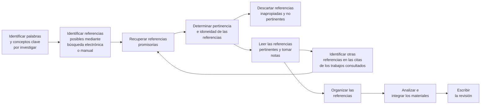

# Investigación científica en ciencias de la salud

DENISE F. POLIT, Ph.D.

President Humanalysis, Inc.

Saratoga Springs, New York

BERNADETTE P. HUNGLER, R.N., PH.D.

Associate Professor, Retired

Boston College School of Nursing

Chestnut Hill, Massachusetts

Traducción

Roberto Palacios Martínez

Lic. en Ciencias, Universidad Autónoma

de Baja California, México

Guillermina Féher de la Torre Bioantropóloga, Escuela Nacional de Antropología e Historia (INAH, México)

Principios y métodos Sexta Edición

## PARTE II

Contextos de la investigación en ciencias de la salud

MEXICO · AUCKLAND · BOGOTA · CARACAS · LISBOA · LONDRES · MADRID

MILAN·MONTREAL·NUEVA DELHI·NUEVA YORK·SAN FRANCISCO

SAN JUAN · SINGAPUR · SIDNEY · TORONTO

# Contexto del conocimiento:

La revisión bibliográfica

Los investigadores casi nunca realizan un estudio en el vacío, sino en el contexto de una base de conocimientos preexistente. En general llevan a cabo una revisión bibliográfica o revisión de la literatura para familiarizarse con dicha base. Sin embargo, como se señaló en el capítulo 2, algunos investigadores cualitativos de manera deliberada evitan las búsquedas bibliográficas exhaustivas antes de ir al campo para que sus indagaciones no se vean restringidas o prejuiciadas por ideas preexistentes sobre el tema.

El concepto de "revisión bibliografica" tiene dos acepciones en la comunidad científica. La primera se refiere a las actividades de identificación y búsqueda de información sobre un tema y asimilar los conocimiento respectivos. En consecuencia, un investigador podría decir que "hace una revisión bibliográfica" antes de llevar a cabo un estudio. La expresión también se utiliza para designar el resumen escrito sobre la situación en que se encuentra un problema de investigación. Tanto la búsqueda como la elaboración de este resumen son importantes para el proceso de investigación.

En este capítulo se analizan diversos aspectos de la revisión bibliográfica: primero, las funciones que ésta desempeña en un proyecto de investigación; segundo, el tipo de material que comprende; tercero, sugerencias para encontrar referencias apropiadas y la forma de registrar la información una vez que se ha localizado; cuarto, sugerencias sobre la forma de leer los informes de investigación y, por último, la organización y presentación por escrito de una revisión bibliográfica.

## OBJETIVOS DE LA REVISION BIBLIOGRAFICA

La revisión bibliográfica desempeña varias funciones importantes en el proceso de investigación. Su valor se aclarará examinando algunas de estas funciones específicas.

## Fuente de ideas para la investigación

Con frecuencia, familiarizarse con temas prácticos o teóricos relacionados con un área problemática ayuda al investigador a generar ideas o a enfocar determinado tema de investigación. En algunos casos, la revisión bibliográfica antecede a la identificación del tema. La lectura de áreas de interés general pueden ser en extremo útil para llamar la atención del investigador respecto de problemas de investigación no resueltos o de nuevas aplicaciones adecuadas para un proyecto. Cuando se ha seleccionado un tema general, la lectura ayuda a precisar aún más el problema y a formular las preguntas de investigación aprobadas.

## Orientación respecto de lo que ya se sabe

Una de las funciones principales de la revisión bibliográfica es precisar lo que ya se sabe acerca de un problema de interés. Conocer el estado actual del conocimiento permite a los investigadores evitar la duplicación involuntaria de un estudio y concentrarse en aspectos relativamente poco explorados de un problema. Desde luego, hay situaciones en que deliberadamente se toma la decisión de replicar un estudio, pero también en esos casos el investigador necesita estar familiarizado con la investigación previa.

Con frecuencia, aunque no realicen investigación, los profesionales de la salud también se interesan por aprender acerca del estado actual del conocimiento sobre un tema en particular, ya sea para mejorar su práctica o para identificar posibles soluciones a los problemas que enfrentan. Por ejemplo, una enfermera puede estar interesada en aprender estrategias de enfermera para reducir el dolor durante la circuncisión de recién nacidos, en cuyo caso necesitará recurrir las investigaciones publicadas para conocer los últimos avances. La capacidad del profesional de la salud para incorporar eficazmente a su práctica los resultados de investigación es proporcional a su capacidad de evaluar la bibliografía existente en su campo.

## Establecimiento de un contexto conceptual

Es conveniente que el investigador (sea cualitativo o cuantitativo) revise la bibliografía a fin de desarrollar el contexto conceptual amplio en el cual se inserta el problema de investigación. Cuando un estudio se analiza a la luz de otra investigación, es posible comprender mejor los resultados a la luz de la base de conocimientos existente. La acumulación de conocimientos basados en la investigación es análoga a la correspondencia de las piezas de un rompecabezas. Cualquier pieza, por pequeña que sea, ayuda a ensamblar las demás.

Otro de los objetivos primordiales de la revisión es proporcionar al investigador una perspectiva del problema, necesaria para interpretar

los resultados de su estudio. Con frecuencia, la comparación de los resultados del estudio con hallazgos anteriores es un buen punto de partida para sugerir nuevos proyectos, ya sea con objeto de resolver las contradicciones o para ampliar la base de conocimientos.

Por último, la revisión escrita que acompaña a un informe de investigación resulta útil a la comunidad de profesionales de la salud porque explica el contexto del que forma parte el estudio.

## Información sobre el método de investigación

Un comerido importante de la revisión bibliográfica, en particular para los estudiantes que llevan a cabo su primer proyecto de investigación, es sugerir formas para realizar un estudio sobre algún tema de interés. Dicho de otra manera, la revisión puede resultar útil para identificar estrategias de investigación y procedimientos específicos, así como instrumentos de medición y análisis estadísticos provechos para el desarrollo del problema. La bibliografía de investigación también sugiere las variables externas que deben controlarse.

## ALCANCES DE LA INVESTIGACION BIBLIOGRAFICA

Los informes de investigación difieren sobremanera en cuanto a la cantidad de detalles relativos a los procedimientos metodológicos específicos, pero no es raro que un informe proporcione información completa sobre los métodos del investigador, incluidas descripciones de los instrumentos de medición utilizados. Cuando el instrumento utilizado no se menciona en el informe, casi siempre es posible obtener una copia si se escribe al autor.

La mayoría de los lectores sabe cómo localizar documentos en una biblioteca y cómo organizarlos. Sin embargo, la bibliografía de investigación difiere en varios aspectos de otro tipo de informes o resúmenes semestrales que los estudiantes deben elaborar. En esta sección se examinará el tipo de información que debe buscarse al revisar la bibliografía especializada, así como

otros aspectos relacionados con la amplitud y profundidad de tal revisión.

## Tipo de informacion por buscar

Los materiales escritos varian considerablemente en cuanto a calidad, público al que van dirigidos y clase de información que contienen. Normalmente, el investigador que revisa la bibliografía entra en contacto con una amplia gama de documentos y, por ello, tiene que ser selectivo al decidir lo que va a leer o a incluir en el informe de su revisión. ¿Cómo se toman estas decisiones? Desafortunadamente no hay una respuesta fácil a esta interrogante, pero aquí se presentan algunas sugerencias que pueden ser de utilidad.

El primer paso para seleccionar el material adecuado es asegurarse de haber conseguido la mayor parte de las referencias pertinentes. En la siguiente sección de este capítulo se trata la forma de localizar las fuentes de referencia adecuadas.

La clase de información que contienen los documentos académicos o de otro tipo, siempre y cuando no sean de ficción, puede clasificarse, a grosso modo, en cinco categorías: 1) hechos, estadísticas y resultados de investigación; 2) teoría o interpretación; 3) métodos y procedimientos; 4) opiniones, creencias o puntos de vista, y 5) anécdotas, impresiones clínicas o narraciones de incidentes y casos. En el cuadro 4-1 se resumen las funciones que desempeñan los diferentes datos en una revisión bibliográfica. Enseguida se describe brevemente la utilidad de los diferentes tipos de información.

1. Resultados de investigación. Esta categoría comprende los resultados de estudios previos; obviamente es fundamental para una investigación porque presenta lo que ya se sabe de un tema como producto de investigaciones empíricas previas. Como se indica en el cuadro 4-1, los estudios publicados también pueden inspirar nuevas ideas y contribuir a la conceptualización y el diseño de nuevos proyectos. Generalmente los resultados de investigación se encuentran en gran variedad de fuentes, como obras de consulta, enciclopedias, memorias de congressos, simposios y conferencias y, en especial, publicaciones periódicas especializadas. Según el tema de interés, suele ser útil revisar los resultados que se publican en la bibliografía del campo específico del investigador, así como de otras disciplinas afines, como sociología, por ejemplo. Dado que a menudo los informes de investigación resultan dificiles de entender para los estudiantes, una sección de este capítulo se dedica a presentar sugerencias para la lectura de estudios de investigación publicados.

2. Teoría. La segunda clase de fuentes de información se ocupa de temas más amplios y de carácter más conceptual para el tema de interés. Las descripciones teóricas resultan de utilidad porque proporcionan el contexto conceptual para un problema de investigación, pero también porque sugieren temas de estudio. En ocasiones, los informes de investigación y los artículos de publicaciones periódicas incluyen un breve resumen de la teoría, pero es más probable encontrar descripciones amplias de una teoría en obras de consulta.

Cuadro 4-1. Resumen de los usos de diversas clases de información para revisiones bibliográficas

<table border="1"><tr><td rowspan="2">CLASE DE INFORMACION</td><td colspan="4">FUNCION DE LA REVISION</td></tr><tr><td>Fuente de ideas para la investigación</td><td>Información acerca de lo que se sabe</td><td>Contexto conceptual</td><td>Enfoque de la investigación</td></tr><tr><td>De investigación</td><td>X</td><td>X</td><td>X</td><td>X</td></tr><tr><td>Explicaciones teóricas</td><td>X</td><td></td><td>X</td><td></td></tr><tr><td>Metodología</td><td></td><td></td><td></td><td>X</td></tr><tr><td>Opiniones y puntos de vista</td><td>X</td><td></td><td>X</td><td></td></tr><tr><td>Anecdotas e informes clínicos</td><td>X</td><td></td><td>X</td><td></td></tr></table>

3. Metodología. La tercera clase de informacion que el investigador debe buscar en una revisión bibliografica está relacionada con los métodos aplicables al estudio del tema de interes; es decir, al revisar la bibliografía, conviene poner atencion no sólo en lo que se ha encontrado, sino también en como fue encontrado. ¿Cuáles son los enfoques utilizados por otros investigadores? ¿Cómo midieron sus variables o conceptualizaron el fenómeno de interes? ¿Qué procedimientos utilizaron para analizar sus datos? Aunque en ocasiones es necesario modificar los métodos, diseños o instrumentos existentes, suele ser posible localizar técnicas que pueden servir como base para la investigación. Los informes relacionados con problemas similares son de especial utilizad.

4. Opiniones y puntos de vista. La bibliografía general y la especializada incluyen gran cantidad de trabajos y artículos centrados en las opiniones o actitudes del autor respecto de un tema de interés, que son intrínsecamente subjetivos y presentan las sugerencias y puntos de vista del autor. Los artículos de opinión suelen ser una fuente importante de ideas e información contextual para los estudios de temas controvertidos o nuevos en el campo de las ciencias de la salud.

5. Informes de casos, anecdotas y descripciones clínicas. En la bibliografía de las ciencias de la salud aparecen con frecuencia descripciones de situaciones clínicas o problemas específicos. En estos artículos se relatan las experiencias e imprésiones clínicas de los autores, o bien se describen la condición y el tratamiento de uno o dos pacientes. Por ejemplo, Comport (1997) presenta el informe del caso de una paciente embarazada con estenosis aortica grave; incluye la descripción del plan multidisciplinario de atención clínica de la paciente.

Informes de caso, informes anecdóticos y artículos de opinión amplían la comprensión del investigador acerca de determinado problema, en particular si no está familiarizado con él. Esta clase de fuentes resultan útiles también para ilus-

trar puntos específicos, demostrar la necesidad de una investigación rigurosa, o despertar la curiosidad del investigador. Sin embargo, por su naturaleza subjetiva o idiosincrásica, su utilidad es limitada en la revisión bibliográfica con fines de investigación. Los investigadores inexpertos no deben ceder a la tentación de confiar demasiado en dichas fuentes, particularmente si preparan un resumen escrito de la revisión bibliográfica. Esto no quiere decir que ese material carezca de interés o de importancia, sino que, en general, resulta inadecuado para resumir el conocimiento y las teorías acerca de una pregunta de investigación.

## Profundidad y amplitud de la revisión bibliográfica

Con frecuencia, los estudiantes se preocupan por saber cuán limitada o extensa debe ser su búsqueda bibliográfica. Tampoco en este caso hay una fórmula que indique el número preciso de referencias que deben rastrearse, sino que la amplitud de la revisión bibliográfica depende de varios factores. Para resúmenes escritos, un factor determinante es la naturaleza del documento que se prepara. Las disertaciones doctorales suelen incluir una revisión meticulosa y amplia de materiales relacionados directa e indirectamente con el área del problema. Por otro lado, los informes publicados en publicaciones periódicas de investigación tienden a presentar una revisión bibliográfica breve que cubre sólo los hallazgos de otros estudios que resultan pertinentes. Un factor más por considerar es el nivel de conocimientos y experiencia del propio investigador. A fin de asegurarse de haberlo comprendido bien, los investigadores inexpertos relativamente poco familiarizados con un tema suelen tener que revisar más materiales que los experimentados.

La amplitud de la revisión bibliográfica depende en gran medida de la profundidad con que se haya investigado el tema. Si se han publicado 20 estudios sobre un problema específico, será difícil que el investigador llegue a una conclusión sobre el estado actual del conocimiento sin haber leído los 20 informes. Sin embargo, no necesariamente es cierto que la lectura sea más

sencilla en el caso de un tema que no se ha investigado de manera exhaustiva. Es probable que para conformar un contexto significativo en la revisión bibliográfica sobre temas nuevos o problemas poco investigados, sea preciso incluir una gama más amplia de estudios relacionados periféricamente.

Los estudiantes que emprenden por primera vez la selección de referencias para un resumen de revisión bibliográfica deben preocuparse por la pertinencia y calidad del material, más que por la cantidad. Un error frecuente radica en creer que la calidad de una revisión depende del número de referencias incluidas. Una revisión concisa que abarque los estudios pertinentes y se organice de manera coherente tiene más peso que la presentación desordenada de información de dudoso valor.

En cuanto a la profundidad de una revisión bibliográfica, el criterio más importante es, una vez más, la pertinencia. En general, la teoría o los estudios estrechamente vinculados con el problema de investigación ameritan una cobertura detallada, en cambio, los estudios que sólo tienen una relación indirecta suelen resumirse en una o dos frases.

## Fuentes primarias y secundarias

Las referencias se clasifican en fuentes primarias y secundarias. Aunque tal vez esta distinción ya es familiar para la mayoría de los lectores, su importancia justifica tomarla en consideración antes de proseguir. Desde el punto de vista de la bibliografía científica, una fuente primaria es la descripción de una investigación escrita por la persona responsable de ésta. Por ejemplo, casi todos los artículos que aparecen en publicaciones periódicas especializadas son informes originales, de modo que constituyen fuentes primarias. Una fuente secundaria es la descripción de un estudio o de un conjunto de estudios redactada por alguien que no es el autor de la investigación original. Los artículos de revisión que resumen la bibliografía existente acerca de un tema constituyen fuentes secundarias. Si el lector se ocupa de escribir un resumen de revisión de la bibliografía sobre un tema, el documento que elaboro será una fuente secundaria. Sin embargo, si pro-

cede a recabar datos nuevos sobre el mismo tema, la descripción del problema de investigación, los métodos y los resultados del estudio constituirán una fuente primaria para otros que realicen una revisión bibliográfica.

Las fuentes primarias y secundarias tienen cometidos importantes, pero distintos, en la tarea de revisión de la bibliografía. Las secundarias son útiles porque proporcionan información bibliográfica sobre fuentes primarias que pueden resultar pertinentes. Sin embargo, las descripciones secundarias de estudios no deben considerarse como sustitutos de las primarias porque comúnmente no proporcionen detalles suficientes sobre los estudios de investigación. Una limitación aún más grave de dichas fuentes consiste en que rara vez resulta posible una completa objetividad al resumir y revisar los materiales escritos. Si bien es cierto que debe hacerse el máximo esfuerzo por evitar todo factor de sesgo, también es necesario aceptar que los valores y prejuicios del investigador representan un filtro a través del cual pasa la información. Sin embargo, los prejuicios del autor de un resumen de investigación no tienen por qué aceptarse como segundo filtro. Siempre que sea posible, la revisión bibliográfica debe basarse en fuentes primarias.

## BUSQUEDA DE BIBLIOGRAFIA PERTINENTE PARA REVISIONES DE INVESTIGACION

La habilidad para identificar y localizar artículos y libros sobre un tema de investigación es un atributo importante. Sin embargo, debe ser adaptable; los rápidos cambios tecnológicos, como el uso creciente del Internet, han hecho obsoletos los métodos manuales de búsqueda de información a partir de fuentes impresas en muchos campos, además de que siguen surgiendo métodos más complejos de búsqueda de bibliografía. Dado que los cambios se suceden ininterrumpidamente y que es alto el riesgo de que la información que aquí se ofrece pronto resulte obsoleta, daremos sólo un breve atisbo a recursos disponibles en la actualidad para localizar bibliografía de investigación. Urgimos al lector a que consulte a los bibliotecarios de su institución

o acceda a Internet en busca de información más actualizada empleando las direcciones que aquí se ofrecen y sus ramificaciones.

En la actualidad, la mayor parte de las bibliotecas universitarias ofrece a los estudiantes la posibilidad de realizar sus propias búsquedas en bases de datos electrónicas, esto es, en enormes archivos bibliográficos a los que se tiene acceso por computadora. Si bien desde el decenio de 1970 se dispone de este tipo de sistemas, al principio era necesario que un bibliotecario realizara la búsqueda, casi siempre a un costo considerable. El creciente desarrollo de sistemas de usuario final ha hecho posible que personas sin experiencia especial en computadoras realicen sus propias búsquedas electrónicas en una terminal o una computadora personal en una biblioteca o incluso en su propio hogar, dormitorio u oficina.

## Búsqueda electrónica de bibliografía

Son varios los métodos y fuentes que permiten el acceso a las diversas bases de datos; múltiples distribuidores comerciales compiten por suministrar servicios de recuperación de información electrónica a partir de numerosas bases de datos bibliográficos. En la actualidad, los proveedores más ampliamente usados (y sus sitios de red —websites— y direcciones de correo electrónico —e-mail—) son los siguientes:

- Aries Knowledge Finder. Website: http://www.ariessys.com; e-mail: WebMaster@ariessys.com

- Ovid. Website: http://www.ovid.com; e-mail: webmaster@ovid.com

- PaperChase. Website: http://www.paperchase.com; e-mail: pch@bidmc.harvard.edu

- SilverPlatter. Website: http://www.silverplatter.com; e-mail: editor@silverplatter.com

La finalidad de todos estos servicios es la recuperación sin complicaciones de información bibliográfica mediante menús con ayuda en pantalla, de modo que suele ser posible con un mínimo de instrucciones. Sin embargo, los servicios varían en algunos aspectos, como número de bases de datos cubiertas, costo, ayuda en línea, facilidad de uso, características especiales, métodos de acceso y capacidad de mapeo (el mapeo es una característica que permite al usuario buscar temas empleando sus propias palabras, sin necesidad de teclear exactamente el mismo término del encabezado temático de la base de datos. Los programas del proveedor del servicio traducen [mapean] el tema solicitado por el usuario al encabezado temático más plausible).

La mayor parte de las bases de datos electrónicas de interés para las ciencias de la salud permiten el acceso en línea (online) (esto es, por comunicación directa con la computadora huésped por línea telefónica o Internet) o via CD-ROM (discos compactos que almacenan la información bibliográfica). Los proveedores de servicios de recuperación bibliográfica antes mencionados suelen ofrecer servicios de prueba sin costo que permiten al usuario potencial probar un sistema online o de CD-ROM antes de suscribirse.

Por otra parte, cabe hacer notar que los libros y demás activos de las bibliotecas casi siempre pueden localizarse electrónicamente empleando sistemas de catalogación en línea, además de que los catálogos de las bibliotecas de muchos países pueden revisarse vía Internet.

Las dos bases de datos electrónicas que suelen ser más útiles en el caso de la enfermería son CINAHL (Cumulative Index to Nursing and Allied Health Literature) y MEDLINE® (Medical Literature On-Line). Estas dos bases de datos se describen con algún detalle en secciones subsiguientes.

## PRINCIPALES BASES DE DATOS ELECTRONICAS PARA INVESTIGACION EN ENFERMERIA

Además de CINAHL y MEDLINE®, las bases de datos bibliográficas más importantes para las investigadoras en enfermería son:

- AIDSLINE (AIDS Information Online) es una colección de citas bibliográficas sobre investigación, aspectos clínicos y políticas de salud sobre SIDA. Esta base de datos incluye artículos de más de 3 000 publicaciones periódicas de todo el mundo, así como informes técnicos, memorias, extractos, artículos, tesis, libros y materiales audiovisuales.

- La Alcohol and Alcohol Problems Science Database (ETOH) contiene más de 92 000 registros bibliográficos de documentos científicos acerca del alcohol de fuentes estadounidenses e internacionales. Cubre todos los aspectos de la investigación sobre alcoholismo, entre otros, psicología, psiquiatría, fisiología, bioquímica, epidemiología, sociología, estudios con animales, tratamiento y prevención y políticas públicas.

- CáncerLit es una fuente de información bibliográfica sobre todos los aspectos del cáncer, como tratamiento clínico y experimental, agentes químicos, virales y de otro tipo, mecanismos de carcinogénesis, bioquímica, immunología, fisiología y estudios sobre mutágenos y factores del crecimiento. Unas 200 publicaciones periódicas importantes contribuyen c esta base de datos, además de que se extrae información de memorias de congresos, informes gubernamentales, tesis y monografías.

- * EMBASE, la base de datos de Excerpta Medica, es una importante base de datos biomédica y farmacéutica que resume más de 3 500 publicaciones periódicas internacionales de los siguientes campos: investigación farmacológica, farmacia, toxicología, medicina clínica y experimental, políticas de salud, salud ambiental, farmacodependencia e instrumentación biomédica; hay una cobertura selectiva para enfermería. En la actualidad, esta base de datos contiene más de seis millones de registros.

- HealthSTAR está formada por referencias a la bibliografía publicada sobre servicios de salud, tecnología, administración e investigación. Se concentra tanto en aspectos clínicos como no clínicos de la atención de la salud. La base d'e datos contiene citas y extractos de artículos de publicaciones periódicas, monografías, informes técnicos y documentos gubernamentales de 1975 a la fecha.

- PsycINFO® cubre la bibliografía profesional y académica sobre psicología y disciplinas afines, como medicina, psiquiatría, enfermería, sociología, educación, farmacología, fisiología y otras. Esta base de datos contie-

ne referencias y extractos de más de 1 300 publicaciones periódicas en más de 20 idiomas; hoy en día incluye más de un millón de referencias. Dos subconjuntos de PsycINFO® son PsycLIT® y ClinPSYC®. El primero difiere de PsycINFO® en que no incluye disertaciones ni informes y abarca menos años. ClinPSYC® también omite disertaciones e informes y sólo contiene referencias de los códigos de clasificación de importancia clínica.

Las bibliotecas se suscriben a distintas bases de datos, de modo que estos recursos no están universalmente disponibles en todas las instituciones. Sin embargo, todas las bases de datos pueden ser consultadas a través de Internet a una tarifa fija mensual o anual, o por hora de conexión. Las tarifas varian según la base de datos y el proveedor, pero típicamente oscilan entre 10 y 40 dólares por hora.

## BASE DE DATOS CINAHL

La base de datos electrónica CINAHL es más importante para las enfermeras. Cubre virtualmente todas las publicaciones periódicas de enfermería publicadas en inglés y muchas en otros idiomas, así como libros, capítulos de libros, dissertaciones de enfermería y memorias de conferencias selectas de enfermería y campos de la salud afines. La CINAHL contiene materiales de más de 950 publicaciones periódicas y cubre campos como tecnología cardiopulmonar, servicios de urgencia, educación en materia de salud, registros médicos, tecnología de laboratorio, tecnología radiológica, terapia respiratoria y ciencias sociales.

La base de datos CINAHL cubre materiales publicados de 1982 a la fecha y contiene más de 250 000 registros. Además de información bibliográfica (autor, título, publicación, año de publicación, volumen y número de páginas), proporciona extractos de más de 300 publicaciones periódicas. Para muchos registros se dispone de información complementaria, como nombres de instrumentos de colecta de datos y referencias citadas en el documento fuente. En general es posible solicitar electrónicamente los artículos de interés.

La CINAHL cuenta con las modalidades de acceso en línea o por CD-ROM a través de Ovid Technology, Silver-Platter Information, Ebsco Publishing y Aries Systems Corporation (Knowledge Finder). También tiene su propio servicio directo en línea; los datos sobre esta opción pueden obtenerse en Internet a través del sitio de red CINAHL (http://www.cinahl.com).

Aquí se utilizará la base de datos CINAHL para ilustrar algunas de las características de una búsqueda electrónica. El ejemplo que sigue se basa en el software de búsqueda de Ovid para CD-ROM, pero los programas de otros proveedores tienen características similares.

En la mayor parte de los casos se empieza con una búsqueda de tema (esto es, de referencias sobre un tema específico). Después de seleccionar el comando de búsqueda en el menú principal, se reclea una palabra o frase que resuma la esencia del tema y la computadora procederá a la búsqueda. Una alternativa importante a la búsqueda de tema es la búsqueda de palabra, con la cual se rastrea el tema en los campos de texto de cada registro, incluidos título y extracto.

Una vez que se ha recleado el tema, la computadora proporciona retroalimentación acerca de cuántas concordancias hay entre el tema solicitado y la base de datos. En la mayor parte de los casos, el número de concordancias es grande inicialmente, de modo que será necesario afinar elastreo para asegurarse de que se recuperen sólo as referencias más apropiadas. Es posible liminar la exploración de distintas formas. Por ejemplo, puede restringirse a las referencias para las cuales el tema deseado es el principal punto de interés. En la mayor parte de los encabezamientos de temas, también es posible seleccionar entre varios subencabezados específicos para el tema que se busca. Asimismo, quizá sólo se deeen referencias por ejemplo de publicaciones periódicas de enfermería, sólo las que correspondan a investigaciones, únicamente las publicadas en determinados años (digamos después de 1990), sólo las escritas en inglés o aquéllas en as cuales los participantes pertenezcan a determinados grupos de edad (p. ej., adolescentes).

Para ilustrar lo anterior con un ejemplo concreto, supóngase que estamos interesados en investigaciones recientes sobre tratamientos para lolor posoperatorio y que iniciamos nuestra

búsqueda recleando postoperative pain. En la base de datos CINAHL hay 11 subencabezados para este tema, tres de los cuales se refieren a tratamientos (diet therapy: terapia dietética, drug therapy: farmacoterapia, y therapy: tratamiento). He aquí un ejemplo en el que hubo varias concordancias en pasos sucesivos de restricción a la búsqueda en la base de datos CINAHL en febrero de 1998:

Tema de búsqueda

restricción Concordancias

- Dolor posoperatorio 859

* Se restringe a tema principal 663

* Se restringe a subencabezado de farmacoterapia 339

- Se limita a principales publicaciones periódicas de enfermería 158

- Se limita a informes de investigación 50

- Se limita a publicaciones aparecidas en el periodo de 1995 a 1998 9

El estrechamiento de la investigación, de 859 referencias iniciales sobre dolor posoperatorio a nueve informes de investigación de enfermería recientes sobre farmacoterapia analgésica posquirúrgica, tardó menos de un minuto. Después podría optarse por ver en pantalla los títulos de esas nueve referencias, y acto seguido desplegar (e imprimir) información bibliográfica completa de las que parezcan especialmente apropiadas. En el recuadro 4-1 se presenta un ejemplo de una de las entradas del registro CINAHL recuperadas en nuestra búsqueda de tratamientos para el dolor posoperatorio. Cada entrada se acompaña de un número de acceso, que es el identificador para cada registro de la base de datos. Después se muestran los autores y el título de la referencia, seguidos de información de la fuente. La fuente indica lo siguiente:

- Nombre de la publicación (Pediatric Nursing)

- Volumen (23)

- Número (3)

## Recuadro 4-1. Ejemplo de ficha de registro CINAHL

Número de acceso

1997029240

Autores

McRae ME. Rourke DA. Imperial-Perez FA. Eisenring CM. Ueda JN.

Institucion UCLA Medical Center, Los Angeles, CA.

Development of a research-based standard for assessment, intervention, and evaluation of pain after neonatal and pediatric cardiac surgery.

## Fuente

Pediatric Nursing. 23(3):263-71, 1997 May-Jun (32 ref)

Encabezados temáticos CINAHL

Adolescencia Factores de edad

Analgésicos, opiáceos/tu Instrumentos de valoración clínica

(therapeutic usage, uso terapéutico) Lactante

Análisis de varianza Lactante, neonato

*Cirugía cardiaca/ae Medición del dolor/st

(adverse effects, efectos adversos) (standards, estándares)

Diseño retrospectivo *Medición del dolor

Dolor posoperatorio/dt Mujer

(drug therapy, farmacoterapia) Niño

Dolor posoperatorio/et Preescolar

(etiology, etiologia) Pruebas T

*Enfermeria pediátrica Reoperación/ae

Estadística descriptiva Revisión de registros

Estudios prospectivos Sedación

Extubación/ae Varón

## Instrumentación

Escala de dolor FACES de Wong-Baker.

## Extracto

En este análisis de datos retrospectivos y prospectivos se cuantificó a niños (edades de 0 a 18 años, n = 132) durante su estancia en una unidad de cuidados intensivos cardiotorácicos y se examinaron las prácticas de analgesia y sedación. Los datos sobre ambos factores, que potencialmente influyen en el dolor y su tratamiento, y en la orden y administración de analgésicos/sedantes a los sujetos, se tomaron de los expedientes médicos. En el grupo prospectivo, la intensidad del dolor se midió dos veces al día empleando la escala de dolor FACES de Wong-Baker. En la primera noche posterior a la cirugía, los sujetos sometidos a reoperación cardiaca informaron que el dolor era significativamente mayor que los sujetos operados por vez primera. Por otro lado, los sujetos con incisión external informaron que el dolor era significativamente que los sujetos con incisión submamaria. No todos los sujetos recibieron analgesia antes de procedimientos con penetración corporal. Los sujetos de 0 a 3 años de edad recibieron cantidades de analgesia significativamente mayores. Se emplearon grandes dosis de sedantes, en especial en niños menores de tres años. Los resultados propiciaron el desarrollo de una norma de enfermeria para valorar y tratar el dolor y administrar sedantes en esta población (32 ref).

- Páginas (263-271)

- Año y mes de publicación (1997 May-June)

- Número de referencias citadas (32 ref.)

También se indican todos los encabezados de temas CINAHL que se codificaron para esta entrada específica; podría haberse empleado cualquiera de estos encabezados en el proceso de búsqueda a fin de recuperar la referencia. Debe hacerse notar que los encabezados de tema pueden ser encabezados sustantivos/de materia (p. ej., dolor posoperatorio, sedación) o encabezados metodológicos (p. ej., estadística descriptiva, estudios prospectivos). A continuación, cuando en el estudio se emplean instrumentos formales con un nombre estándar,éstos se indican bajo el título Instrumentation. Por último, se presenta el extracto del estudio.

Con base en el extracto, el lector puede decidir si la referencia específica es pertinente para su investigación. Una vez que se han identificado referencias pertinentes, pueden obtenerse y revisarse los informes de investigación completos. Todos los documentos a que se hace referencia en la base de datos pueden solicitarse por correo o fax, de modo que no es necesario que la biblioteca esté suscrita a la revista que se cita. Muchos de los proveedores de servicios de recuperación (como Ovid) ofrecen servicios de texto completo en línea, de modo que, en el caso de determinadas publicaciones periódicas, los artículos pueden seleccionarse de manera directa, unirse a otros y recuperarse.

La base de datos MEDLINE® fue desarrollada por la U.S. Library of Medicine (NLM) y es ampliamente reconocida como la principal fuente de cobertura bibliográfica en el área biomédica. MEDLINE® incluye información de Index Medicus, International Nursing y otras fuentes del área de trastornos infecciosos, biología de poblaciones y biología reproductiva. Cubre más de 3 600 publicaciones periódicas y contiene más de 8.5 millones de registros.

## BASE DE DATOS MEDLINE

Dadas las dimensiones de MEDLINE®, conviene ingresar a un subconjunto de esta base de datos y no a la versión no abreviada, que tiene

referencias que se remontan hasta 1966. Porejemplo, algunos subconjuntos cubren sólo referencias de los últimos cinco años. Otros cubren las principales publicaciones periódicas médicas, publicaciones periódicas de especialidades y publicaciones periódicas de enfermería.

El acceso a la base de datos MEDLINE® se lleva a cabo en línea o por CD-ROM a través de Ovid, Aries Knowledge Finder, SilverPlatter y PaperChase, pagando una tarifa, aunque también es posible el acceso gratuito por Internet. La NML ha creado Internet Grateful Med, que ofrece acceso gratuito no sólo a MEDLINE® sino también a otras bases de datos, como AIDSLINE y HealthSTAR. El sitio de red para Internet Grateful Med es http://igm.nlm.nih.gov. También es posible el acceso gratuito a MEDLINE® a través de otros sitios de red, como los siguientes:

- PubMed (http://www.ncbi.nlm.nih.gov PubMed)

- Health Gate (http://www.healthgate.com/ HealthGate/ MEDLINE/search/shtml)

La ventaja de entrar a la base de datos a través de los proveedores comerciales radica en que ellos ofrecen mejores recursos de búsqueda con muchas características especiales.

## Recursos impresos

Los recursos impresos que deben examinarse manualmente están siendo desplazados con rapidez por las bases de datos electrónicas, pero no deben pasarse por alto, en especial porque las bibliotecas pequeñas (como las de muchos hospitales) a veces basan su acervo en estos recursos por las restricciones de presupuesto. Además, a veces es necesario remitirse a fuentes impresas para realizar una búsqueda exhaustiva que incluya bibliografía antigua sobre un tema. Por ejemplo, la base de datos CINAHL no contiene referencias a informes de investigación publicados antes de 1982.

Los indices impresos son libros que se emplean para localizar artículos en publicaciones periódicas, libros, disertaciones, publicaciones de organizaciones profesionales y document-

ros del gobierno. Algunos índices especialmente útiles para las enfermeras son International Nursing Index, Cumulative Index to Nursing and Allied Health Literature (los "libros rojos"),

Nursing Studies Index, Index Medicus y Hospital Literature Index. Los índices se publican periodicamente durante todo el año (p. ej., cada trimestre) y tienen un índice acumulativo anual. Cuando se emplea un índice impreso, en general es necesario primero identificar el encabezado temático apropiado.* Estros encabezados se localizan en el directorio del índice, que contiene términos de uso común o palabras clave. Una vez que se determina el encabezado temático apropiado, el usuario puede proceder a la sección correspondiente del índice, donde se encuentran las referencias propiamente dichas.

En las publicaciones periódicas de extractos se resumen artículos de otras publicaciones periódicas. Los servicios de extractos en general resultan de mayor utilidad que los índices, pues proporcionan resúmenes de los estudios y no sólo títulos. Nursing Abstracts y Psychological Abstracts son dos fuentes importantes de bibliografía especializada en enfermería.

## Sugerencias para localizar informes de investigación

Localizar toda la información pertinente para un problema de investigación es como una investigación detectivesca. Los diversos instrumentos electrónicos e impresos para recuperar bibliografía representan una magnifica ayuda, pero aun contando con ellos sigue siendo necesario desentrañar, escudriñar y clasificar las pistas para la localización del conocimiento existente sobre un tema. He aquí algunas sugerencias:

* Si se desea identificar todos los informes importantes sobre un tema determinado, es necesario ser flexible y tener amplitud de criterio acerca de las palabras clave y los encabezados temáticos que podrían rela-

cionarse con el tema. Por ejemplo, si lo que interesa es la anorexia nerviosa en adolescentes, tal vez el lector querrá considerar el material agrupado bajo anorexia, trastornos de la alimentación y pérdida de peso, o también bajo apetito, conducta alimentaria, nutrición, bulimia, cambios de peso corporal e imagen corporal.

- Si el problema de investigación en que se centra la búsqueda incluye variables independientes y dependientes, tal vez sea necesario realizar un rastreo para cada una. Por ejemplo, si el lector está interesado en el efecto del estrés diario en las creencias de salud de los pacientes con SIDA, posiblemente desee leer acerca del efecto del estrés (en general) y acerca de las creencias de salud de las personas (en general). Quizá también desee investigar algo sobre los pacientes de SIDA y sus problemas. Si el lector busca referencias electrónicamente, a menudo es posible combinar las exploraciones, de modo que las referencias para dos búsquedas independientes puedan vincularse (p. ej., el programa de búsqueda puede identificar las referencias que incluyan tanto el estrés como las creencias de salud como encabezados temáticos).

- Si se realiza una búsqueda manual, es recomendable comenzar por las referencias pertinentes en la edición más reciente de los índices o publicaciones periódicas de extractos y remontarse después a números anteriores. (La mayor parte de las bases de datos electrónicas están organizadas de manera cronológica, y las referencias más recientes aparecen al principio del listado.)

* Pocas veces es posible identificar todos los estudios pertinentes si se confía de manera exclusiva en las bases de datos electrónicas. Un método excelente para identificar otros informes de investigación es localizar varios estudios pertinentes recién publicados y revisar las referencias que aparezcan al final. Los investigadores que realizan estudios sobre un tema suelen tener conocimiento de otras investigaciones afines y remitir a estudios importantes como una forma de poner en contexto su propia investigación.

## LECTURA DE INFORMES DE INVESTIGACION

Una vez que el investigador ha identificado posibles referencias, debe localizar los materiales correspondientes. Es probable que en el acervo de las bibliotecas académicas (es decir, las pertenecientes a colegios y universidades) se encuentren muchos de los libros o publicaciones periódicas identificados en la búsqueda bibliográfica inicial, de lo contrario, es aconsejable consultar al bibliotecario, pues la mayor parte de ellas cuenta con servicios de préstamo interbibliotecario, lo cual hace posible acceder al material de otras bibliotecas. Asimismo, como ya se dijo, muchas referencias pueden solicitarse por vía electrónica a través de un proveedor de base de datos o incluso recuperarse directamente.

En el caso de la revisión de bibliografía de investigación, la información pertinente se encontrará sobre todo en los informes publicados en las publicaciones periódicas especializadas, como Nursing Research o Western Journal of Nursing Research. Antes de revisar la manera de preparar por escrito los resultados de la revisión bibliográfica, en seguida se presentan brevemente algunas sugerencias para la lectura de informes de investigación en publicaciones periódicas especializadas.

## ¿Qué son los artículos de publicaciones periódicas especializadas?

Los artículos de publicaciones periódicas especializadas (o artículos de investigación) son informes que resumen los puntos sobresalientes de una investigación. En virtud de que el espacio disponible en dichas publicaciones es limitado, el artículo de investigación tipico es relativamente breve, en general de sólo 15 a 25 páginas mecanografiadas a doble espacio (cuartillas), de modo que el investigador debe condensar gran cantidad de información en un espacio reducido.

Los informes de investigación compiten por el espacio de las publicaciones periódicas, que los revisan de manera crítica antes de aceptarlos para publicación. De esta manera, los lectores

tienen la certeza de que los estudios han sido elegidos en función de su mérito científico. Sin embargo, la publicación de un artículo no significa que los hallazgos de la investigación puedan aceptarse como verdaderos sin someterse a una consideración crítica, pues su validez depende en gran medida del modo en que se realizó el estudio, de modo que tanto los productores como los destinatarios de la investigación se ven beneficiados con el conocimiento de los métodos de investigación utilizados.

En las publicaciones periodicas, los informes de investigación suelen seguir determinado formato para la presentación del material y tienden a redactarse en un estilo específico. En las dos secciones siguientes se revisan el contenido y el estilo de los informes de investigación.

## Contenido de los informes de investigación

En general, los informes que aparecen en las publicaciones periódicas especializadas constan de seis secciones principales: extracto o resumen, introducción, sección de metodología, sección de resultados, discusión y bibliografía. A manera de guía sobre lo que puede esperarse de un informe de investigación, en seguida se describe brevemente cada una de estas secciones.

## EXTRACTO

Ubicado al principio del artículo, el extracto constituye una breve descripción del estudio. En unas 100 a 200 palabras responde a las siguientes preguntas: ¿Cuáles son las preguntas de investigación? ¿Qué mérodos empleó el investigador para abordarlas? ¿Cuáles fueron sus hallazgos? Los lectores pueden revisarlo con facilidad a fin de evaluar si les conviene leer o no el resto del informe. Puesto que los investigadores saben que muchas personas sólo leerán el extracto, suelen esforzarse por comunicar únicamente lo esencial para que capten la esencia del estudio. En el recuadro 4-2 se presentan extractos de dos estudios reales, uno cuantitativo y otro cualitativo.

## Recuadro 4-2. Ejemplos de extractos de investigaciones publicadas

## Estudio cuantitativo

Es poco lo que se sabe acerca del modo de ayudar a afrontar las frecuentes hospitalizaciones a niños en condiciones críticas y a sus familiares. Antes de la prueba se realizó un estudio con dos grupos y después, con otro, para determinar si una intervención de enfermeria de punto de esfuerzo basada en la comunidad reduciria el malestar de los padres y mejoraria el funcionamiento de la familia y del niño. Se asignaron al azar 50 participantes a la intervención o a grupos de control de atención normal. La intervención se concentró en aspectos específicos del niño y la familia verificados por los padres. Tres meses después de la hospitalización, los padres asignados a la intervención tuvieron mejor afrontamiento y desempeño familiar que los del grupo de atención ordinario. La ansiedad de los primeros fue mayor al principio y después fue menor. No hubo diferencias en el comportamiento de los niños de un grupo y otro luego de la hospitalización. Los niños del grupo intervenido no habían experimentado regresiones en el desarrollo a las dos semanas y presentaron mayores logros tres meses después del alta que los del grupo de atención ordinaria. La intervención de punto de estrés para las familias y sus hijos con afecciones crónicas mejoró el afrontamiento y el funcionamiento de la familiar, además de que eliminó las regresiones del desarrollo inducidas por la hospitalización (Burke, Handley-Derry, Costello, Kauffmann y Dillon, 1997).

## Estudio cualitativo

Con base en entrevistas a profundidad, este articulo informa del modo en que las personas con discapacidades perciben y experimentan la atención proporcionada por personal público de atención de la salud. Un resultado importante y perturbador es que los informantes describen sentimientos de ser violados, agredidos y rebajados por el personal respectivo. En virtud de la manera en que médicos, enfermeras y demás personal de la salud interactuan, el cuerpo de los pacientes a menudo es percibido como un objeto. En este articulo se describen algunos de estos sentimientos, incluido el modo en que los informantes construyen diversas fronteras corporales en un intento por defenderse de la violación de su cuerpo y la zona corporal y se discuten algunas características de las profesiones de atención de la salud que podrian provocar en los pacientes la sensación de ser violados (Lillestra, 1997).

## INTRODUCCIÓN

El objetivo de la sección introductoria de un informe de investigación es familiarizar a los lectores con el problema de investigación y con el contexto en el cual se formuló. A menudo, la introducción no se titula así especificamente, sino que sigue de inmediato al extracto. Suele contener los siguientes elementos:

- Fenómenos, conceptos o variables centrales en estudio. Se identifica el tema clave de la investigación.

* Enunciado del objetivo, preguntas de investigación, hipótesis por probar. La sección introductoria suele indicar qué se proponía lograr el investigador.

* Revisión de la bibliografía sobre el tema. A menudo se describe brevemente lo que se

conoce del problema de investigación para que los lectores comprendan cómo encaja el nuevo estudio en los resultados previos y puedan evaluar su contribución.

* Marco teórico. En los estudios cuantitativos diseñados para probar una teoría, el marco teórico suele presentarse en la introducción.

- Importancia y justificación del estudio. En la mayor parte de los estudios, la introducción explica por qué es importante esa investigación y de qué manera puede contribuir a la base de conocimientos existente o a la práctica de las ciencias de la salud.

En resumen, el objetivo de la introducción es establecer el escenario para una descripción de lo que el investigador hizo y descubrió.

## SECCION DE METODOS

Su objetivo es comunicar a los lectores lo que el investigador hizo para resolver el problema o para contestar a las preguntas de investigación. En esta sección se explican las principales decisiones metodológicas y a menudo se presentan los fundamentos teóricos de las mismas. Por ejemplo, es frecuente que en el informe de un estudio cualitativo se explique por qué se consideró especialmente apropiado y fructifero dicho enfoque.

En un estudio cuantitativo, la sección de mérodos suele describir lo siguiente, que puede presentarse como subsecciones:

* Sujetos. Los informes de -investigación cuantitativos generalmente describen la población bajo estudio especificando los criterios por los cuales el investigador decidió si una persona era elegible para el estudio. En la sección de métodos también se describe la muestra real de investigación, indicando el modo en que se seleccionó o reclutó a las personas y el número de individuos que conformaron la muestra.

* Diseño de investigación. Se describe el estudio concentrándose en el plan global de investigación y a menudo incluyendo los pasos que el investigador siguió para minimizar los sesgos y facilitar la interpretación de los resultados mediante diversos controles.

* Instrumentos y colecta de datos. Un componente importante de la sección de métodos es la exposición del método o los métodos empleados para colectar los datos. El investigador describe cómo se operacionalizaron las variables de investigación críticas y los instrumentos específicos empleados para medirlas. También suele presentar información acerca de la calidad de los instrumentos de medición.

* Procedimientos de estudio. La sección de métodos suele contener una descripción de los procedimientos empleados durante la realización del estudio. Por ejemplo, si se evalúa una intervención de enfermería, se describe por completo. También se resumen los procedimientos para la colec-

ta de daros, además de que suelen describirse los esfuerzos del investigador por proteger los derechos de los sujetos humanos.

En un informe cualitativo, el investigador expone muchos de los aspectos analizados para el cuantitativo, aunque con frecuencia la perspectiva es diferente. Por ejemplo, un estudio cualitativo suele proporcionar mucha más información sobre el ambiente de investigación y el contexto del estudio y menos sobre el muestreo. Asimismo, dado que en los estudios cualitativos no suelen emplearse instrumentos formales para colectar datos, es escasa la exposición sobre los métodos específicos al respecto, pero suele haber más información sobre procedimientos de colecta de datos. Cada vez es más frecuente que los informes de estudios cualitativos incluyan descripciones de los esfuerzos del investigador para asegurar la obtención de datos de alta calidad. Muchos informes cualitativos también tienen una subsección sobre análisis de datos. Si bien el análisis de datos cuantitativos está más o menos estandarizado, no sucede lo mismo para los cualitativos, de manera que a menudo es necesario que los investigadores describan brevemente el enfoque de su análisis.

En ella se presentan los resultados (o hallazgos) de investigación; esto es, los obtenidos tras el análisis de los datos. El texto los resume, a menudo acompañados de cuadros o figuras que ponen de relieve los más notables.

## SECCION DE RESULTADOS

Virtualmente todas las secciones de resultados contienen algo de información descriptiva, incluso de los participantes (p. ej., la edad promedio o el porcentaje de sujetos de cada sexo). En los estudios cuantitativos, el investigador proporciona información descriptiva básica acerca de las variables clave mediante estadísticas sencillas. Por ejemplo, en un estudio del efecto de la exposición prenatal a fármacos en las características de los neonatos, en la sección de resultados podría empezarse con una descripción del peso promedio al nacer y la puntuación de la escala de Apgar, o bien el porcentaje de los que nacen con bajo peso (menos de 2 500 g).

Es típico que en la sección de resultados de los estudios cuantitativos se presenten, además, datos acerca del análisis estadístico realizado:

- Nombre de las pruebas estadísticas empleadas. Una prueba estadística es, sencillamente, un instrumento para evaluar la credibilidad de los resultados. Por ejemplo, si se calcula el porcentaje de lactantes con bajo peso al nacer en la muestra de productos expuestos a fármacos, équé probabilidad hay de que el porcentaje sea exacto? Si el investigador descubre que en la muestra el peso promedio es más bajo que el de los lactantes de la misma muestra no expuestos a fármacos, écuidadable es que lo mismo ocurra en el caso de otros lactantes fuera de la muestra? Dicho de otro modo, ¿es real la relación entre exposición prenatal a fármacos y peso al nacer observada en la muestra; resulta susceptible de replicación con otra muestra de lactantes? Las pruebas estadísticas responden a interrogantes como las anteriores. Hay docenas de pruebas estadísticas, pero todas se basan en los mismos principios; el lector no necesita saber los nombres de todas las pruebas estadísticas para entender los hallazgos descritos en un informe.

- Valor de la estadística calculada. Las computadoras se utilizan casi universalmente para procesar los datos de investigación y calcular un valor para la prueba estadística que se empleó, el cual permite al investigador sacar conclusiones acerca del significado de los resultados. Sin embargo, el valor numérico de la estadística no es significativo en sí y, por tanto, no siempre incumbe al lector del informe.

* Significancia. La información más importante de la sección de resultados es que estos sean significativos, lo cual no debe confundirse con su importancia. Si un investigador informa que sus resultados son estadísticamente significativos, quiere decir que, según la prueba estadística, sus hallazgos podrían ser válidos y replicables con nuevas muestras de sujetos. Los informes de investigación también indican el nivel de significancia de los hallazgos, el cual

es un índice de la probabilidad de que sean confiables. Por ejemplo, si el informe indica que un resultado es significativo en un nivel de 0.05, quiere decir la probabilidad de que el resultado sea espurio o erróneo es sólo de 5 en 100. En otras palabras, en 95 de cada 100 veces se obtendrían resultados similares y por tanto el investigador puede estar seguro de que sus hallazgos son confiables.

En un informe cualitativo, el investigador sucle organizar los resultados conforme a los principales temas surgidos directamente de los datos. La sección de resultados de los informes cualitativos normalmente tiene varias subsecciones cuyos encabezados corresponden a las etiquetas del investigador para cada uno de los temas. Por ejemplo, Jarrett y Lethbridge (1994) estudiaron las experiencias de mujeres maduras acerca del decremento de la fecundidad e identificaron el proceso como "mirar adelante, mirar atrás". Dentro de este proceso global hubo tres temas principales que se utilizaron como encabezados para las subsecciones de resultados: Reflexión sobre los años de crianza, Revisión de la madurez, y Previsión del envejecimiento. En los estudios cualitativos se incluyen en el informe extractos de los datos reales, a fin de apoyar el análisis temático y describirlo ampliamente. Asimismo, las secciones de resultados de este tipo de estudios suelen presentar la teoría del investigador acerca del fenómeno en estudio, aunque también puede aparecer en la sección de conclusiones.

## SECCION DE DISCUSION

Corresponde a las conclusiones acerca del significado y las implicaciones del estudio. Aquí se trata de dilucidar qué significan los resultados y por qué ocurrieron de ese modo las cosas. Tanto en los informes cualitativos como en los cuantitativos la discusión suele incorporar los siguientes elementos:

* Interpretación de los resultados. Implica traducir los hallazgos a un significado práctico, conceptual o teórico.

* Implicaciones. Los investigadores suelen hacer sugerencias acerca del modo en que sus

resultados podrían emplearse para mejorar la práctica de las ciencias de la salud y recomendaciones encaminadas a incrementar el conocimiento en ese campo específico profundizando en las investigaciones.

* Limitaciones del estudio. A menudo, el investigador se encuentra en la mejor posición para plantear las limitaciones del estudio, como deficiencias de la muestra, problemas de diseño, dificultades en la collecta de datos, etc. El hecho de que en la discusión se presenten estas limitaciones demuestra a los lectores que el autor estaba consciente de ellas y que quizá las tomó en cuenta al interpretar los resultados.

Algunos investigadores, en especial los que llevan a cabo estudios cualitativos, resumen la bibliografía pertinente en la sección de discusión y no en la introducción, o bien en ambas. En tal caso, utilizan los estudios previos como base para comparar sus resultados.

## BIBLIOGRAFIA

Los artículos de investigación concluyen con una lista de los libros, informes y otros artículos que se citaron en el texto del informe. La lista de referencias bibliográficas de un estudio representa un excelente punto de partida para proseguir la búsqueda sobre un tema sustantivo.

## Estilo de los informes de investigación

En los informes de investigación se cuenta una historia. Sin embargo, es común que el estilo de la mayor parte de los artículos de investigación publicados (en especial los informes de estudios cuantitativos) dificulte que los investigadores principiantes u otros lectores se interesen en la historia. Para el público que no está habituado, los informes pueden resultar pomposos y pedantes. Cuatro factores (de los cuales sólo los dos primeros se aplican a los informes de investigación cualitativos) contribuyen a esta impresión:

* Concisión. Dadas las limitaciones de espacio en las publicaciones periódicas, el autor de un informe debe comprimir muchas

ideas y conceptos, de modo que con frecuencia tiene que omitirse el aspecto personal de la investigación.

* Jerga. En general, el autor utiliza términos que presupone forman parte del vocabulario del lector. En muchos casos, esta jerga puede traducirse al lenguaje coloquial, pero a expensas de la eficiencia y, en algunos casos, de la precisión.

- Objetividad. El autor de un informe de investigación cuantitativa suele esforzarse por presentar los hallazgos de tal manera que sugiera neutralidad y ausencia de prejuicios personales. Es frecuente que haga todo lo posible por evitar la impresión de subjetividad, de modo que el tono de las historias de investigación es impersonal. Por ejemplo, la mayor parte se escribe en voz pasiva, es decir, que se evitan los pronombres personales. El empleo de la voz pasiva tiende a hacer el informe menos atractivo y vivaz y a dar la impresión de que el investigador no participó activamente en el estudio. (Por el contrario, los informes cualitativos son más subjetivos y personales y están escritos en un estilo más coloquial.)

- Información estadística. Las cifras y símbolos estadísticos pueden intimidar a los lectores que carecen de inquietudes o formación matemáticas. La mayor parte de los estudios de ciencias de la salud son cuantitativos y, por tanto, los artículos de investigación resumen los resultados de los correspondientes análisis estadísticos. De hecho, en el último decenio los investigadores de las ciencias de la salud han empezado a utilizar las herramientas estadísticas más poderosas y complejas.

Uno de los principales objetivos de esta obra es ayudar a los estudiosos de las ciencias de la salud a dominar estos temas.

## Sugerencias para leer informes de investigación

A medida que el lector avance en la lectura de esta obra, irá adquiriendo habilidades útiles para eva-

luar de manera crítica los diferentes aspectos de un informe de investigación. En seguida se presentan algunas sugerencias preliminares para la lectura de informes de investigación y el manejo de los temas que se analizaron anteriormente.

- A fin de habituarse al estilo de los informes, conviene hacer frecuentes lecturas, aunque en un principio no se entiendan rodos los puntos técnicos. Conviene no perder de vista la justificación subyacente del estilo de los informes de investigación (que se acaba de describir) conforme se avanza la lectura.

- Es recomendable que, por lo menos al principio, se lean detenidamente los artículos; puede ser útil revisarlos para encontrar los puntos principales y después releerlos con mayor cuidado.

- Intente no cejar ni sentirse amedrentado ante la información estadística; haga un esfuerzo por captar el meollo de la historia sin dejarse frustrar por los símbolos y las cifras.

- Una vez acostumbrado al estilo y la jerga de los artículos de investigación, puede hacer el ejercicio de traducir mentalmente el contenido cambiando los párrafos compactos a un estilo más suelto, la jerga a frases y términos familiares y la voz pasiva a la activa para entender mejor la participación dinámica del investigador en el proceso, así como las cifras a palabras que expresen los hallazgos. En el recuadro 4-3 se presenta a manera de ejemplo un breve resumen de un estudio ficticio. La parte superior ilustra el estilo usual de los artículos de publicaciones periódicas de investigación. En la inferior se presenta la traducción a un lenguaje más digerible.

- Es importante leer y entender los informes de investigación, pero también es necesario leerlos críticamente, en especial cuando se prepara una revisión bibliográfica por escrito. La lectura crítica consiste en evaluar las principales decisiones conceptuales y metodológicas del investigador. Desafortunadamente, es difícil que los estudiantes valoren de manera crítica esas decisiones antes de haber adquirido ellos

mismos algunas aptitudes conceptuales y metodológicas, las cuales se reforzarán a medida que se avance en la lectura de este manual, pero en ocasiones el sentido común y el análisis concienzudo bastan para poner al descubierto las fallas de un estudio. Algunas de las interrogantes clave son: ¿Tiene sentido la forma en que el investigador conceptualizó el problema? Por ejemplo, ¿las hipótesis parecen sensatas? ¿Se llevó a cabo un estudio cuantitativo cuando uno cualitativo hubiera sido más apropiado? En un estudio cuantitativo, se midieron de manera razonable las principales variables de investigación o habría sido mejor aplicar otro método? En el capítulo 25 se presentan otras pautas para evaluar críticamente los diferentes aspectos de un informe de investigación.

## PRESENTACION POR ESCRITO

DE LA REVISION BIBLIOGRAFICA

Para preparar una revisión escrita es necesario seguir los pasos que se resumen en la figura 4-1, en la cual se muestra que después de identificar las posibles fuentes de interés, el investigador debe localizar las referencias y evaluar si resultan pertinentes para el tema. Posteriormente, lee el material que le parece apropiado, toma nota y descarta el que no sea útil. Con frecuencia, algún texto incluye muchas otras referencias importantes, lo cual conduce al investigador a localizar fuentes adicionales. Una vez que ha revisado todas las referencias pertinentes, organiza, analiza e integra el acervo bibliográfico. En esta sección se ofrecen algunas sugerencias sobre los últimos pasos para preparar una revisión por escrito.

## Condensación y toma de notas

Una vez que se ha determinado que un documento es pertinente, se lee el informe completo, con detenimiento y juicio crítico, a fin de identificar el material que amerite tomar notas y revisar si hay fallas en el estudio u omisiones en el informe. Deben tomarse notas para recordar el con-

## Versión original

Las secuelas potencialmente negativas en el ajuste psicológico de las adolescentes por un aborto provocado no han sido estudiadas adecuadamente. En el presente estudio se pretende determinar si las distintas alternativas respecto de la resolución de un embarazo producen efectos distintos a largo plazo en el funcionamiento psicológico de las jóvenes.

Los resultados de este estudio sugieren que las jóvenes que deciden practicarse un aborto pueden experimentar diversas consecuencias negativas a largo plazo. Al parecer, debe hacerse lo necesario para dar seguimiento a las pacientes que abortan voluntariamente de modo de determinar la necesidad de un tratamiento adecuado.

Los sujetos de este estudio fueron tres grupos de adolescentes embarazadas de bajos recursos atendidas en una clínica urbana: las que dieron a luz y conservaron a su bebé, las que lo dieron en adopción al nacer y las que se sometieron a un aborto. Cada grupo estuvo conformado por 25 sujetos. Los instrumentos del estudio fueron un cuestionario autoaplicado y una baterla de pruebas psicológicas para medir depresión, ansiedad y síntomas psicosomáticos. Las pruebas se aplicaron al principio de la investigación (cuando las mujeres acudieron por vez primera a la clínica) y un año después de la terminación del embarazo.

## Versión "traducida"

Los datos fueron sometidos a un análisis de varianza (analysis of variance, ANOVA) cuyos resultados indicaron que la depresión, la ansiedad y los sintomas psicosomáticos no fueron significativamente diferentes en la prueba inicial para ninguno de los grupos. Sin embargo, en la prueba posterior, el grupo que optó por el aborto mostró puntuaciones significativamente más altas en la escala de depresión y sus integrantes fueron significativamente más propensas a sufrir fuertes cefaleas por tensión. No se observaron diferencias importantes en el comportamiento de las variables dependientes en los dos grupos de sujetos que dieron a luz.

Como investigadores, nos preguntamos si las jóvenes que han abortado tienen a la larga algún problema emocional. Nos parece que no hay suficientes estudios para determinar si dicho procedimiento produce daños psicológicos.

Decidimos responder a esta interrogante comparando la experiencia de tres tipos de adolescentes que se embarazaron; primero, jóvenes que dieron a luz y conservaron a su bebé; segundo, que dieron a luz pero dieron a sus bebés en adopción, y tercero, que prefirieron abortar. Todas las adolescentes de la muestra eran pacientes pobres de una clinica de la ciudad. En total, estudiamos a 75 jóvenes, 25 en cada uno de los tres grupos. Evaluamos su estado emocional pidiendoles que llenaran un cuestionario y que se sometieran a varias pruebas psicológicas que nos permitieron evaluar aspectos como grado de depresión y ansiedad de las jóvenes y si sufrián alteraciones psicosomáticas. Les solicitamos que llenaran los cuestionarios dos veces: una cuando llegaron por primera vez a la clinica y otra un año después del aborto o el parto.

Descubrimos que los tres grupos presentaron el mismo estado emocional cuando llenaron el cuestionario por primera vez, pero cuando las comparamos un año más tarde, observamos que las adolescentes que habían abortado experimentaban mayor depresión y eran más propensas a sufrir cefaleas por tensión. Las adolescentes que conservaron a sus bebés y las que los dieron en adopción tuvieron respuestas bastante similares un año después del nacimiento de sus hijos, cuando menos en términos de depresión, ansiedad y molestias psicosomáticos.

Por lo tanto, parece razonable preocuparse por los efectos emocionales del aborto y tener presente que podrian hacerse evidentes a largo plazo; incluso podria ser aconsejable instituir algún tipo de seguimiento para determinar si estas jóvenes requieren de otro tipo de ayuda.

Fig. 4-1. Diagrama de flujo de las tareas de la revisión bibliográfica.

tenido informe, sus aciertos y sus limitaciones. En general, debe registrarse la siguiente información: la referencia completa para incluirla en la bibliografía, las preguntas o hipótesis de investigación, el marco teórico, las características clave de los métodos de investigación y los principales hallazgos y conclusiones.

## Organización de la revisión

Si el producto final de la búsqueda bibliográfica va a integrarse en una revisión por escrito, la organización de los datos recopilados constituye una tarea fundamental. Existen diversos medios para llevarla a cabo con éxito. Cuando la bibliografía sobre un tema es muy extensa, conviene organizar los hallazgos de los estudios revisados en un cuadro resumen, el cual puede incluir las columnas de "Autor", "Número de materias", "Tipo de diseño", "Método para medir las variables" y "Hallazgos principales". Con base en este cuadro, el investigador puede hacer un rápido repaso general e integrar gran cantidad de información. Por ejemplo, en la introducción de su estudio sobre la eficacia del cloruro de sodio en comparación con la heparina diluida para el mantenimiento de dispositivos intravenos intermitentes periféricos, Tuten y Gueldner (1991) presentan un excelente cuadro que resume las investigaciones previas.

A la mayoría de los investigadores les resulta útil trabajar a partir de un bosquejo; si el material revisado es extenso y complejo, siempre es

recomendable elaborarlo por escrito, pero si es breve puede ser suficiente con un bosquejo mental. Lo importante antes de empezar a escribir es estructurar la presentación de manera que tenga sentido y sea comprensible. La falta de organización es una falla común en los primeros intentos por escribir una revisión bibliográfica.

Algunas revisiones de investigación se organizan de manera cronológica resumiendo la historia de los estudios sobre el tema, pero sólo resulta útil si pueden determinarse tendencias cronológicas claras (p. ej., las primeras investigaciones sobre factores relacionados con el embarazo de adolescentes se concentraban principalmente en el conocimiento de los métodos anticonceptivos y el acceso a ellos, pero en estudios recientes se han examinado factores sociales y psicológicos más complejos, como pobreza, funcionamiento familiar y opciones de vida percibidas). Otro enfoque que puede adoptarse en estudios cuantitativos es el presentar un panorama general de la investigación sobre la variable independiente, la dependiente, y luego las dos combinadas seguido de la investigación sobre factores que afectan la relación entre los dos (p. ej., el efecto del estado civil en la salud en caso de que haya diferencias según el sexo). Aunque las especificidades de la organización difieren de un tema a otro, el objetivo general es estructurar la revisión de tal manera que la presentación sea lógica, demuestre una integración con sentido y lleve a una conclusión acerca de lo que se conoce y lo que se desconoce sobre el tema.

Una vez que se ha determinado cuáles serán los temas principales y el orden de presentación, se revisan las notas, no sólo para recordar el material leído, sino para sentar las bases de la decisión sobre el lugar que le corresponderá a una referencia específica (en su caso). Si alguna parece no tener lugar, será necesario revisar el bosquejo, o bien, descartarla. Debe resistirse la tentación de incorporar de manera forzada una referencia que no aporta información, pues el número de referencias utilizadas es menos importante que su pertinencia, la calidad del resumen y la organización general del trabajo.

## Contenido del informe de la revisión bibliográfica

Una revisión bibliográfica escrita no consiste en una serie de citas o extractos. La tarea central es organizar y resumir las referencias, de tal manera que revelen el estado actual del conocimiento sobre el tema elegido y, en el contexto de un nuevo estudio, establezcan una base sistemática para la investigación. La revisión debe señalar tanto los puntos congruentes como las contradicciones, así como explicar las incongruencias, por ejemplo, diferentes conceptualizaciones o métodos.

Los estudios que revisten particular importancia para la investigación deben describirse con detalle, si bien los que arrojan resultados comparables a menudo pueden agruparse y resumirse brevemente, como en el siguiente ejemplo ficticio:

En una serie de estudios se ha encontrado que la frecuencia de la flebitis se relaciona directamente con el método de administración de las infusiones intravenosas y con determinados parámetros de los materiales utilizados (Dayton, 1998; Stainback, 1996; Whitman y Coxe, 1997).

Resulta conveniente parafrasear o resumir una referencia en palabras propias y demostrar que se ha puesto cuidado al analizar los materiales. Reunir citas tomadas de diferentes documentos no demuestra que se hayan entendido y asimilado las investigaciones previas sobre el tema.

Otro punto que ha de considerarse es que la revisión será lo más objetiva posible, sin omitir

los estudios que entren en conflicto con los valores personales del investigador; tampoco debe ignorarse deliberadamente un estudio sólo porque sus hallazgos contradicen los de otros. En suma, el investigador analizará los resultados incongruentes y evaluará las pruebas de apoyo contanta objetividad como sea posible.

La revisión bibliográfica concluye con la elaboración de un resumen general del estado del conocimiento respecto del problema que se analiza. El resumen no sólo debe señalar lo que se ha estudiado y la idoneidad de las investigaciones, sino también las lagunas o áreas de investigación inexploradas. El resumen implica el juicio crítico del autor en cuanto a la amplitud y confiabilidad de la información sobre el tema. Si la revisión bibliográfica se lleva a cabo como parte de un proyecto de investigación nuevo, el resumen crítico debe demostrar que el estudio es necesario y aclarar el contexto en el que se desarrollarán las hipótesis.

A medida que el lector avance en la lectura de esta obra, mejorarán sus aptitudes para evaluar críticamente la bibliografía de investigación. Se espera que el lector comprenda la mecánica del desarrollo de una revisión bibliográfica una vez que haya terminado de leer este capítulo, aunque no es de esperar que esté en posición de escribir una revisión crítica actualizada sino hasta adquirir más habilidades de investigación.

## Estilo del informe de la revisión

Uno de los problemas más frecuentes para el investigador que por primera vez escribe un informe-bibliográfico es ajustarse al estilo de redacción que suele emplearse en estos casos. Así, por ejemplo, los estudiantes suelen aceptar los resultados de investigaciones previas como verdaderos o como prueba de que los hallazgos son concluyentes o de que una teoría es correcta. Esta inclinación resulta comprensible, pues no es otro el estilo de presentación que se utiliza en muchos libros de texto, artículos de opinión y otros trabajos ajenos al campo de la investigación. En parte, dicho estilo es producto del deseo de claridad y precision por pedantería, y en parte resulta de un malentendido común acerca del grado de veracidad que puede lograrse me-

diante la investigación empírica. No hay hipótesis o teoría que pueda probarse o refutarse en forma definitiva por medio de pruebas empíricas, y ninguna pregunta de investigación puede ser respondida de manera definitiva en una sola investigación.

Todos los estudios tienen sus limitaciones, pero la magnitud de éstas depende en gran medida de las decisiones metodológicas del investigador. El hecho de que las teorías e hipótesis no se puedan probar o refutar en forma definitiva no significa, desde luego, que debamos ignorar las pruebas o poner en tela de juicio cada idea a que nos enfrentemos. Al menos en parte, el problema es semántico: las hipótesis no se demuestran, se sustentan en los hallazgos de investigación; las teorías no se verifican ni confirman, se aceptan tentativamente si existe un cuerpo sustancial de pruebas o indicios que demuestre su legitimidad. El investigador debe aprender a adoptar este lenguaje al presentar la revisión bibliográfica.

Un problema de estilo afín al anterior es la inclinación de los investigadores principiantes a intercalar libremente opiniones, propias o ajenas, en los hallazgos de las investigaciones. Las escasas opiniones vertidas en el cuerpo de la revisión, si es que llegan a utilizarse, deben ser explícitas en cuanto a la fuente de que provienen. La descripción del punto de vista de un conocedor de prestigio puede resultar provechosa para establecer la necesidad de investigar el problema o presentar una perspectiva sobre el tema, pero debe ser muy breve. Las opiniones del investigador no tienen cabida, excepto en la evaluación de la calidad de los estudios existentes.

En la columna izquierda del cuadro 4-2 se presentan algunos ejemplos de la clase de dificultades estilísticas expuestas en esta sección. La columna de la derecha ofrece algunas recomendaciones para reformular las frases de manera que sean aceptables para una revisión de bibliografía; las alternativas son muy variadas.

## EJEMPLOS DE INVESTIGACION DE REVISIONES BIBLIOGRAFICAS

La mejor manera de aprender acerca de estilo, contenido y organización de una revisión bibliográfica es leer varias revisiones relacionadas con

el campo que nos ocupa. Enseguida se presentan dos extractos; se insta al lector a que lea otras sobre algún tema que le resulte de interés.

## Ejemplo de un informe de investigación cuantitativa

Holditch-Davis, Barham, O'Hale y Tucker (1995) llevaron a cabo un estudio cuantitativo para examinar los efectos de periodos de descanso estandarizados en los estados de sueño y vigilia de neonatos prematuros convalecientes. En esencia, el siguiente extracto representa la sección de revisión bibliográfica del artículo publicado en el Journal of Obstetric, Gynecologic, and Neonatal Nursing.

Uno de los problemas más difíciles para las enfermeras neonatológicas es modificar el ambiente de la unidad de cuidados intensivos neonatales de modo que brinde estimulación apropiada para el crecimiento y el desarrollo de los lactantes prematuros, acostumbrados al útero, un ambiente cálido y oscuro que proporciona estimulación cinestésica y apoyo hormonal complejo. Por el contrario, la unidad de cuidados intensivos neonatales es un ambiente iluminado y ruidoso con escasa variación diurna, frecuentes procedimientos récnicos y escasa manipulación positiva (Duxbury et al., 1984; Gottfried y Gaiter, 1985) y los lactantes enfermos carecen de las reservas fisiológicas necesarias para enfrentarse a él. Los neonatos críticamente enfermos se tornan hipóxicos en reacción a estimulos como ruido (Long et al., 1980), procedimientos técnicos (Evans, 1991; Peters, 1882) y contactos sociales (Gorski et al., 1983). Incluso los cambios espontáneos en los estados de sueño-vigilia pueden reducir la oxigenación (Brazy, 1988; Gabriel et al., 1980).

El ambiente de cuidados intermedios es similar al de cuidados intensivos. La intensidad de la iluminación y el número de procedimientos técnicos disminuyen, pero los lactantes prematuros siguen sometidos a variación diurna limitada y pocas interacciones sociales (Blackburn y Barnard, 1985; Gaiter, 1985; Gottfried, 1985). La reacción ante las señales del lacrante son incongruentes. Gottfried (1985) observó que en las unidades de cuidados intermedios o convalecientes las enfermeras respondían a menos de la mitad de los episodios de llano de los lacrantes prematuros

Cuadro 4-2. Ejemplos de dificultades estilísticas en informes de revisión bibliográfica

<table border="1"><tr><td>ESTILO O REDACCION INAPROPIADOS</td><td>AJUSTES QUE SE RECOMIENDAN</td></tr><tr><td>1. Se sabe que las expectativas no cumplidas engendran ansiedad.</td><td>Varios expertos (Abraham, 1999; Lawrence, 1998) han propuesto que las expectativas no cumplidas engendran ansiedad.</td></tr><tr><td>2. La mujer que no participa en cursos previos al parto tiende a manifestar un alto grado de estrés durante el trabajo de parte.</td><td>Estudios anteriores indican que las mujeres que toman cursos de reparación para el parto manifiestan menos estrés durante el trabajo de parte que aquéllas que no los toman (Klotz, 1997; Reynolds, 1998; McTygue, 1997).</td></tr><tr><td>3. Los estudios han probado que los médicos y enfermeras no entienden plenamente la dinámica psicobiológica de la recuperación luego de un infarto al miocardio.</td><td>Los estudios de Lambalot (1998) y Carter (1997) plantean la posibilidad de que médicos y enfermeras no entienden plenamente la dinámica psicobiológica de la recuperación luego de un infarto miocardico.</td></tr><tr><td>4. Las acitudes no pueden modificarse de un día para otro.</td><td>Se ha observado que las actitudes son atributos relativamente perduables que no pueden ser modificados de un día para otro (O&#x27;Connell, 1997; Valentine, 1999).</td></tr><tr><td>5. La responsabilidad constituye, en sí, un factor de estrés.</td><td>Según el doctor A. Cassard, autoridad en el rema del estrés, la responsabilidad es en sí un factor de estrés (Cassard, 1996, 1998).</td></tr></table>

Nora: Todas las referencias son ficticias.

Los estados de sueño y vigilia de estos pacientes en particular son afectados por el entorno. Los estados de sueño-vigilia identificables se desarrollan durante el periodo pretérmino (Curzi-Dascalova et al., 1988; Holditch-Davis, 1990a) y se ven afectados por aspectos del ambiente de cuidados intermedios, como manipulaciones para atención de enfermería normal (Duxbury et al., 1984; Holditch-Davis, 1990b), gran intensidad luminosa (Moseley et al., 1988), procedimientos dolorosos (Field y Goldson, 1984; Holditch-Davis y Cahoon, 1989) e interacciones entre los lactantes y sus padres (Miller y Holditch-Davis, 1992; Minde et al., 1975). Sin embargo, no todos los efectos del ambiente de enfermería intermedia son perjudiciales; por ejemplo, al parecer la interacción con los padres reduce el número de veces que despiertan e incrementa las conductas sociales (Miller y Holditch-Davis, 1992; Minde et al., 1975), de modo que es esencial determinar en qué forma influye el ambiente de enfermería de atención intermedia (intermediate care nursery, ICN) en los estados de sueño-vigilia a fin de adaptarlos de manera optima a los neonatos prematuros convalecientes.

Se han realizado estudios para examinar los efectos que los cambios en la ICN producen en los estados de sueño-vigilia de los lactantes. Gabriel et al. (1981) agruparon los cuidados de enfermería sistemáticos. Strauch et al. (1993) redujeron la intensidad del ruido durante 1 h en cada turno de enfermería. Fajardo et al. (1990) crearon una guardería especial con ciclos diurnos, menos rui-

do, alimentación por demanda y atención de enfermería reactiva. Otros investigadores procuraron que hubiera una mayor diferencia entre el día y la noche reduciendo la intensidad de luz y ruido por la noche (Blackburn y Patteson, 1991; Mann et al., 1986). También se han analizado modificaciones del ambiente para satisfacer las necesidades individuales de los lactantes (Als et al., 1986; Becker et al., 1991). Los lactantes prematuros se beneficiaron con estos cambios, pero la naturaleza de los beneficios difirió de estudio a estudio. Algunos de los cambios ambientales propiciaron que los neonatos experimentaran más sueño y menos cambios de estado (Fajardo et al., 1990; Gabriel et al., 1981; Strauch et al., 1993), menos niveles de actividad (Blackburn y Patteson, 1991; Fajardo et al., 1990), o menos tiempo de ventilación mecánica y uso del biberón en una fase más temprana (Als et al., 1986; Becker et al., 1991).

Los resultados de los estudios anteriores deben interpretarse con cautela porque la mayor parte se realizaron con muestras pequeñas (menos de 15 por grupo) (Als et al., 1986; Fajardo et al., 1990; Gabriel et al., 1981; Strauch et al., 1993). En ocasiones la concordancia entre el grupo testigo y el experimental no era la adecuada (Fajardo et al., 1990). A menudo, los grupos experimentales se estudiaron después que los grupos testigo (Als et al., 1986; Becker et al., 1991; Gabriel et al., 1981). Sin embargo, los resultados para los lactantes estudiados posteriormente deben ser mejores, aun si una intervención especial no tuvo efecto, porque

la atención neonatal mejora de manera constante.

En todos estos estudios se modificaron múltiples aspectos del ambiente y es imposible determinar si todas las modificaciones influyeron en el logro de los efectos beneficios.

El objetivo de este estudio era determinar si la modificacion de un solo aspecto del ambiente de atencion intermedia incide en los patrones de sueño-vigilia de los lactantes prematuros (págs. 424-425).

## Ejemplo de un estudio de investigación cualitativo

Brodsky (1995) llevó a cabo un estudio cualitativo en el que exploró la percepción del impacto psicosocial del cáncer testicular en los propios pacientes después del tratamiento. La introducción del autor, que se reproduce integra, contiene una breve revisión que enmarca el estudio y pone de relieve la necesidad de una investigación a fondo:

El cáncer testicular es la malignidad más común en varones de 15 a 34 años de edad (Ganong y Markovitz, 1987) y su incidencia ha aumentado en países como Estados Unidos en los últimos decenios (Schottenfeld et al., 1980). Sin embargo, la información sobre la experiencia masculina con el cáncer testicular y su tratamiento sigue siendo escasa. Esto resulta evidente en una revisión de la bibliografía, la cual revela sólo dos experiencias de primera mano de varones afectados (Fiore, 1979; Moreland, 1982), una encuésta que se-concentró en los aspectos psicológicos del trastorno (Schover y von Eschenbach, 1984) y una investigación centrada en la reacción psicológica de pacientes curados de cáncer avanzado (Kennedy et al., 1976).

Esta falta de información quizá se debe a que en el pasado reciente pocos pacientes sobrevivían a la enfermedad. Sin embargo, nuevos desarrollos de la tecnología médica han incrementado la supervivencia; han beneficiado a los pacientes porque los mantienen con vida, pero han dado lugar a nuevos problemas relacionados con la rehabilitación posterior al tratamiento. Así, la supervivencia al cancer testicular es un fenómeno nuevo (Donohue et al., 1978; Einhorn, 1987), y como resultado de esta novedad, aún no se conoce el impacto de la supervivencia en la percepción de sí mismo de los varones tratados (Gorzynski y Holland, 1979). Nos encontramos en el punto en que podemos empezar a explorar la naturaleza del fenómeno, de

modo que el centro de interés de este estudio es examinar los cambios en la percepción de sí mismo derivados de la experiencia de haber padecido cáncer testicular (págs. 78-79).

En la sección de discusión del informe de Brodsky, los resultados de la investigación se comparan con los de otros estudios. He aquí un extracto que ayuda a situar en contexto para nuevas investigaciones:

Otros investigadores que han observado las repercusiones del trauma han obtenido resultados similares a los del presente trabajo. En su estudio cualitativo de personas y duelo, Kessler (1987) observó que este último, de manera similar a la experiencia del cáncer testicular, ayuda a muchos a "apreciar cuán preciosa es la vida y a descubrir fuentes internas de fortaleza".

Kennedy et al. (1976) confirman estos resultados; concluyen que "los pacientes con cáncer avanzado que al parecer sanaron aprecian mejor el tiempo, la vida, a las personas y las relaciones interpersonales..."

Los datos de esta investigación también concuerdan con los resultados de Gorzynski y Holland (1979), quienes abordaron el ajuste psicológico de los pacientes con cáncer testicular como resultado de diagnóstico, linfadenectomía retroperitoneal y quimioterapia. Sugieren que, en la fase diagnóstica, negar la gravedad del padecimiento implica que el tratamiento se posponga y que los médicos varones tarden en sugerir una orquiectomía debido a su propio malestar y a su identificación con el paciente...

Los resultados también apoyan los de Liss-Levinson (1982) y Farrell (1974). Liss-Levinson reconoció la dificultad de los varones para enfrentar la dependencia y la pérdida de control. Esto fue verificado casi por la mitad de los participantes del presente estudio. Farrell (1974) habla de los problemas de comunicación de los varones en el ámbito emocional, lo cual se reflejó en el hecho de que muy pocos entrevistados buscaran ayuda psiquiátrica para identificar sentimientos y comunicarlos a otros... También se confirmaron los resultados de Schover y von Eschenbach (1984) y de Cash et al. (1986) acerca de la relación entre imagen corporal y bienestar psicológico (págs. 93-94).

## RESUMEN

La tarea de revisar la bibliografía de investigación comprende identificación, selección, análisis críti-

co y descripción escrita de la información existente sobre el tema de interés. En general, se aconseja realizar la revisión bibliográfica antes del proyecto de investigación en sí por varias razones importantes. Primero, en la fase de arranque del proyecto, la revisión del trabajo realizado en un área de interés general contribuye a la formulación o aclaración del problema por investigar. Segundo, la inspección detallada del trabajo previo familiariza al investigador con lo que se ha hecho en ese campo y disminuye al mínimo la posibilidad de duplicación involuntaria. Tercero, la revisión proporciona un contexto o marco conceptual para el investigador y para la comunidad científica que facilita la acumulación de conocimientos. Cuarto, el investigador se ubica en una mejor posición para evaluar la factibilidad de un estudio propuesto. Por último, la revisión es útil para proporcionar sugerencias metodológicas que guien la investigación.

La información disponible en documentos escritos puede clasificarse en cinco categorías generales: hechos, hallazgos o resultados; teoría; procedimientos o métodos de investigación; opiniones, puntos de vista o comentarios personales, e informes de casos clínicos, anécdotas o impresiones sobre un suceso o circunstancia particulares. Otra forma de categorizar la bibliografía consiste en ubicar las fuentes como primarias o secundarias. Una fuente primaria es la descripción original de un estudio, elaborada por el investigador o equipo responsable; una fuente secundaria es una descripción del estudio hecha por un tercero no relacionado con la investigación. Al realizar la revisión bibliográfica, deben consultarse las fuentes primarias siempre que sea posible.

Cuando se prepara una revisión bibliográfica, lo primero es identificar los conceptos clave y localizar referencias apropiadas. Un desarrollo importante en este sentido es la creciente disponibilidad de diversas bases de datos electrónicas, muchas de las cuales están disponibles a través de búsqueda en línea (online) o por CD-ROM. Para las enfermeras, la base de datos CINAHL es especialmente útil. Cuando consultan una base de datos, los usuarios normalmente realizan una búsqueda temática, pero también son posibles otros tipos de búsqueda. Aunque la recuperación de información electrónica está ampliamente difundida y sigue creciendo, también se dispone de en

papel, como índices impresos y publicaciones periódicas de extractos, especialmente útiles para localizar referencias publicadas antes de 1982.

Una vez que el investigador ha identificado y localizado las referencias, debe evaluar su pertinencia y revisarlas de manera crítica. En el caso de las revisiones bibliográficas con fines de investigación, es probable que la mayor parte de las referencias se encuentren en publicaciones periódicas especializadas. En general, los artículos de publicaciones periódicas que presentan la descripción concisa de investigaciones científicas, contienen seis secciones principales: extracto (breve resumen del estudio); introducción (explica el problema de estudio y su contexto); sección de metodología (estrategia que el investigador emplea para abordar el problema de investigación); resultados (hallazgos de la investigación); discusión (interpretación e implicaciones de los hallazgos), y bibliografía.

A menudo, la densidad de los artículos de investigación, el uso de términos científicos, su estilo impersonal y la descripción de pruebas estadísticas dificultan la lectura. Quizá valga la pena traducir las ideas contenidas en el artículo antes de intentar digerirlas.

Tomar notas de las lecturas y organizar el material puede simplificar en gran medida la tarea de analizar, resumir y evaluar la bibliografía de un tema específico. Al elaborar un informe escrito de la revisión, es importante que los materiales se organicen de manera lógica y coherente. Se recomienda hacer un bosquejo, así como desarrollar cuadros de resumen para integrar la información de los diferentes estudios. La revisión escrita no debe ser una simple serie de citas o extractos. El cometido del investigador es señalar lo que se ha estudiado a la fecha, la idoneidad y confiabilidad de los trabajos existentes, las lagunas que parece haber y la contribución probable del nuevo estudio. Debe presentar los hechos y hallazgos en el lenguaje tentativo que corresponde a la indagación científica e identificar las fuentes de opiniones, puntos de vista y generalizaciones.

## ACTIVIDADES DE ESTUDIO

1. Lea el estudio de Keeling y colaboradores (1994) titulado "Postcardiac catheterization time-in-bed study: Enhancing patient con-

fort through nursing research", Applied Nursing Research, 7,14-17. Escriba un resumen del problema, los métodos, los resultados y las conclusiones del estudio. Su resumen debe servir como notas para una revisión de la bibliografía.

2. Suponga el lector que planea estudiar las prácticas y programas de orientación para victimas de violación. Elabore una lista de palabras clave relacionadas con el tema que puedan utilizarse con índices o sistemas de recuperación de información para identificar trabajos anteriores.

3. En seguida se presentan cinco frases tomadas de revisiones bibliográficas cuyo estilo debe mejorarse. Escribalas nuevamente de modo que se apeguen a las recomendaciones bechas en el texto. (Si así lo desea puede incluir referencias ficticias.)

a. Los niños se angustian menos durante la vacunación cuando sus padres están presentes.

b. Los adolescentes de menor edad no están preparados para abordar temas complejos de moralidad sexual.

c. Se necesitan más programas estructurados que empleen enfermeras de tiempo parcial.

d. Las enfermeras de cuidados intensivos requieren tanto apoyo emocional que el apoyo que proporcionan a los enfermos es insuficiente.

e. La mayoría de las enfermeras no ha sido educada adecuadamente para entender y enfrentar la realidad del paciente terminal.

4. Suponga el lector que estudia los factores relacionados con el alta de pacientes crónicos de psiquiatría. Reúna cinco referencias bibliográficas sobre el tema. Compare sus referencias y fuentes con las de otros estudiantes.

## Referencias metodológicas

American Psychological Association. (1983). Publication manual (3rd ed.). Washington, DC: Author.

## BIBLIOGRAFIA

Cooper, H. M. (1984). The integrative research review. Beverly Hills: Sage.

Fox, R. N., & Ventura, M. R. (1984). Efficiency of automated literature search mechanisms. Nursing Research, 33, 174-177.

Ganong, L. H. (1987). Integrative reviews of nursing research. Research in Nursing & Health, 10, 1-11.

Light, R. J., & Pillemer, D. B..(1984). Summing up: The science of reviewing research. Cambridge, MA: Harvard University Press.

Saba, V. K., Oatway, D. M., & Rieder, K. A. (1989). How to use nursing information sources. Nursing Outlook, 37, 189-195.

Smith, L. W. (1988). Microcomputer-based bibliographic searching. Nursing Research, 37, 125-127.

Turabian, K. L., Grossman, J., & Bennett, A. (1996). A manual for writers of term papers, theses, and dissertations (6th ed.). Chicago: University of Chicago Press.

## Referencias básicas

Brodsky, M. S. (1995). Testicular cancer survivors impressions of the impact of the disease on their lives. Qualitative Health Research, 5, 78-96.

Burke, S. O., Handley-Derry, M, Costello, E. A., Kauffmann, E., & Dillon, M. C. (1997). Stresspoint intervention for parents of repeatedly hospitalized children with chronic conditions. Research in Nursing & Health, 20, 475-485.

Holditch-Davis, D., Barham, L. N., O'Hale, A., & Tucker, B. (1995). Effect of standard rest periods on convalescent preterm infants. Journal of Obstetric, Gynecologic, and Neonatal Nursing, 24, 424-432.

Jarrett, M. E., & Lethbridge, D. J. (1994). Looking forward, looking back: Women's experience with waning fertility during midlife. Qualitative Health Research, 4, 370-384.

Lillestø, B. (1997). Violation in caring for the physically disabled. Western Journal of Nursing Research, 19, 282-296.

Turen, S. H., & Gueldner, S. H. (1991). Efficacy of sodium chloride versus dilute heparin for maintenance of peripheral intermittent devices. Applied Nursing Research, 4, 63-71.

## Referencia adicional

Comport, K. A. (1997). Aortic stenosis in pregnancy: A case report. Journal of Obstetric, Gynecologic, and Neonatal Nursing, 26, 67-77.