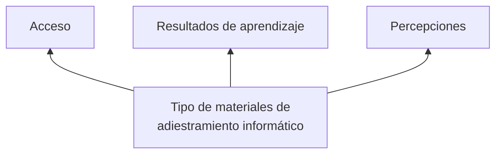

METODOLOGÍA DE LA INVESTIGACIÓN EN ORGANIZACIONES, MERCADO Y SOCIEDAD 

Epistemología y técnicas

cap 19,21 25.

## Capítulo 19 El informe del proyecto y el reporte de investigación

## Ha de observarse que toda doctrina de la objetividad termina siempre por someter el conocimiento del objeto al control ajeno.1

## Gastón Bachelard

## 19.1 Los documentos de la investigación

El epigrafe de este capítulo dice: "Ha de observarse que toda doctrina de la objetividad termina siempre por someter el conocimiento del objeto al control ajeno." Una de las formas en la que ese control se concreta es regresando sobre los propios pasos para exponer públicamente los conocimientos obtenidos en nuestra investigación y dar lugar, de ese modo, a la crítica fundamenta que permitirá la rectificación del error. La investigación que no es sometida a la crítica hecha sombra sobre sus resultados y, en consecuencia, sobre la validez de su aplicación.

A la par, la publicación de los resultados de una investigación los transforma en literatura disponible para otros investigadores que realicen sus propios estudios y, eventualmente, puedan replicar el que hemos hecho en otros contextos; más aún: promueve la circulación del saber que, como bien social, debe estar disponible para que la comunidad lo acoja.

Pero los documentos de la investigación, el anteproyecto, el proyecto de investigación (o plan de trabajo, cuando se trata de una tesis) y el informe de investigación (reporte que se elabora al concluir una investigación), no sólo deben rendir cuentas al formalismo institucional; además -y en tanto la ciencia se construye a partir de un intenso diálogo entre la teoría y la observación, guiado por esa estructura de principios que es el método científico-, los informes deben tener también como soporte tales principios, y por ello la investigación y su documentación deben ser, ambas, coherentes con los supuestos del método científico que la guiaron.

Lo anterior pone de manifiesto que en tanto la investigación se construye sobre el método científico -atendiendo las variadas consideraciones que definen la cientificidad- los documentos deben seguir, al igual que el estudio, la lógica del método del cual son tributarios. Es decir, deben ser coherentes con ese conjunto de principios epistemológicos y metodológicos que consideremos apropiados para obtener conocimientos válidos.

Finalmente, es necesario considerar el significado y las implicaciones del informe en tanto mensaje que se expone a la consideración de los demas. Aquí, son pertinentes todas las recomendaciones relativas a cualquier mensaje: definir quién es, qué espera que necesita su destinatario para decidir adecuadamente el soporte, la modalidad, la profundidad y el lenguaje de la comunicación.

## 1 Bachelard, G. La formación del espíritu científico. op. cit. p. 284.

## 19.2 El anteproyecto de investigación

El informe de investigación no sólo testimonia la actividad del investigador sino que es, ante todo, un documento de gestión. "En tal sentido, la eficacia de la gestión dependará en mucho del discurso de exposición, es decir de cómo está escrito, una pregunta que comienza a contestarse a partir de la demanda de investigación: para qué y para quién se escribe." 2

Por regla general, el anteproyecto antecede al proyecto y es un documento similar pero menos preciso que se elabora en un momento temprano del proceso de investigación. Es solicitado al investigador por una persona, empresa o institución, con el fin de evaluar la calidad de una propuesta de investigación, y la adecuación de los objetivos de la misma a sus propósitos. En cuanto al interés del investigador, la elaboración del anteproyecto, constituye para él un recurso formal que permite aclarar y sistematizar la propuesta ante sus propios oíos

En síntesis, tres son las exigencias que se le imponen al informe: cumplimiento de los formalismos institucionales, coherencia metodológica y adecuación al destinatario. El texto debe atender a la continuidad en la exposición de las ideas, a la secuencia lógica de los argumentos, a la cohesión entre sus diferentes fases y a la coherencia con los supuestos teóricos y epistemológicos que guiaron el estudio; todo ello para que, al final, el autor responda al problema de la investigación y alcance sus objetivos mediante un empleo adecuado de los métodos néticos.

En el ámbito académico, se trata del documento solicitado por las universidades para autorizar la iniciación de la tesis de grado o postgrado, o con la finalidad de ponerlo a consideración de un potencial tutor. Si bien la precisión y grado de desarrollo del antéproyecto varián de una institución a otra, los elementos que deben incluirse son generalmente los mismos

Cuando la investigación sale del ámbito académico, es decir, cuando es requerida por una empresa, organización o institución, la presentación de proyectos y de informes permite al investigador poner en consideración de quienes requieren el estudio los objetivos o los productos que la actividad investigativa se propone alcanzar. Frecuentemente, los documentos que se exigen en estos ámbitos tienen un formato estándar cuyo propósito es asegurar que todas las áreas identificadas como relevantes sean tenidas en cuenta. Ese documento, de ser aprobado, introduce un nivel de compromiso asociado con las cosas que se estipulan por escrito, y establece una garantía reciproca entre ambas partes. Desde la perspectiva del investigador, la formulación de objetivos así expresada pone a disposición de la organización o empresa, antes de iniciar su labor, cuáles serán los productos de la investigación, previniendo los conflictos que pudieran surgir a partir de la utilidad que efectivamente tengan o no esos productos en la toma de decisiones para la cual fueron solicitados. Por su parte, para quien solicita la investigación, el proyecto y el informe son documentos de seguimiento tanto del proceso como del producto y representan la posibilidad de inserción de los resultados de la investigación en los diferentes contextos institucionales, organizacionales o empresariales en donde la tarea realizada cobra significado.

Si el anteproyecto se presenta en un ambiente no académico, como por ejemplo una empresa, será un elemento imprescindible para sondear las expectativas de los gerentes en relación a la pertinencia de la investigación. Debe, por lo tanto, permitir despejar interrogantes tales como si los resultados de la investigación permitirán cumplir con los objetivos de quien la solicita; o, en otros términos, si los objetivos de la investigación proveerán los datos e informaciones con los que se podrá resolver un problema o tómar determinada decisión.

## 19.3 El proyecto de investigación

Habiendo considerado los distintos destinatarios de un informe, huelga aclarar que incluiremos técnicismos y expresiones lingüísticas diferentes si quien pidió la investigación es una institución que exige una tesis para la graduación, un organismo gubernamental que necesita un estudio, una gerencia que solicita una investigación de mercado para la toma de decisiones o un medio de comunicación masiva que difundirá los resultados televisión.

El proyecto (al igual que el anteproyecto) se presenta como una secuencia lineal, aunque ya sabemos que, en la práctica, los caminos de la investigación se recorren en paralelo, se mezclan, superponen, modifican e intercambian al ritmo del movimiento dialéctico que su misma lógica impone. La linealidad inevitable del informe se corresponde con la exigencia de lograr claridad expositiva y con la necesidad de no perder la perspectiva del vector temporal: el informe ordena una cronología y ésta contribuye al cumplimiento de las actividades en los plazos de que se dis-

none para hacerlo

Es necesario, en suma, no perder de vista el carácter administrativo que siempre tienen los documentos de investigación, aunque ello no debe implicar un divorcio o distorsión de los fundamentos epistemológicos y metodológicos en los que ésta se concibe y realiza.

En los párrafos que siguen presentaremos los formatos clásicos que toman el anteproyecto, el proyecto y el reporte o informe final de la investigación. En cuanto a los informes de estudios cualitativos, los hemos incluido directamente en la parte IV (capítulo 25) de esta obra, atendiendo a su especificidad.

Veremos a continuación un formato de Proyecto de Investigación, también llamado Plan de Trabajo. Los proyectos pueden tener mayor o menor grado de desarrollo y precisión, según las exigencias de la institución que acogerá la investigación que se planea realizar y según, claro, el nivel de desarrollo y precisión que el investigador haya logrado en el momento de su elaboración. En nuestro curso introductorio, el proyecto sintetiza las operaciones que el estudiante habrá realizado en su proceso de aprendizaje: construcción de su objeto de investigación y propuesta de contrastación empírica. En general, cada uno de los productos que el proyecto expone fue desarrollado en los capítulos correspondientes de este libro. Sugerimos volver a ellos cada vez que sean necesarias mayores ampliaciones. Los puntos o ítems del documento del Proyecto de Investigación se muestran en la figura 19.1, a continuación de la cual se hacen algunas aclaraciones y señalamientos específicos que contribuirán a la eficiencia en el proceso de documentación.

2 Besse, J. "Epistemografías. La escritura de los resultados de investigación" Cinta de Moebio N°11. Septiembre

2001. Facultad de Ciencias Sociales. Universidad de Chile. En línea http://www.rehue.csociales.uchile.c/l/publicaciones/moebio/11/frames08.htm.

## Figura 19.1 Estructura del Proyecto de Investigación

del título perjudica su claridad, entonces es conveniente dividirlo en dos partes: el título y el sub-

título. Un buen título se puede resumir, aproximadamente, en unas 17 a 25 palabras. Conside-

remos el siguiente ejemplo:

Título y subtítulo informativo

Nombre del investigador o investigadores

Institución/ organización

Echeo de presentación

## "La estructuración del mensaje publicitario"

Hasta aquí, el título proporciona una idea general del contenido de la obra para los conocedores del tema publicitario, pero es impreciso. Esto se resuelve agregándole un subtítulo:

## "La estructuración del mensaje publicitario en el comercial televisivo"

3. Planteo del problema

3.1. Planteamiento del problema

3.2. Formulación del problema

3.3. Operacionalización del problema

3.4. Justificación e importancia del estudio.

3.5. Viabilidad o factibilidad

la captación de la atención en audiencias con diferentes grados de interés

Este subtítulo seguramente podrá resultar complejo para quienes se encuentran fuera del área de conocimiento, pero no para el especialista. Lo importante es que se logre comprensión en el destinatario adecuado.

7. Metodología

7.1. Tipo de estudio

7.2. Unidad de análisis

7.3. Diseño muestral

Los titulos deben ser informativos. Esto significa que hay que desechar las metáforas, imágenes poéticas, humorísticas y los titulos interrogativos. Vale la pena enfatizar esta característica esencial del título en todos los documentos de investigación, y en general, del lenguaje todo con que el investigador se expresa. La recomendación es especialmente pertinente para estudiantes de letras, comunicación o publicidad, especialmente los orientados a las ramas creativas, que suelen recurrir a los titulos del tipo mencionado, incluso en los capítulos y parágrafos del marco teórico. Una pregunta que aquellos creativos pueden hacerse es "¿como hubiera yo recogido información para mi investigación si solo hubiera encontrado titulos metafóricos o enigmáticos?" Debemos pensar que la oferta informativa es enorme, y la única manera de tornar accesible nuevas producción a los investigadores que vendrán detrás de nosotros es ofreciendo claridad y precisión en el producto de la investigación. Un título poético o ambiguo sólo alejará a los potenciales lectores, faltos de tiempo para averiguar con qué se encontrarán al hojear el estudio. La exigencia de claridad remite a una triple cuestion. La primera es de género: del mismo modo que un comercial tiene su lenguaje, diferente al de un boleto de compra-venta, una denuncia por hurto, o una nota periodística; una investigación tiene también el suyo propio. La segunda es práctica: se necesitan palabras claras e informativas para que los buscadores electrónicos releven nuestras investigaciones. La tercera es normativa: no nos aceptarán otra cosa.

7.4. Propuesta operacional

7.5. Estrategias de recolección de datos

10. Bibliografia

## 2. Indice o Esquema

## 1. Portada

La portada debe incluir:

El índice o esquema del trabajo proviene en gran medida del que hemos elaborado para el marco teórico.3 Lo esencial aquí es el desarrollo y coherencia lógica con que estructuramos los contenidos.

## 3. Planteo del Problema 4

a. Datos de identificación

Se incluye el apellido y nombre del investigador o investigadores, la institución u organización que promueve o solicita el estudio y la fecha de presentación.

El planteamineto del problema implica la exposición del tema general y de los hechos y suposiciones que conducen a la formulación de los interrogantes. El desarrollo debe ser necesariamente analítico.

El título de la investigación debe ser claro, preciso y completo. En forma simple y sucinta, indicará el lugar, el fenómeno que se presenta, de qué o quiénes hablarán los datos, las variables que se interrelacionan y, preferentemente, la fecha o época a la que se refiere el estudio. Si la extensión

3 Como contribución a la elección de la modalidad mas adecuada a cada trabajo presentamos en el capítulo 4 y en Apéndice diferentes modelos de esquemas comentados.

4 Para ampliar, ver el Capítulo 3.

## 3.2. Formulación del problema

La estructura de la formulación se realiza en términos de una pregunta que debe incluir los elementos que indican el nivel de investigación escogido (un caso, el universo o muestra, un período de tiempo determinado, un espacio físico) y las correspondientes variables implicadas en el problema

## el problema.

transferencia o aprovechamiento de los resultados de la investigación a distintos problemas. Si el problema de investigación fuera, por nuestro viejo ejemplo, “¿Cuáles son las causas de los accidentes de tránsito?”, los objetivos tendrán que ver con la identificación de las causas. De tal modo, “contribuir a la reducción de los accidentes de tránsito” no es un objetivo de investigación, sino que representa el propósito que puede tener el funcionario que solicito la investigación. El objetivo es siempre un producto de la investigación: un nuevo conocimiento, una explicaçión, una descripción, fruto de la labor del investigador. b. En cuanto a la forma: un objetivo debe redactarse con verbos en infinitivo (clave).

3.5. Operacionalización del problema

En este punto, si es necesario, se debe descomponer el problema en subproblemas con sus res-

pectivos comentarios e interrogantes específicos.

## 3.4. Justificación e importancia del estudio

son: analizar, presentar, verificar, planear, describir, comprobar, explicar, comprender, esta blecer, examinar, compilar, formular, indicar, proporcionar, señalar, someter, pensar, hacer, etc.). En la figura 19.2 proponemos un ejemplo sencillo que nos permita luego ilustrar otras instancias de la presentación. Sin embargo, hay que tener presente que la investigación social, con sus complejos y elusivos problemas puede enfrentarnos -generalmente lo hace- a la necesidad de revisar muchas veces los objetivos que nos hemos planteado. Insistimos en ello: el lugar para profundizar en la tarea crucial de formular objetivos es el capítulo 3; recomendamos enfaticamente regresar allí antes de dar por finalizado este punto del documento.

Se deben exponer aquí los propósitos de esta investigación. Entre las características que debe tener un problema de investigación está, sin dudas, la de su importancia. Esto es: la pregunta que guía el estudio debe conducir a resultados que contribuyan de manera significativa a la práctica o a la teoría de una ciencia o disciplina. Así, una investigación es importante en relación directa a la significatividad del problema.

## Figura 19.2 Objetivo General y objetivos específicos en el proyecto de investigación. Ejemplo

## 3.5 Viabilidad o factibilidad

Establecer la influencia del tipo de materiales de adiestramiento informático en el aprendizaje de programas por parte de usuarios inexpertos.

Objetivos específicos

La viabilidad es función de la disponibilidad de recursos humanos, económicos, materiales y de tiempo. Es muy importante en este punto que el investigador sea consciente de la posibilidad de conseguir fuentes de datos para el desarrollo de su estudio, ya sean primarias o secundarias. En este ítem se incorporarán, además, las razones -si las hubiere- que impiden abordar el problema en todos los aspectos que serían deseables. En tal caso, éstas deben estar establecidas de la manera más clara y concisa posible; por ejemplo: dificultad para encontrar información, área geográfica, período de investigación, recursos utilizados, etc.

- Comparar la efectividad del uso de una documentación electrónica en forma de programa hipermedia con la efectividad de una documentación impresa en el aprendizaje de programas para usuarios inexpertos.

• Establecer si existen diferencias en la frecuencia de acceso a los dos tipos de documentación 6

## 4. Objetivos 5

## 4.1. Objetivo general

Aunque los objetivos son parte del planteo del problema de investigación, debido a la importancia central que tienen en el proyecto -representan la promesa del investigador- deben ser explicados de manera relevante. Habitualmente, se incluye un objetivo general (que prácticamente es la pregunta de investigación sin los interrogantes) y:

- Conocer las percepciones de los usuarios acerca de los materiales de adies-tramiento que utilizaron, y averiguar si existen diferencias en la percepción de la facilidad de uso, la utilidad y el grado de satisfacción de los usuarios con ca-da documentación.

En esta parte, se hace un desglose o desagregado del objetivo general en términos de las variables utilizadas (la investigación se ocupará de estos objetivos los cuales, una vez logrados, habrán respondido al objetivo general)

## 5. Marco Teórico 7

a. En cuanto al contenido: los objetivos se refieren al producto de las acciones que realizará el investigador. No se deben incluir objetivos metodológicos, como por ejemplo “realizar una encuesta”, pues ese instrumento se utiliza para lograr un objetivo. No se deben establecer objetivos que dependan de otras personas o que resulten de la aplicación,

El marco teórico tiene como objetivo integrar el problema específico en un contexto científico más amplio y ofrecer una explicación acotada para las relaciones y regularidades identicas en el problema. Incluye los antecedentes teóricos que fundamenen el problema, extraídos

6 Tener en cuenta que los diseñadores de soft siempre lamentan que los usuarios no accedan a los manuales y en cambio preferan aprender por ensayo y error. El acceso del usuario a la consulta del manual de programa es una conducta buscada por quien diseña y es por eso que se quiere saber con cual de ambos métodos el usuario accede de más frecuentemente, y en tal sentido el método que logra mayor acceso es mejor.

7 Para ampliar, ver capítulo 4.

Si es que existen, se formulan las hipótesis o supuestos fundamentales planteados para desarrollar el trabajo de investigación. Si no las hay, se explicita con claridad cuáles serán las variables o categorías de interés. La figura 19.4 ilustra la formulación de hipótesis en la investigación que estamos utilizando como ejemplo.

de la literatura existente. Recordemos que la revisión bibliográfica y documental tiene por finalidad identificar, elegir, analizar, criticar e informar sobre datos ya existentes acerca del tema en estudio. Sin embargo, la revisión de la literatura nos ayudó desde el inicio a formular el problema de investigación, ampliar los conocimientos sobre el asunto, delimitar el campo de la investigación, demostrar la necesidad de efectuar la investigación en un área definida y conocer los estudios previos para sugerir aspectos del problema que no se conocen totalmente. No todo lo leído para elaborar cada una de las instancias señaladas debe ser atestiguado en el marco teórico, sino que con el material seleccionado y fichado, hay que redactar el entramado, con formato de prosa argumentativa respaldada en las fuentes, que da cuenta de nuestro objeto de investigación y no un glosario ni una yuxtaposición de teorías y antecedentes.

Figura 19.4 Presentación de hipótesis o supuestos en el Proyecto de Investigación. Ejemplo

Impotesis general

El tipo de materiales de adiestramiento informático influye en los resultados de aprendizaje, en el acceso y en las percepciones de usuarios inexpertos.

Hipótesis específicas

Frecuentemente la revisión de la literatura induce a la redacción de una serie de resúmenes de los aportes encontrados o a la presentación de un mero recorrido por elestado de la cuestión. El marco teórico no es una recopilación histórica del objeto de investigación. La bibliografía disponible es la base para establecer un fundamento sistemático para el estudio, señalando las congruencias y contradicciones que de ésta surgen en relación al tema elegido. Sobre la base de esa revisión y las ideas que nos habrán surgido durante la lectura y procesamiento, habremos construido una explicación acotada del problema que será nuestra explicación, una entre otras posibles maneras de dar respuesta al problema de investigación.

Hipótesis 1: Hay diferencias en el estudio y la realización de tareas entre los sujetos que utilizan documentación electrónica y los que utilizan documentación impresa.

Hipótesis 2: Hay diferencias en el acceso de los usuarios a la documentación impresa y electrónica.

Hipótesis 3: Hay diferencias entre sujetos que utilizan documentación impresa o documentación electrónica en cuanto a sus percepciones sobre la documentación.

## Fuente: Tejada, J. Sobre papel o hipermedia. Efecto de dos tipos de materiales de adiestramiento informático en el acceso, resultados de aprendizaje y percepción de usuarios inexperitos.11

## 7. Metodología

En síntesis, en este punto se desarrollan los elementos del marco teórico que hemos tratado detenidamente en el capítulo 4: los antecedentes teóricos, los frutos seleccionados de la investigaciones empírica disponible, la respuesta teórica que se da al problema (modelo teórico) y la definición de los conceptos centrales del estudio. Cuando corresponda, el investigador podrá incluir una representación gráfica del modelo teórico que ha elaborado, tal como se muestra en la figura 19.3. Subrayemos en este punto que hemos llamado modelo teórico a cualquier sistema de relaciones entre propiedades seleccionadas, abstractas y simplificadas, construido consciente con fines de descripción, de explicação o previsión y, por ello, plenamente manejable, teortas en miniatura 9 que no pretenden reflejar el funcionamiento de lo real sino la lógica que el investigador trata de construir para explicar teóricamente al objeto.

Comprende las pautas generales del diseño. En esta instancia, se clasifican el tipo de estudio, el diseño y los procedimientos que se siguen para responder a las preguntas de investigación. Puede tratarse de una investigación de datos primarios o secundarios, exploratoria, descriptiva o explicativa; proponerse una validación experimental o no experimental de las hipótesis y ade-lantar si se tratará de un estudio transversal o longitudinal. Los puntos donde incluir la informa-ción sobre metodología son:

## Unidad de observación: Usuarios inexpertos

## Figura 19.3 Representación gráfica del Modelo Teórico

## 7.1. Tipo de estudio 12

Diseño y método utilizado:13 El diseño del estudio debe ser descripto con claridad, así como los puntos fuertes y débiles del método y las limitaciones que se prevén para el estudio. Hay que describir las estrategias metodológicas que serán usadas para evitar sesgos en los resultados. Alance: Exploratorio, descriptivo, correlacional o explicativo (para cada nivel corresponde una cuestión base, un diseño apropiado, un tipo de muestra y método de análisis de los datos). Tiempo:14 Transversal o longitudinal. El estudio debe ser definido por un tipo y un tiempo. Ambos deben estar fundamentados.

En este punto, debe señalarse y justificarse la unidad de análisis y sus características.

10 Para ampliar, ver capítulo 5.

11 Tejada, J. op. cit.

12 Para ampliar, ver capítulo 2.

13 Para ampliar, ver Sección 1 Diseños de investigación. EL DISEÑO DE INVESTIGACIÓN.

14 Para ampliar, ver capítulo 2 y casos de estudios longitudinales en los capítulo 9 (encuestas panel) y 10 (experi-

mentos de series temporales).

15 Para ampliar, ver capítulo 11.

## 7.3. Diseño muestral:16

En esta instancia, se definen la población -el grupo al cual podemos aplicar los resultados del estudio- y la muestra como una pequeña parcela de población que puede, a través de determinados requisitos, representarla de forma genérica más amplia.

Si presentamos cada una de las tareas a realizar como una barra en una cuadrácula basada en un calendario, el resultado es un diagrama de Gantt (figura 19.5). Este diagrama puede ayudar a definir la secuencia más operativa de trabajo y a reservar los recursos para las tareas pendientes. El diagrama de Gantt es, luego, una herramienta efectiva en el seguimiento de los progreso del provisto

## del proyecto.

## 7.4. Propuesta operacional:17

## Figura 19.5 Diagrama de Gantt

La propuesta operacional representa la traducción de los conceptos o hipótesis teóricas a referentes empíricos. En este apartado se dan definiciones precisas de los conceptos que componen el problema de la investigación, con el fin de facilitar la comunicación de las ideas de la investigación y de ayudar a minimizar la brecha entre los fenómenos abstractos y las variables mensurables. Este punto es el soporte necesario para abordar el siguiente punto: la recolección de datos.

<table border="1"><tr><td></td><td colspan="4">Marzo</td><td colspan="4">Abril</td><td colspan="4">Mayo</td><td colspan="4">Junio</td></tr><tr><td>Revisión bibliográfica</td><td></td><td></td><td></td><td></td><td></td><td></td><td></td><td></td><td></td><td></td><td></td><td></td><td></td><td></td><td></td><td></td><td></td></tr><tr><td>Problema</td><td></td><td></td><td></td><td></td><td></td><td></td><td></td><td></td><td></td><td></td><td></td><td></td><td></td><td></td><td></td><td></td><td></td></tr><tr><td>Marco teórico</td><td></td><td></td><td></td><td></td><td></td><td></td><td></td><td></td><td></td><td></td><td></td><td></td><td></td><td></td><td></td><td></td><td></td></tr><tr><td>Diseño</td><td></td><td></td><td></td><td></td><td></td><td></td><td></td><td></td><td></td><td></td><td></td><td></td><td></td><td></td><td></td><td></td><td></td></tr><tr><td>Muestra</td><td></td><td></td><td></td><td></td><td></td><td></td><td></td><td></td><td></td><td></td><td></td><td></td><td></td><td></td><td></td><td></td><td></td></tr><tr><td>Recolección de datos</td><td></td><td></td><td></td><td></td><td></td><td></td><td></td><td></td><td></td><td></td><td></td><td></td><td></td><td></td><td></td><td></td><td></td></tr><tr><td>Análisis de los datos</td><td></td><td></td><td></td><td></td><td></td><td></td><td></td><td></td><td></td><td></td><td></td><td></td><td></td><td></td><td></td><td></td><td></td></tr><tr><td>Redacción del informe</td><td></td><td></td><td></td><td></td><td></td><td></td><td></td><td></td><td></td><td></td><td></td><td></td><td></td><td></td><td></td><td></td><td></td></tr><tr><td>Revisión del informe</td><td></td><td></td><td></td><td></td><td></td><td></td><td></td><td></td><td></td><td></td><td></td><td></td><td></td><td></td><td></td><td></td><td></td></tr></table>

## 8. Plan de análisis

Algunas instituciones solicitan también el plan de análisis. Aunque tal no sea el caso, insistimos enfaticamente en la necesidad de prepararlo. Para poder definir las técnicas de análisis, se debe elaborar, con base en las hipótesis generales y específicas, un plan o proyecto tentativo de análisis específicando el sistema de codificación y tabulación. Las técnicas estadísticas son vitales para evaluar los datos y determinar la calidad de los mismos, comprobar las hipótesis y obtener conclusiones. Aunque generalmente el análisis estadístico es una tarea de especialistas, el investigador es el que tiene que tener claro qué tipo de análisis pretende y puede realizar.

## 10. Bibliografía

## 9. Cronograma

En la bibliografía, deben incluirse sólo los autores citados en el texto. Se presentan al final, ordenados alfabéticoamente en una columna a doble espacio según normativa internacional.

En el caso de que se tenga la intención de leer bibliografía adicional en el curso de la investigación, se deben explicitar y encolumnar aparte las fuentes bibliográficas consultadas de las fuentes bibliográficas para consultar

En el apéndice de este libro hay información detallada y precisa acerca de cómo citar fuentes bibliográficas y documentales en diferentes soportes según las pautas establecidas para documentos científicos como papers o tesis. Incluimos, además, una guía sintética para resolver con rapidez las referencias del proyecto, utilizando la modalidad anglosajona, que es la más habitual en los informes de investigación empírica.

Comprende la cantidad de pasos en que se discrimina el proyecto y varía en función de las exigencias institucionales u organizacionales, la naturaleza de la investigación y la modalidad de trabajo de cada investigador. Para el investigador inexperto puede ser difícil prever los tiempos que insumirán las tareas a realizar. En la fase de la revisión previa de la bibliografía, se requiere cierto tiempo para detección del material, la selección de las fuentes, lectura, fichaje, resúmenes y escritos que serán utilizados en el marco teórico. Êste, a su vez, suma al proceso de análisis y síntesis que exige el tiempo necesario para la elaboración de los esquemas. Además, hay una cantidad de elementos complementarios que deben ser previstos, como por ejemplo la redacción de la introducción, conclusión, título, bibliografía, índice, apéndices, citas y notas, anexos, etc. Esas tareas consumen, en general, bastante más días de los que se piensa; por ello, es necesario planificar el tiempo que se destinará a completarlas.

## 11. Anexos

Si hubiera alguna documentación que acompaña, como planos, fotografías, planillas de datos, etc., ha de hacerse en este apartado.

## 19.4 El informe o reporte final de la investigación

Luego de haber hecho estas previsiones, aún resta planificar los tiempos de post redacción (revisión del texto escrito, presentación formal, aspectos ortográficos, etc.). Una vez más: no siempre se planifican los aspectos finales y, en verdad, consumen mucho tiempo, por lo que suelen ser fuente de dilaciones impensada en las últimas etapas, cuando no de errores y descuidos de último momento que pueden comprometer seriamente la formalización del estudio.

Hasta aquí nos hemos dedicado a precisar los elementos del anteproyecto y del proyecto de investigación. Veamos ahora un modelo de Informe o Reporte Final, acompañado de algunos comentarios específicos. Valen aquí todas las aclaraciones hechas para el proyecto, y se agregan algunas más, sobre todo relativas a las etapas del proceso que no repasamos al referirnos al proyecto.

## 16 Idem anterior.

El informe o reporte final de la investigación que presentamos está compuesto por los elementos inventariados en la figura 19.6.

17 Para ampliar, ver capítulo 12.

18 Para ampliar, ver Sección 3.

## Figura 19.6 Reporte de investigación

2. Indice o Tabla de contenidos

Es conveniente presentar el índice al comienzo del informe, pues orienta al lector y contribuye al análisis de la coherencia lógica del trabajo.19 El contenido de cada capítulo se define en función de la estructura del estudio, que en rigor debe reflejar los objetivos generales y específicos del Proyecto de Investigación. Si el proyecto ha sido bien diseñado, la redacción de los capítulos no presentará dificultades y el índice que se haya elaborado como plan de trabajo servirá ahora como guía para la propuesta final.

Autor: Nombre y Apellido

Lugar y Fecha

2. fndice

3. Resumen (abstract)

El resumen -de 75 a 175 palabras- debe contener el propósito, el objetivo, el método, los resultados y conclusiones de la investigación:

4. Introducción

- Descripción del problema, el objetivo o la "hipótesis de trabajo" que orientó la búsqueda de información

4.1 Procedenatica

4.2 Procedimiento General de la Investigación:

4.3 Guía de Lectura

## 5. Capítulos del Marco Teórico

- Metodología y fuentes de información utilizadas.

- Palabras clave: identificatorias del trabajo.

Vemos un ejemplo de resumen o abstract en la figura 19.7.

6.3. Población y Muestra

6.4. Instrumentos de Medición

Figura 19.7 Resumen o abstract para el reporte final de la investigación. Ejemplo

Sobre papel o hipermedia

7. Resultados

8. Interpretación de los Resultados

9. Sugerencias y recomendaciones de investigación

Efecto de dos tipos de materiales de adiestramiento informático en el acceso, resultados de aprendizaje y percenciones de usuarios inexperitos

9. Conclusiones

10. Glosario

Jesús Tejada (Dto. de Expresión Artística. Universidad de La Rioja.)

13. Bibliografia

Con el fin de averiguar el efecto de dos tipos de documentación, electrónica e impresa, en los resultados de aprendizaje de un programa editor de partituras, acceso a la documentación y las percepciones de los usuarios, se llevó a cabo un estudio empírico de contraste con treinta estudiantes de música universitarios con nulas y bajas experiencias previas en el uso de computadoras. A uno de los grupos se le asignó un manual impreso y al otro, un manual electrónico con información procedimental exclusivamente en formato de video. En la elaboración de los instrumentos, se utilizó el modelo minimalista para el manual impreso y el modelo hipermedia para el manual electrónico. Los resultados muestran que el grupo que trabajó con el manual hipermedia (MH) empleó menos tiempo en la fase de adiestramiento, consiguió una mejor puntuación en la exactitud de las tareas de transferencia cercana y lejana de los tests y tuvo que consultar menos su manual que el grupo que utilizó el manual impreso (MI). Además, el grupo MI hubiera preferido trabajar con el manual hipermedia más que el grupo MH con el manual impreso.

Se completan los datos que exige la institución ante la cual el proyecto será presentado. Po

elemplo:

- Institución

Palabras clave:

Adiestramiento de usuarios inexpertos, documentación técnica, hipermedia, minimalismo, informática musical.

- Subtítulo

- Autor: Nombre y Apellido

- Lugar y Fecha

## puramente descriptiva, en la que habitualmente se elaboran esquemas, tablas y diagrams de forma clara y creativa.

## 4. Introducción

En todo informe publicable, la identificación del problema y los objetivos se lleva a cabo en la introducción del trabajo, ya que el fin de ésta es volverlos familiares a los lectores. Por lo tanto debe contener datos suficientes de estudios previos que ayuden a definir las razones por las cuales el investigador considera necesaria la clarificación del problema, así como la importancia del mismo. Es en la introducción donde deben plantearse las preguntas que guiaron la investigación y las hipótesis de trabajo, si las hubiera. En la introducción del informe final, a diferencia de la del proyecto, no se incluye un apartado llamado problema donde se plantean los objetivos, pues habrán de estar cumplidos desde el momento en que el trabajo ya está terminado. La introducción debe contener tres elementos: problemática, procedimiento general de la investigación y guita de lectura. Estos elementos no llegan a constituirse en subtítulos que los identifiquen sino que se integran uno a continuación del otro:

Ejemplo:

De acuerdo con los resultados, el grupo MH (manual hipermedia) invirtió en el adiestra-

miento un 33% menos de tiempo que el grupo MI (manual impreso) y puntuó mejor tanto en

las tareas de transferencia cercana, como la en tarea de transferencia lejana. En la tabla 4.1 se

muestran los resultados y su significación. (ver gráfico 4.1.A)

## 4.1 Problematica: En este ítem se plantea el problema, la o las preguntas que han guiado la in

## vestigación y la hipótesis.

## 8. Interpretación de los resultados

En este estudio se ha intentado averiguar a través de un diseño experimental comparativo si el uso de una documentación electrónica en forma de programa hipermedia es más efectiva que una documenta-

ción impresa en el aprendizaje de un programa de edición de partituras por parte de usuarios inexperitos.

## Ejemplo:

Los resultados de un estudio deben ser interpretados tomando en consideración los objetivos del proyecto, las hipótesis que fueron sometidas a la comprobación, el cúmulo de conocimientos afines y las limitaciones del método adoptado. Si los datos que se interpretan no son expresión del modelo teórico que se ha construido en el marco teórico, no tendrán validez alguna. Es imprescindible explicitar hasta qué punto las hipótesis son la respuesta al fenómeno que se pretende explicar y de qué forma amplían, rectifican o confirman los conocimientos hasta el momento considerados válidos acerca del fenómeno en cuestión. Para ello, la interpretación de los resultados debe aplicar los nuevos conocimientos obtenidos en la investigación que se ha desarrollado al cuerpo general de las informaciones en el campo determinado en el que ésta se inscribe; en suma, la interpretación sirve para que los autores expliciten sus descubrimientos, así como para la confirmación o no de sus hipótesis, si las hubiere.

4.2 Procedimiento de la investigación: Aquí debe explicarse, primero, cómo y dónde se llevó a ca-

bio, con qué dificultades o limitaciones. También deben mencionarse y describirse las herramientas utilizadas para la recolección de datos y para el tratamiento de la información.

## Ejemplo:

Con este fin, se desarrollaron un manual impreso, un manual hipermedia y dos cuestionarios (materiales todos incluidos en el Anexo I). La diferencia más destacable entre ambos tipos de documentación la constituyó la inclusión en el manual hipermedia de información procedimental en formato de video. El resto de información, texto e imágenes estáticas, fue la misma en los dos manuales, así como la estrategia de adiestramiento, basada en una exploración guiada del soft.

Al invertir menos tiempo en el estudio de las unidades, el sujeto MH dispondría de un tiempo acumulado de repaso al final de cada sesión mayor que el del sujeto MI. Este tiempo de repaso adicional favorecería el aprendizaje, es decir, la automatización de procedimientos. No obstante, no se midió el período de repaso para los sujetos que acabaron el estudio de las unidades antes de que finalizaran las sesiones de adiestramiento y no se puede efectuar una correlación. Esto podría dar una explicación a la mayor exactitud en los test de tareas de transferencia cercana y lejana del grupo MH, aunque no totalmente. Cabría aquí preguntarse si la codificación de información procedimental de vídeo requiere el mismo montante de traducción mental que la información textual en orden a explicar los resultados

De manera breve, debe adelantarse al lector el contenido de cada uno de los capítulos, destacando la relación que existe entre ellos.

## 5. Capítulos del marco teórico

El contenido de cada capítulo debe estar estrechamente ligado con la estructura del trabajo, que es el reflejo de los objetivos generales y específicos del Proyecto de Investigación. Los títulos y subtítulos de cada capítulo deben ser informativos, de modo que con sólo leerlos se comprenda cuál es el contenido que se va a abordar.

Respecto al acceso a la documentación, la información procedimental de video disminuyó el número de accesos a la documentación. Un factor que hubiera provocado un mayor número de accesos del grupo MI sería bajas destrezas de compresión lectora, aunque no podemos asegurarlo dado que no se realizó un test previo que midiera esta variable en todos los sujetos.

## 9. Conclusiones

Aquí se describen el diseño, las muestras y los instrumentos -incluida la confiabilidad y validez de los mismos- de manera detallada (no sintética, como en la introducción).

## 6. Método

Con relación a las conclusiones del estudio, éstas ocupan una posición destacada, pues un estudio que no las presenta puede decirse que no fue terminado. Las conclusiones desempeñan una función semejante al sumario, es decir, presentan de manera sucinta los logros del estudio. Considerando su importancia para el informe, éstas deben ser claras, descriptivas y concisas. Como dice Richardson: "Una conclusión puede ser contestada en su contenido, más no en su forma. No puede dar lugar a la ambigüedad, y sugerir lo que no fue descubierto ni evidenciado."20

Es importante resaltar que resultados no son conclusiones. Se presentan en general los resultados obtenidos y a continuación se analizan en detalle todos y cada uno de ellos. Es una instancia

La conclusión de un estudio cierra siempre sobre la introducción y, en tal sentido, las conclusiones deben ser la respuesta claramente expresada a las preguntas que se formularon en la introducción en función de la capacidad o no de la teoría propuesta para responder a ellas bajo la forma de hipótesis confirmadas o refutadas por el trabajo realizado.

- Toda investigación debe dar un tratamiento riguroso a sus fuentes de información. Dicho tratamiento redunda no sólo en la calidad del informe sino en la credibilidad de los resultados.

• El texto del informe debe identificar la página de la cual provienen las citas, literales o no, que se realicen. Esta exigencia requiere que seamos precavidos al fichar los textos que leemos y utilizamos para elaborar el marco teórico, para evitar la tarea de volver a buscar los datos en los textos originales.

Nada nuevo puede agregarse en la conclusión: no se abren nuevas discusiones ni se introducen problemáticas a tratar. Además, por más que sugiera o recomienda algo de interés para el campo del estudio en cuestión, el sitio exacto y el lenguaje propio para sugerir o recomendar no es el de las conclusiones". De modo que, "cuando el autor pretenda ofrecer sugerencias o recomendaciones, debe abrir espacios para hacerlo."21

## 10. Sugerencias o recomendaciones de investigación

En este punto se pueden proponer aplicaciones prácticas, hacer sugerencias o advertencias sobre el tema de investigación, los métodos o instrumentos utilizados en el estudio y sugerir investigaciones futuras.

- Cuando la bibliografía es muy amplia, hay que separarla de algún modo. Por ejemplo: por tema, por capítulo o por tipo de publicación. Si la bibliografía es corta, se hace una lista al final del trabajo bajo el título Bibliografía citada ordenando alfabeticamente los apellidos de los autores.22 Como ha quedado dicho, sólo se incluye la bibliografía que se ha citado en la investigación, y no toda la que se ha leído.

## vestigaciones futuras.

## Ejemplo:

## 14. Cuadros y gráficos

- Los cuadros y gráficos deben numerarse por separado, y en forma correlativa. Si son muchos, conviene colocar por separado un índice de cuadros y/o gráficos detrás del índice tomático

Un paso natural después de esta investigación sería la replicación del estudio, bien bajo un entorno experimental, bien bajo uno natural mediante una cámara de video y software de registro automatizado. Además, investigaciónes ulteriores deberían estudiar la libertad de elección de la documentación para validar determinados hallazgos de Anson (1995) desde la perspectiva hipermedia y minimalista ¿Qué tipo de documentación selecciona un usuario para realizar una determinada tarea? ¿cuáles son los motivos que le impulsan a elegir una determinada documentación? ¿hay una correlación entre el tipo de documentación, el tipo de usuario, el tipo de tarea, el tipo de errores y los resultados de aprendizaje?

- No se deben incluir cuadros o imágenes que no sean pertinentes a la argumentación.

El material "ilustrativo", eventualmente, se agrega en un anexo. Todos los cuadros o gráficos deben estar anunciados, explicados y analizados.

en el texto las condiciones en que fueron obtenidos los resultados. Se debe indicar claramente el contenido de gráficos y cuadros en el encabezamiento, que contendrá también el período cubierto, la unidad de medida que fue utilizada, etc. También debe precisarse con mucha claridad el contenido de filas y columnas de los cuadros y las coordenadas de 
Incluye la definición de los principales conceptos sobre los cuales se sostiene la estructura del trabajo. Si bien este punto no es imprescindible, es muy importante para su localización por buscadores electrónicos.

## 11. Glosario

- La fuente se identifica al pie de cuadros y gráficos. Si se trata de una elaboración propia debe aclararse en el mismo lugar. Ejemplo: "Elaboración propia a partir de datos de la Encuesta Permanente de Hogares del INDEC".

## 12. Anexo/s

## 19.5 Evaluación de reportes de investigación

En los anexos se coloca toda información complementaria. Es el material que se ha usado en el estudio y que permite a quienes recurren al informe evaluar la naturaleza y calidad de los dispositivos empleados. Además el material crudo -como la desgrabación de entrevistas o las respuestas a cuestionariso de preguntas abiertas- es un aporte interesante para su reutilización en futuras investigaciones y para la evaluación de los procedimientos realizados. Son materiales adecuados para colocar en el anexo/s:

- Los instrumentos utilizados: cuestionarios, escalas, plantillas de observación, guías de

Si hemos llegado, luego de un arduo trabajo, a finalizar el reporte de investigación o si pensamos utilizar el informe de otro estudio como parte de la literatura disponible para iniciar una investigación nueva, en cualquier caso, y recurriendo a los conocimientos que adquirimos en nuestro recorrido, valdrá la pena contar con una guía de preguntas que nos permita autoevaluar o analizar el reporte de la investigación. Cabe aclarar que la guía de evaluación de los informes que presentamos no es adecuada para evaluar informes de investigación cualitativa, por lo que remitimos al lector a la Parte IV de este libro, destinada a dicho enfoque. Allí encontrará recomendaciones especialmente preparadas para los informes de estudios cualitativos.

- Las planillas de bases de datos estadísticos.

• Las desgrabaciones completas de entrevistas importantes.

19. 5.1 Aspectos epistémicos

- La introducción del estudio integra y explica claramente el tema central de la inves

*¿Las conclusiones so n claras, analíticas y concisas?*

tigación?

gunta/s que define/n al problema?

- El problema es significativo? ¿esta explicado?

* Se articulan adecuadamente las conclusiones con la teoria disponible ubicando a los resultados en el contexto más amplió del saber de la disciplina o ciencia de que se trate?

* ¿Cuáles son las consecuencias prácticas de los resultados?

* ¿Los objetivos están elaborados en forma clara y contienen la acción, el alcance de la in-

vestigación y los sujetos?

¿El objetivo general es coherente con la pregunta de investigación planteada en el pro-

* ¿Se sugieren investigaciones más completas?

blema?

19. 5.4 Aspectos formales

- ¿Los objetivos específicos son suficientemente específicos para ser investigados?

• ¿Los supuestos del autor están descriptos? ¿son clarios y fundamentados?

¿El resumen contempla el problema, propósito, objetivos, el método, los resultados y

conclusiones?

- Los supuestos del autor están descriptos? ¿son claros y fundamentados?

¿Esta expuesta la manera en que el estudio ampliará y mejorará resultados anteriores?

¿El autor formula hipótesis? ¿son congruentes con el problema de investigación? ¿pue-

- La bibliografía sigue las normas establecidas? ¿Todas las referencias están en la bibliol-

¿El autor conceptualiza las variables de su investigación? ¿presentó las variables dependientes?

- ¿Los anexos son adecuados? ¿son indispensables o necesarios? ¿están organizados y completos?

* ¡El autor presenta un marco teórico adecuado a su problema?

¿La revision de la literatura es coherente con las variables del estudio? ¿sustenta el pro-

* ¿Tienen las tablas titulo, cuerpo y cabeza? ¿se discuten en el texto las informaciones pre-

entidades?

blema de la investigación?

* ¿la revisión de la literatura está organizada y deja claro el desarrollo de las ideas?

- La revisión es actualizada?

* ¡El diseño de la investigación está descripto y es apropiado para la resolución del pro-

yecto.

¿son explicitados los puntos fuertes v dábiles del método?

blema? ¿son explicitados los puntos fuertes v dábiles del método?

blema? ¿son explicitados los puntos fuertes y débiles del método?

- ¿Qué medidas se han tomado para controlar las variables extrañas o explicaciones alter-

nativas, si corresponde?

- ¿La población del estudio está identificada y descriita? ¿el autor utiliza la población o sólo

una muestra? En caso de emplear una muestra, ¿describe de qué tipo?

¿La población o la muestra son adecuadas al estudio propuesto?

objetivos del estudio?

* ¿El autor muestra evidencias de tener establecidas la validez y confiabilidad de los ins.

* ¿Están descriptos los procedimientos éticos del estudio? ¿son adecuados?

*¿El método seleccionado para el análisis de los datos es apropiado? ¿El autor lo describe?*

19. 5.3 Aspectos teóricos

- ¿Ha relacionado el investigador los resultados con los principios teóricos del estudio?

• Las interpretaciones están basadas en los resultados? ¿ho ha generalizado el investigador

- ¿Los resultados se analizan comparándolos con los de otros estudios semejantes?

- Los resultados se analizan comparando con los de otros estudios semejantes?

• Las conclusiones responden al problema de la investigación? ¿están de acuerdo con los chipitos del alimento?

objetivos del estudio?