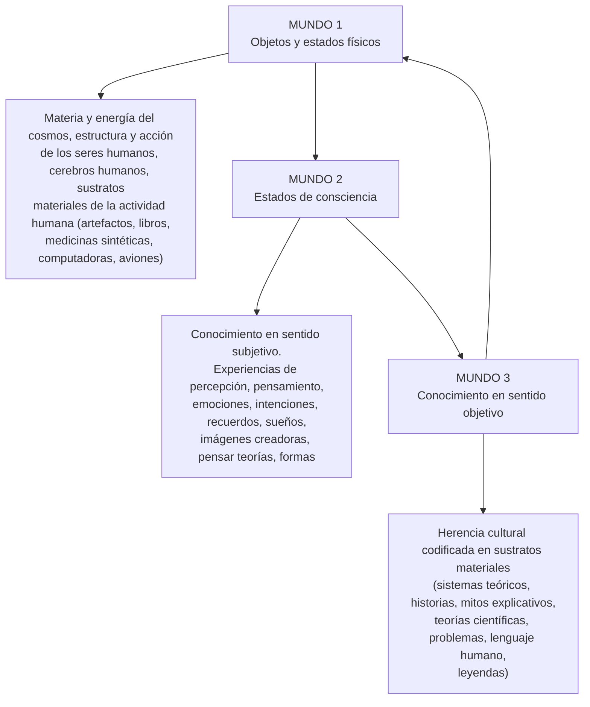

Asignatura: Neuropsicología. Facultad de Psicología. Universidad Nacional de Mar del Plata
# DESCRIPCIÓN DE ALGUNAS DE LAS PRINCIPALES POSTURAS
ACERCA DEL PROBLEMA MENTE-MATERIA

Juan Ignacio Galli & Hernán López Morales, 2018
## INTRODUCCIÓN

El problema mente-materia es, tal vez, uno de los enigmas más antiguos y fascinantes de la historia del pensamiento occidental. Emergente de la confluencia entre filosofía y ciencia, el problema de la relación entre mente y materia está presente en los sistemas filosóficos de las grandes figuras intelectuales, desde los antiguos griegos hasta la actualidad.

La gran mayoría de ellos (p.e. el dualismo platónico, el hilemorfismo aristotélico, el dualismo cartesiano, el empirismo británico, el materialismo francés, el evolucionismo darwinista, el conductismo ontológico) formula una respuesta de evidente cariz ontológico ante los dos grandes interrogantes que genera el susodicho problema: la existencia de lo mental y su interacción con el cuerpo/cerebro (Goñi-Sáez & Tirapu-Ustárroz, 2016).

Éste es un problema central de la Psicología en general, y de la Neuropsicología en particular. Si esta última es entendida como un intento de conocimiento de lo mental a partir del estudio científico del cerebro, el problema es fundamental para comprender los fenómenos explicados.

Con elocuencia y enorme fuerza expresiva, Stephen Priest así lo refiere:

¿Eres tú, lector, un objeto físico complicado y nada más que eso? Si respondes que no: ¿eres una mente? Si respondes que sí: ¿qué son las mentes? ¿Cuál es exactamente la relación entre la mente y el cuerpo? ¿Eres una mente con un cuerpo o un cuerpo con una mente? ¿Somos almas inmateriales que sobreviven a la muerte del cuerpo o lo ha descartado la ciencia moderna? ¿Eres tu propio cerebro? ¿Cómo se conecta la materia gris -si es que existe tal conexión- con nuestras emociones y pensamientos íntimos?

Nos caracteriza el no saber lo que somos. El problema más importante con que nos enfrentamos al tratar de descubrir lo que somos es el problema mente-cuerpo, es decir, el problema de la enunciación correcta de la relación entre lo mental y lo físico o entre la mente y el cuerpo. (Priest, 1994: 13).

Siguiendo a Bunge (1985), al enfrentarse al problema mente-materia es posible adoptar tres posturas diferentes:

1) Considerar que es un pseudoproblema.

2) Considerar que es un problema auténtico pero insoluble.

3) Considerar que es un problema soluble.

Quienes adoptan la primera postura niegan que se trate de un auténtico problema en base a la afirmación de que lo único que puede ser objeto de estudio científico es la conducta observable o manifiesta. En esta postura es posible incluir al conductismo (p.e. Watson), la reflexología (p.e. Pavlov) y el positivismo lógico. En la segunda postura se incluyen aquellos autores (p.e. Hume, Spencer) que reconocen que el problema mentemateria es, en efecto, un problema genuino pero que se trata de un problema que no puede ser resuelto. En otras palabras, sostienen que no sabemos ni podremos saber en el futuro cómo es que los estados o procesos mentales surgen de o se relacionan con el funcionamiento del sistema nervioso. En la tercera de las posturas podemos incluir a quienes, a pesar de reconocer las limitaciones y dificultades asociadas al problema mentemateria, no desisten en su intento por encontrarle una solución.

Dentro de la tercera postura, es posible distinguir dos grandes tradiciones con base en distintos modelos ónticos de la realidad, al interior de cada uno de los cuales es posible incluir diferentes variantes:

(1) los monismos: la realidad está compuesta por una única sustancia, entidad o proceso, que bien puede ser mental (idealismo o mentalismo) o material (materialismo).

(2) los dualismos: existen dos entidades ontológicas diferentes, lo mental y lo material.

Cada posición sobre la relación mente-materia (o mente-cerebro, puesto que lo material ha sido con frecuencia reducido a la estructura cerebral), tiene sus presupuestos y sus grandes consecuencias epistemológicas y hasta antropológicas. A su vez, al posicionarse en una de las dos tradiciones mencionadas surgen un conjunto de interrogantes asociados. Como refiere Mario Bunge (1985), si al hablar de mente y materia se hace referencia a entidades independientes (dualismos):

¿cómo se mantienen unidas y juntas en el mismo organismo vivo? ¿Cómo establecieron contacto al principio, cómo se separan al final y qué ocurre después de la descomposición del cerebro? ¿Cómo se las arreglan las dos entidades para funcionar sincrónicamente? ¿Qué significa decir que los estados mentales tienen correlatos neurales? ¿Interactuarían esas entidades? Y si lo hacen, ¿cómo lo hacen? ¿Cuál es la que domina? (Bunge, 1985: 19).

Si, por el contrario, la mente y el cerebro no constituyen entidades distintas (monismos):

¿es, entonces, la mente corpórea? ¿O es que ocurre lo contrario, es decir, es el cerebro una forma de la mente? ¿O es cada una manifestación de una substancia simple inaccesible y subyacente (y, por tanto, neutral)? En cualquier caso, ¿qué es la mente? ¿Una cosa, una colección de estados, un conjunto de procesos en una cosa, o absolutamente nada? Y, sea lo que sea, ¿es sólo física, o es algo más? Y, en este último caso —esto es, si la mente es emergente con respecto al nivel físico— ¿la podemos explicar científicamente o sólo puede ser descrita utilizando el lenguaje ordinario? (Bunge, 1985: 19).

Generalmente se dice que percibir, sentir, recordar, pensar, etc., son estados o procesos mentales. Dado que todo estado es un estado de una cosa y todo proceso ocurre en una entidad, el eje de la cuestión radica en identificar qué es lo que menta, es decir, cuál es la cosa que percibe, siente, recuerda, piensa, etc. Éste es, siguiendo a Bunge (1985) el verdadero núcleo del denominado problema mente-materia: la identificación del sujeto de los predicados mentales.

Veamos a continuación en qué consiste cada una de estas posturas, y al interior de cada una de ellas, qué respuesta particular se ha brindado para resolver el problema.

## EL PROBLEMA MENTE-MATERIA O MENTE-CEREBRO

Principales posturas

En la Tabla 1 se exponen, resumidas, cinco posturas monistas y cinco posturas dualistas.

Tabla 1.

Diez concepciones sobre el problema mente-cerebro. $ \varphi $ representa el cerebro (o lo físico) y la $ \psi $ la mente (o lo mental).

<table border="1"><tr><td colspan="2">MONISMO</td><td colspan="2">DUALISMO</td></tr><tr><td rowspan="4">M1</td><td>Todo es ψ</td><td rowspan="4">D1</td><td>φ y ψ son independientes.</td></tr><tr><td>IDEALISMO, PANPSIQUISMO,</td></tr><tr><td>FENOMENISMO</td></tr><tr><td>Berkeley, Fichte, Hegel, Fechner, Mach, James, Whitehead, Teilhard de Chardin</td><td>Nadie ha llegado tan lejos excepto L. Wittgenstein.</td></tr></table>

<table border="1"><tr><td>M2</td><td>φyψ son otros tantos aspectos o manifestaciones de una única entidad
MONISMO NEUTRAL
CONCEPCIÓN DEL DOBLE ASPECTO.
Spinoza, James, Russell,
Carnap, Schlick, Feigl.</td><td>D2</td><td>φyψ son paralelos o sincrónicos
PARALELISMO PSICOFÍSICO
ARMONÍA PREESTABLECIDA.
Leibniz, Lotze, Jackson,
algunos gestaltistas, el joven Freud.</td></tr><tr><td>M3</td><td>Nada es φ
MATERIALISMO ELIMINATIVO
CONDUCTISMO.
Watson, Skinner, Turing, Rorty, Quine</td><td>D3</td><td>φ afecta o causa (secreta) φ
EPIFENOMENISMO.
Huxley, Vogt, Broad, Ayer, Puccetti</td></tr><tr><td>M4</td><td>ψ es físico
MATERIALISMO REDUCTIVO
Epicuro, Lucrecio, Hobbes, Lashley,
Smart, Armstrong, Feyerabend</td><td>D4</td><td>ψ afecta, causa, anima o controla φ
ANIMISMO
Platón, San Agustín, Tomas
de Aquino, Freud, Sperry, Popper,
Toulmin.</td></tr><tr><td>M5</td><td>ψ es un conjunto de funciones
(actividades) cerebrales emergentes
MATERIALISMO EMERGENTISTA
Diderot, Darwin, Cajal,
Scheneirla, Hebb, Bindra</td><td>D5</td><td>φyψ interactuan
INTERACCIONISMO
Descartes, McDougall, Penfield,
Eccles, Popper, Margolis.</td></tr></table>

Como puede observarse en la Tabla 1, dentro del monismo y del dualismo pueden incluirse, principalmente, cinco doctrinas diferenciadas. Por lo general se sostiene que dos posiciones dentro del monismo (materialismo reductivo y materialismo emergentista) y dos dentro del dualismo (paralelismo e interaccionismo) son las que cuentan con mayores desarrollos, argumentos a favor y defensores en la actualidad, por lo que van a ser descriptas con mayor detalle a continuación. No se incluye dentro de estas posiciones al materialismo eliminativo (cuya expresión es el conductismo radical) ya que no sólo niega la existencia de estados y sucesos mentales, sino que también se opone al estudio del sistema

nervioso como forma de explicar la conducta. Siguiendo a Skinner (1974) se procede erróneamente al intentar buscar las causas de la conducta estudiando al cerebro, en lugar de buscarlas en el mundo exterior.

## 1. MONISMO

1. 1. MATERIALISMO NIVELADOR (reductivo o fisicalista): Sostiene que los estados, sucesos o procesos mentales son estados, sucesos o procesos físicos que ocurren en el cerebro (SNC). La mente es el cerebro, y este último es entendido como un sistema físico que sólo difiere de otros sistemas físicos por su nivel de complejidad. Los conceptos mente y cerebro hacen referencia a una misma y única entidad que presenta, al igual que toda entidad real, una estructura exclusivamente física. Por tanto, no niegan la existencia de la mente, aunque consideran que no se trata de una entidad independiente. El carácter nivelador de esta posición está dado por la propensión a reducir o nivelar los estados, sucesos o procesos mentales, a los físicos.

2. 2. MATERIALISMO EMERGENTISTA: En consonancia con el materialismo nivelador no niega la existencia de la mente, aunque sostiene que los estados (o sucesos o procesos) mentales son estados (o sucesos o procesos) del sistema nervioso central o de alguna de sus partes. Sin embargo, a diferencia de la doctrina anterior, el materialismo emergentista sostiene que el SNC no constituye simplemente un sistema físico más complejo que otros sistemas físicos, sino que constituye un biosistema: una cosa o entidad compleja con propiedades y leyes propias de los seres vivos, algunas de las cuales son particulares del SNC y no se comparten con otros biosistemas. En este sentido, las funciones mentales serían propiedades del SNC, emergentes respecto al nivel físico, aunque no reductibles a procesos puramente físicos (Bunge, 1985).

Para analizar la posición materialista emergentista es necesario considerar dos conceptos centrales: sistema y emergencia. Un sistema puede ser definido como un conjunto de elementos o componentes interdependientes, con leyes y propiedades particulares que pertenecen al conjunto y no a sus elementos constitutivos. Según la hipótesis sistemista, el cerebro no es un conjunto de unidades aisladas y autosuficientes (atomismo) ni tampoco una "gelatina homogénea" (holismo), sino que constituye un sistema de subsistemas (o de órganos) especializados (Bunge, 1979). Por tanto, las propiedades mentales del SNC son propiedades sistémicas emergentes o, en otras palabras, propiedades que surgen en base al funcionamiento del SNC como biosistema sólo en aquellos animales que cuentan con un sistema nervioso extremadamente complejo y plástico. En esta línea, la física, la química e incluso la biología, si bien necesarias, no son

suficientes para conocer las propiedades mentales emergentes y las leyes específicas del SNC, dado que este último es un sistema complejo con múltiples niveles que debe, por tanto, ser estudiado con el auxilio de todas las ciencias. La concepción sistemista y emergentista sugiere como estrategia de investigación la de estudiar el cerebro como totalidad y, a la vez, todos sus subsistemas, sus modos de articulación, y sus relaciones con otros sistemas y subsistemas orgánicos no neurales (como el sistema endócrino) (Bunge, 1985).

Si bien el materialismo emergentista constituye una superación a las limitaciones ontológicas y epistemológicas del materialismo reductivo (Bunge, 2007) -en tanto que este último no da cuenta de los rasgos específicos que posee lo mental y deposita sus esperanzas en la física como fundamento para la explicación de lo mental- no resuelve el problema dado que no es propiamente una teoría, sino que se trata de una hipótesis programática -a la vez científica y filosófica- que sólo proporciona un andamiaje para la investigación científica de los problemas ligados a la relación entre lo mental y la materia (Bunge, 1985).

## 2. DUALISMO

2. 1. PARALELISMO: Esta posición, al tratarse de un dualismo, defiende la existencia de dos conjuntos de entidades, sucesos o procesos distintos: por un lado, los estados o procesos mentales y, por el otro, los estados y los procesos fisiológicos. Según esta doctrina, a todo estado mental le corresponde un proceso fisiológico (por lo que no sería posible la existencia de estados mentales desprovistos de correlatos o contrapartes físicas), pero la recíproca no es necesariamente verdadera (por tanto, existen procesos fisiológicos que ocurren en el SNC, pero sin un correlato o contraparte mental). La actuación de ambos conjuntos (mente y materia) se da en paralelo y de manera sincrónica, aunque no se establece la existencia de interacciones reales entre los mismos (Goñi-Saéz & Tirapú-Ustárroz, 2016). La tesis del paralelismo o sincronismo, sostiene Bunge (1985), no representa un intento de solución al problema sino que establece un supuesto, ya que precisamente lo que se busca determinar es cuáles son las peculiaridades de lo mental y cuáles son los mecanismos que explican la existencia de secuencias “paralelas” o “sincrónicas” de estados fisiológicos y mentales. Argumentar que los fenómenos mentales y los fenómenos fisiológicos son paralelos o sincrónicos resulta insuficiente a menos que se especifique con suficiente claridad conceptual qué se entiende por estados o procesos mentales y cuál es la naturaleza de la relación entre los mismos.

3. 2. DUALISMO INTERACCIONISTA: La mente y el cerebro son dos sustancias diferentes y autónomas que tienen la potencialidad de interactuar entre sí. Por tanto, afirma que la mente puede actuar sobre determinados estados y procesos fisiológicos y, recíprocamente, el cerebro puede actuar sobre determinados estados y procesos mentales. Supone, por consiguiente, la existencia de relaciones causales entre ambas instancias.

Si bien la primera formulación sistemática de esta propuesta se la debemos al filósofo francés René Descartes, su actualización contemporánea ha sido articulada por el filósofo de la ciencia Karl Popper y el neurofisiólogo John Eccles, cuya minuciosa descripción se encuentra publicada en el libro titulado The Self and Its Brain [El yo y su cerebro] de 1980, en el que defienden el dualismo psicofísico y el interaccionismo. Veamos a continuación, una breve descripción de ambas posturas:

## 2.2.1. Karl Popper: Mundos 1, 2 y 3.

Según Popper, el problema mente-cerebro se plantea en términos de relación entre los mundos. Plantea la existencia de tres mundos en constante interacción (Figura 1): El Mundo 3 (ocupado por todos los productos de la mente humana: obras de arte, tecnologías, teorías científicas, lenguaje humano), que en cuanto creado disfruta de autonomía, actúa sobre el Mundo 2 (el mundo de los estados mentales, incluyendo entre ellos los estados, sucesos y procesos de conciencia, las disposiciones psicológicas y los estados inconscientes) y, a través del Mundo 2 (la mente, la conciencia) sobre el Mundo 1 (el mundo físico, el universo de las entidades físicas). La interacción (mente-cerebro) entre los mundos se puede describir tanto como causación descendente o acción de arriba abajo (influjo del yo sobre el Mundo 1) como causación ascendente o acción de abajo arriba (influjo del Mundo 1 sobre el yo).

Siguiendo a Popper (citado por Nogueira, 2010), un dolor de muelas es un estado físico y a la vez mental: si tengo un dolor de muelas ello mismo es una justificación para asistir a una consulta odontológica, lo que lleva a un conjunto de acciones y movimientos físicos del cuerpo, siendo los estados mentales los que explican la acción y el movimiento de ese cuerpo. Este ejemplo permite situar la interacción entre los mundos 1 y 2, pero también juega un rol importante el mundo 3, con la cristalización de una herencia socio-cultural, compuesta por sustratos materiales, sistemas teóricos, mitos explicativos, etc.

## Figura 1.

Interacciones recíprocas de los mundos propuestos por Popper (adaptado de Nogueira, 2010).

## 2.2.2. John Eccles: La mente autoconsciente

Situando al neurobiólogo J. C. Eccles dentro del dualismo interaccionista, revalidado, según él, desde la fisiología y anatomía cerebral, podemos resumir su pensamiento, de la siguiente manera:

"En este esquema, se considera que los fenómenos conscientes interactuan con los aspectos fisicoquímicos y fisiológicos del cerebro, gobernándolos en gran medida. Obviamente, también se produce la relación inversa, por lo que se concibe una interacción mutua entre las propiedades fisiológicas y mentales. Aun así, la interpretación presente tendería a restaurar a la mente en su vieja posición prestigiosa sobre la materia, en el sentido de que los fenómenos mentales trascienden claramente los fenómenos de la fisiología y la bioquímica" (Popper & Eccles, 1980: 420).

El pensamiento de Eccles podría estructurarse en torno a tres tesis fundamentales:

(1) Existe una "causación ascendente/descendente" entre la mente y el cerebro. Para Eccles, es posible comprobar la acción de la mente autoconsciente sobre la maquinaria cerebral en fenómenos tales como los movimientos voluntarios, evocaciones de recuerdos, la percepción consciente en la existencia de la imaginación creadora, la toma de decisiones, etc.

(2) La estructura de esta causación bidireccional se resuelve en un gobierno de la mente sobre el cerebro. Este gobierno halla su plasmación en la llamada "unidad de la experiencia consciente". El gobierno de la mente autoconsciente sobre el cerebro se ha de entender en su papel de controlador e intérprete de los sucesos cerebrales. Este

gobierno se realiza por el carácter fundamentalmente activo de la mente autoconsciente con respecto a la maquinaria cerebral. La mente actúa sobre los módulos neuronales.

(3) Se afirma una trascendencia de lo mental sobre lo físico que implica una separación o una gran autonomía de la mente con respecto al cerebro. J. C. Eccles piensa en la existencia y el funcionamiento de la mente autoconsciente con gran autonomía con respecto al cerebro. Esta autonomía lo lleva a Eccles a conjeturar acerca de la no localización espacial de la mente autoconsciente. Otro punto relacionado con la autonomía de la mente autoconsciente es el de su origen. Eccles rechaza el origen emergentista de la mente autoconsciente con respecto al cerebro, y admite la idea de la creación sobrenatural que da razón no sólo del origen de la mente autoconsciente, sino también de su unicidad e inmortalidad.

Si hubiera que resumir las ideas tanto del neurólogo J. C. Eccles como las del epistemólogo K. R. Popper, aun habiendo diferencias, se podría decir que: (a) la mente no es el cerebro; (b) el cerebro no basta para dar razón de los fenómenos mentales; (c) hay en el hombre, además de la estructura cerebral, otra realidad de naturaleza distinta, no orgánica, no material, a la que se debe el carácter único de lo humano.

¿CÓMO EXPLICAN LA CONDUCTA Y LA MENTACIÓN LAS PRINCIPALES POSTURAS

CON RESPECTO AL PROBLEMA MENTE-MATERIA?

En la Tabla 2, se exponen las explicaciones, con respecto a la conducta y a la mentación, que refieren las principales posturas con respecto al problema mente-materia o mente-cerebro.

Tabla 2.

Diez tipos de explicación de la conducta y de la mentación (Adaptada de Bunge, 1985).

<table border="1"><tr><td colspan="3">POSICIÓN MONISTA</td></tr><tr><td>FILOSOFÍA
DE LA MENTE</td><td>EXPLICACIÓN DE LA
CONDUCTA</td><td>EXPLICACIÓN DE LA
MENTACIÓN</td></tr><tr><td>IDEALISMO</td><td>Manifestación de las obras
de un espíritu (individual o universal). No necesita leyes.</td><td>Actividad autónoma y
esponánta de la mente,
explicable por medio de
leyes que sólo utilizan
predicados mentalistas.</td></tr><tr><td>MONISMO NEUTRAL</td><td colspan="2">La conducta y la mentación son manifestaciones de las
obras de un ser que no es material ni mental, que es
explicable con un conjunto único de leyes junto con dos
proyecciones o traducciones</td></tr></table>

<table border="1"><tr><td>MATERIALISMO ELIMINATIVO</td><td>Resultado de estímulos. Por tanto, la podemos describir con leyes del tipo E-R (sin que intervenga el SNC).</td><td>La mentación no existe, por tanto no debe ser explicada</td></tr><tr><td>METERIALISMO REDUCTIVO</td><td>Resultado motor de los procesos físicos del SNC. Por tanto se puede explicar en términos físicos.</td><td>Actividad física del SNC.</td></tr><tr><td>MATERIALIMO EMERGENTISTA</td><td>Resultado de procesos biológicos del SNC, por tanto se puede explicar con la ayuda de leyes biológicas.</td><td>Actividad biológica de los subsistemas plásticos del SNC, por tanto explicable con la ayuda de leyes biológicas.</td></tr><tr><td colspan="3">POSICIÓN DUALISTA</td></tr><tr><td>AUTONOMISMO</td><td>Los procesos biológicos se pueden explicar en términos puramente fisiológicos, más posibles términos teológicos.</td><td>Los procesos mentales se pueden explicar en términos puramente mentalista, más posibles términos teológicos.</td></tr><tr><td>PARALELISMO</td><td colspan="2">Existencia de estados y procesos fisiológicos y mentales. A todo estado mental le corresponde un proceso fisiológico, pero la recíproca no es necesariamente verdadera.</td></tr><tr><td>EPIFENOMENALISMO</td><td>Resultado motor del SNC.</td><td>Efecto no motor de la actividad del SNC.</td></tr><tr><td>ANIMISMO</td><td>Resultado motor de los procesos mentales (tendencias, deseos).</td><td>Inexplicable, excepto, posiblemente, por procesos sobrenaturales.</td></tr><tr><td>INTERACCIONISMO</td><td>Bajo control dual del cuerpo y de la mente. Sólo se puede explicar parcialmente.</td><td>Autónoma, aunque está influenciada por procesos corporales. Inexplicable para la ciencia.</td></tr></table>

## COMENTARIOS FINALES

El problema mente-materia -o el conjunto de preguntas que giran en torno a la naturaleza de lo mental y su relación con el cuerpo- constituye uno de los desafíos centrales del pensamiento occidental y representa una de las brechas más importantes en nuestra comprensión del mundo natural (Ludwig, 2007). Parte de las dificultades se relacionan con que el hecho de que tomar postura ante tal problema tiene fuertes implicancias para nuestra concepción del ser humano: ¿somos el producto de nuestra biología y nuestra cultura, unidos al mundo natural y, a la vez, atravesados por circunstancias sociales?, ¿o tenemos una mente inmaterial con sus propias leyes, lo que nos convierte en algo diferente y separado del mundo natural, especial entre todos los animales?

La conducta y la mentación son actividades de sistemas que atraviesan diversos niveles de lo real, niveles que van desde el físico hasta el social. Por tanto, ninguna ciencia que se ocupe de un solo nivel podrá explicarlas. Siempre que el objeto de estudio es un sistema con múltiples niveles, lo única estrategia que parece fructífera es adoptar un enfoque multidisciplinar que abarque todos los niveles intervinientes y sus relaciones (Bunge, 1985). Wilhelm Wundt alertó, hace más de un siglo, sobre los riesgos de recurrir exclusivamente a la fisiología como clave explicativa en detrimento de la ciencia psicológica:

Nadie tomará en serio, como una explicación científica, las fantasías del determinismo fisiológico de una mecánica de las moléculas cerebrales. En vez de seguir el camino de la investigación psicológica, se contenta con la indicación de una ciencia imaginaria del futuro, que por su propia naturaleza nunca podrá concretizarse (Wundt, 1886: 401).

Actualmente, el ámbito científico, en su afán de volver más parsimonioso el mundo sensible, es propenso a caer en peligrosos reduccionismos que podrían representar un peligro inminente para la compresión del mundo en general, y en particular, para integrar la polaridad entre mente y materia. La psicología no está exenta de ello: "el peligro potencial del reduccionismo representado por la biologización desmesurada de la psicología puede significar un franco retroceso de la ciencia, aunque esté disfrazado de alta tecnología" (Álvarez González, 2009, p. 45). Expresión de ello es el libro The Astonishing Hypothesis (1994), de Francis Crick, quien plantea:

Tú, tus alegrías y tus penas, tus recuerdos y tus ambiciones, tu sentido de la identidad personal y libre albedrío, de hecho, no son más que un vasto conjunto de células nerviosas y sus moléculas asociadas (p. 3).

En la misma línea, Paul Churchland (1988):

Nuestras explicaciones sobre los comportamientos de unos y de otros van a recurrir a, por ejemplo, nuestros estados neurofarmacológicos, nuestra actividad neural en áreas anatómicas específicas y a otros estados que sean relevantes para nuestra teoría (Churchland, 1988: 81-82).

¿Podemos acaso reducir la condición humana a una serie de conexiones neurales?

¿Qué limitaciones y alcances tiene sostener una posición así? ¿Acaso es preferible poner en suspenso la resolución del problema en pos del avance de la ciencia? Si mantener una

postura así permite no sólo el avance de la ciencia, sino también la resolución –al menos tentativa- de problemas humanos y sociales, ¿resulta preferible optar por ello?

El éxito de los denodados esfuerzos por conocer en profundidad la naturaleza y funcionamiento del sistema nervioso y su relación con lo mental depende, en parte, del desarrollo de investigaciones en las ciencias sociales y las humanidades que ofrezcan un marco general desde el cual pueda ser interpretado el gran cúmulo de datos disponible. Las técnicas más precisas para la exploración de cómo funciona el sistema nervioso estarán completas cuando sus resultados se analicen en el contexto de la vida psicosocial, integrando tanto los conocimientos estrictamente neurobiológicos como el conocimiento de que disponemos –por cierto, escaso- sobre las interrelaciones entre la biología y la cultura (Álvarez González, 2009). Por tanto, el problema mente-materia está lejos de ser resuelto, pero debe mantenerse vivido el intento de darle una solución, al menos parcial y provisoria, que ofrezca una franca oposición tanto a las posiciones que niegan o ignoran las leyes comunes a todas las ciencias, así como a los reduccionismos disfrazados de parsimonia.

## REFERENCIAS BIBLIOGRÁFICAS

Álvarez González, M. A. (2009). Datos blandos para ciencias duras. El camino de la psicología a las neurociencias. Buenos Aires: Paidós.

Bunge, M. (1985). El problema mente-cerebro. Un enfoque psicobiológico. Madrid: Tecnos.

Bunge, M. (2007). Blushing and the philosophy of mind. Journal of Physiology - Paris, 101(4-6), 247-256.

Bunge, M. (1979). Capítulo 4. La mente. En: Mario Bunge: Tratado de Filosofía. Ontología II: Un mundo de sistemas. Buenos Aires: Gedisa Editorial.

Churchland, P. M. (1988) Matter and consciousness. Cambridge: MIT Press.

Crick, F. (1995). The astonishing hypothesis. The scientific search for the soul. New York: Touchstone,

Goñi-Sáez, F. & Tirapu-Ustárroz, J. (2016). El problema mente-cerebro (I): fundamentos ontoepistemológicos. Revista de Neurología, 63(3), 130-139.

Litwig, K. (2007). Chapter 1. The Mind-Body Problem: An overview. En S. P. Stich & T. A. Warfield (Eds.), The Blackwell Guide to Philosophy of Mind (pp. 1-46). Oxford: Blackwell Publishing Ltd.

Nogueira, G. (2010). El problema mente-materia. Ficha de circulación interna, Cátedra Neuropsicología, Facultad de Psicología, Universidad Nacional de Mar del Plata.

Popper, K. R. & Eccles, J. C. (1980). El yo y su cerebro. Barcelona: Labor.

Priest, S. (1994). Teorías filosóficas de la mente. Madrid: Cátedra.

Skinner, B. F. (1974). About behaviorism. New York: Knopf.
