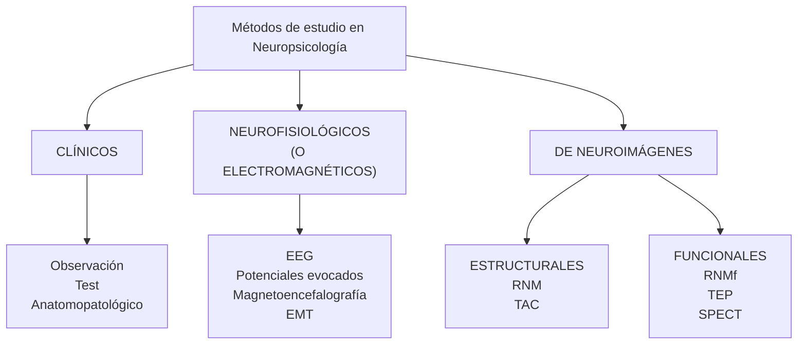

## Neuropsicología, teórico introductorio
Lic. Grossi

## Neuro

## Sistema Nervioso

Psicología: Etimológicamente proviene de "psiqué", que en griego significa "alma". Literalmente Psicología es "el estudio del alma". Alma mente, funciones mentales

- Neuro-Psicología: Estudio de la relación que puede establecerse entre el funcionamiento del sistema nervioso y los fenómenos mentales.

Neuropsicológia

Definición
"La Neuropsicología es una rama de la ciencia cuyo fin único y específico es investigar el papel de los sistemas cerebrales particulares en las formas complejas de actividad mental" (Luria)

Problema mente-materia

Programa de entrenamiento
métodos de estudio
fundamentos neuropsicológicos
en con
- Autorregulación emocional
- Planificación y organización
- Atención
- Memoria
- Repetición (consolidación)
- Producción oral y/o escrita,

Evaluación de su eficacia
papel del lenguaje interior
- Autoeficacia
- Ansiedad (estado-rasgo)
- Rendimiento académico
## Aplicación del método científico

Métodos de estudio

Modelos de Luria, Tamaroff y Allegri, y Azcoaga

Modelo, palabra polisémica: Cosa que sirve como pauta para ser imitada, reproducida o copiada

Modelo: Representación de algunos aspectos de un fenómeno (objetos, estados, procesos o sucesos) que nos permiten abordarlo de acuerdo a los fines que nos propongamos.
⇩

## Modelo NO representa la totalidad del fenómeno.

⇩

"El mapa no es el territorio"
(Alfred Korzybski)

En aquel Imperio, el Arte de la Cartografía logró tal Perfección que el mapa de una sola Provincia ocupaba toda una Ciudad, y el mapa del Imperio, toda una Provincia. Con el tiempo, estos Mapas Desmesurados no satisficieron y los Colegios de Cartógrafos levantaron un Mapa del Imperio, que tenía el tamaño del Imperio y coincidía puntualmente con él.

Menos Adictas al Estudio de la Cartografía, las Generaciones Siguientes entendieron que ese dilatado Mapa era Inútil y no sin Impiedad lo entregaron a las Inclemencias del Sol y los Inviernos. En los desiertos del Oeste perduran despedazadas Ruinas del Mapa, habitadas por Animales y por Mendigos; en todo el País no hay otra reliquia de las Disciplinas Geográficas.

Suárez Miranda, Viajes de Varones Prudentes, Libro Cuarto, Cap. XLV, Lérida, 1658.

FIN

## ¿Por qué repasamos el concepto de modelo?

El funcionamiento del sistema nervioso es un fenómeno de altísima complejidad

Para poder abordar su estudio de modo introductorio, comenzaremos estudiando modelos simples

Ningún modelo lo representa en su totalidad (ni los más complejos).

Lo cual no implica asumir que el funcionamiento del SN es un fenómeno simple, ni que queda por completo explicado en función de los mismos.

Korbinian Brodmann (1868-1918)

Áreas citoarquitectónicas

![[vista-lateral-medial.png]]

![[vista-lateral.png]]

![[vista-medial.png]]

términos y conceptos nuevos

→

"alfabetización académica"

→

esfuerzo deliberado de comprender y recordar las palabras y los conceptos.

recordar con memoria explícita consciente:

→

otorgar significado + repetirlo/repasarlo

Terminología

Para que un concepto nuevo quede incluido en nuestras redes semánticas, es necesario que se produzcan cambios en nuestro sistema nervioso, y éstos tienen que consolidarse.

→

## la memoria a largo plazo semántica se beneficia de una codificación profunda (no superficial) del material a estudiar

→

atención plena y atención dividida, efectos en la memoria explícita
