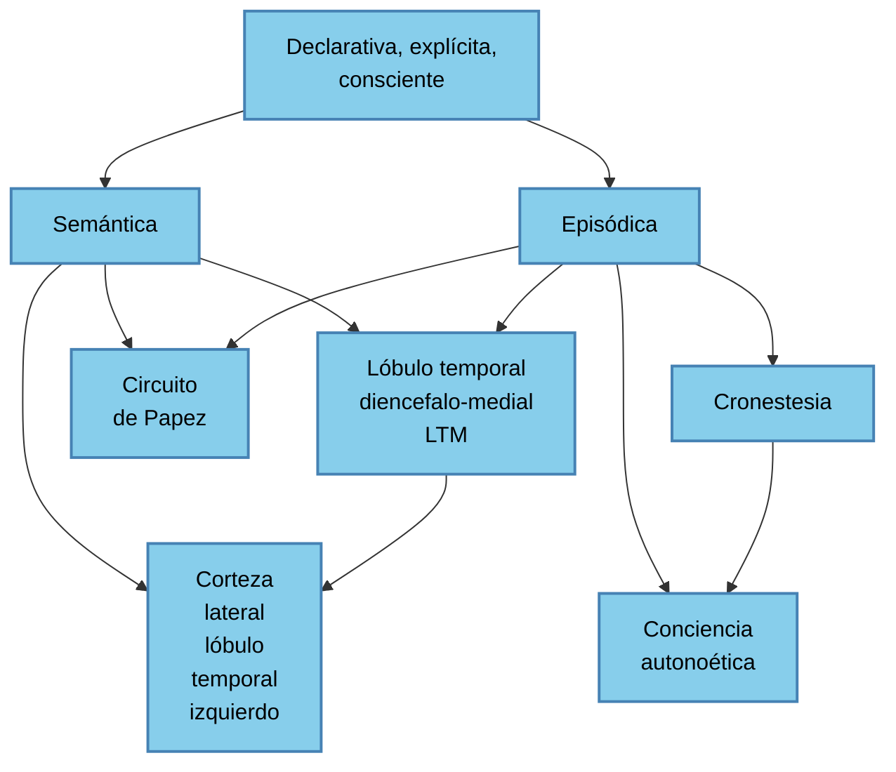

## Sistema de memoria en humanos

````mermaid
graph TD
    Memoria --> Memoria_de_trabajo
    Memoria --> Sistemas_de_memoria_a_largo_plazo
    
    Sistemas_de_memoria_a_largo_plazo --> Declarativa_explicita_consciente
    Sistemas_de_memoria_a_largo_plazo --> No_declarativa_implicita_no_consciente
    
    Declarativa_explicita_consciente --> Semántica
    Declarativa_explicita_consciente --> Episódica
    
    No_declarativa_implicita_no_consciente --> Sistema_de_Representación_Perceptual
    No_declarativa_implicita_no_consciente --> Procedimental_o_procedural
    
    Procedimental_o_procedural --> Aprendizaje_no_asociativo
    Procedimental_o_procedural --> Condicionamiento_clásico_e_instrumental
    Procedimental_o_procedural --> Habilidades_motoras
    Procedimental_o_procedural --> Habilidades_cognitivas
````

**Agendavisuoespacial, sistema subsidiario**
Almacén de información visual y espacial 
Corteza parietal inferior del hemisferio derecho (su lesión altera el span visuoespacial)

**Ejecutivo Central**, sistema estratégico Selección Planificación Control ejecutivo Nexo entre SS y MLP Relacionado con áreas prefrontales. No relacionado con áreas temporales mediales.

**Bucle fonológico, sistema subsidiario**
Almacén de información fonológica (verbal)
Corteza parietal inferior del hemisferio izquierdo (su lesión altera span de dígitos)




El **SRP** (Sistema de Representación Perceptual) es un mecanismo cognitivo cuyas funciones son codificar, retener y recuperar forma y estructura de los estímulos en diferentes dominios y modalidades. 
Aprendizaje perceptual
Gnosias
Áreas corticales secundarias de la parte posterior del cerebro que rodean a las áreas de proyección sensorial primaria visual y auditiva.

### Aprendizaje no asociativo:
**Habituación**: disminuir o suprimir una respuesta refleja a un E nocivo cuando éste es inocuo y se presenta repetidamente 
**Sensibilización**: aplicado en una vía produce un aumento en la intensidad de la respuesta refleja mediada por otra vía.

**Aprendizaje E-R**: 
Respuestas emotivas: Amígdala
Respuestas motoras: Cerebelo

**Habilidades motoras**: algoritmos complejos que rigen secuencias de operaciones motoras.

|   | Alzahimer | Hungtington |
| :--- | :--- | :--- |
| Memoria episódica | No | Sí |
| Memoria procedimental | Sí | No |
**Habilidades cognitivas**: Algoritmos procedurales que operan con representaciones cognitivas.

