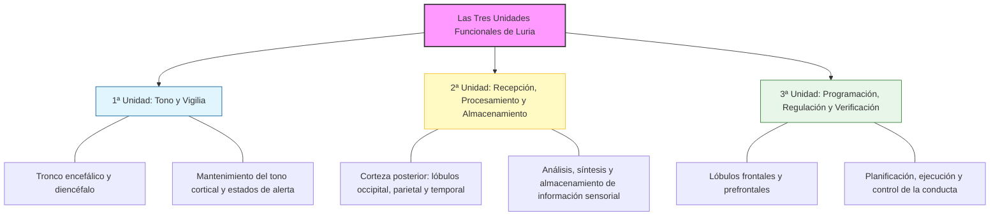

# Las Tres Unidades Funcionales de Luria

```mermaid
graph TD
    %% Título
    Title[Las Tres Unidades Funcionales de Luria]

    %% Unidades
    U1[1ª Unidad: Tono y Vigilia]
    U2[2ª Unidad: Recepción, Procesamiento y Almacenamiento]
    U3[3ª Unidad: Programación, Regulación y Verificación]

    %% Estructuras implicadas
    S1[Tronco encefálico y diencéfalo]
    S2[Corteza posterior: lóbulos occipital, parietal y temporal]
    S3[Lóbulos frontales y prefrontales]

    %% Funciones principales
    F1[Mantenimiento del tono cortical y estados de alerta]
    F2[Análisis, síntesis y almacenamiento de información sensorial]
    F3[Planificación, ejecución y control de la conducta]

    %% Relaciones
    Title --> U1
    Title --> U2
    Title --> U3

    U1 --- S1
    U1 --- F1
    
    U2 --- S2
    U2 --- F2
    
    U3 --- S3
    U3 --- F3

    %% Estilos
    style Title fill:#f9f,stroke:#333,stroke-width:2px
    style U1 fill:#e1f5fe,stroke:#01579b
    style U2 fill:#fff9c4,stroke:#fbc02d
    style U3 fill:#e8f5e9,stroke:#2e7d32
```
