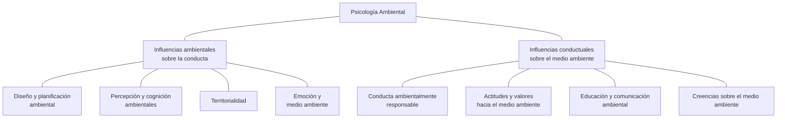

# Psicología ambiental: interfase entre conducta y naturaleza

Erick Roth U.

## Psicología y Medio Ambiente

Si bien es posible encontrar antecedentes conceptuales de la relación entre psicología y medio ambiente, en la década de los años cuarenta, en el trabajo pionero de Kurt Lewin (Lewin, 1951) y en el de algunos de sus discípulos (Barker y Wright, 1955), sus avances teóricos son muy recientes y datan de sólo hace dos o tres décadas. En este período, hemos presenciado el advenimiento de una serie de interdisciplinas interesadas en establecer interfases conceptuales y empíricas entre la psicología y las ciencias ambientales, principalmente con la ecología. Algunas de ellas, fértiles en contribuciones fueron la psicología ambiental, la geografía conductual, la biología social, la ecología humana, la ecología conductual, la arquitectura psicológica y la antropología y sociología urbanas.

Ciertamente todas estas interdisciplinas consideran como objeto de estudio el comportamiento humano en su contexto físico-social inmediato; sin embargo, sus enfoques y aproximaciones varian grandemente, y lo hacen no sólo en atención a la especificidad de las disciplinas que las conforman, sino también porque ensayan niveles de análisis, escalas y enfoques diferentes.

Tómese como ejemplo el caso de la psicología ambiental -a la que nos dedicaremos de aquí en adelante-, donde la existencia de dos aproximaciones o enfoques proporcionan también resultados diferentes. Uno de estos enfoques enfatiza la variable ambiental como influencia determinante del comportamiento, mientras que el otro, analiza más bien los efectos de la conducta en el medio ambiente físico y natural. En ambos casos, la relación entre el objeto de la psicología y el medio ambiente es evidente, aunque la naturaleza del dato en consideración es diferente. El diagrama que se presenta a continuación ilustra esta distinción.

No pocos autores han ensayado definiciones de la Psicología Ambiental; Aragonés y Amérigo (1998) hacen un completo recuento de las más importantes. Todas sin excepción destacan la relación entre el individuo y su entorno;

algunas de ellas enfatizan exclusivamente relaciones con el entorno físico (Heimstra y McFarling, 1978; Holahan, 1982; Gifford, 1987), otras incorporan lo social como parte del medio ambiente (Stokols y Altman, 1987; Veitch y Arkkelin, 1995), y las menos consideran también al ambiente natural (Bell, Fisher, Baum y Greene, 1996).

Representación esquemática de los enfoques de la psicología ambiental

Algunas definiciones enfatizan procesos cognitivos, experienciales y emocionales (Darley y Gilbert, 1985), mientras que otras recalcan más bien procesos conductuales, entendiendo conducta desde una perspectiva más inclusiva de los procesos psicológicos (Holahan, 1982 y Bell, Fisher, Baum y Greene, 1996).

Si bien estas definiciones presuponen tácitamente una relación de ida y vuelta del individuo con su medio ambiente (Gilfford, 1982, habla de "transacciones entre individuos y el medio ambiente" y Darley y Gilbert, 1985, menciona las "influencias interactivas" entre ambos elementos), ninguna de ellas expresa abiertamente la necesaria diferenciación que debe hacerse entre conducta determinada y conducta determinante.

Por ello quizá sea necesario delimitar ambos dominios de la psicología ambiental, valiéndonos de una definición que integre todos los elementos constitutivos de la interdisciplina:

De esta manera, la psicología ambiental debería precisarse como la interdisciplina que se interesa por el análisis teórico y empírico de las relaciones entre el comportamiento humano y su entorno físico construido, natural y social. Dichas relaciones pueden asumir dos modalidades; una que ubica la conducta como efecto de las propiedades ambientales y otra que la sitúa como causa de las modificaciones de este.

En tanto interdisciplina, esta definición enfatiza la necesidad de que la psicología ambiental incorpore los aportes provenientes de otras disciplinas, particularmente de las ciencias socio-ambientales (ecología, arquitectura, urbanismo, sociología, diseño, geografía, etc.). No debe olvidarse que la validez

de un objeto teórico de conocimiento depende de la manera en que puede relacionarse con otros objetos de otras disciplinas específicas que también se proponen estudiar analíticamente un segmento de la realidad.

Asimismo, tipifica el medio ambiente en términos inclusivos, cuidando de no dejar fuera el contexto natural, dominio en el que el comportamiento humano representa un papel extraordinariamente importante.

El concepto de relación entre el comportamiento y el medio ambiente debe merecer una consideración especial. Aquí concretamente describe una interconducta (Kantor, 1959; Ribes y López, 1985) que pone de relieve la interacción misma como objeto de interés primario de la psicología y que evita la dualidad conducta-ambiente como dos eventos independientes en transacción mecánica que establece conducta como simple actividad y ambiente como simple objeto que suscita actividad. Desde esta perspectiva, la "relación" prevé el concepto de interdependencia entre campos de relaciones sincrónicas. Por lo tanto como menciona Willems (1973) la conducta es una propiedad del sistema más que un atributo del individuo. Y en la misma dirección Proshansky y colaboradores (1978), afirmaban que existe sólo un medio ambiente total, del cual el hombre es simplemente un componente en relación con sus otros componentes. El hombre, nos decía, no existe excepto en sus relaciones con otros componentes.

La definición considera, además, que la psicología ambiental debe permitir una aproximación analítica a su objeto como corresponde a una aproximación científica al estudio de la relación propuesta. Finalmente, la definición sugerida recalca la diferencia que existe entre aquellos estudios que exploran la conducta humana como variable dependiente o como efecto de las características o condiciones ambientales, y los que la analizan como variable independiente o determinante de procesos ambientales particulares. Esta distinción expresa, permite a la psicología ambiental asumir no solamente su rol tradicional (diseño y planificación ambientales, uso del espacio, territorialidad, percepción y cognición, etc., destacado en la mayoría de los trabajos publicados hasta ahora), sino también terminar de incursionar en el terreno fértil del estudio de la conducta ambientalmente responsable al que los investigadores de este campo se asoman aún muy tímidamente.

## Antecedentes de la Psicología Ambiental

Si bien –tal como comentamos al inicio de este trabajo– existen en las publicaciones de Lewin y algunos de sus colaboradores más próximos, antecedentes de la preocupación por las relaciones hombre-medio ambiente, sobre todo relacionadas con el “espacio vital” (ciertamente vinculadas a la teoría de campo), el término “psicología ambiental” habría sido utilizado por primera vez por Brunswik (Aragonés y Amérigo, 1998) durante la década de los años cuarenta, al especular en torno a procesos perceptivos relacionados con el entorno inmediato de los individuos.

Posteriormente. Una propuesta más articulada surge con los trabajos de Barker y Wright, bajo el nombre de "psicología ecológica", a fines de los años cuarenta. Estos autores brindaron especial atención al concepto de "contexto conductual" (behavior setting) $ ^{1} $ y a la teoría del manning $ ^{2} $ .

En los Estados Unidos, durante los años sesenta surgieron varias iniciativas y espacios de discusión sobre los problemas planteados por la relación conducta-ambiente: congresos y conferencias, como la llevada a cabo sobre Psicología Arquitectónica y Psiquiatría en 1961en Utah; publicaciones periódicas como el número monográfico dedicado a cuestiones ambientales del Journal of Social Issues de 1966; o la conformación de asociaciones científicas como la Asociación de Investigación para el Diseño Ambiental (EDRH), en 1968. Asimismo, un año después, se edita el primer número de la revista Environment and Behavior.

Paralelamente en Europa, particularmente en Inglaterra, se registraron también una serie de eventos de los que el más importante sin duda fue la creación de un postgrado de la especialidad en la Universidad de Surrey.

Posteriormente, durante los años setenta, apareció la publicación de Proshansky y colaboradores (Proshansky, Ittelson y Rivlin, 1970, primera edición en inglés, traducida al español en 1978 por la Editorial Trillas de México)–considerada un hito en el desarrollo de la interdisciplina- recopilando una importante cantidad de trabajos realizados en años precedentes, bajo el título genérico de Psicología Ambiental. Junto con este trabajo se conocieron otros no menos importantes de Altman (1975) y Altman y Rogoff (1987), aportando con reflexiones sobre la relación hombre-medio, a propósito del creciente deterioro de la calidad ambiental y por lo tanto de la calidad de la vida en los países desarrollados.

Casi inmediatamente después, la American Psychological Association (APA), crea su División 34, denominada "Población y Psicología Ambiental", con lo que se formaliza en ese país la existencia de la interdisciplina.

En los primeros años de la década de los ochenta, se empieza a editar el Journal of Environmental Psychology y posteriormente, una serie de títulos que actualmente constituyen ya clásicos de la psicología ambiental. Entre ellos, las publicaciones de Russel y Ward (1982), Holahan (1986, traducida al español por Editorial Limusa, 1990), Seagert y Winkel (1990), Stokols (1995) y Sundstrom y Cols (1996) y particularmente el Manual de Psicología Ambiental, editado por Stokols y Altman (1987).

Si bien estos antecedentes certifican el proceso de desarrollo de la psicología ambiental en las últimas décadas, así como la vitalidad actual de la interdisciplina, dejan al descubierto el enfasis puesto en la relación medio ambiente-conducta, relegando a un segundo lugar el análisis y reflexión de aquellos procesos que se centran en la relación conducta-medio ambiente. El resultado ha sido un evidente déficit de aportes teóricos y empíricos relativos a la influencia de los patrones de conducta de individuos, grupos e instituciones sobre el medio físico-natural en el que se desenvuelven.

Sólo muy recientemente, es posible encontrar autores cuyo interés se encuentra centrado en lo que ha dado en llamarse la conducta ambientalmente responsable. En este sentido son interesantes e invalorables los aportes de Cone y Hayes (1980), el de Suárez (1998), el de Stern (1992a, 1992b) y los de McKenzie-Mohr y Smith. Estos autores se han preocupado por aspectos vinculados a la conservación del medio ambiente, a través de la modificación consistente del comportamiento individual, así como a través de la consideración de las actitudes, valores, creencias, entre otros procesos.

A continuación, describiremos brevemente, las tendencias y los logros más evidentes, patentizados por ambas lógicas de la psicología ambiental.

## Influencias medio ambientales en la conducta

En el primer caso, donde la conducta opera como variable dependiente, los aportes son abundantes y sus representantes han centrado su atención en el estudio de los determinantes ambientales del comportamiento nutriendo de esta manera, la orientación ambientalista (casi siempre en oposición a la innatista) en psicología. La influencia del medio ambiente en la conducta ha sido expresada con diferentes enfasis, dando lugar al menos a tres concepciones: el determinismo ambiental, el posibilismo ambiental y el probabilismo ambiental.

El determinismo ambiental constituye una postura fatalista, muy popular en el siglo XIX, íntimamente ligada a la teoría evolucionista y legada por la visión aristotélica del mundo. Esgrimía la idea de que el clima, el suelo y los recursos naturales ejercían un efecto definitivo en la conducta humana, dando lugar al acomodo de algunas concepciones poco serias como el de la superioridad del habitante de las zonas frías del norte con respecto a la "indolencia" de los pobladores de las áreas calientes del sur, por ejemplo. El determinismo se hacía patente al afirmarse que el sólo hecho de vivir en ciertas latitudes bastaba para que se configure un comportamiento particular. Los escritos sobre antropogeografía de Ratzel, en los años de 1880 son especialmente ilustrativos en este sentido. Asimismo, son famosos los estudios que relacionan las

tendencias suicidas con la duración de la luz solar, las bajas temperaturas y la presión atmosférica, esfuerzos que a la fecha aún no son concluyentes (Pokorny y Cols, 1963).

El posibilismo ambiental por su parte, emerge como una lógica reacción a los postulados extremos del determinismo. Así esta postura concibe el ambiente como el medio a través del cual el hombre tiene o no acceso a las oportunidades para su crecimiento personal. El medio ambiente establece las limitaciones que el individuo debe vencer equipándose adecuadamente para ello con suficiente tecnología, capital, destrezas y una organización eficiente. En este sentido, el posibilismo es una apertura para fortalecer la doctrina del libre albedrío y más tarde se constituirá en refuerzo de la visión antropocentrista de la naturaleza.

Sir Lawrence Alma-Tadema, Flora, Primacera en los jardines de Villa Borg-

Finalmente, el probabilismo ambiental postula la vigencia de leyes que regulan las relaciones entre la conducta y el medio ambiente; dichas leyes otorgan valor determinante al contexto, dependiendo de los otros valores que forman parte del complejo situacional. Así, dado un individuo A, con atributos constitucionales y genéticos a, b y c, que actúa en un ambiente X, con características d, e y f, y una motivación general M, muy probablemente (pues nunca hay certidumbre total) se comportará de manera Z (Porteous, 1977). De hecho, el probabilismo ambiental inaugura una gran dosis de incertidumbre en relación con el estudio de la conducta de los organismos y propone disiparla valiéndose del rigor metodológico en un abordaje integral y sistémico.

Quizá el aporte más influyente a la psicología ambiental, que toma a la conducta como producto de las condiciones medioambientales, haya sido el de Proshansky y sus colaboradores (1978). Aparentemente lo más destacable de este trabajo habría sido el esfuerzo por entender las influencias físicas y sociales del contexto circundante del individuo, permitiendo los aportes de otras disciplinas ajenas a la psicología. A partir de entonces, fueron posibles relaciones tales como "arquitectura conductual", "psicología ecológica", "ecología conductual", "diseño ambiental", etc. establecidas por la contribución de psicólogos, ingenieros diseñadores, planificadores sociales, ecólogos, arquitectos, etc., aportando con mayor realidad e integridad al estudio y la solución de los problemas relacionados con el comportamiento humano.

Ittelson y otros (1974) hacen casi 30 años destacaba la propiedad integradora y sistémica de esta interdisciplina:

Debería quedar claro que la psicología ambiental no es una teoría del determinismo. Considera al hombre no como un producto pasivo de su ambiente sino como un ser orientado hacia metas que actúa sobre su medio ambiente y al hacerlo recibe también su influencia. De esta manera, en el intento de cambiar el mundo, el hombre se cambia a sí mismo. El principio que guía a la psicología ambiental es el que llamamos de intercambio dinámico entre el hombre y su contexto. La concepción tradicional de un medio ambiente fijo al que el organismo debe adaptarse o perecer, es actualmente reemplazado por la visión ecológica que enfatiza el rol de los organismos de crear su propio ambiente (p. 5).

## El diseño ambiental

La modalidad de la psicología ambiental que focaliza su interés en la conducta ambientalmente determinada, ofrece interesantes avances tecnológicos evidenciados en materia de diseño ambiental, toda vez que al ser la conducta una función ordenada de las condiciones ambientales, los arreglos en la conformación física del contexto inmediato del comportamiento, lo afectarian para configurarlo en una u otra dirección.

La aplicación sistemática de este principio ha conducido a los especialistas a conseguir importantes logros en el campo de la modificación del comportamiento a partir del diseño de espacios físicos como el de escuelas (Krasner, 1980), hospitales y centros de salud comunitarios (Jeger, 1980), cárceles (McClure, 1980); o en el campo de la planificación urbana (Porteus, 1977).

El diseño ambiental puede entenderse como un área de estudio y aplicación, preocupada por el estudio de las condiciones necesarias para iniciar y mantener las actividades humanas, así como para desarrollar mecanismos de

intervención de tales condiciones para generar los cambios deseados, tanto mediante la manipulación o configuración de estructuras físicas como a través de la disposición de procesos de solución de problemas y toma de decisiones. Desde esta perspectiva, medio ambiente se entiende como aquellas condiciones físicas (incluye el medio natural y el ambiente construido) y sociales en las que el ser humano se comporta y con las que se relaciona.

Ciertamente, esta propuesta relaciona el diseño ambiental con los postulados y práctica del análisis del comportamiento, en el sentido de que diseñar el ambiente puede entenderse también como una manera de disponer las contingencias físicas y sociales para alterar la probabilidad de comportarse de una manera en particular. Por ejemplo, nuestra reforma educativa está promoviendo la construcción de aulas y mobiliario que a través de una nueva concepción espacial, permitan el relacionamiento cara a cara de los alumnos para fomentar una mayor participación e intercambio de experiencias personales. Ciertamente, la estructura convencional de las aulas educativas determinan las condiciones físicas y sociales para reducir la interacción social durante el proceso de aprendizaje, situación inadmisible para el proceso educativo. En este sentido, se asume que una nueva disposición del ambiente físico traerá como consecuencia la optimización de la conducta académica.

De manera similar Kerpen y Cols. (1976) asumieron que el ambiente físico constituía en sí mismo un instrumento terapéutico y que por lo tanto puede ser manipulado para cambiar la naturaleza y distribución del comportamiento de un hospital psiquiátrico. De esta manera demostraron que el ambiente físico puede generar nuevos patrones de actividad orientados a estructurar las interacciones adaptativas entre personas. De la experiencia en el diseño de espacios terapéuticos, surgieron las siguientes categorías de análisis:

Identidad/privacidad: que destaca la individualidad y la territorialidad como necesidades humanas básicas y que obliga a distinguir entre los espacios personales y grupales.

Trabajo/recreación/descanso: los pacientes deben alternar entre ambientes de juego o distensión y trabajo que favorezcan su autoexpresión. Esta diferencia contraviene las condiciones que prevalecen en instituciones totales.

Estética. Los usos creativos de la forma, el espacio, la escala, el color y la textura, favorecen los ambientes estimulantes y acogedores.

Seguridad. Los requerimientos de seguridad dependen tanto de la calidad de la respuesta humana como de las condiciones arquitectónicas. Todo contexto terapéutico necesita de espacios o áreas destinadas a la seguridad de pacientes y personal especializado.

Existen también antecedentes sobre la manipulación intencionada de elementos físicos del ambiente (iluminación, color del contexto, ruido, temperatura y disposición espacial) con el propósito de optimizar el comportamiento laboral y mejorar los niveles de productividad de los empleados. Los resultados de este tipo de estudios, se han utilizado en la formulación de normas de diseño para ambientes construidos. En este sentido, son pertinentes los trabajos de Boyce (1975), con relación a las influencias de la luminosidad sobre el rendimiento; el de Cohen y Weinstein (1981), referido a los efectos del ruido sobre el tra-

bajo; el de Azer, McNall y Leung (1972), relacionando temperatura ambiente y ejecución laboral; y el de McCormick (1976) que explora los efectos de la disposición espacial del contexto construido.

Finalmente, quizá sea interesante añadir que con el propósito de llevar a cabo mediciones precisas del rendimiento en ambientes físicos, se ha desarrollado el método de la elaboración de los "mapas conductuales". Itelson, Rivlin y Proshansky (1976) aplicaron este procedimiento para determinar la densidad de ciertas conductas emitidas por diferentes individuos en determinados espacios físicos. Dicho procedimiento consiste en registrar el número de individuos que manifiestan una conducta determinada en cada subárea ambiental. Previamente se elabora una lista de categorías conductuales que cubren la mayor parte de las conductas que se manifiestan en el contexto que se estudia. Además de anotar el comportamiento, el observador registra la ubicación específica del sujeto en el ambiente, en cada intervalo de observación.

La información que se obtiene con este procedimiento, puede utilizarse de diferentes maneras. Así por ejemplo, el estudio de los flujos de compradores en los supermercados, llevó a determinar las áreas de mayor circulación o convergencia, lo que posibilidad tomar decisiones de mercadeo de productos. Por otro lado, los estudios de flujo vehicular, suelen permitir tomar medidas para descongestionar el tráfico de motorizados en ciertas horas pico.

## Cogniciones ambientales

Uno de los temas más difundidos relativos al estudio de la psicología ambiental, desde la óptica de la causalidad contextual, es la cognición. Por cognición ambiental debemos entender los conocimientos, imágenes, información, impresiones, significados y creencias que los individuos y grupos desarrollan acerca de los aspectos estructurales, funcionales y simbólicos de los ambientes físicos, sociales, culturales, económicos y políticos (Moore y Golledge, 1976, citado por Aragonés, 1998).

Ciertamente, esta definición apunta a la noción de "mapas cognitivos", término acuñado por Tolman a propósito de sus trabajos de aprendizaje con sujetos infrahumanos y utilizado ampliamente por Lynch (1960) en el estudio de la imagen social de las ciudades. En psicología ambiental, un mapa cognitivo es un constructo que refleja procesos que explican la adquisición, almacenamiento, codificación, recuperación y manejo de la información proveniente del ambiente físico y de su estructura espacial; constituye un marco de referencia ambiental.

Los mapas cognitivos han sido muy utilizados para estudiar las representaciones urbanas, su configuración espacial y estructura, tal como son percibidas por los individuos (distintividad, visibilidad, uso y significado simbólico), así como la orientación durante el desplazamiento.

Si bien aún no existe conocimiento completo acerca de la naturaleza de los procesos cognoscitivos comprendidos en la elaboración de los mapas cognitivos ni sobre su ajuste o modificación en el tiempo y sobre la base de la experiencia, los investigadores han podido llegar a precisar algunas influencias interesantes. Por ejemplo, los estilos de vida de la gente, el grado de familiaridad, la condición social, el grado de participación en actividades comunitarias y las diferencias de género parecen influir diferencialmente sobre la percepción del espacio que habitan.

## Emoción y medio ambiente

Otro tema que ha ocupado a los psicólogos ambientales tiene que ver con la experiencia emocional del ambiente (Corraliza, 1998), es decir el estudio de aquellos procesos a través de los cuales el espacio físico adquiere significado para el individuo (qué es para una persona un lugar determinado). El análisis

del significado supone una valoración personal del ambiente, aspecto íntimamente relacionado con la experiencia emocional. Así, el estudio del significado tiene como marco de referencia el análisis de los patrones perceptivos que desencadenan respuestas emocionales con respecto a un contexto físico determinado. Un ejemplo típico es la reacción de temor que suscita el encontrarse en espacios urbanos que permiten la lectura de señales de alta actividad delincuencial.

Autores como Russell, Ward y Pratt (1981), estudiaron una serie de descriptores-indicadores afectivos asociados al medio ambiente, sobre la base del diferencial semántico. Los resultados muestran la posibilidad de establecer perfiles afectivos de los estímulos ambientales, utilizando factores tales como: agrado, activación, impacto y control. La información producida por estos estudios, tiene una utilidad potencial en el marco del trabajo que actualmente se despliega para explicar la conducta ambientalmente responsable o las actitudes pro ambientales.

Sir Lawrence Alma-Tadema, Promesa de primacera.

Otras fuentes importantes de información sobre aspectos emocionales asociados al medio ambiente constituyen los estudios sobre estrés ambiental producido por el exceso de estimulación física como el ruido o las aglomeraciones, por ejemplo (Cohen, Evans, Krantz y Stokols, 1980).

## Territorialidad

Si bien el estudio de la territorialidad ha sido principalmente alentado desde las corrientes etológicas que se aproximaron con mayor soltura a la consideración de la conducta animal y sus determinantes biológicos-instintivos, este fenómeno dista mucho de ser únicamente una expresión de las especies más elementales. Es absolutamente evidente la manifestación de la territorialidad en el hombre, la misma que se expresa como una forma de ejercer control tanto sobre el contexto físico-natural inmediato, como sobre el espacio simbólico-convencional que establece el individuo. El primero es objetivo, mientras que el segundo resulta más arbitrario.

De esta manera, el territorio puede ser tanto una vivienda o un bosque tropical, como una actividad que se asume como jurisdicción, sobre la que se sienta un derecho de ejercicio exclusivo en un contexto particular; por ejemplo, el ejercicio de la medicina es un territorio vedado para otros profesionales no médicos.

La territorialidad se fundamenta en la provisión de seguridad para la supervivencia (seguridad material y psicológica), e identidad (en sentido de búsqueda de individuación: la pregunta "¿quién eres?", a menudo significa "¿de dónde provienes?") de la persona o el grupo. Por lo tanto, el concepto de territorio se encuentra asociado a las nociones de defensa y personalización, ambas consideradas mecanismos de control territorial (Altman, 1970).

Es interesante advertir cómo la territorialidad constituye materia de interés de la psicología ambiental, toda vez que un ambiente físico construido, natural o simbólico considerado como territorio, puede llegar a tener influencia directa en la configuración del comportamiento humano. Por ejemplo, el territorio contribuye al desarrollo de la identidad personal, social, cultural y a la gama de manifestaciones humanas de ella derivadas. Asimismo, el territorio permite la conducta gregaria de quienes lo comparten y evoca acciones de integración, solidaridad, pertenencia y defensa militante ante cualquier amenaza actual o potencial. En consecuencia el territorio es capaz de generar comportamiento comunitario, organización social y fortalece los roles socioculturales de quienes lo asumen como propio.

Ciertamente, el estudio de la territorialidad se muestra fecundo para dilucidar la naturaleza del comportamiento ambientalmente determinado y por lo mismo para reforzar el campo del diseño ambiental.

## Influencias conductuales sobre el medio ambiente

El otro gran capítulo de la psicología ambiental tiene que ver con el estudio de las relaciones conducta-medio ambiente, tomando aquella como determinante de los efectos ambientales; es decir, con el análisis de las repercusiones ambientales del ejercicio de la conducta sobre este. En dicho contexto, la variable ambiental resulta dependiente del comportamiento, el mismo que queda definido a partir de sus consecuencias sobre el entorno natural.

Por lo tanto, es posible identificar dos clases de conducta: conducta protectora, responsable o pro-ambiental y conducta destructiva, irresponsable o degradante. Ambas se definen por sus efectos contextuales. Pertenecen a la primera clase, todo comportamiento encaminado a aliviar o solucionar problemas ambientales que caen en alguna de las siguientes categorías: estéticos, de salud y de manejo sostenible de los recursos naturales. Por otra parte, pertenecen a la segunda clase, las conductas que atentan o agudizan los problemas referidos a los mismos aspectos arriba señalados. Ejemplos de dichas conductas son la alteración del paisaje, toda acción que contamina el suelo, el aire, el agua y que atenta contra la vida de plantas y animales; y todo comportamiento que como consecuencia propicia la degradación de los recursos naturales, como aquellos patrones productivos o tecnológicos ambientalmente poco adecuados.

## Conducta ambientalmente responsable

Si bien los aportes teórico-conceptuales y empíricos en relación con esta aproximación de la psicología ambiental no son tan abundantes como los que se pueden encontrar en el estudio de las relaciones medio ambiente-conducta, existen actualmente contribuciones muy relevantes. Un ejemplo de ellas es la publicación de Cone y Hayes (1980), orientado principalmente al tratamiento

de las alternativas tecnológicas (ingeniería conductual) para la solución de problemas bien conocidos del espacio ambiental. Estos autores señalan que la conducta ambientalmente destructiva sobreviene cuando el individuo se involucra en comportamientos que si bien tienen consecuencias reforzantes a corto plazo, generan consecuencias colectivamente punitivas a largo plazo. Así por ejemplo, el uso excesivo de la calefacción produce consecuencias inmediatas relacionadas con la obtención del calor y la eliminación del frío en la vivienda; no obstante, a largo plazo, el uso excesivo de calentadores aumenta la emisión de gases de invernadero que contribuyen al calentamiento de la atmósfera.

El razonamiento tiene una impecable lógica descriptiva; sin embargo, en el plano explicativo este análisis deja algunas interrogantes, pues existen razones para dudar que las consecuencias punitivas, que pueden darse lugar de manera tan remota con respecto al comportamiento que las genera, puedan adquirir influencia sobre un comportamiento alternativo. En otras palabras, la sola promesa de una lejana debacle ambiental tiene problemas para gobernar la conducta ambientalmente responsable en el momento actual. La razón harto conocida es que existe una lógica dificultad (aunque no una lógica imposibilidad) de "enlazar contingencialmente" lo que se hace ahora con lo que el hacerlo produce al cabo de digamos, diez o veinte años.

Por lo tanto parecería necesario explicar tanto el comportamiento protectivo como el destructivo, acudiendo a circunstancias que se encuentran inmersas en el contexto y la experiencia inmediatas del individuo. En efecto, si uno elige apagar la calefacción de su vivienda, con el argumento de que ello tendrá consecuencias positivas sobre el medio ambiente, no podemos asumir que dicha elección esté bajo el control de contingencias naturales tan remotas como la que emerge de la promesa de una adecuada calidad ambiental en los próximos años. La conducta en cuestión no puede ser explicada a partir de un efecto indirecto que sólo podrá constatarse al cabo de mucho tiempo de haberse emitido. La regulación del consumo energético, para reducir o evitar consecuencias remotas sobre el calentamiento planetario, tiene que ser más bien analizada a partir de las consecuencias inmediatas que este comportamiento genera.

Sería más lógico sostener que dicho comportamiento responsable se encuentra bajo el control de contingencias actuales de otra índole; por ejemplo, la íntima satisfacción de saberse solidario y coherente con sus convicciones ambientalistas, el sentimiento actual que acompaña al convencimiento de haber contribuido a lograr una atmósfera más limpia y sana para todos, el haber eludido el juicio crítico de su grupo social próximo, o simplemente la reducción de la cuenta por concepto de consumo energético, etc.

La experiencia nos ha enseñado el valor de los eventos contextuales en la explicación de la vigencia de ciertos patrones de conducta. Así, es posible que el comportamiento de ahora de energía pueda deberse también a la presencia de señales que surgen de la "lectura" del medio ambiente inmediato. De esta manera, para algunas personas, encender la chimenea en un medio cuya atmósfera se encuentra altamente contaminada, es ciertamente menos probable que hacerlo allí donde el impacto ambiental de dicha conducta sea menor o menos evidente. Asimismo, un ambiente sucio parece "dar licencia" para arrojar basura; por el contrario, un ambiente limpio e impecable generalmente restringe todo comportamiento encaminado a ensuciarlo.

No obstante esta "lectura" sólo es posible para quienes estuvieron expuestos a ciertas experiencias con la contaminación atmosférica; es decir, quienes la sufrieron en carne propia o quienes tuvieron acceso a información concreta sobre la relación "quema de leña-emisión de gases de CO2-efecto invernadero-calentamiento global-calidad de vida".

En algunos casos, es también posible que las normas (como eventos discriminativos), representen un papel importante en la explicación del comportamiento ambientalmente responsable, en virtud a su relación funcional con sanciones o incentivos. De esta manera, alguien puede privarse de quemar leña en observancia a una disposición municipal, aún sin entender las razones de dicha norma y en ausencia de cualquier convicción ambientalista que gobierne sus decisiones en materia de manejo de la energía domiciliaria.

Recientemente, algunos autores (McKenzie-Mohr y Smith, 1999) han propuesto que la presencia o ausencia del comportamiento ambientalmente relevante, debe explicarse a partir del efecto suscitado por otras conductas que ejercen funciones que las facilitan o interfieren. En este caso, la persona hace una valoración de la conveniencia de involucrarse o no con acciones protectoras o poco responsables –según sea el caso- auscultando el valor personal que éstas puedan representarle. Por ejemplo, la elección de movilizarse en transporte público para llegar al trabajo, en lugar de utilizar el automóvil propio (que sabemos es una opción ambientalmente relevante), puede competir (y sucumbir) con el convencimiento de que el viaje en autobús demanda excesivo tiempo y que éste puede ser mejor capitalizado en compañía de la familia.

Por otra parte, la idea de recuperar los envases vacíos de aluminio puede verse fortalecida por la perspectiva de su venta y por la consecuente obtención de un beneficio pecuniario.

Aquí, como en el caso anterior, el análisis pasa por la consideración de las consecuencias de comportarse de una u otra manera. Sin embargo, la diferencia estriba en que en este enfoque, se pone especial enfasis en la valoración de dichas consecuencias y en la respectiva toma de decisiones, lo que añade un componente cognitivo al proceso.

Así, desde esta perspectiva se puede señalar que son por lo menos tres las razones para que la gente se comprometa con acciones ambientalmente no responsables: en primer lugar, puede no saber comportarse de cierta manera. Por ejemplo, puede no saber cómo se aprovecha la basura orgánica para el compostaje. En segundo lugar, aún sabiendo cómo comportarse, algunas personas pueden identificar o percibir una o más dificultades o barreras asociadas con el comportamiento en cuestión. Por ejemplo, se puede pensar que almacenar basura orgánica cerca de la vivienda puede atraer animales indeseables o vectores portadores de enfermedades que deben evitarse. Finalmente, en tercer lugar, la gente –a pesar de saber comportarse de la manera requerida y de no percibir barrera alguna– simplemente podría considerar que el persistir con su comportamiento inicial supone mayores ventajas relativas, como cuando se advierte que hay mayores beneficios al disponer la basura orgánica de manera usual, porque ello es claramente más fácil y no supone ninguna molestia.

De estas reflexiones se desprende claramente que los individuos se inclinan naturalmente por acciones que generan mayores beneficios y para las cuales

existen menos barreras percibidas; asimismo, parece lógico esperar que la percepción de estas barreras y beneficios varián grandemente de sujeto a sujeto y de grupo a grupo. Por último, resulta también claro que ciertas conductas compiten con otras conductas, lo que significa que adoptar una puede suponer rechazar otra. Este enfoque por lo tanto, pone en juego el concepto de los valores como elementos de mediación de la conducta ambientalmente responsable.

Esta propuesta conceptual, tiene la ventaja de llevar implícita una propuesta metodológica orientada hacia la generación de patrones de conducta pro ambiental, a través de las siguientes estrategias: a) incrementando los beneficios de la conducta ambientalmente responsable; b) debilitando las barreras que se oponen a la conducta ambientalmente responsable; c) debilitando los beneficios asociados a las conductas que compiten con la conducta ambientalmente responsable; y d) fortaleciendo aquellas barreras que compiten con la conducta ambientalmente responsable.

## Actitudes y creencias

## relacionadas con el medio ambiente

Otro dominio conceptual relacionado con el enfoque de la conducta dependiente del medio ambiente, establece la necesidad de estudiar la manera en que ciertas expresiones del comportamiento permiten predecir formas de interacción del hombre con su entorno. Un ejemplo de ello es la consideración de las actitudes hacia el medio ambiente.

Entendemos por actitud hacia el medio ambiente al proceso mediacional que agrupa un conjunto de objetos de pensamiento en una categoria conceptual capaz de evocar un patrón de respuestas valorativas (Eagly y Chaiken, 1992). Consiste entonces, en una valoración del contexto natural que predispone acciones relacionadas con dicho objeto.

La investigación de las actitudes hacia el medio ambiente se ha ocupado generalmente de cuatro aspectos claramente identificables: la definición teórica y empírica del concepto, el grado de implantación del comportamiento pro ambiental en la sociedad, la relación entre interés por el medio ambiente y el comportamiento responsable y el cambio de actitudes (Hernández e Hidalgo, 1998). De todos ellos, el que ha merecido mayor consideración es este último, favorecido por una inusitada proliferación de instrumentos de medida y por un creciente interés por la medición de actitudes hacia el medio ambiente.

Al presente, sin embargo, de la revisión de la producción científica en esta materia, resulta evidente que la exploración de la relación entre actitud y conducta sigue sin arrojar resultados concluyentes, pese a que constituye el meollo del estudio de las actitudes, por lo que este tema deberá en el futuro recibir mayor atención.

Algo parecido acontece con la relación entre conducta responsable y creencias. Se presume que un sistema de creencias dado estaría en condiciones de forjar patrones de respuesta particulares tanto a favor como en contra de la conservación ambiental. Así, un grupo social que atribuya al entorno natural propiedades sobrenaturales con intencionalidad y capacidad de castigar o premiar según el comportamiento expresado, muy probablemente asumirá actitudes respetuosas o responsables.

Las corrientes conocidas como "antropocentrismo" y "ecocentrismo", expresan claramente creencias que sitúan al hombre y los grupos que los soportan, como defensores de un sistema de valores, donde en el primer caso el ser humano se erige como el centro del universo y rey de la creación, lo que condiciona patrones de conducta que supeditan la

naturaleza a los deseos, intereses y caprichos del hombre. Por el contrario, el ecocentrismo supone la creencia de que el hombre hace parte del conjunto natural como uno más de los elementos del ecosistema sin considerarse por lo tanto, el más importante. En consecuencia, es de esperar de quienes comparten este sistema de creencias, un comportamiento cualitativamente diferente. Este es sin duda otra área de trabajo muy poco explorada y que depara por lo mismo, sorpresas sin límites.

Como pudo verse a lo largo de estas páginas, la psicología ambiental constituye una interdisciplina llena de promesas conceptuales y empíricas para quienes están dispuestos a trascender las tradicionales áreas de conocimiento y aplicación de la psicología e incursionar en el estudio de relaciones nuevas ofrecidas por otras disciplinas próximas a la nuestra con las cuales establece la función de interfase.

## Bibliografía

Altman, I., Territorial behavior in humans. An analysis of the concept: en L, 1970.

Pastalan, y D.H., Carson, (Eds.) Spacial behavior of older people. Ann Arbor: University of Michigan - Wayne State University Press.

Altman, I., The environment and social behavior.Privacy, personal space, territoriality and crowding. Brooks/Cole,Monterrey (Ca.), 1975.

Altman, I., World views in psychology: Trait, interactional, organismic and transactional perspectives. En D. Stokols e I. Altman (Eds.) Handbook of environmental psychology. John Wiley & Sons, New York, 1987.

Aragonés, J.I., Amérigo, M., Psicología ambiental. Ediciones Pirámide, Madrid, 1998.

Aragónés, J.I., Cognición ambiental. En J.I. Aragónés y M. Amérigo (Eds) Psicología Ambiental. Ediciones Pirámide, Madrid, 1998.

Azer, N.Z., McNall, P.E., Leung, H.C., Effects of heat stress on performance. Ergonomics, 15, 681-691, 1972.

Barker, R.G., Wrigth, H.F., The midwest and its children. Evaston, III: Rowe Peterson, 1955.

Boyce, P.R., The luminous environment. En D. Canter y P.Stringer )Eds. Environmental interaction. Psychological Approaches to our physical surroundings. International Universities Press, New York, 1975.

Cohen, S., Evans, G.W., Krantz, D.S., Stokols, D., Physiological, motivational and cognitive effects of aircraft noise on children. Moving from the laboratory to the field. American Psychologist, 35, 231-243, 1980.

Cohen, S., Weinstein, N., Nonauditory effects of noise on behavior and health. Journal of Social Issues, 37, 36-70, 1981.

Cone, J.D., Hayes, S.C., Environmental problems/Behavioral solutions. Brook/Cole Publishing Co, Monterrey (Ca.), 1980.

Corraliza, J.A., Emoción y ambiente. En J.I. Aragonés y M. Amérigo (Eds) Psicología Ambiental. Ediciones Pirámide, Madrid, 1998.

Eagly, A.H, Chaiken, S., The psychology of attitudes. Harcourt Brace Jovanovich, Londres, 1993.

Hernández, B. E Hidalgo, M., Actitudes y creencias hacia el medio ambiente. En J.I. Aragonés y M. Amérigo (Eds) Psicología Ambiental. Ediciones Pirámide, Madrid, 1998.

Holahan, Ch.J., Psicología Ambiental. Un enfoque general. Ediciones Limusa, México, 1999.

Ittelson, W.H., Proshansky, H.M., Rivlin, L.G., y Winkel, G.H. (1974) An introduction to environmental psychology. New York: Holt, Rinehart and Winston.

Itelson, W.H.; Rivlin, L.G., y Proshansky, H.M. (1976) El uso de mapas conductuales en la psicología ambiental. En H.M Proshansky, W.H. Itelson, W y L.G. Rivlin (1978) Psicología ambiental. El hombre y su ambiente físico. México: Trillas.

Jeger, A.M., Community mental Health and environmental design. En L.Krasner (Ed) Environmental Design and Human Behavior. A psychology of the individual in society. Pergamon Press, New York, 1980.

Kantor, J.R., Interbehavioral psychology. Principia Press, Chicago, 1959.

Kerpen, S., Marshall, D., Whitehead, C., y Ellison, G., An approach to the analysis and redesign of an outdated psychiatric ward. En P. Suedfeld y J.A. Russell (Eds) The behavioral basis of design. Book 1: Selected papers.Pennsylvania: Dowden, Hutchinson & Ross, Inc., 1976.

Krasner, M., Environmental design in the classroom. En L.Krasner (Ed) Environmental Design and Human Behavior. A psychology of the individual in society. Pergamon Press, New York, 1980.

Lewin, K., Field theory and learning. En D., Cartwrigth, (Ed.) Field Theory in Social Science. Selected theoretical papers by Kurt Lewin. Harper & Row, pp. 60 - 86, New York, 1951.

Lynch, K., The image of the city. Cambridge, Mass: M.I.T. Press, 1960.

McCormick, E.J., Human factors in engineering and design. McGraw-Hill, New york, 1976.

McClure, G., Environmental design in closed institutions. En L.Krasner (Ed) Environmental Design and Human Behavior. A psychology of the individual in society. Pergamon Press, New York, 1980.

McKenzie-Mohr, D., y Smith, W., Fostering sustainable behavior. An Introduction to community based social marketing. New Society Publishers, Gabriola Island, Canada, 1999.

Pokorny, A.D., Davis, F., Halberson, W., Suicide, suicide attempts and weather. American Journal of Psychiatry 120:371-388, 1963.

Porteous, J.D., Environment and behavior: Planning and everyday urban life. Addison - Wesley Publishing Co., Massachusetts, 1977.

Proshansky, H.M., Ittelson,W.H., Rivlin, L.G., Psicología Ambiental. El hombre y su entorno físico. Trillas, México, 1978.

Ribes,E y López, F., Teoría de la conducta. Un análisis de campo y paramétrico. Trillas, México, 1985.

Russel, J.A., Ward, L.M., Environmental psychology. Annual Review of Psychology 33, 651-688, 1982.

Russell, J.A., Ward,L.M., Pratt, G., The affective quality attributed to environments: A factor-analitic study. Environment and Behavior, 13, 259-288, 1981.

Saegert, S., Winkel, G.H., Environmental Psychology. Annual Review of Psychology, 41, 441-477, 1990.

Stern, P.C., Psychological dimensions of global environmental change. Annual Review of Psychology, 43, 269 - 302, 1992.

Stern, P.C., What psychologist knows about energy conservation. American Psychologist, 47, 1224-1232, 1992.

Stokols, D., The paradox of environmental psychology. American Psychologist, 50, 821-837, 1995.

Stokols, D., Altman, I., Handbook of Environmental Psychology. John Wiley & Sons, New York, 1987.

Suárez, E., Problemas ambientales y soluciones conductuales. En J.I. Aragonés, M.Amérigo (Eds.) Psicología Ambiental. Ediciones Pirámide, Madrid, 1998.

Sudstrom, E., Bell, P.A., Biusby, P.L., Asmus, C., Environmental Psychology 1989 - 1994. Annual Review of Psychology, 47, 485 - 512, 1996.

Willems, E.P.,Behavior-Environment Systems: An ecological approach. Man-Environment Systems 3: 79-110, 1973.

Sir Lawrence Alma-Tadema, Una amable bienvenida.